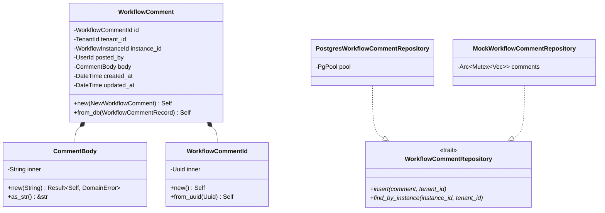
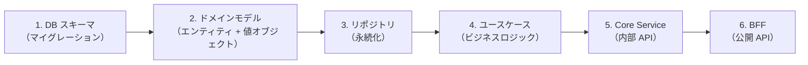
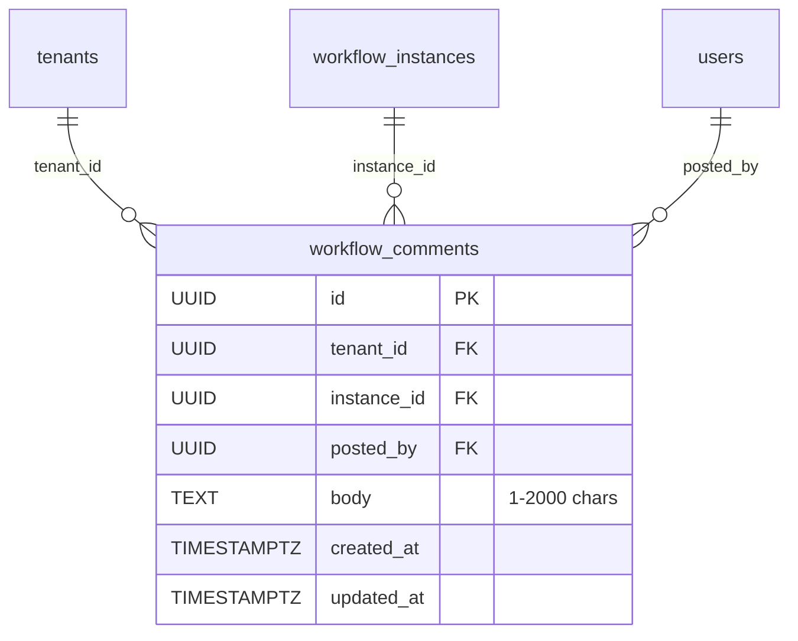
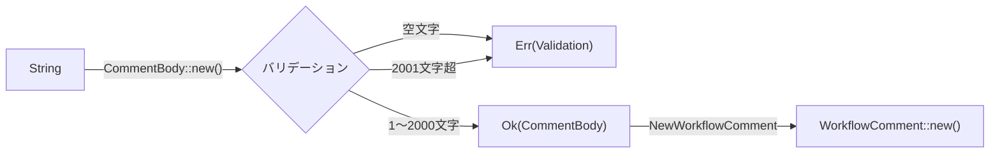
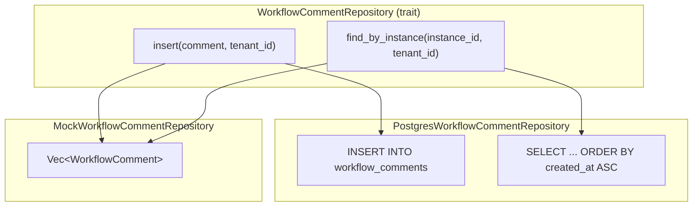
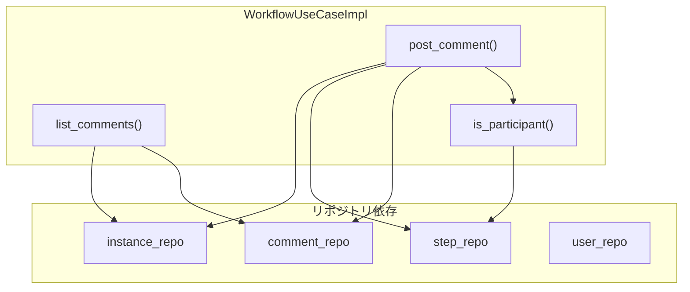
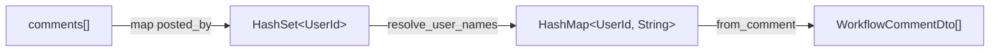
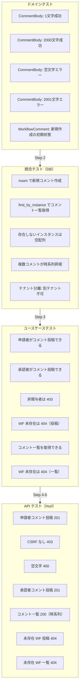
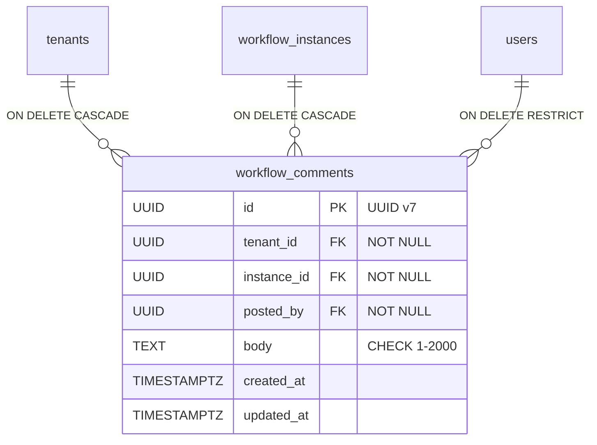

# ワークフローコメント - コード解説

対応 PR: #487
対応 Issue: #477

## 主要な型・関数

| 型/関数 | ファイル | 責務 |
|--------|---------|------|
| `WorkflowComment` | [`domain/workflow/comment.rs:90`](../../../backend/crates/domain/src/workflow/comment.rs) | コメントエンティティ |
| `CommentBody` | [`domain/workflow/comment.rs:48`](../../../backend/crates/domain/src/workflow/comment.rs) | コメント本文値オブジェクト（1〜2000 文字） |
| `WorkflowCommentId` | [`domain/workflow/comment.rs:22`](../../../backend/crates/domain/src/workflow/comment.rs) | UUID v7 Newtype |
| `WorkflowCommentRepository` | [`infra/repository/workflow_comment_repository.rs:35`](../../../backend/crates/infra/src/repository/workflow_comment_repository.rs) | リポジトリトレイト |
| `PostgresWorkflowCommentRepository` | [`infra/repository/workflow_comment_repository.rs:81`](../../../backend/crates/infra/src/repository/workflow_comment_repository.rs) | PostgreSQL 実装 |
| `PostCommentInput` | [`usecase/workflow.rs:92`](../../../backend/apps/core-service/src/usecase/workflow.rs) | コメント投稿入力 |
| `post_comment` (UseCase) | [`usecase/workflow/command.rs:689`](../../../backend/apps/core-service/src/usecase/workflow/command.rs) | 投稿ビジネスロジック |
| `is_participant` | [`usecase/workflow/command.rs:739`](../../../backend/apps/core-service/src/usecase/workflow/command.rs) | 関与者チェック |
| `list_comments` (UseCase) | [`usecase/workflow/query.rs:188`](../../../backend/apps/core-service/src/usecase/workflow/query.rs) | 一覧取得ビジネスロジック |
| `PostCommentRequest` (Core) | [`handler/workflow.rs:282`](../../../backend/apps/core-service/src/handler/workflow.rs) | Core 内部 API リクエスト |
| `WorkflowCommentDto` (Core) | [`handler/workflow.rs:293`](../../../backend/apps/core-service/src/handler/workflow.rs) | Core レスポンス DTO |
| `PostCommentCoreRequest` (BFF) | [`client/core_service/types.rs:256`](../../../backend/apps/bff/src/client/core_service/types.rs) | BFF → Core 通信型 |
| `WorkflowCommentDto` (BFF) | [`client/core_service/types.rs:264`](../../../backend/apps/bff/src/client/core_service/types.rs) | Core レスポンスデシリアライズ |
| `PostCommentRequest` (BFF) | [`handler/workflow.rs:186`](../../../backend/apps/bff/src/handler/workflow.rs) | BFF 公開 API リクエスト |
| `WorkflowCommentData` (BFF) | [`handler/workflow.rs:193`](../../../backend/apps/bff/src/handler/workflow.rs) | BFF 公開 API レスポンス |

### 型の関係



## コードフロー

コードをライフサイクル順に追う。各ステップの構造を図で示した後、対応するコードを解説する。



### 1. DB スキーマ（マイグレーション）

`workflow_comments` テーブルを作成する。既存の `workflow_instances` への FK、RLS ポリシー、CHECK 制約を設定する。



```sql
-- backend/migrations/20260212000002_create_workflow_comments.sql:15-27
CREATE TABLE workflow_comments (
    id UUID PRIMARY KEY,                                              -- ①
    tenant_id UUID NOT NULL REFERENCES tenants(id) ON DELETE CASCADE,
    instance_id UUID NOT NULL REFERENCES workflow_instances(id) ON DELETE CASCADE,
    posted_by UUID NOT NULL REFERENCES users(id) ON DELETE RESTRICT,  -- ②
    body TEXT NOT NULL,
    created_at TIMESTAMPTZ NOT NULL DEFAULT NOW(),
    updated_at TIMESTAMPTZ NOT NULL DEFAULT NOW(),

    CONSTRAINT workflow_comments_body_length CHECK (                  -- ③
        char_length(body) >= 1 AND char_length(body) <= 2000
    )
);
```

注目ポイント:

- ① UUID v7 をアプリケーション側で生成するため DEFAULT 句なし
- ② `posted_by` は `ON DELETE RESTRICT`。ユーザー削除時にコメントを失わないための制約
- ③ DB レベルの CHECK 制約とドメインの `CommentBody` バリデーションで二重防御

RLS ポリシーは他テーブルと同じパターン:

```sql
-- backend/migrations/20260212000002_create_workflow_comments.sql:40-46
ALTER TABLE workflow_comments ENABLE ROW LEVEL SECURITY;
CREATE POLICY tenant_isolation ON workflow_comments
    FOR ALL TO ringiflow_app
    USING (tenant_id = NULLIF(current_setting('app.tenant_id', true), '')::UUID)
    WITH CHECK (tenant_id = NULLIF(current_setting('app.tenant_id', true), '')::UUID);
```

### 2. ドメインモデル（エンティティ + 値オブジェクト）

`CommentBody` 値オブジェクトで本文のバリデーションを型レベルで強制する。



```rust
// backend/crates/domain/src/workflow/comment.rs:60-73
pub fn new(value: impl Into<String>) -> Result<Self, DomainError> {
   let value = value.into();
   if value.is_empty() {                                    // ①
      return Err(DomainError::Validation(
         "コメント本文は必須です".to_string(),
      ));
   }
   if value.chars().count() > COMMENT_BODY_MAX_LENGTH {     // ②
      return Err(DomainError::Validation(format!(
         "コメント本文は{}文字以内で入力してください",
         COMMENT_BODY_MAX_LENGTH
      )));
   }
   Ok(Self(value))
}
```

注目ポイント:

- ① 空文字チェック。`trim()` はしない（仕様にスペースのみ禁止の記載なし）
- ② `chars().count()` でマルチバイト文字を正しくカウント。`len()` はバイト数

エンティティは `new`（新規作成）と `from_db`（DB 復元）の 2 つのコンストラクタパターンを踏襲:

```rust
// backend/crates/domain/src/workflow/comment.rs:123-133
pub fn new(params: NewWorkflowComment) -> Self {
   Self {
      id:          params.id,
      tenant_id:   params.tenant_id,
      instance_id: params.instance_id,
      posted_by:   params.posted_by,
      body:        params.body,
      created_at:  params.now,     // ① created_at = updated_at = now
      updated_at:  params.now,
   }
}
```

注目ポイント:

- ① 新規作成時は `created_at` と `updated_at` を同一タイムスタンプに設定（他エンティティと同じパターン）

### 3. リポジトリ（永続化）

既存のリポジトリパターンを踏襲。トレイト → PostgreSQL 実装 → Mock の 3 層構成。



```rust
// backend/crates/infra/src/repository/workflow_comment_repository.rs:34-49
#[async_trait]
pub trait WorkflowCommentRepository: Send + Sync {
   async fn insert(
      &self,
      comment: &WorkflowComment,
      tenant_id: &TenantId,
   ) -> Result<(), InfraError>;

   async fn find_by_instance(
      &self,
      instance_id: &WorkflowInstanceId,
      tenant_id: &TenantId,
   ) -> Result<Vec<WorkflowComment>, InfraError>;
}
```

DB の行 → ドメインエンティティへの変換は中間構造体 `WorkflowCommentRow` と `TryFrom` で行う:

```rust
// backend/crates/infra/src/repository/workflow_comment_repository.rs:62-77
impl TryFrom<WorkflowCommentRow> for WorkflowComment {
   type Error = InfraError;

   fn try_from(row: WorkflowCommentRow) -> Result<Self, Self::Error> {
      Ok(WorkflowComment::from_db(WorkflowCommentRecord {
         id:          WorkflowCommentId::from_uuid(row.id),   // ①
         tenant_id:   TenantId::from_uuid(row.tenant_id),
         instance_id: WorkflowInstanceId::from_uuid(row.instance_id),
         posted_by:   UserId::from_uuid(row.posted_by),
         body:        CommentBody::new(row.body)              // ②
            .map_err(|e| InfraError::Unexpected(e.to_string()))?,
         created_at:  row.created_at,
         updated_at:  row.updated_at,
      }))
   }
}
```

注目ポイント:

- ① 各 Newtype ID は `from_uuid` で復元（バリデーションなし）
- ② `CommentBody::new` で DB の値を再バリデーション。DB の CHECK 制約と二重防御だが、ドメインの不変条件を保証する

### 4. ユースケース（ビジネスロジック）

`WorkflowUseCaseImpl` に `comment_repo` を依存として追加。



#### コメント投稿のビジネスロジック

```rust
// backend/apps/core-service/src/usecase/workflow/command.rs:689-734
pub async fn post_comment(
   &self,
   input: PostCommentInput,
   display_number: DisplayNumber,
   tenant_id: TenantId,
   user_id: UserId,
) -> Result<WorkflowComment, CoreError> {
   // 1. ワークフローインスタンスを取得
   let instance = self.instance_repo
      .find_by_display_number(display_number, &tenant_id)
      .await
      .map_err(|e| CoreError::Internal(...))?
      .ok_or_else(|| CoreError::NotFound(...))?;

   // 2. 権限チェック                                           // ①
   if !self.is_participant(&instance, &user_id, &tenant_id).await? {
      return Err(CoreError::Forbidden(...));
   }

   // 3. コメント本文のバリデーション                             // ②
   let body = CommentBody::new(input.body)
      .map_err(|e| CoreError::BadRequest(e.to_string()))?;

   // 4. コメントを作成して保存
   let now = self.clock.now();                                  // ③
   let comment = WorkflowComment::new(NewWorkflowComment {
      id: WorkflowCommentId::new(),
      tenant_id: tenant_id.clone(),
      instance_id: instance.id().clone(),
      posted_by: user_id,
      body,
      now,
   });

   self.comment_repo.insert(&comment, &tenant_id).await
      .map_err(|e| CoreError::Internal(...))?;

   Ok(comment)
}
```

注目ポイント:

- ① 権限チェックをインスタンス取得の直後に配置（Early Return パターン）
- ② `CommentBody::new` がドメインバリデーション。`DomainError` → `CoreError::BadRequest` への変換
- ③ `Clock` トレイト経由でタイムスタンプ取得（テストで `FixedClock` に差し替え可能）

#### 関与者チェック

```rust
// backend/apps/core-service/src/usecase/workflow/command.rs:739-758
async fn is_participant(
   &self,
   instance: &WorkflowInstance,
   user_id: &UserId,
   tenant_id: &TenantId,
) -> Result<bool, CoreError> {
   // 申請者チェック                                              // ①
   if instance.initiated_by() == user_id {
      return Ok(true);
   }

   // 承認者チェック                                              // ②
   let steps = self.step_repo
      .find_by_instance(instance.id(), tenant_id)
      .await
      .map_err(|e| CoreError::Internal(...))?;

   Ok(steps.iter().any(|s| s.assigned_to() == Some(user_id)))
}
```

注目ポイント:

- ① 申請者は常に関与者。DB クエリなしで判定できるため先にチェック
- ② 承認者チェックはステップ一覧を取得して `any` で走査。ステップ数は通常数件のため、DB のサブクエリより可読性を優先

#### コメント一覧取得

```rust
// backend/apps/core-service/src/usecase/workflow/query.rs:188-209
pub async fn list_comments(
   &self,
   display_number: DisplayNumber,
   tenant_id: TenantId,
) -> Result<Vec<WorkflowComment>, CoreError> {
   // 1. ワークフローインスタンスの存在確認                         // ①
   let instance = self.instance_repo
      .find_by_display_number(display_number, &tenant_id)
      .await
      .map_err(|e| CoreError::Internal(...))?
      .ok_or_else(|| CoreError::NotFound(...))?;

   // 2. コメント一覧を取得
   self.comment_repo
      .find_by_instance(instance.id(), &tenant_id)
      .await
      .map_err(|e| CoreError::Internal(...))
}
```

注目ポイント:

- ① 存在しないワークフローに対して空配列ではなく 404 を返す。「ワークフローが存在しない」と「コメントがない」は異なるセマンティクス

### 5. Core Service ハンドラ（内部 API）

コメント一覧取得ハンドラでのユーザー名一括解決パターン。`list_my_workflows` と同じ `HashSet` → `resolve_user_names` パターンを踏襲。



```rust
// backend/apps/core-service/src/handler/workflow/query.rs:220-234
// コメント投稿者のユーザー名を一括解決
let all_user_ids: Vec<UserId> = comments
   .iter()
   .map(|c| c.posted_by().clone())
   .collect::<HashSet<_>>()               // ① 重複排除
   .into_iter()
   .collect();
let user_names = state.usecase.resolve_user_names(&all_user_ids).await?;

let response = ApiResponse::new(
   comments
      .iter()
      .map(|c| WorkflowCommentDto::from_comment(c, &user_names))  // ②
      .collect::<Vec<_>>(),
);
```

注目ポイント:

- ① `HashSet` で重複排除してから `resolve_user_names` を呼ぶ（N+1 防止）
- ② `from_comment` はユーザー名マップを受け取り、`to_user_ref` で `UserRefDto` を生成

### 6. BFF ハンドラ（公開 API）

BFF はセッション認証 + CSRF + テナント分離を行い、Core Service に委譲する。

```mermaid
sequenceDiagram
    participant H as BFF Handler
    participant M as Middleware
    participant C as CoreServiceClient

    H->>M: extract_tenant_id(headers)
    H->>M: get_session(session_manager, jar)
    H->>H: PostCommentCoreRequest 組立
    H->>C: post_comment(display_number, req)
    C-->>H: Result&lt;ApiResponse&gt;
    H->>H: エラーマッピング
```

```rust
// backend/apps/bff/src/handler/workflow/command.rs:387-439
pub async fn post_comment(
   State(state): State<Arc<WorkflowState>>,
   headers: HeaderMap,
   jar: CookieJar,                                      // ①
   Path(display_number): Path<i64>,
   Json(req): Json<PostCommentRequest>,
) -> impl IntoResponse {
   if display_number <= 0 { ... }

   let tenant_id = match extract_tenant_id(&headers) { ... };
   let session_data = match get_session(..., &jar, tenant_id).await { ... };

   let core_req = PostCommentCoreRequest {               // ②
      body:      req.body,
      tenant_id: *session_data.tenant_id().as_uuid(),
      user_id:   *session_data.user_id().as_uuid(),
   };

   match state.core_service_client
      .post_comment(display_number, core_req).await
   {
      Ok(core_response) => {
         let response = ApiResponse::new(
            WorkflowCommentData::from(core_response.data)  // ③
         );
         (StatusCode::CREATED, Json(response)).into_response()
      }
      Err(CoreServiceError::WorkflowInstanceNotFound) => not_found_response(...),
      Err(CoreServiceError::ValidationError(detail)) => validation_error_response(&detail),
      Err(CoreServiceError::Forbidden(detail)) => forbidden_response(&detail),
      Err(e) => { ... internal_error_response() }
   }
}
```

注目ポイント:

- ① `CookieJar` でセッション Cookie を抽出。CSRF ミドルウェアは別途 POST リクエスト全体に適用
- ② `tenant_id` と `user_id` はセッションから取得（ブラウザからの入力ではない）
- ③ Core の `WorkflowCommentDto` → BFF の `WorkflowCommentData` への変換は `From` 実装

## テスト

各テストがライフサイクルのどのステップを検証しているかを示す。



| テスト | 検証対象 | 検証内容 |
|-------|---------|---------|
| `CommentBody::test_1文字で成功` | Step 2 | 最小値の境界 |
| `CommentBody::test_2000文字で成功` | Step 2 | 最大値の境界 |
| `CommentBody::test_空文字列でエラー` | Step 2 | 空文字拒否 |
| `CommentBody::test_2001文字でエラー` | Step 2 | 超過拒否 |
| `test_新規作成の初期状態` | Step 2 | エンティティ初期化 |
| `test_insert_で新規コメントを作成できる` | Step 3 | DB INSERT + 読み戻し |
| `test_find_by_instance_でコメント一覧を取得できる` | Step 3 | DB SELECT + フィルタ |
| `test_find_by_instance_存在しないインスタンスは空ベクター` | Step 3 | 空結果ハンドリング |
| `test_find_by_instance_複数コメントが時系列昇順` | Step 3 | ORDER BY 検証 |
| `test_テナント分離_別テナントのコメントは取得できない` | Step 3 | RLS 動作確認 |
| `test_post_comment_申請者がコメントを投稿できる` | Step 4 | 申請者の権限 |
| `test_post_comment_承認者がコメントを投稿できる` | Step 4 | 承認者の権限 |
| `test_post_comment_関与していないユーザーは403` | Step 4 | 非関与者の拒否 |
| `test_post_comment_ワークフローが見つからない場合404` | Step 4 | 未存在エラー |
| `test_list_comments_コメント一覧を取得できる` | Step 4 | 一覧取得ロジック |
| `test_list_comments_ワークフローが見つからない場合404` | Step 4 | 未存在エラー |
| Hurl: 申請者投稿 201 | Step 5-6 | E2E 投稿フロー |
| Hurl: CSRF なし 403 | Step 6 | CSRF ミドルウェア |
| Hurl: 空文字 400 | Step 5-6 | E2E バリデーション |
| Hurl: 承認者投稿 201 | Step 5-6 | 承認者の E2E 投稿 |
| Hurl: 一覧取得 200 | Step 5-6 | E2E 一覧取得 + 時系列 |
| Hurl: 未存在 WF 投稿 404 | Step 5-6 | E2E 未存在エラー |
| Hurl: 未存在 WF 一覧 404 | Step 5-6 | E2E 未存在エラー |

### 実行方法

```bash
# ドメインテスト
cd backend && cargo test --package ringiflow-domain comment

# ユースケーステスト
cd backend && cargo test --package ringiflow-core-service comment

# 統合テスト（DB 必要）
just test-rust-integration

# API テスト（サーバー起動必要）
just test-api -- --test tests/api/hurl/workflow/comments.hurl
```

## マイグレーション

### create_workflow_comments

ファイル: `backend/migrations/20260212000002_create_workflow_comments.sql`

```sql
CREATE TABLE workflow_comments (
    id UUID PRIMARY KEY,
    tenant_id UUID NOT NULL REFERENCES tenants(id) ON DELETE CASCADE,
    instance_id UUID NOT NULL REFERENCES workflow_instances(id) ON DELETE CASCADE,
    posted_by UUID NOT NULL REFERENCES users(id) ON DELETE RESTRICT,
    body TEXT NOT NULL,
    created_at TIMESTAMPTZ NOT NULL DEFAULT NOW(),
    updated_at TIMESTAMPTZ NOT NULL DEFAULT NOW(),
    CONSTRAINT workflow_comments_body_length CHECK (
        char_length(body) >= 1 AND char_length(body) <= 2000
    )
);
```



付随する設定:
- インデックス: `instance_id`、`tenant_id`
- トリガー: `updated_at` 自動更新
- RLS ポリシー: `tenant_isolation`（`app.tenant_id` セッション変数）
- テナント削除レジストリ: `postgres_workflow.rs` に `DELETE FROM workflow_comments` を追加（FK 順序で `workflow_steps` の前に実行）

## 設計解説

コード実装レベルの判断を記載する。機能・仕組みレベルの判断は[機能解説](./01_ワークフローコメント_機能解説.md#設計判断)を参照。

### 1. テナント削除時の FK 順序

場所: `infra/deletion/postgres_workflow.rs`

```rust
// workflow_comments は workflow_instances への FK を持つため、
// workflow_steps と同じ順番で先に削除する
sqlx::query!("DELETE FROM workflow_comments WHERE tenant_id = $1", ...)
   .execute(&mut *tx).await?;
sqlx::query!("DELETE FROM workflow_steps WHERE tenant_id = $1", ...)
   .execute(&mut *tx).await?;
sqlx::query!("DELETE FROM workflow_instances WHERE tenant_id = $1", ...)
   .execute(&mut *tx).await?;
```

なぜこの実装か:
`workflow_comments.instance_id` は `workflow_instances(id)` への FK（`ON DELETE CASCADE`）だが、削除レジストリは明示的に全テーブルを削除する方針のため、FK の CASCADE に依存せず順序を守って削除する。

### 2. ユーザー名一括解決の適用

場所: `core-service/handler/workflow/query.rs:220-227`

```rust
let all_user_ids: Vec<UserId> = comments
   .iter()
   .map(|c| c.posted_by().clone())
   .collect::<HashSet<_>>()    // 重複排除
   .into_iter()
   .collect();
```

なぜこの実装か:
コメント一覧では同一ユーザーが複数コメントを投稿する場合がある。`HashSet` で重複排除してから `resolve_user_names` を呼ぶことで、N+1 問題を回避しつつ不要な DB クエリを防ぐ。`list_my_workflows` と同じパターン。

代替案:

| 案 | メリット | デメリット | 判断 |
|----|---------|-----------|------|
| HashSet で重複排除（採用） | N+1 防止、既存パターン踏襲 | コード量やや増加 | 採用 |
| 全 posted_by をそのまま渡す | コード簡潔 | 同一ユーザーの重複クエリ | 見送り |

### 3. BFF の型変換に From トレイトを使用

場所: `bff/handler/workflow.rs:201-209`

```rust
impl From<crate::client::WorkflowCommentDto> for WorkflowCommentData {
   fn from(dto: crate::client::WorkflowCommentDto) -> Self {
      Self {
         id:         dto.id,
         posted_by:  UserRefData::from(dto.posted_by),
         body:       dto.body,
         created_at: dto.created_at,
      }
   }
}
```

なぜこの実装か:
Core Service のレスポンス型（`client::WorkflowCommentDto`）から BFF の公開型（`WorkflowCommentData`）への変換は失敗しない。`From` を実装することで `.into()` や `map(WorkflowCommentData::from)` のイディオムが使え、既存の `WorkflowData` 等と同じパターンに統一される。

## 関連ドキュメント

- [機能解説](./01_ワークフローコメント_機能解説.md)
- [機能仕様書: ワークフロー管理](../../20_機能仕様書/01_ワークフロー管理.md)
- [データベース設計](../../40_詳細設計書/02_データベース設計.md)
- [ADR-001: ID 形式の選定](../../70_ADR/001_ID形式の選定.md)
