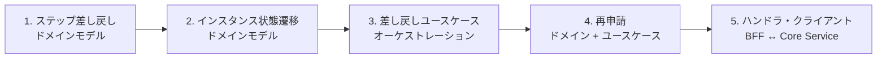
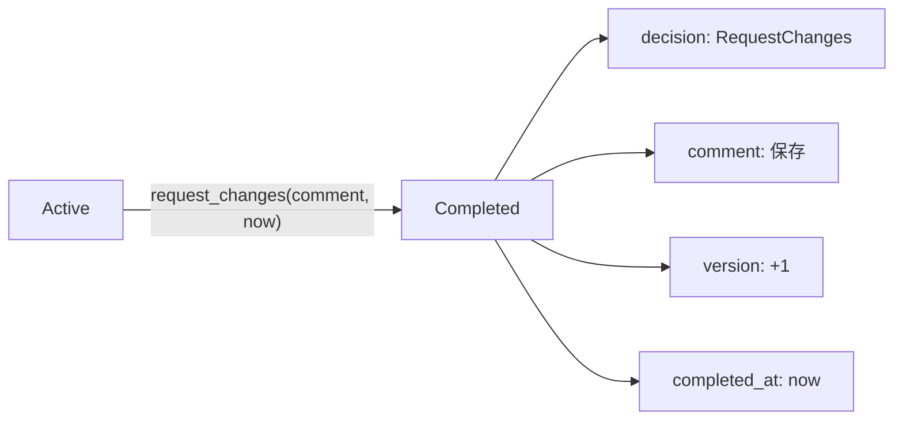
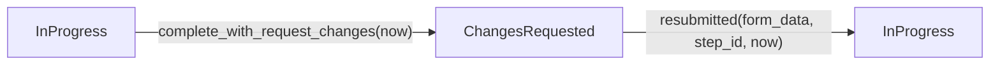
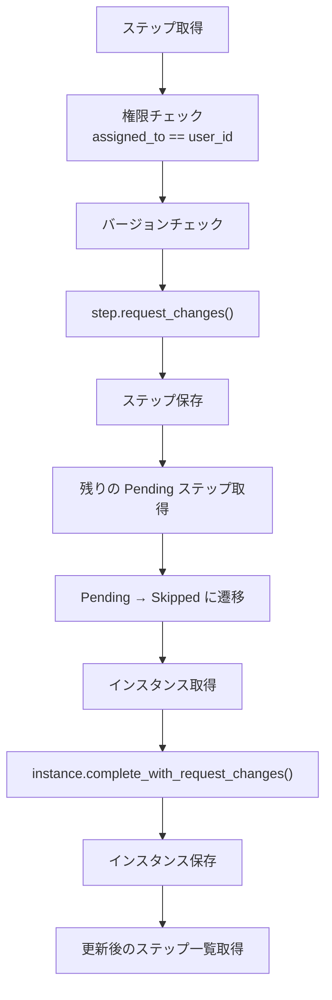
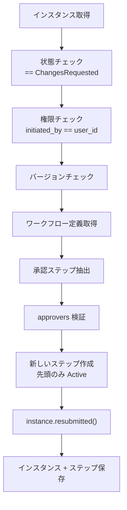
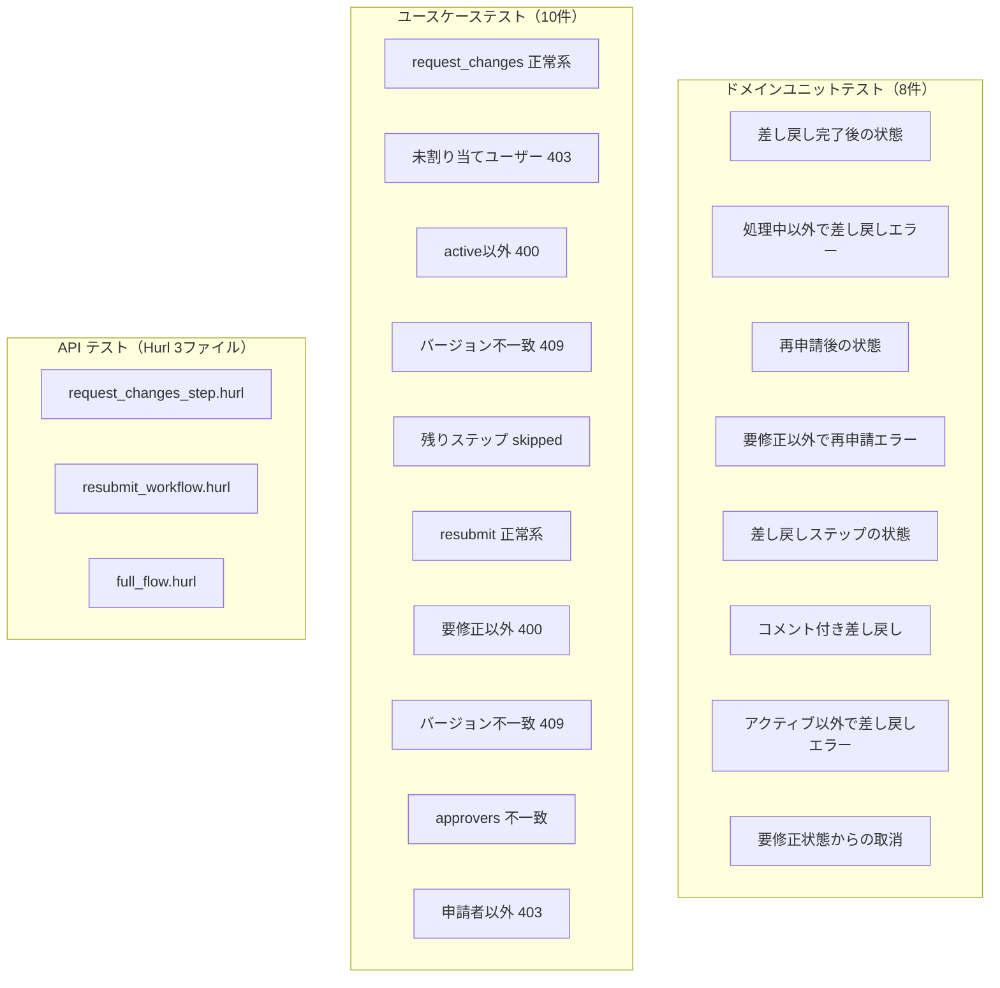

# 差し戻し・再申請機能 - コード解説

対応 PR: [#488](https://github.com/ka2kama/ringiflow/pull/488)
対応 Issue: [#476](https://github.com/ka2kama/ringiflow/issues/476)

## 主要な型・関数

| 型/関数 | ファイル | 責務 |
|--------|---------|------|
| `WorkflowInstanceStatus::ChangesRequested` | [`domain/src/workflow/instance.rs:66`](../../../backend/crates/domain/src/workflow/instance.rs) | 差し戻し後の中間状態 |
| `StepDecision::RequestChanges` | [`domain/src/workflow/step.rs:88`](../../../backend/crates/domain/src/workflow/step.rs) | ステップの差し戻し判定 |
| `complete_with_request_changes()` | [`domain/src/workflow/instance.rs:400`](../../../backend/crates/domain/src/workflow/instance.rs) | InProgress → ChangesRequested |
| `resubmitted()` | [`domain/src/workflow/instance.rs:425`](../../../backend/crates/domain/src/workflow/instance.rs) | ChangesRequested → InProgress |
| `request_changes()` | [`domain/src/workflow/step.rs:394`](../../../backend/crates/domain/src/workflow/step.rs) | Active → Completed(RequestChanges) |
| `request_changes_step()` | [`usecase/workflow/command.rs:542`](../../../backend/apps/core-service/src/usecase/workflow/command.rs) | 差し戻しユースケース |
| `resubmit_workflow()` | [`usecase/workflow/command.rs:675`](../../../backend/apps/core-service/src/usecase/workflow/command.rs) | 再申請ユースケース |
| `ResubmitWorkflowInput` | [`usecase/workflow.rs`](../../../backend/apps/core-service/src/usecase/workflow.rs) | 再申請の入力型 |

## コードフロー

コードをライフサイクル順に追う。差し戻しと再申請の2つのフローを解説する。



### 1. ステップの差し戻し（ドメインモデル）

承認ステップに `request_changes()` メソッドを追加。`approve()` / `reject()` と同じパターンで、Active → Completed への遷移と version インクリメントを行う。



```rust
// backend/crates/domain/src/workflow/step.rs:394-415
pub fn request_changes(
    self,
    comment: Option<String>,
    now: DateTime<Utc>,
) -> Result<Self, DomainError> {
    if self.status != WorkflowStepStatus::Active {       // ① 状態ガード
        return Err(DomainError::Validation(/* ... */));
    }

    Ok(Self {
        status: WorkflowStepStatus::Completed,            // ② 完了状態に遷移
        version: self.version.next(),                      // ③ 楽観的ロック用
        decision: Some(StepDecision::RequestChanges),      // ④ 差し戻し判定
        comment,                                           // ⑤ 差し戻し理由
        completed_at: Some(now),
        updated_at: now,
        ..self
    })
}
```

注目ポイント:
- ① `approve()` / `reject()` と同じ状態ガードパターン
- ④ `StepDecision::RequestChanges` は `Approved` / `Rejected` と並ぶ第3の判定
- ⑤ `comment` はステップに直接保存。将来のコメント機能（別テーブル）とは独立

### 2. インスタンスの状態遷移（ドメインモデル）

2つのメソッドを追加: `complete_with_request_changes()` と `resubmitted()`。



```rust
// backend/crates/domain/src/workflow/instance.rs:400-414
pub fn complete_with_request_changes(self, now: DateTime<Utc>) -> Result<Self, DomainError> {
    if self.status != WorkflowInstanceStatus::InProgress {
        return Err(DomainError::Validation(/* ... */));
    }

    Ok(Self {
        status: WorkflowInstanceStatus::ChangesRequested,
        version: self.version.next(),
        updated_at: now,
        ..self  // ① completed_at は変更しない（中間状態のため）
    })
}
```

```rust
// backend/crates/domain/src/workflow/instance.rs:425-447
pub fn resubmitted(
    self,
    form_data: JsonValue,
    step_id: String,
    now: DateTime<Utc>,
) -> Result<Self, DomainError> {
    if self.status != WorkflowInstanceStatus::ChangesRequested {
        return Err(DomainError::Validation(/* ... */));
    }

    Ok(Self {
        status: WorkflowInstanceStatus::InProgress,
        form_data,                         // ② フォームデータを丸ごと置換
        current_step_id: Some(step_id),    // ③ 新しいステップ1のIDに更新
        version: self.version.next(),
        completed_at: None,                // ④ 明示的に None（中間状態から戻るため）
        updated_at: now,
        ..self
    })
}
```

注目ポイント:
- ① `complete_with_request_changes` は `completed_at` をそのまま（None のまま）にする。`complete_with_rejection` は `completed_at: Some(now)` を設定する点が異なる
- ② `form_data` はパッチではなく全量置換。申請者が修正したフォーム全体を受け取る
- ③ 再申請で新しいステップが作成されるため、`current_step_id` も更新が必要
- ④ `completed_at = None` を明示。ChangesRequested は中間状態のため元々 None だが、意図の明確化のために明示

### 3. 差し戻しユースケース（オーケストレーション）

`reject_step()` と同じパターンを踏襲しつつ、インスタンスの遷移先が異なる。



```rust
// backend/apps/core-service/src/usecase/workflow/command.rs:542-652（抜粋）
pub async fn request_changes_step(
    &self,
    input: ApproveRejectInput,
    step_id: WorkflowStepId,
    tenant_id: TenantId,
    user_id: UserId,
) -> Result<WorkflowWithSteps, CoreError> {
    // ... 権限・バージョン検証 ...

    let now = self.clock.now();
    let request_changes_step = step
        .request_changes(input.comment, now)?;                    // ① ドメインメソッド呼び出し

    self.step_repo
        .update_with_version_check(/* ... */).await?;             // ② 楽観的ロック付き保存

    // ③ 残りの Pending ステップを Skipped に遷移
    for pending_step in all_steps.into_iter()
        .filter(|s| s.status() == WorkflowStepStatus::Pending)
    {
        let skipped_step = pending_step.skipped(now)?;
        self.step_repo.update_with_version_check(/* ... */).await?;
    }

    // ④ インスタンスを ChangesRequested に遷移
    let changes_requested_instance = instance
        .complete_with_request_changes(now)?;
    self.instance_repo
        .update_with_version_check(/* ... */).await?;

    // ...
}
```

注目ポイント:
- ① `reject_step()` での `step.reject()` に対応。入力型 `ApproveRejectInput` は reject と共有
- ③ 差し戻し時も `reject_step()` と同様に後続の Pending ステップを Skipped にする
- ④ `reject_step()` では `complete_with_rejection()` を呼ぶが、差し戻しでは `complete_with_request_changes()` を呼ぶ。この1行が reject と request-changes の分岐点

### 4. 再申請ユースケース

`submit_workflow()` のステップ作成ロジックを再利用しつつ、追加の検証（状態チェック、権限チェック、バージョンチェック）を行う。



```rust
// backend/apps/core-service/src/usecase/workflow/command.rs:675-800（抜粋）
pub async fn resubmit_workflow(
    &self,
    input: ResubmitWorkflowInput,
    instance_id: WorkflowInstanceId,
    tenant_id: TenantId,
    user_id: UserId,
) -> Result<WorkflowWithSteps, CoreError> {
    // ... 状態・権限・バージョン検証 ...

    // ① 定義から承認ステップを抽出して approvers と突合
    let approval_step_defs = definition.extract_approval_steps()?;
    for (approver, step_def) in input.approvers.iter().zip(&approval_step_defs) {
        if approver.step_id != step_def.id {
            return Err(CoreError::BadRequest(/* ... */));
        }
    }

    // ② 新しいステップ作成（submit_workflow と同パターン）
    for (i, (step_def, approver)) in approval_step_defs.iter()
        .zip(&input.approvers).enumerate()
    {
        let step = WorkflowStep::new(/* ... */);
        let step = if i == 0 { step.activated(now) } else { step };  // ③
        steps.push(step);
    }

    // ④ インスタンス遷移 + 保存
    let resubmitted_instance = instance
        .resubmitted(input.form_data, first_step_id, now)?;
    // ... 保存 ...
}
```

注目ポイント:
- ① approvers の検証は `submit_workflow()` と同じロジック。ステップ定義との整合性を保証
- ② 前回のステップは残したまま、新規にステップを作成する。各承認ラウンドが独立した記録として残る
- ③ 最初のステップのみ `activated()` で Active にし、残りは Pending のまま。順次承認のパターンを踏襲
- ④ `form_data` はユースケース層でバリデーションせず、ドメインモデルに渡す（フォームバリデーションは将来のフロントエンド実装で対応）

### 5. ハンドラ・クライアント層（BFF ↔ Core Service）

BFF と Core Service のハンドラは `approve_step` / `reject_step` と同じ薄いレイヤーパターンを踏襲。

```mermaid
sequenceDiagram
    participant BFF as BFF Handler
    participant Client as Core Service Client
    participant Core as Core Service Handler
    participant UC as Usecase

    BFF->>Client: request_changes_step_by_display_number(dn, sdn, req)
    Client->>Core: POST /internal/.../request-changes
    Core->>UC: request_changes_step(input, step_id, tenant_id, user_id)
    UC-->>Core: WorkflowWithSteps
    Core-->>Client: ApiResponse&lt;WorkflowInstanceDto&gt;
    Client-->>BFF: ApiResponse&lt;WorkflowInstanceDto&gt;
```

#### リクエスト型の構成

| 型 | 定義場所 | 用途 |
|----|---------|------|
| `ApproveRejectRequest`（BFF） | `bff/handler/workflow.rs` | 公開 API（差し戻し）。approve/reject と共有 |
| `ResubmitWorkflowRequest`（BFF） | `bff/handler/workflow.rs` | 公開 API（再申請） |
| `ApproveRejectRequest`（Core） | `core-service/handler/workflow.rs` | 内部 API（差し戻し） |
| `ResubmitWorkflowRequest`（Core） | `core-service/handler/workflow.rs` | 内部 API（再申請） |

BFF と Core Service で同名の型があるが、それぞれのスコープで独立している。BFF 版はセッションからユーザー情報を補完し、Core Service 版は `tenant_id` / `user_id` を直接受け取る。

## テスト



| テスト | 検証対象 | 検証内容 |
|-------|---------|---------|
| `test_差し戻し完了後の状態` | ステップ 1 | InProgress → ChangesRequested、version++、completed_at == None |
| `test_処理中以外で差し戻しするとエラー` | ステップ 1 | Draft から呼ぶとエラー |
| `test_再申請後の状態` | ステップ 2 | ChangesRequested → InProgress、form_data 更新 |
| `test_要修正以外で再申請するとエラー` | ステップ 2 | InProgress から呼ぶとエラー |
| `test_差し戻しステップの状態` | ステップ 1 | Active → Completed(RequestChanges)、version++ |
| `test_コメント付き差し戻しステップの状態` | ステップ 1 | comment が保存される |
| `test_request_changes_step_正常系` | ステップ 3 | ユースケース全体の正常フロー |
| `test_resubmit_workflow_正常系` | ステップ 4 | form_data 更新 + 新ステップ作成 |
| `request_changes_step.hurl` | ステップ 5 | CSRF エラー、Not Found、正常系を E2E で検証 |
| `resubmit_workflow.hurl` | ステップ 5 | 状態エラー、正常系を E2E で検証 |
| `full_flow.hurl` | 全体 | 2段階承認 → 差し戻し → 再申請 → 全承認のフルフロー |

### 実行方法

```bash
# ドメインユニットテスト
cd backend && cargo test --package ringiflow-domain 差し戻し
cd backend && cargo test --package ringiflow-domain 再申請

# ユースケーステスト
cd backend && cargo test --package ringiflow-core-service request_changes
cd backend && cargo test --package ringiflow-core-service resubmit

# API テスト（要: 開発サーバー起動）
just test-api
```

## マイグレーション

### add_changes_requested_status

ファイル: `backend/migrations/20260213000001_add_changes_requested_status.sql`

```sql
-- workflow_instances.status CHECK 制約に changes_requested を追加
ALTER TABLE workflow_instances DROP CONSTRAINT IF EXISTS workflow_instances_status_check;
ALTER TABLE workflow_instances ADD CONSTRAINT workflow_instances_status_check
    CHECK (status IN ('draft', 'in_progress', 'approved', 'rejected', 'cancelled', 'changes_requested'));
```

既存の CHECK 制約を削除して再作成する方式。データ移行は不要（新しい状態値の追加のみ）。

## 設計解説

コード実装レベルの判断を記載する。機能・仕組みレベルの判断は[機能解説](./01_差し戻し再申請_機能解説.md#設計判断)を参照。

### 1. `request_changes()` 専用メソッドの追加

場所: `domain/src/workflow/step.rs:394`

既存の `completed()` メソッドは version をインクリメントしない汎用メソッド。差し戻しでは楽観的ロックのパターンに従い version++ が必要。

| 案 | メリット | デメリット | 判断 |
|----|---------|-----------|------|
| 専用メソッド追加 | approve/reject と一貫した version++ パターン | メソッド数が増える | 採用 |
| `completed()` に version++ を追加 | 既存メソッド活用 | 他の呼び出し元に影響、責務が曖昧に | 見送り |

### 2. `ApproveRejectInput` の共有

場所: `usecase/workflow/command.rs:542`

差し戻しの入力（version + comment）は approve/reject と同じ構造。専用の `RequestChangesInput` を作ることも検討したが、フィールドが完全に一致するため既存型を共有した。

| 案 | メリット | デメリット | 判断 |
|----|---------|-----------|------|
| 既存 `ApproveRejectInput` を共有 | DRY、型定義が増えない | 名前が正確でない | 採用 |
| `RequestChangesInput` を新設 | 名前が正確 | フィールドが同一で冗長 | 見送り |

### 3. reject_step パターンの踏襲

場所: `usecase/workflow/command.rs:542-652`

`request_changes_step()` は `reject_step()` と構造がほぼ同一。差異はドメインメソッド呼び出しの1行のみ（`step.reject()` vs `step.request_changes()`、`complete_with_rejection()` vs `complete_with_request_changes()`）。共通化も可能だが、各操作の意味的な独立性を優先してコードを複製した。

## 関連ドキュメント

- [機能解説](./01_差し戻し再申請_機能解説.md)
- [機能仕様書: ワークフロー管理](../../20_機能仕様書/01_ワークフロー管理.md)
- [実装解説: 承認却下機能](../PR141_ワークフロー承認却下機能/)
- [実装解説: 多段階承認](../PR479_多段階承認/)
- [計画ファイル](../../../prompts/plans/476_request-changes-resubmit.md)
