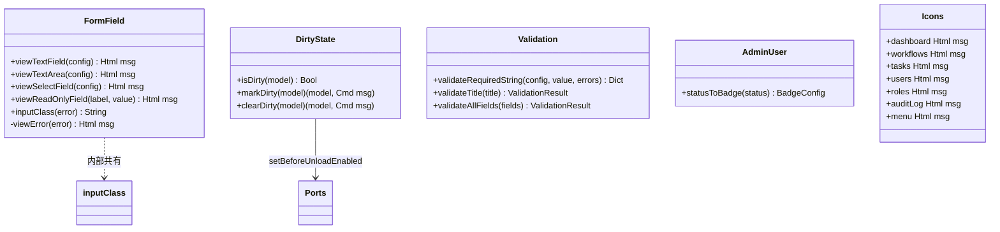
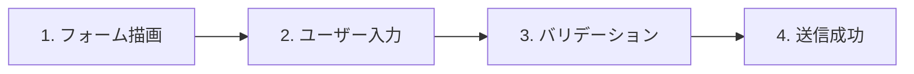
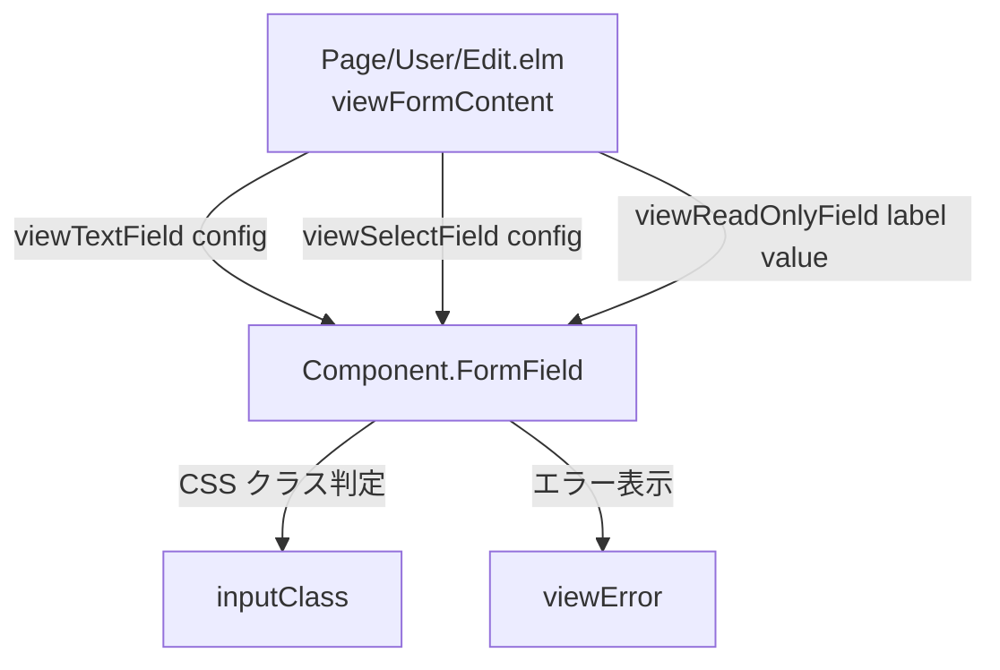
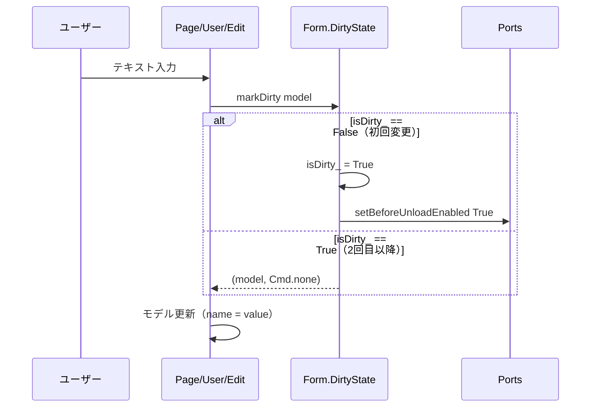
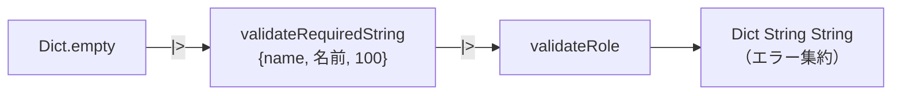
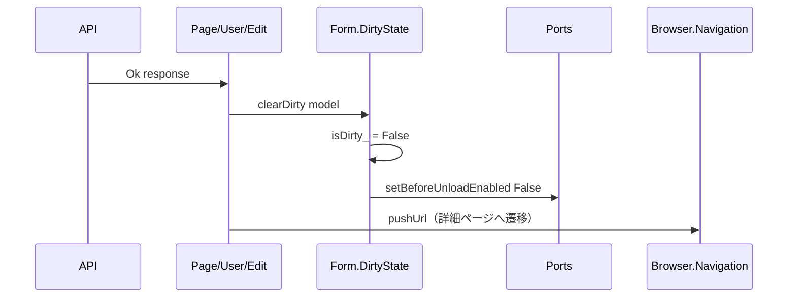
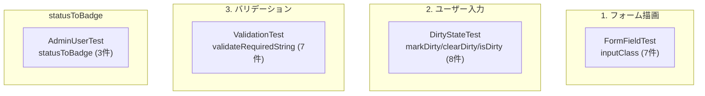

# Elm クローン削減 - コード解説

対応 PR: #574
対応 Issue: #533

## 主要な型・関数

| 型/関数 | ファイル | 責務 |
|--------|---------|------|
| `viewTextField` | [`Component/FormField.elm:60`](../../../frontend/src/Component/FormField.elm) | テキスト入力（ラベル + エラー表示） |
| `viewTextArea` | [`Component/FormField.elm:86`](../../../frontend/src/Component/FormField.elm) | テキストエリア |
| `viewSelectField` | [`Component/FormField.elm:109`](../../../frontend/src/Component/FormField.elm) | セレクトボックス |
| `viewReadOnlyField` | [`Component/FormField.elm:139`](../../../frontend/src/Component/FormField.elm) | 読み取り専用フィールド |
| `inputClass` | [`Component/FormField.elm:46`](../../../frontend/src/Component/FormField.elm) | エラー有無による CSS クラス切り替え |
| `markDirty` | [`Form/DirtyState.elm:42`](../../../frontend/src/Form/DirtyState.elm) | Dirty フラグを立てる |
| `clearDirty` | [`Form/DirtyState.elm:54`](../../../frontend/src/Form/DirtyState.elm) | Dirty フラグをクリアする |
| `isDirty` | [`Form/DirtyState.elm:36`](../../../frontend/src/Form/DirtyState.elm) | Dirty 状態を取得 |
| `validateRequiredString` | [`Form/Validation.elm:56`](../../../frontend/src/Form/Validation.elm) | 必須文字列バリデーション |
| `statusToBadge` | [`Data/AdminUser.elm:37`](../../../frontend/src/Data/AdminUser.elm) | ステータス → Badge 設定 |
| `BadgeConfig` | [`Data/AdminUser.elm:31`](../../../frontend/src/Data/AdminUser.elm) | Badge の色とラベル |

### モジュール間の関係



## コードフロー

コードをフォーム操作のライフサイクル順に追う。



### 1. フォーム描画（ページ初期表示時）

ページの `view` 関数が `Component.FormField` の関数を呼び出し、フォーム UI を描画する。



```elm
-- frontend/src/Page/User/Edit.elm:309-327
viewFormContent model userDetail roles =
    Html.form [ onSubmit SubmitForm, class "mx-auto max-w-lg space-y-6" ]
        [ h2 [ ... ] [ text "ユーザーを編集" ]
        , FormField.viewReadOnlyField "メールアドレス" userDetail.email  -- ①
        , FormField.viewTextField                                         -- ②
            { label = "名前"
            , value = model.name
            , onInput = UpdateName
            , error = Dict.get "name" model.validationErrors
            , inputType = "text"
            , placeholder = "山田 太郎"
            }
        , FormField.viewSelectField                                       -- ③
            { label = "ロール"
            , value = model.selectedRoleId
            , onInput = UpdateRole
            , error = Dict.get "role" model.validationErrors
            , options = List.map (\role -> { value = role.id, label = role.name }) roles
            , placeholder = "-- ロールを選択 --"
            }
        ...
```

注目ポイント:

- ① `viewReadOnlyField` は位置引数（2 引数）。読み取り専用フィールドは設定項目が少ないため record config を使わない
- ② `viewTextField` は record config パターン。エラー状態に応じて `inputClass` が CSS クラスを切り替える
- ③ `viewSelectField` の `options` は `List { value : String, label : String }` 型。呼び出し側で `RoleItem` → `{ value, label }` に変換する

### 2. ユーザー入力（フォーム変更時）

ユーザーがフォームを変更すると、`DirtyState.markDirty` が呼ばれ、未保存状態を管理する。



```elm
-- frontend/src/Form/DirtyState.elm:42-50
markDirty : { a | isDirty_ : Bool } -> ( { a | isDirty_ : Bool }, Cmd msg )  -- ①
markDirty model =
    if model.isDirty_ then
        ( model, Cmd.none )                     -- ② 既に dirty なら何もしない
    else
        ( { model | isDirty_ = True }
        , Ports.setBeforeUnloadEnabled True      -- ③ 初回のみ Port を呼び出す
        )
```

注目ポイント:

- ① extensible record 型 `{ a | isDirty_ : Bool }` により、`isDirty_` フィールドを持つ任意のモデルで使用可能
- ② 冪等性: 2 回目以降の変更では Port 呼び出しをスキップし、不要な JavaScript 通信を避ける
- ③ `Ports.setBeforeUnloadEnabled` はブラウザの beforeunload イベントを有効化し、ページ離脱時の確認ダイアログを表示する

呼び出し側のパターン:

```elm
-- frontend/src/Page/User/Edit.elm:152-156
UpdateName value ->
    let
        ( dirtyModel, dirtyCmd ) =
            DirtyState.markDirty model
    in
    ( { dirtyModel | name = value }, dirtyCmd )
```

### 3. バリデーション（フォーム送信時）

フォーム送信時に `validateRequiredString` を含むバリデーションパイプラインが実行される。



```elm
-- frontend/src/Form/Validation.elm:53-77
validateRequiredString :
    { fieldKey : String
    , fieldLabel : String                     -- ① パラメータ化されたフィールドラベル
    , maxLength : Int
    }
    -> String
    -> Dict String String                     -- ② Dict パイプライン型
    -> Dict String String
validateRequiredString config value errors =
    let
        trimmed = String.trim value            -- ③ 前後の空白を除去
    in
    if String.isEmpty trimmed then
        Dict.insert config.fieldKey
            (config.fieldLabel ++ "を入力してください。")  -- ④ 動的メッセージ生成
            errors
    else if String.length trimmed > config.maxLength then
        Dict.insert config.fieldKey
            (config.fieldLabel ++ "は" ++ String.fromInt config.maxLength ++ "文字以内で入力してください。")
            errors
    else
        errors
```

注目ポイント:

- ① `fieldLabel` パラメータにより「名前を入力してください」「ロール名を入力してください」のメッセージを動的に生成
- ② `Dict String String -> Dict String String` 型は既存の `validateTitle` と同じパイプライン型。`|>` で連鎖可能
- ③ `String.trim` で空白のみの入力も空文字列として扱う
- ④ エラーメッセージは日本語テンプレートで構成。バリデーションロジックは共通、メッセージのみ可変

呼び出し側のパターン:

```elm
-- frontend/src/Page/User/Edit.elm:237-241
validateForm model =
    Dict.empty
        |> Validation.validateRequiredString
            { fieldKey = "name", fieldLabel = "名前", maxLength = 100 }
            model.name
        |> validateRole model.selectedRoleId
```

### 4. 送信成功（Dirty クリア時）

API 呼び出し成功後に `DirtyState.clearDirty` が呼ばれ、未保存状態をリセットする。



```elm
-- frontend/src/Page/User/Edit.elm:191-199
GotUpdateResult result ->
    case result of
        Ok _ ->
            let
                ( cleanModel, cleanCmd ) =
                    DirtyState.clearDirty model     -- ① Dirty クリア
            in
            ( { cleanModel | submitting = False }
            , Cmd.batch
                [ cleanCmd                           -- ② Port の Cmd
                , Nav.pushUrl model.key
                    (Route.toString (Route.UserDetail model.displayNumber))
                ]
            )
```

注目ポイント:

- ① `clearDirty` は `markDirty` の逆操作。`isDirty_ = True` → `False` + `setBeforeUnloadEnabled False`
- ② `Cmd.batch` で Port の Cmd とナビゲーションの Cmd を同時に発行

## テスト

各テストがコードフローのどのステップを検証しているかを示す。



| テスト | 検証対象のステップ | 検証内容 |
|-------|------------------|---------|
| `FormFieldTest.inputClass` (7件) | 1. フォーム描画 | エラー有無による CSS クラスの切り替え |
| `DirtyStateTest.isDirty` (2件) | 2. ユーザー入力 | isDirty\_ フィールドの読み取り |
| `DirtyStateTest.markDirty` (3件) | 2. ユーザー入力 | isDirty\_ の True 更新、冪等性、他フィールド保持 |
| `DirtyStateTest.clearDirty` (3件) | 4. 送信成功 | isDirty\_ の False 更新、冪等性、他フィールド保持 |
| `ValidationTest.validateRequiredString` (7件) | 3. バリデーション | 空文字列、空白、maxLength 超過、正常値、ラベル動的生成 |
| `AdminUserTest.statusToBadge` (3件) | — | active/inactive/未知の値 |

テスト方針:

- elm-html-test が未導入のため、view 関数のテストは `inputClass` のような純粋関数を公開してテスト（`Component.Button.variantClass` と同パターン）
- `DirtyState` のテストでは Elm の `Cmd` 値は比較不可能なため、モデルのフィールド変更のみを検証
- `DirtyState` のテストでは `{ isDirty_ = False, name = "test" }` のように追加フィールドを持つレコードを使い、extensible record の動作を確認

### 実行方法

```bash
# 全テスト実行
cd frontend && pnpm run test

# 個別テスト
cd frontend && pnpm run test -- --watch tests/Component/FormFieldTest.elm
cd frontend && pnpm run test -- --watch tests/Form/DirtyStateTest.elm
cd frontend && pnpm run test -- --watch tests/Form/ValidationTest.elm
```

## 設計解説

コード実装レベルの判断を記載する。機能・仕組みレベルの判断は[機能解説](./01_Elmクローン削減_機能解説.md#設計判断)を参照。

### 1. extensible record によるポリモーフィズム

場所: `Form/DirtyState.elm:42`

```elm
markDirty : { a | isDirty_ : Bool } -> ( { a | isDirty_ : Bool }, Cmd msg )
```

なぜこの実装か:
Elm にはインターフェースやトレイトがないため、extensible record が「特定フィールドを持つ任意のレコード型」を表現する唯一の手段。型変数 `a` によりレコードの他のフィールドが任意であることを表現し、`isDirty_` フィールドの存在のみをコンパイル時に保証する。

代替案:

| 案 | メリット | デメリット | 判断 |
|----|---------|-----------|------|
| **extensible record** | 呼び出し側変更なし、型安全 | Elm 固有の概念 | 採用 |
| 値のみ返す `Bool -> (Bool, Cmd msg)` | シンプル | 呼び出し側の boilerplate 増加 | 見送り |
| wrapper type `DirtyState` | 明示的な型 | 全モデルの構造変更が必要 | 見送り |

### 2. inputClass の公開によるテスタビリティ

場所: `Component/FormField.elm:46`

```elm
inputClass : Maybe String -> String
inputClass error =
    "w-full rounded-lg border px-3 py-2 text-sm "
        ++ (case error of
                Just _ ->
                    "border-error-300 focus:border-error-500 focus:ring-error-500"
                Nothing ->
                    "border-secondary-300 focus:border-primary-500 focus:ring-primary-500"
           )
```

なぜこの実装か:
elm-html-test が未導入のため、view 関数を直接テストできない。CSS クラス計算ロジックを純粋関数として抽出・公開し、単体テストを可能にする。これは既存の `Component.Button.variantClass` と同じパターン。

代替案:

| 案 | メリット | デメリット | 判断 |
|----|---------|-----------|------|
| **inputClass 公開** | テスト可能、既存パターン踏襲 | 内部実装が公開される | 採用 |
| elm-html-test 導入 | view 関数を直接テスト | 新しい依存追加、学習コスト | 見送り（将来検討） |
| テストなし | 変更不要 | ロジックの正しさを保証できない | 見送り |

### 3. viewSelectField の options 型統一

場所: `Component/FormField.elm:114`

```elm
viewSelectField :
    { ...
    , options : List { value : String, label : String }
    ...
    }
```

なぜこの実装か:
User ページでは `List RoleItem`（`{ id, name, ... }`）をセレクトに使うが、`Component.FormField` はドメイン型に依存すべきでない。`{ value : String, label : String }` に統一し、呼び出し側で変換する。

```elm
-- 呼び出し側での変換
, options = List.map (\role -> { value = role.id, label = role.name }) roles
```

代替案:

| 案 | メリット | デメリット | 判断 |
|----|---------|-----------|------|
| **`{ value, label }` 統一** | ドメイン非依存、汎用的 | 変換コード必要 | 採用 |
| `List RoleItem` 直接受け取り | 変換不要 | ドメイン型に依存、再利用性低下 | 見送り |

### 4. validateRequiredString の Dict パイプライン型

場所: `Form/Validation.elm:53`

```elm
validateRequiredString :
    { fieldKey : String, fieldLabel : String, maxLength : Int }
    -> String
    -> Dict String String
    -> Dict String String
```

なぜこの実装か:
既存の `validateTitle` が `String -> ValidationResult` 型を返すのに対し、`validateRequiredString` は `Dict -> Dict` 型のパイプライン型を採用した。これにより `Dict.empty |> validate1 |> validate2` のように連鎖でき、各ページの `validateForm` が簡潔になる。

`validateTitle` は動的フォーム専用で `ValidationResult` 型（`{ isValid, errors }`）を使うが、静的フォーム（User/Role ページ）では `Dict String String` でエラーを管理しているため、そのパターンに合わせた。

## 関連ドキュメント

- [機能解説](./01_Elmクローン削減_機能解説.md)
- [フォーム dirty-state コード解説](../PR264_フォームdirty-state/02_フォームdirty-state_コード解説.md)（Dirty フラグの初期実装）
- [計画ファイル](../../../prompts/plans/533_elm-clone-reduction.md)
