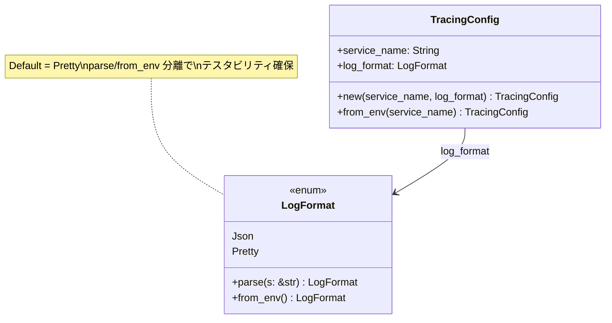
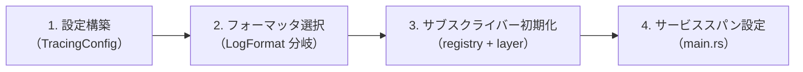
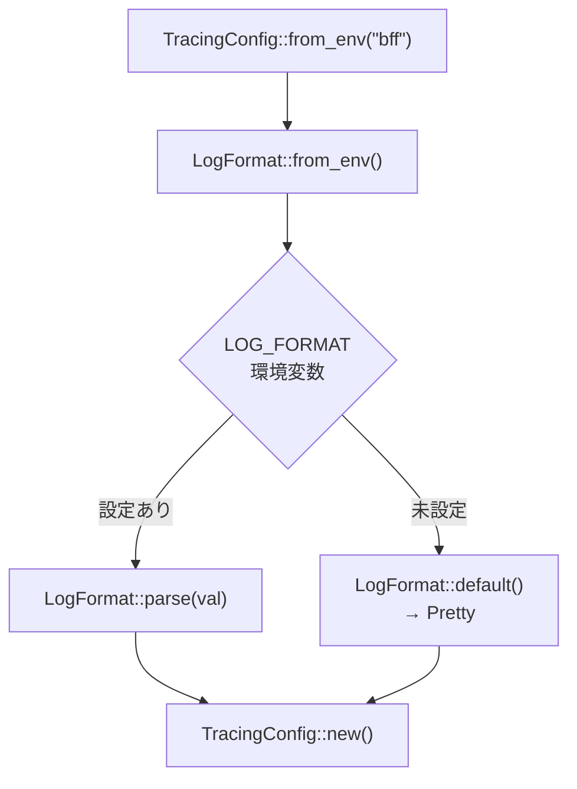
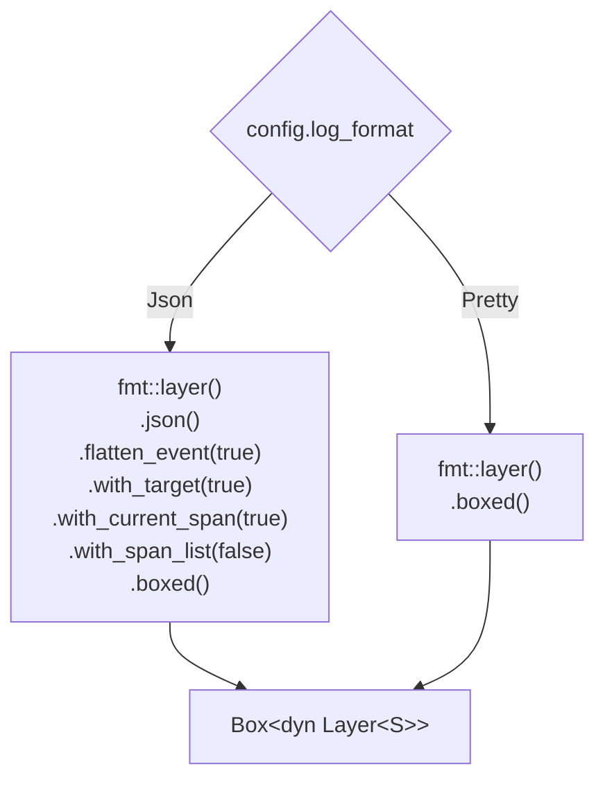
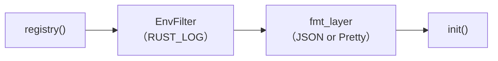
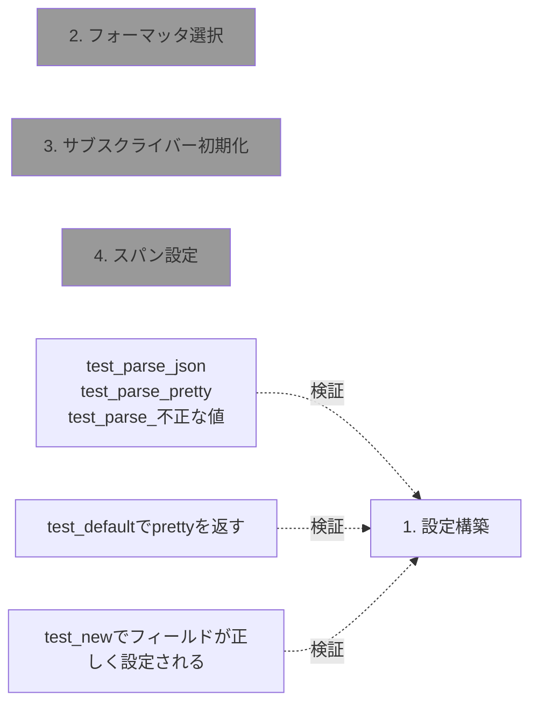

# ログ初期化共通化 - コード解説

対応 PR: #658
対応 Issue: #649

## 主要な型・関数

| 型/関数 | ファイル | 責務 |
|--------|---------|------|
| `LogFormat` | [`observability.rs:12`](../../../backend/crates/shared/src/observability.rs) | ログ出力形式の enum（Json / Pretty） |
| `TracingConfig` | [`observability.rs:49`](../../../backend/crates/shared/src/observability.rs) | サービス名とログ形式を保持する設定 |
| `init_tracing()` | [`observability.rs:84`](../../../backend/crates/shared/src/observability.rs) | グローバルトレーシングサブスクライバーの初期化 |
| `LogFormat::parse()` | [`observability.rs:25`](../../../backend/crates/shared/src/observability.rs) | 文字列から LogFormat へのパース（純粋関数） |
| `LogFormat::from_env()` | [`observability.rs:39`](../../../backend/crates/shared/src/observability.rs) | 環境変数 LOG_FORMAT からの読み取り |
| `TracingConfig::from_env()` | [`observability.rs:68`](../../../backend/crates/shared/src/observability.rs) | 環境変数から設定を構築するファクトリ |

### 型の関係



## コードフロー

コードをライフサイクル順に追う。各ステップの構造を図で示した後、対応するコードを解説する。



### 1. 設定構築（サービス起動時）

各サービスの `main.rs` で `TracingConfig::from_env()` を呼び出し、環境変数から設定を構築する。



```rust
// backend/apps/bff/src/main.rs:133-135
let tracing_config = TracingConfig::from_env("bff");                    // ①
ringiflow_shared::observability::init_tracing(tracing_config);          // ②
let _tracing_guard = tracing::info_span!("app", service = "bff").entered(); // ③
```

注目ポイント:

- ① `from_env()` は `LogFormat::from_env()` に委譲して環境変数を読み取る
- ② `init_tracing()` にムーブで渡す（`TracingConfig` は `Clone` だが、ここでは所有権を移動）
- ③ `_tracing_guard` を `_` 付きで束縛。スコープ内（main 関数全体）でスパンを維持する

### 2. フォーマッタ選択（init_tracing 内部）

`LogFormat` に応じて JSON または Pretty のフォーマットレイヤーを構築する。



```rust
// backend/crates/shared/src/observability.rs:90-99
let fmt_layer = match config.log_format {
    LogFormat::Json => tracing_subscriber::fmt::layer()
        .json()                      // ① JSON フォーマッタに切替
        .flatten_event(true)         // ② イベントフィールドをトップレベルに展開
        .with_target(true)           // ③ モジュールパスを含める
        .with_current_span(true)     // ④ 現在のスパン情報を含める
        .with_span_list(false)       // ⑤ スパンのリスト表示を無効化
        .boxed(),                    // ⑥ Box<dyn Layer<S>> に型消去
    LogFormat::Pretty => tracing_subscriber::fmt::layer().boxed(),
};
```

注目ポイント:

- ① `.json()` を呼ぶと戻り型が `Layer<S, JsonFields, Format<Json, T>, W>` に変わる。Pretty の `Layer<S, DefaultFields, Format<Full, T>, W>` とは異なる型
- ② `flatten_event(true)` により `{"fields":{"message":"..."}}` ではなく `{"message":"..."}` とフラットに出力
- ④ `with_current_span(true)` で `"span":{"service":"bff","name":"app"}` が付与される
- ⑤ `with_span_list(false)` でスパンのネスト一覧を省略（`with_current_span` で十分）
- ⑥ `.boxed()` は `tracing_subscriber::Layer` トレイトのメソッド。`Box<dyn Layer<S>>` に変換し、JSON と Pretty の型を統一する

### 3. サブスクライバー初期化（init_tracing 内部）

`EnvFilter` とフォーマットレイヤーを `registry()` に合成し、グローバルサブスクライバーとして設定する。



```rust
// backend/crates/shared/src/observability.rs:87-88, 101-104
let env_filter = tracing_subscriber::EnvFilter::try_from_default_env()
    .unwrap_or_else(|_| "info,ringiflow=debug".into());   // ①

tracing_subscriber::registry()
    .with(env_filter)     // ② フィルタリングレイヤー
    .with(fmt_layer)      // ③ フォーマットレイヤー
    .init();              // ④ グローバルサブスクライバーに設定
```

注目ポイント:

- ① `RUST_LOG` 環境変数が未設定の場合のデフォルト: `info` レベル全体 + `ringiflow` 名前空間は `debug`
- ④ `.init()` は `tracing_subscriber::util::SubscriberInitExt` トレイトのメソッド。プロセスで一度だけ呼べる（2回呼ぶとパニック）

### 4. サービススパン設定（main.rs）

`init_tracing()` 完了後、呼び出し元でサービス識別用のトップレベルスパンを設定する。

```rust
// backend/apps/bff/src/main.rs:135
let _tracing_guard = tracing::info_span!("app", service = "bff").entered(); // ①
```

注目ポイント:

- ① `.entered()` は `Span::enter()` のショートカットで、`EnteredSpan` ガードを返す。変数に束縛してスコープ（= main 関数全体）でスパンを維持する
- このスパンにより、JSON 出力の全ログイベントに `"span":{"service":"bff","name":"app"}` が付与される
- `init_tracing()` からスパン生成を分離することで、共通モジュールの責務を初期化のみに限定

## テスト

各テストがライフサイクルのどのステップを検証しているかを示す。



| テスト | 検証対象のステップ | 検証内容 |
|-------|------------------|---------|
| `test_parse_jsonでjsonを返す` | 1. 設定構築 | "json" → `LogFormat::Json` |
| `test_parse_prettyでprettyを返す` | 1. 設定構築 | "pretty" → `LogFormat::Pretty` |
| `test_parse_不正な値でprettyにフォールバックする` | 1. 設定構築 | "unknown", "", "JSON" → `Pretty` |
| `test_defaultでprettyを返す` | 1. 設定構築 | `Default` trait で Pretty |
| `test_newでフィールドが正しく設定される` | 1. 設定構築 | フィールドの値が引数と一致 |

ステップ 2〜4 はグローバル状態を変更するため、ユニットテストではなくコンパイル成功で型の整合性を検証し、手動検証で動作を確認した。

### 実行方法

```bash
cargo test -p ringiflow-shared --features observability
```

## 依存関係

| クレート | バージョン | 追加理由 |
|---------|-----------|---------|
| `tracing-subscriber` | workspace (0.3) | JSON / Pretty フォーマッタ、EnvFilter、registry。`observability` feature で optional |

`tracing` クレート自体は shared の直接依存に含めない。`tracing-subscriber` の推移的依存で十分であり、shared 内のコードでは `tracing` の型を直接使用しない（`tracing::info_span!` 等は各 app の main.rs で使用）。

## 設計解説

コード実装レベルの判断を記載する。機能・仕組みレベルの判断は[機能解説](./01_ログ初期化共通化_機能解説.md#設計判断)を参照。

### 1. `#[cfg(feature = "observability")]` の配置

場所: `observability.rs:83`

```rust
#[cfg(feature = "observability")]
pub fn init_tracing(config: TracingConfig) {
    use tracing_subscriber::{Layer as _, layer::SubscriberExt, util::SubscriberInitExt};
    // ...
}
```

なぜこの実装か:
`LogFormat` と `TracingConfig` は feature gate の外に置き、`init_tracing()` のみを gate する。これにより:
- `LogFormat` と `TracingConfig` は `tracing-subscriber` に依存しない純粋な型として常に利用可能
- テスト（`#[cfg(test)]`）が feature 無効時でも実行可能
- `init_tracing()` 内の `use` 文をローカルにすることで、feature 無効時のインポートエラーを回避

代替案:

| 案 | メリット | デメリット | 判断 |
|----|---------|-----------|------|
| **関数レベル cfg（採用）** | 型のテストが容易 | init_tracing 単体では feature 必要 | 採用 |
| モジュール全体に cfg | シンプル | LogFormat のテストに feature 必要 | 見送り |
| lib.rs で cfg_attr(feature, pub mod) | 外部から不可視 | テスト書きにくい | 見送り |

### 2. `use` 文のローカル配置

場所: `observability.rs:85`

```rust
pub fn init_tracing(config: TracingConfig) {
    use tracing_subscriber::{Layer as _, layer::SubscriberExt, util::SubscriberInitExt};
    // ...
}
```

なぜこの実装か:
`tracing_subscriber` のインポートを `init_tracing()` 関数内に配置。ファイルトップに置くと `#[cfg(feature)]` で囲む必要が生じ、`LogFormat` / `TracingConfig` の定義と `use` 文の整合性管理が複雑になる。関数内 `use` は Rust では合法であり、feature gate との相性が良い。

### 3. `LogFormat::parse()` の大文字小文字処理

場所: `observability.rs:26-33`

```rust
pub fn parse(s: &str) -> Self {
    match s {
        "json" => Self::Json,
        "pretty" => Self::Pretty,
        other => {
            eprintln!("WARNING: unknown LOG_FORMAT={other:?}, falling back to pretty");
            Self::Pretty
        }
    }
}
```

なぜこの実装か:
大文字小文字を区別し、`"JSON"` は不正値としてフォールバックする。環境変数の値は明示的に設定するものであり、曖昧さを排除する方が運用上安全。テストで `"JSON"` が Pretty にフォールバックすることを検証済み。

代替案:

| 案 | メリット | デメリット | 判断 |
|----|---------|-----------|------|
| **case-sensitive + 警告（採用）** | 明示的、誤設定を早期発見 | "JSON" が動かない | 採用 |
| `to_lowercase()` で正規化 | 柔軟 | 誤った値が黙って通る | 見送り |
| `FromStr` トレイト実装 | 標準的 | `.parse()` で `Result` 返す必要 | 見送り（2バリアントに過剰） |

## 関連ドキュメント

- [機能解説](./01_ログ初期化共通化_機能解説.md)
- [ADR-049: サービス間共通コード抽出の方針](../../70_ADR/049_サービス間共通コード抽出の方針.md)
- [セッションログ](../../../prompts/runs/2026-02/2026-02-18_2024_ログ初期化共通モジュール化.md)
