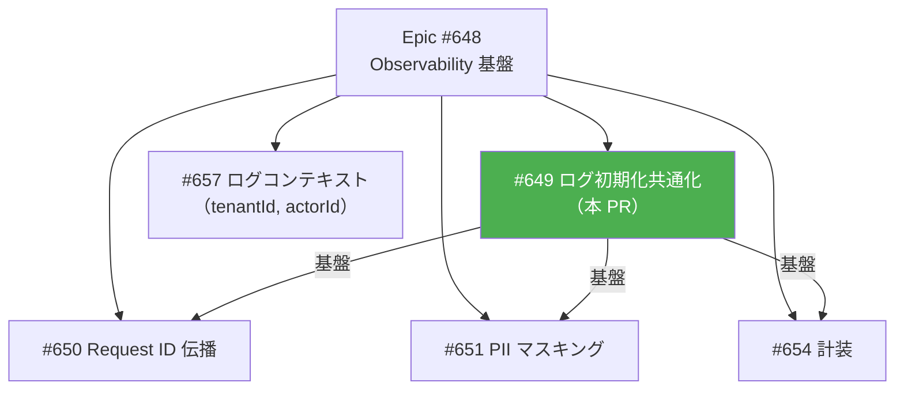
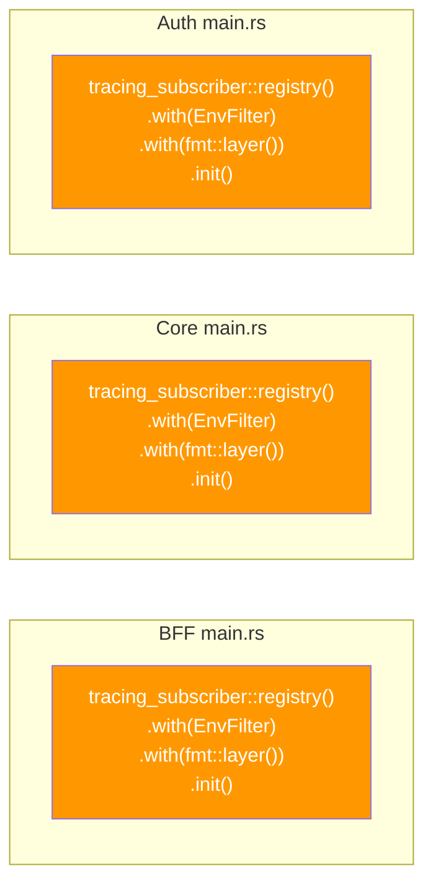
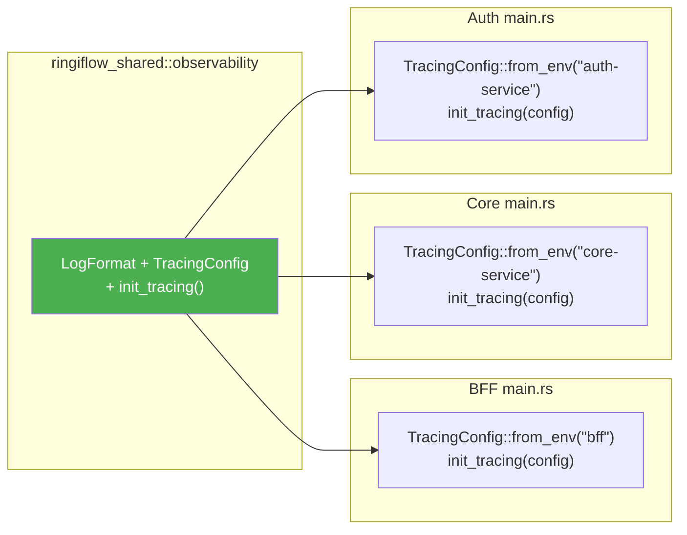
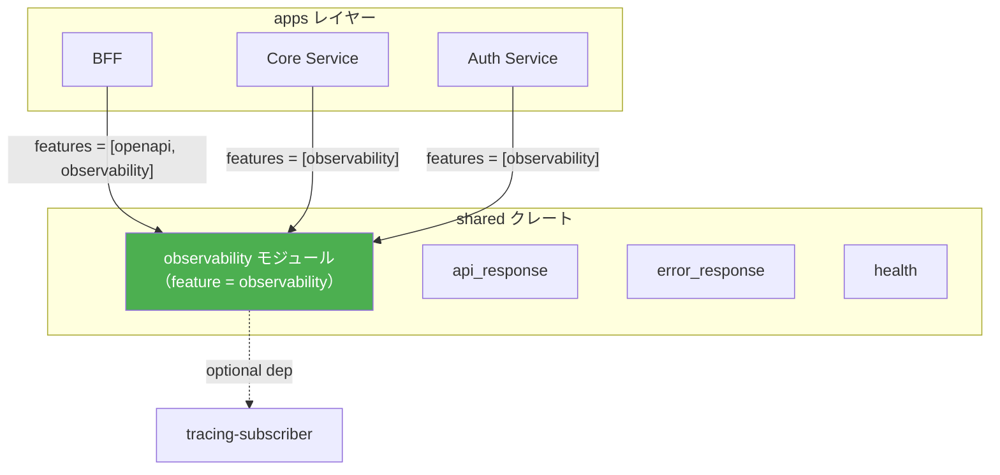
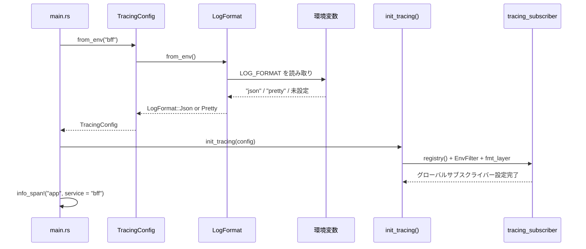

# ログ初期化共通化 - 機能解説

対応 PR: #658
対応 Issue: #649

## 概要

3サービス（BFF / Core Service / Auth Service）で重複していたログ初期化コードを `ringiflow_shared::observability` モジュールに集約し、環境変数 `LOG_FORMAT` による JSON/Pretty 出力の切り替えに対応した。Observability 基盤（Epic #648）の最初の Story として、後続の Request ID 伝播（#650）、PII マスキング（#651）、計装（#654）の土台を構築する。

## 背景

### マイクロサービスにおけるログの課題

RingiFlow のバックエンドは3つのサービスで構成されている。各サービスが独立してログ初期化を行う場合、以下の課題が生じる:

- フィールド構成の不統一（あるサービスだけタイムスタンプの形式が違う等）
- 設定変更時に3箇所の修正が必要
- ログ集約基盤（CloudWatch Logs 等）での一貫したパースが困難

### ADR-049 からの判断変更

ADR-049「サービス間共通コード抽出の方針」では、ログ初期化コード（クローン 2）を「起動コードは安定しており変更頻度が極めて低い」として `jscpd:ignore` による意図的重複を選択していた。

しかし、Epic #648（Observability 基盤）により前提が変わった:

| 項目 | ADR-049 初版の前提 | #649 時点の現実 |
|------|-------------------|----------------|
| 変更頻度 | 極めて低い | 高い（JSON 切替、Request ID、PII マスキング等） |
| 設定ロジック | なし | `LOG_FORMAT` 環境変数による分岐 |
| フィールド統一 | 不要 | 3サービスで JSON 構造を統一する必要あり |

この判断変更は ADR-049 の補遺として記録した。

### Epic #648 の中での位置づけ



| Issue | 内容 | 状態 |
|-------|------|------|
| #649 | ログ初期化共通化と構造化ログ（本 PR） | 完了 |
| #650 | Request ID 伝播 | 未着手 |
| #651 | PII マスキング | 未着手 |
| #654 | tracing::instrument 計装 | 未着手 |
| #657 | ログコンテキスト（tenantId, actorId） | 未着手 |

## 用語・概念

| 用語 | 説明 | 関連コード |
|------|------|-----------|
| LogFormat | ログ出力形式（Json / Pretty）の enum | `LogFormat` |
| TracingConfig | サービス名とログ形式を保持する設定構造体 | `TracingConfig` |
| 構造化ログ | キーバリュー形式で機械可読な JSON ログ | `fmt::layer().json()` |
| Pretty ログ | 人間が読みやすいテキスト形式のログ | `fmt::layer()` |
| Feature gate | Cargo の条件付きコンパイル機能 | `#[cfg(feature = "observability")]` |
| 型消去（`.boxed()`） | 異なる型を動的ディスパッチで統一する手法 | `.boxed()` → `Box<dyn Layer<S>>` |

## ビフォー・アフター

### Before（変更前）

各サービスの `main.rs` に同一のログ初期化コードが重複していた。



#### 制約・課題

- Pretty 出力のみ。本番環境で必要な JSON 出力に非対応
- 3箇所に同一コードが存在（`jscpd:ignore` でマーク済み）
- 後続 Story で変更が必要になると、3箇所を同時に修正する必要がある

### After（変更後）

共通モジュールに集約し、各サービスは1行で初期化。



#### 改善点

- JSON / Pretty の出力形式を環境変数 `LOG_FORMAT` で切り替え可能
- ログ初期化ロジックが1箇所に集約され、後続 Story の変更が容易
- `jscpd:ignore` マーカーが不要になり、意図的重複の管理コストが削減

## アーキテクチャ



`observability` モジュールは feature gate で保護されており、domain / infra クレートは feature を有効にしないため、不要な依存を引き込まない。

## データフロー

### フロー 1: サービス起動時のログ初期化



#### 処理ステップ

| # | レイヤー | ファイル:関数 | 処理内容 |
|---|---------|-------------|---------|
| 1 | main.rs | `TracingConfig::from_env("bff")` | 環境変数から設定を構築 |
| 2 | observability | `LogFormat::from_env()` | `LOG_FORMAT` を読み取り、パース |
| 3 | observability | `init_tracing(config)` | フォーマッタ選択、グローバルサブスクライバー設定 |
| 4 | main.rs | `tracing::info_span!(...)` | サービス識別用スパンを設定 |

### フロー 2: JSON ログ出力の例

```
{"timestamp":"2026-02-18T20:30:00.000Z","level":"INFO","target":"ringiflow_bff","message":"BFF サーバーを起動します: 0.0.0.0:3000","span":{"service":"bff","name":"app"}}
```

| フィールド | 由来 | 設定 |
|-----------|------|------|
| `timestamp` | tracing-subscriber デフォルト | — |
| `level` | tracing マクロの引数 | — |
| `target` | モジュールパス（自動） | `with_target(true)` |
| `message` | tracing マクロの引数 | `flatten_event(true)` |
| `span.service` | `info_span!("app", service = "bff")` | `with_current_span(true)` |

## 設計判断

機能・仕組みレベルの判断を記載する。コード実装レベルの判断は[コード解説](./01_ログ初期化共通化_コード解説.md#設計解説)を参照。

### 1. 異なるフォーマッタの型をどう統一するか

`tracing_subscriber::fmt::layer().json()` と `fmt::layer()` は異なる型を返すため、`match` で分岐すると型不一致でコンパイルエラーになる。

| 案 | 柔軟性 | パフォーマンス | 複雑さ |
|----|--------|-------------|-------|
| **`.boxed()` 型消去（採用）** | 高い（レイヤー追加が容易） | 動的ディスパッチ | 低い |
| `#[cfg]` コンパイル時分岐 | 低い（実行時切替不可） | 静的ディスパッチ | 中程度 |
| 2つの初期化関数 | 中程度 | 静的ディスパッチ | 高い（重複） |

**採用理由**: `.boxed()` は tracing-subscriber 公式 API。動的ディスパッチのオーバーヘッドはログ I/O に比べて無視できる。後続 Story でレイヤー追加時に1箇所の修正で済む。

### 2. サービス名をどう JSON に含めるか

JSON 出力にサービス識別子（`"service": "bff"` 等）を含める方法。

| 案 | 責務分離 | 柔軟性 | 標準 API |
|----|---------|--------|---------|
| **トップレベルスパン方式（採用）** | 明確（init は初期化のみ） | 高い | `info_span!` |
| init_tracing 内でスパン生成 | 混在（初期化 + スパン） | 低い | `info_span!` |
| カスタムレイヤーでフィールド注入 | 明確 | 中程度 | 独自実装 |

**採用理由**: `init_tracing()` の責務を初期化のみに限定。サービス名のスパンは呼び出し元（main.rs）で `tracing::info_span!("app", service = "bff").entered()` を設定する。

### 3. shared クレートへの依存追加をどう管理するか

tracing-subscriber を shared に追加すると、shared に依存する全クレートに影響する。

| 案 | 依存の最小化 | 既存パターン |
|----|------------|------------|
| **`observability` feature gate（採用）** | optional | `openapi` feature と同じ |
| 常時依存 | 全クレートに波及 | — |
| 別クレートに分離 | 完全分離 | 過剰（2バリアント enum のため） |

**採用理由**: `openapi` feature の先例に倣い、tracing-subscriber を optional 依存にする。domain / infra は feature を有効にしないため不要な依存を引き込まない。

### 4. `LogFormat::parse` のテスタビリティをどう確保するか

Rust 2024 edition では `std::env::set_var` が `unsafe` になったため、環境変数を使うテストが書きにくい。

| 案 | テスタビリティ | API の明確さ |
|----|-------------|------------|
| **`parse()` と `from_env()` を分離（採用）** | 高い（純粋関数テスト） | 明確 |
| `unsafe` ブロックでテスト | 低い（テスト間の競合リスク） | — |
| テストなし（コンパイルのみ） | なし | — |

**採用理由**: `parse()` は純粋関数として環境変数に依存せずテスト可能。`from_env()` は `parse()` に委譲するだけの薄いラッパーとし、テスト対象から外す。

## 関連ドキュメント

- [コード解説](./01_ログ初期化共通化_コード解説.md)
- [ADR-049: サービス間共通コード抽出の方針](../../70_ADR/049_サービス間共通コード抽出の方針.md)
- [セッションログ](../../../prompts/runs/2026-02/2026-02-18_2024_ログ初期化共通モジュール化.md)
- [計画ファイル](../../../prompts/plans/649_structured-logging.md)
