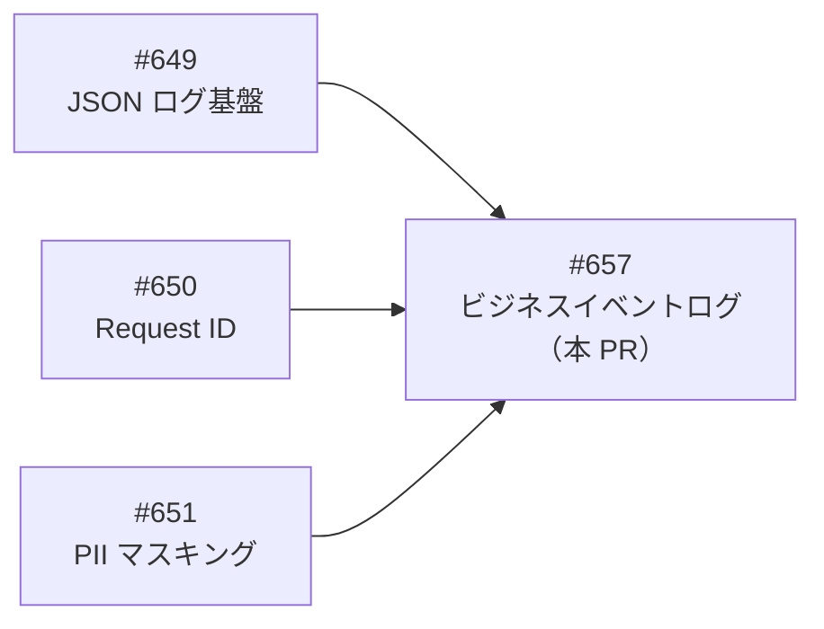
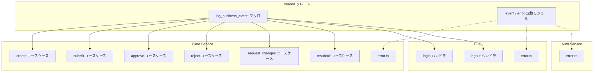
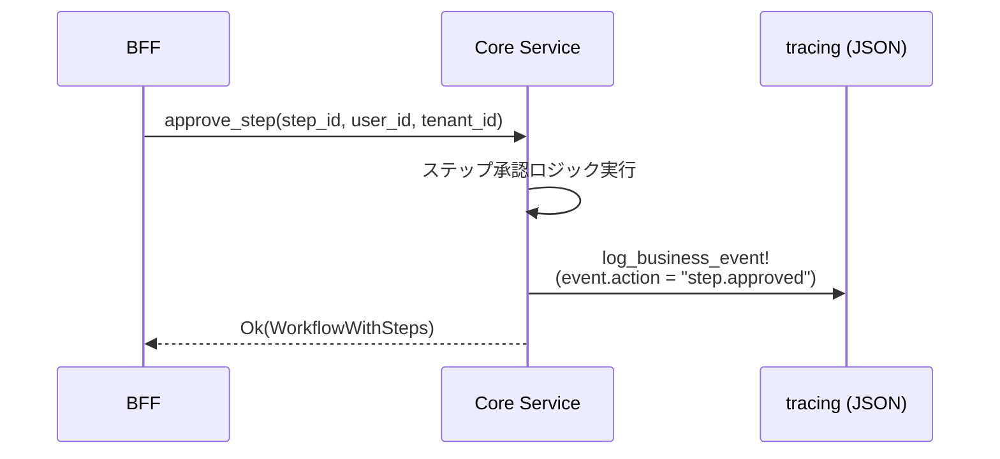
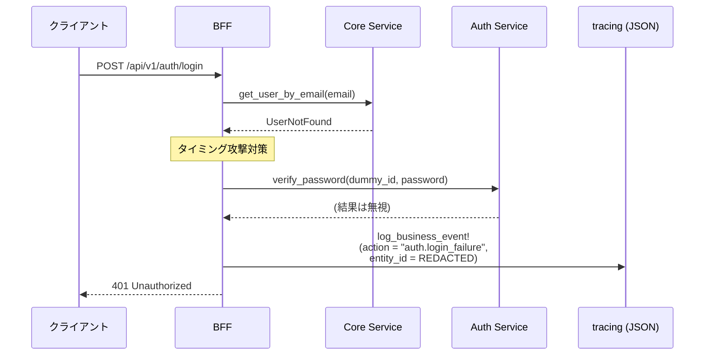

# ビジネスイベントログ - 機能解説

対応 PR: #675
対応 Issue: #657

## 概要

AI エージェントが本番障害を `jq` ワンライナーで効率的に調査できるよう、ビジネスイベントの構造化ログとエラーコンテキストの拡充を実装した。`log_business_event!` マクロの導入、ワークフロー操作（6 ユースケース）と認証操作のイベントログ追加、3 サービスの中央エラーハンドリングのコンテキスト強化を行った。

## 背景

### Observability Epic の位置づけ

本 PR は Epic #648（Observability 基盤構築）の Story 6 にあたる。先行 Story で構築した基盤の上にビジネス意味のあるログを載せる。



| Issue | 内容 | 状態 |
|-------|------|------|
| #649 | JSON ログ出力基盤 | 完了 |
| #650 | Request ID 生成・伝播 | 完了 |
| #651 | PII マスキング・ログサニタイズ | 完了 |
| #657 | ビジネスイベントログ・エラーコンテキスト（本 PR） | 実装中 |

### 変更前の課題

変更前のログは開発者向けの自由テキストで、AI エージェントによる構造的な調査が困難だった。

- ビジネスイベント（ワークフロー申請・承認・却下）のログが存在しない
- エラーログにはメッセージのみで、発生コンテキスト（カテゴリ、種別）が欠落
- 調査時に複数のログ行を手動で相関させる必要がある

### 自己完結性の原則

1 つのログエントリだけで以下の質問に答えられることを目標とした。

| 質問 | 対応フィールド |
|------|---------------|
| いつ？ | `timestamp` |
| 誰が？ | `event.actor_id` |
| どのテナントで？ | `event.tenant_id` |
| 何をしようとした？ | `event.action` + `event.entity_type` |
| 何に対して？ | `event.entity_id` |
| 結果は？ | `event.result` |
| 失敗なら原因は？ | `error.category` + `error.kind` |
| どのリクエスト？ | `request_id`（#650 で導入済み） |

## 用語・概念

| 用語 | 説明 | 関連コード |
|------|------|-----------|
| ビジネスイベント | ワークフロー操作・認証操作などの業務上の出来事 | `log_business_event!` マクロ |
| `event.kind` | ビジネスイベントを識別するマーカーフィールド。値は `"business_event"` 固定 | `event_log.rs:44` |
| `event.category` | イベントの業務カテゴリ（`workflow` / `auth`） | `event::category` |
| `event.action` | 具体的なアクション名（`workflow.created` / `step.approved` 等） | `event::action` |
| `error.category` | エラーの発生源カテゴリ（`infrastructure` / `external_service`） | `event_log::error::category` |
| `error.kind` | エラーの具体的な種別（`database` / `session` / `user_lookup` 等） | `event_log::error::kind` |

## ビフォー・アフター

### Before（変更前）

ログは自由テキストのみ。構造化フィールドなし。

```
[ERROR] ユーザー情報取得で内部エラー: connection refused
[ERROR] セッション作成に失敗: Redis timeout
```

- `jq` でフィルタリング不可能
- エラーの種別（DB / Redis / 外部サービス）がメッセージの文言に依存
- ビジネスイベント（誰がいつ何を操作したか）のログが一切ない

### After（変更後）

構造化フィールド付きのログ。`jq` でのフィルタリングが可能。

**ビジネスイベントログ:**
```json
{
  "level": "INFO",
  "event.kind": "business_event",
  "event.category": "workflow",
  "event.action": "step.approved",
  "event.entity_type": "workflow_step",
  "event.entity_id": "550e8400-...",
  "event.actor_id": "7c9e6679-...",
  "event.tenant_id": "a1b2c3d4-...",
  "event.result": "success",
  "message": "承認ステップ完了"
}
```

**エラーコンテキスト付きログ:**
```json
{
  "level": "ERROR",
  "error.category": "infrastructure",
  "error.kind": "database",
  "message": "データベースエラー: connection refused"
}
```

#### 改善点

- `jq 'select(.["event.kind"] == "business_event")'` で全ビジネスイベントをフィルタ可能
- `jq 'select(.["error.category"] == "infrastructure")'` でインフラ系エラーを一括抽出
- PII マスキング（`REDACTED`）によりユーザー不存在時のメールアドレス漏洩を防止

## アーキテクチャ



ビジネスイベントログは `log_business_event!` マクロ経由で出力し、エラーコンテキストは既存の `tracing::error!` にフィールドを追加する形で実装した。

## データフロー

### フロー 1: ワークフロー承認時のビジネスイベント



| # | レイヤー | ファイル:関数 | 処理内容 |
|---|---------|-------------|---------|
| 1 | Core ユースケース | `approve.rs:approve_step` | 承認ロジック実行 |
| 2 | Core ユースケース | `approve.rs:152` | `log_business_event!` で構造化イベント出力 |
| 3 | tracing | JSON サブスクライバ | フラット JSON としてファイル/stdout に出力 |

### フロー 2: ログイン失敗（ユーザー不存在）時のイベント



| # | レイヤー | ファイル:関数 | 処理内容 |
|---|---------|-------------|---------|
| 1 | BFF ハンドラ | `login.rs:login` | ユーザー検索 → NotFound |
| 2 | BFF ハンドラ | `login.rs:214` | タイミング攻撃対策のダミーリクエスト |
| 3 | BFF ハンドラ | `login.rs:219` | `log_business_event!` で失敗イベント出力（entity_id は `REDACTED`） |

## イベントカタログ

### ワークフロー操作（Core Service ユースケース層）

| action | entity_type | ログ配置 |
|--------|-------------|---------|
| `workflow.created` | `workflow_instance` | `create.rs` |
| `workflow.submitted` | `workflow_instance` | `submit.rs` |
| `step.approved` | `workflow_step` | `approve.rs` |
| `step.rejected` | `workflow_step` | `reject.rs` |
| `step.changes_requested` | `workflow_step` | `request_changes.rs` |
| `workflow.resubmitted` | `workflow_instance` | `resubmit.rs` |

### 認証操作（BFF ハンドラ層）

| action | entity_type | event.result | 補足 |
|--------|-------------|-------------|------|
| `auth.login_success` | `session` | `success` | session_id を entity_id に記録 |
| `auth.login_failure` | `user` | `failure` | reason フィールドで失敗理由を区別 |
| `auth.logout` | `session` | `success` | tenant_id のみ |

### エラーコンテキスト（3 サービスの error.rs + BFF login ハンドラ）

| error.category | error.kind | 発生箇所 |
|---------------|-----------|---------|
| `infrastructure` | `database` | Core/Auth error.rs |
| `infrastructure` | `internal` | Core/Auth error.rs |
| `infrastructure` | `session` | BFF error.rs, login.rs |
| `infrastructure` | `csrf_token` | login.rs |
| `external_service` | `service_communication` | BFF error.rs |
| `external_service` | `user_lookup` | login.rs |
| `external_service` | `password_verification` | login.rs |

## 設計判断

機能・仕組みレベルの判断を記載する。コード実装レベルの判断は[コード解説](./02_ビジネスイベントログ_コード解説.md#設計解説)を参照。

### 1. ビジネスイベントのログ出力層をどうするか

ワークフロー操作のログをどのレイヤーに配置するかの判断。

| 案 | 両パスのカバー | ドメイン層の純粋性 | HTTP コンテキスト |
|----|--------------|-------------------|-----------------|
| **ユースケース層（採用）** | `*_by_display_number` が UUID バリアントに委譲するため両パスカバー | 侵入なし | なし |
| ハンドラ層 | display_number 委譲でログ重複の可能性 | 侵入なし | あり |
| ドメイン層 | 完全カバー | tracing 依存がドメインに侵入 | なし |

**採用理由**: `*_by_display_number` バリアントは UUID バリアントに委譲する設計のため、UUID バリアントにログを配置すれば両方の API パスを 1 箇所でカバーできる。ドメイン層の純粋性も保てる。

### 2. 認証イベントのログ出力層をどうするか

認証イベントのログを BFF と Core Service のどちらに配置するかの判断。

| 案 | 責務の一致 | 利用可能な情報 |
|----|----------|--------------|
| **BFF ハンドラ（採用）** | 認証は BFF の責務 | session_id、Cookie、タイミング攻撃対策の全コンテキスト |
| Core Service | 認証を知らないサービスにログ責務を持たせる | ユーザー情報のみ |

**採用理由**: 認証フローは BFF の責務であり、Core Service は認証を知らない。BFF ハンドラはセッション ID やタイミング攻撃対策のダミーリクエストなど、認証固有のコンテキストにアクセスできる。

### 3. フィールド命名にドット記法を採用するか

tracing のフィールド名をフラット（`event_category`）にするかドット記法（`event.category`）にするかの判断。

| 案 | JSON 出力 | jq での参照 | 既存パターンとの一貫性 |
|----|----------|-----------|---------------------|
| **ドット記法（採用）** | `"event.category": "workflow"` | `jq '.["event.category"]'` | `audit_log.rs` の `user.create` と一貫 |
| アンダースコア | `"event_category": "workflow"` | `jq '.event_category'` | 既存パターンなし |

**採用理由**: tracing の `$($field:ident).+` パターンがドット区切りを許容する。JSON 出力ではフラットなキー（`"event.category"`）になり、`jq` のブラケット記法で参照できる。既存の `audit_log.rs` でも `user.create` のようなドット区切りの命名を使用しており一貫性がある。

### 4. エラー種別のフィールド名をどうするか

Issue の設計案では `error.type` だったが、Rust の予約語との衝突を考慮。

| 案 | Rust での利用 | エコシステムとの一貫性 |
|----|-------------|---------------------|
| **`error.kind`（採用）** | 問題なし | `std::io::ErrorKind` と命名が一致 |
| `error.type` | `type` は Rust 予約語、tracing フィールドでも使用不可 | OpenTelemetry の命名に近い |

**採用理由**: `type` は Rust の予約語であり tracing のフィールド名に使用できない。`error.kind` は `std::io::ErrorKind` と命名が一致しており、Rust エコシステムで自然。

## 関連ドキュメント

- [コード解説](./02_ビジネスイベントログ_コード解説.md)
- [ログスキーマ](../../80_ナレッジベース/backend/log-schema.md)
- [計画ファイル](../../../prompts/plans/657_business-event-log.md)
