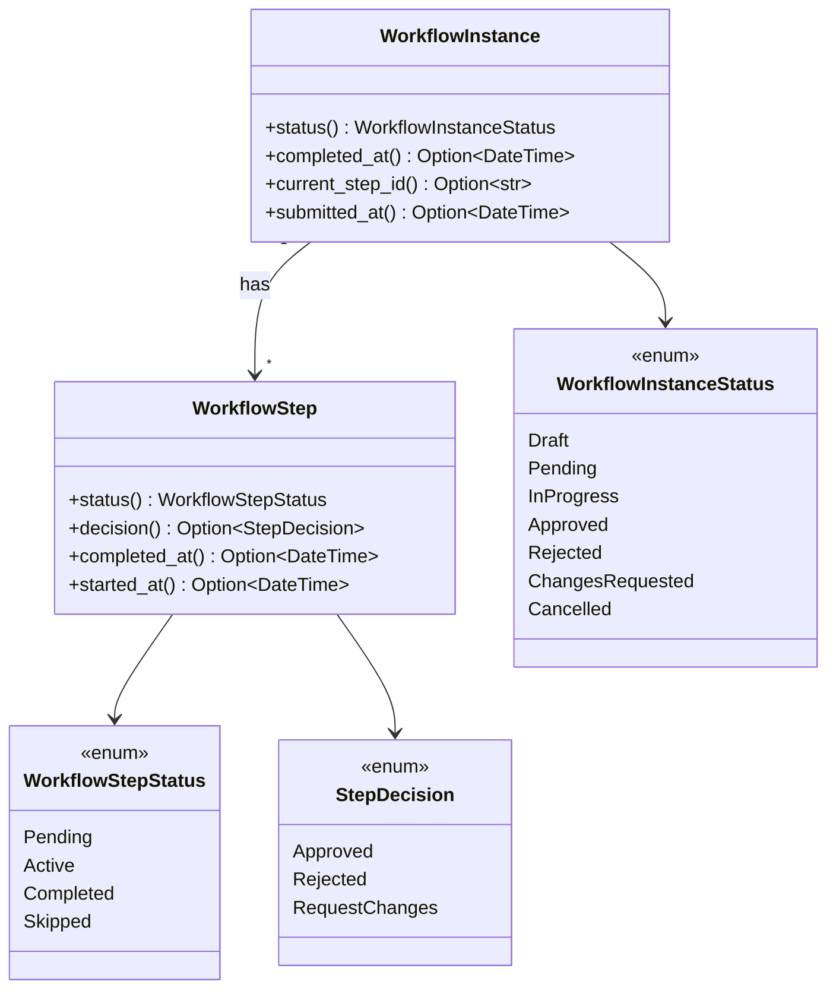
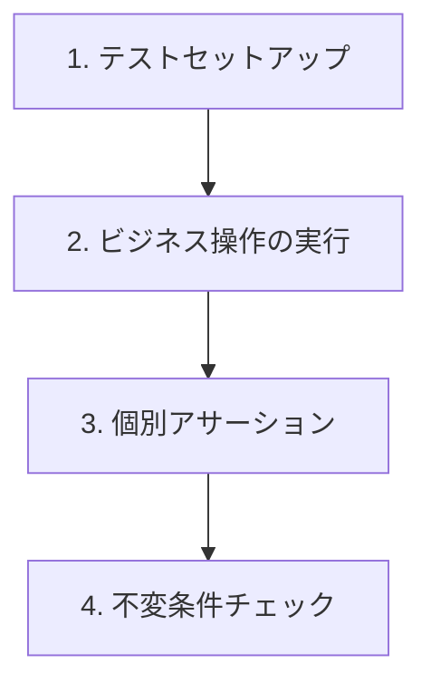
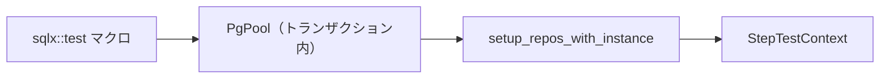
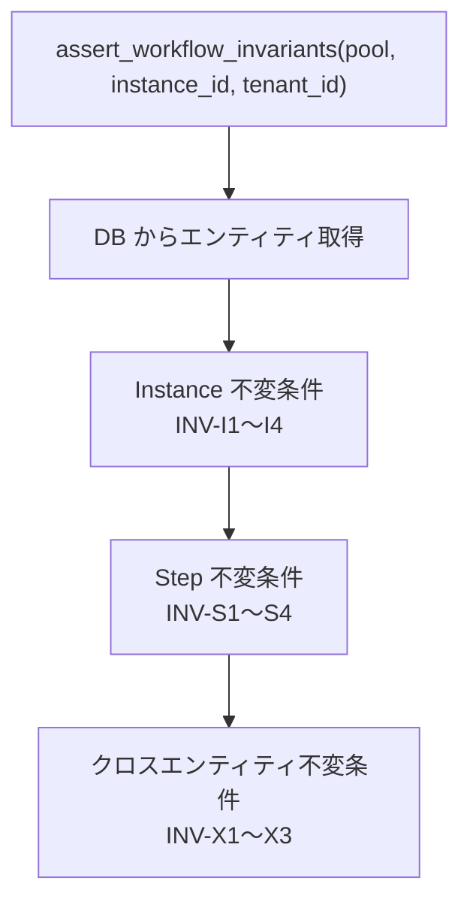
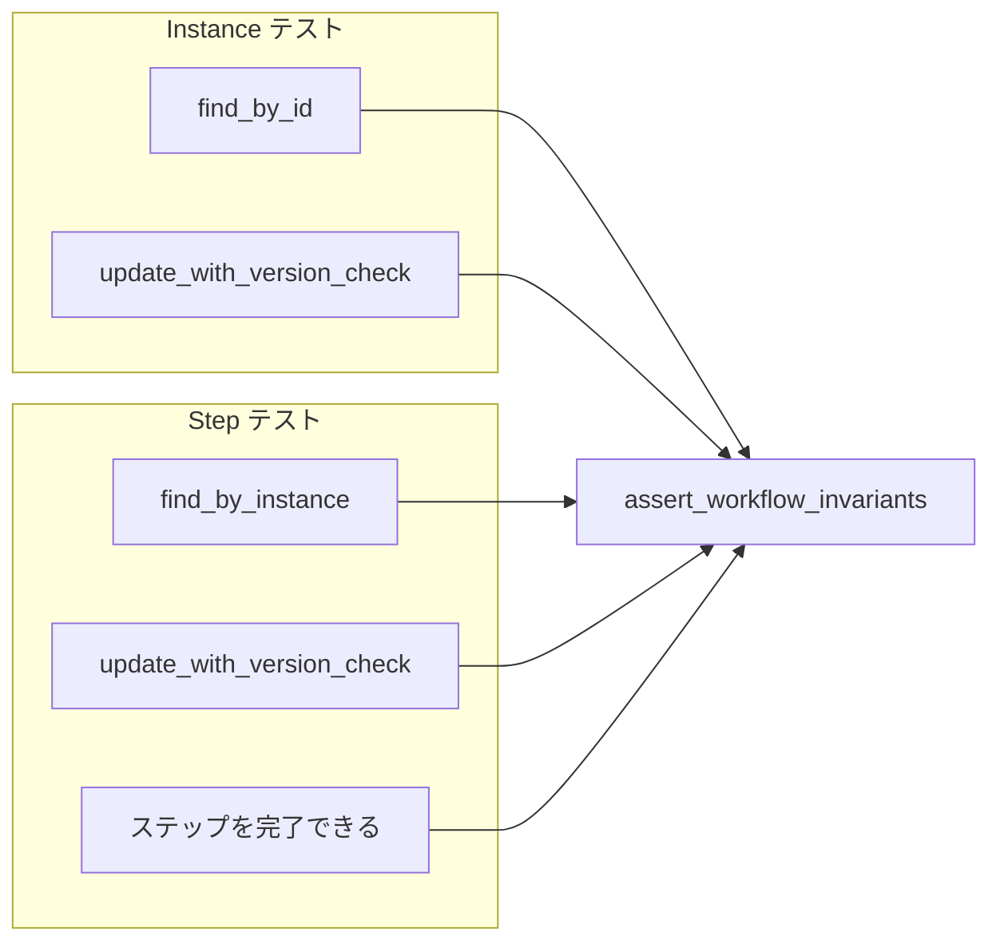

# 不変条件チェック関数 - コード解説

対応 PR: #691
対応 Issue: #686

## 主要な型・関数

| 型/関数 | ファイル | 責務 |
|--------|---------|------|
| `assert_workflow_invariants` | [`tests/common/mod.rs:228`](../../../backend/crates/infra/tests/common/mod.rs) | 全不変条件の一括検証 |
| `WorkflowInstance` | [`domain/src/workflow/instance.rs:78`](../../../backend/crates/domain/src/workflow/instance.rs) | ワークフローインスタンスのドメインモデル |
| `WorkflowStep` | [`domain/src/workflow/step.rs:90`](../../../backend/crates/domain/src/workflow/step.rs) | ワークフローステップのドメインモデル |
| `WorkflowInstanceStatus` | [`domain/src/workflow/instance.rs:30`](../../../backend/crates/domain/src/workflow/instance.rs) | インスタンスの状態 enum |
| `WorkflowStepStatus` | [`domain/src/workflow/step.rs:28`](../../../backend/crates/domain/src/workflow/step.rs) | ステップの状態 enum |
| `StepDecision` | [`domain/src/workflow/step.rs:60`](../../../backend/crates/domain/src/workflow/step.rs) | ステップの判断結果 enum |
| `StepTestContext` | [`tests/workflow_step_repository_test.rs:35`](../../../backend/crates/infra/tests/workflow_step_repository_test.rs) | Step テストの共通コンテキスト |

### 型の関係



## コードフロー

統合テストでの不変条件チェックのライフサイクルを追う。



### 1. テストセットアップ（テスト開始時）

`sqlx::test` マクロがテストごとにトランザクションを作成し、テスト完了後にロールバックする。Step テストでは `StepTestContext` が共通セットアップを提供する。



```rust
// tests/workflow_step_repository_test.rs:35-55
struct StepTestContext {
    pool:      PgPool,       // ① 不変条件チェック用に追加
    sut:       PostgresWorkflowStepRepository,
    instance:  WorkflowInstance,
    tenant_id: TenantId,
}

async fn setup_repos_with_instance(pool: PgPool, display_number: i64) -> StepTestContext {
    let instance_repo = PostgresWorkflowInstanceRepository::new(pool.clone());
    let sut = PostgresWorkflowStepRepository::new(pool.clone()); // ② clone に変更
    let tenant_id = seed_tenant_id();
    let instance = create_test_instance(display_number);
    instance_repo.insert(&instance).await.unwrap();
    StepTestContext {
        pool,  // ③ 所有権を ctx に移動
        sut,
        instance,
        tenant_id,
    }
}
```

注目ポイント:

- ① `pool` フィールドの追加: `assert_workflow_invariants` は内部で `PostgresWorkflowInstanceRepository` と `PostgresWorkflowStepRepository` を生成するため `PgPool` が必要。変更前は `pool` の所有権を `sut` に渡していたため、不変条件チェック時に `pool` にアクセスできなかった
- ② `pool.clone()`: `PgPool` は内部的に `Arc` で接続プールを共有するため、clone は軽量（参照カウントのインクリメントのみ）
- ③ 所有権の移動: `pool` は `sut` 作成後も `StepTestContext` に保持され、テスト全体を通じて利用可能

### 2. ビジネス操作の実行（テスト本体）

各テストがリポジトリ経由でビジネス操作を実行する。この段階でエンティティの状態が変更される。

```rust
// tests/workflow_step_repository_test.rs:309-333（ステップ完了テストの例）
// ステップをアクティブ化
let active_step = step.activated(now);
ctx.sut
    .update_with_version_check(&active_step, v1, &ctx.tenant_id)
    .await
    .unwrap();

// ステップを完了
let completed_step = active_step
    .completed(StepDecision::Approved, Some("承認します".to_string()), now)
    .unwrap();
ctx.sut
    .update_with_version_check(&completed_step, v2, &ctx.tenant_id)
    .await
    .unwrap();
```

### 3. 個別アサーション（テスト本体）

各テスト固有の検証。特定のフィールド値が期待通りかを確認する。

```rust
// tests/workflow_step_repository_test.rs:336-341
let found = result.unwrap().unwrap();
assert!(found.completed_at().is_some());
assert_eq!(found.decision(), Some(StepDecision::Approved));
assert_eq!(found.comment(), Some("承認します"));
```

### 4. 不変条件チェック（テスト末尾）

テスト末尾で `assert_workflow_invariants` を呼び出し、全不変条件を一括検証する。



```rust
// tests/common/mod.rs:228-357
pub async fn assert_workflow_invariants(
    pool: &PgPool,
    instance_id: &WorkflowInstanceId,
    tenant_id: &TenantId,
) {
    let instance_repo = PostgresWorkflowInstanceRepository::new(pool.clone()); // ①
    let step_repo = PostgresWorkflowStepRepository::new(pool.clone());

    let instance = instance_repo
        .find_by_id(instance_id, tenant_id)
        .await
        .expect("不変条件チェック: DB エラー")
        .expect("不変条件チェック: Instance が見つからない"); // ②

    let steps = step_repo
        .find_by_instance(instance_id, tenant_id)
        .await
        .expect("不変条件チェック: DB エラー");
    // ... 各不変条件の検証
}
```

注目ポイント:

- ① リポジトリを関数内で生成: テスト本体の `sut` とは別にリポジトリを作成する。テストの検証フェーズでは、テスト対象（sut）とは独立した経路でデータを取得するほうが信頼性が高い
- ② `expect` によるパニック: テスト専用関数のため、エラーハンドリングではなくパニックで即座に失敗させる。メッセージに「不変条件チェック:」プレフィックスを付け、通常のテスト失敗と区別しやすくしている

#### INV-X1 の検証（rfind + expect による防御的チェック）

クロスエンティティ不変条件 INV-X1 では、最後の Completed ステップを逆順で検索する。

```rust
// tests/common/mod.rs:326-336
// INV-X1: Instance.status=Approved ⇒ 最終 Completed ステップの decision=Approved
if instance.status() == WorkflowInstanceStatus::Approved && !steps.is_empty() {
    let last_completed = steps
        .iter()
        .rfind(|s| s.status() == WorkflowStepStatus::Completed) // ①
        .expect("INV-X1 violated: Approved instance has steps but none is Completed"); // ②
    assert_eq!(
        last_completed.decision(),
        Some(StepDecision::Approved),
        "INV-X1 violated: ..."
    );
}
```

注目ポイント:

- ① `rfind`: `DoubleEndedIterator` のメソッドで、末尾から条件に合う最初の要素を検索する。`Vec` のイテレータは `DoubleEndedIterator` を実装しているため利用可能。`.filter().last()` や `.filter().next_back()` よりも Rust のイディオムに沿った書き方
- ② `expect` による防御的チェック: Approved インスタンスにステップがあるのに Completed ステップが1つもない場合、サイレントに通過させず即座にパニックする。`if let Some` では検出漏れが発生し得る

## テスト

各テストがライフサイクルのどのステップを検証しているかを示す。



| テスト | ファイル | 検証対象の状態 | 検証される不変条件 |
|-------|---------|-------------|-----------------|
| `test_find_by_id_でインスタンスを取得できる` | instance_repository_test | Draft | INV-I4 |
| `test_update_with_version_check_バージョン一致で更新できる` | instance_repository_test | submitted（InProgress 前の Pending） | INV-I4（Draft 時の submitted_at=None は遷移済み） |
| `test_find_by_instance_インスタンスのステップ一覧を取得できる` | step_repository_test | Draft + Pending ステップ2つ | INV-S1 |
| `test_update_with_version_check_バージョン一致で更新できる` | step_repository_test | Active ステップ | INV-S4 |
| `test_ステップを完了できる` | step_repository_test | Completed ステップ | INV-S2, INV-S3 |

不変条件チェック関数を追加していないテスト（find_by_id の None ケース、テナント分離テスト等）は、エンティティの状態変更を伴わないため対象外。

### 実行方法

```bash
# Instance テスト
cd backend && cargo test -p ringiflow-infra --test workflow_instance_repository_test

# Step テスト
cd backend && cargo test -p ringiflow-infra --test workflow_step_repository_test
```

## 設計解説

コード実装レベルの判断を記載する。機能・仕組みレベルの判断は[機能解説](./01_不変条件チェック関数_機能解説.md#設計判断)を参照。

### 1. 不変条件チェック関数の配置場所

場所: `tests/common/mod.rs`

```rust
pub async fn assert_workflow_invariants(
    pool: &PgPool,
    instance_id: &WorkflowInstanceId,
    tenant_id: &TenantId,
) { ... }
```

なぜこの実装か:
Rust の統合テスト規約では `tests/common/mod.rs` が共通ヘルパーの配置先。テストヘルパー関数（`create_test_instance` 等）と同じ場所に配置することで、テストファイルから `common::assert_workflow_invariants` として自然にアクセスできる。

代替案:

| 案 | メリット | デメリット | 判断 |
|----|---------|-----------|------|
| `tests/common/mod.rs`（採用） | 既存パターンに沿う、import が自然 | ファイルが大きくなる | 採用 |
| `tests/common/invariants.rs` に分割 | 責務の分離 | サブモジュール構成が複雑化。Rust 統合テストでは `mod.rs` 以外の共通モジュールは認識されにくい | 見送り |
| `src/` 内のテストユーティリティ | プロダクションコードから参照可能 | テスト専用コードがプロダクションに混入。`#[cfg(test)]` が必要 | 見送り |

### 2. 不変条件チェック関数内でのリポジトリ生成

場所: `tests/common/mod.rs:233-234`

```rust
let instance_repo = PostgresWorkflowInstanceRepository::new(pool.clone());
let step_repo = PostgresWorkflowStepRepository::new(pool.clone());
```

なぜこの実装か:
テスト本体の `sut`（テスト対象リポジトリ）を引数で受け取る代わりに、関数内部で独立したリポジトリインスタンスを生成する。これにより、テスト対象とは独立した検証経路を確保し、呼び出し側のシグネチャもシンプルになる。

代替案:

| 案 | メリット | デメリット | 判断 |
|----|---------|-----------|------|
| 関数内で生成（採用） | 呼び出し側がシンプル。独立した検証経路 | pool.clone() のコスト（軽微） | 採用 |
| 引数でリポジトリを受け取る | clone 不要 | 呼び出し側が煩雑。Instance テストと Step テストで引数が異なる | 見送り |

### 3. rfind の活用

場所: `tests/common/mod.rs:329`

```rust
let last_completed = steps.iter().rfind(|s| s.status() == WorkflowStepStatus::Completed);
```

なぜこの実装か:
`DoubleEndedIterator` トレイトの `rfind` は、末尾から条件検索を行う。`Vec<T>` のイテレータはこのトレイトを実装しているため、中間コレクションの生成なしに逆順検索が可能。

Clippy（`double_ended_iterator_last` lint）が `.filter().last()` を検出し、`.rfind()` への変更を推奨した。

代替案:

| 案 | パフォーマンス | Clippy 適合 | 判断 |
|----|--------------|-------------|------|
| `rfind`（採用） | O(n) 最悪、平均的に良い | 適合 | 採用 |
| `filter().last()` | O(n) 常に全走査 | lint 警告 | 見送り |
| `filter().next_back()` | O(n) 最悪 | `filter_next` lint 警告 | 見送り |

## 関連ドキュメント

- [機能解説](./01_不変条件チェック関数_機能解説.md)
- [エンティティ影響マップ: WorkflowInstance](../../40_詳細設計書/エンティティ影響マップ/WorkflowInstance.md)
- [エンティティ影響マップ: WorkflowStep](../../40_詳細設計書/エンティティ影響マップ/WorkflowStep.md)
