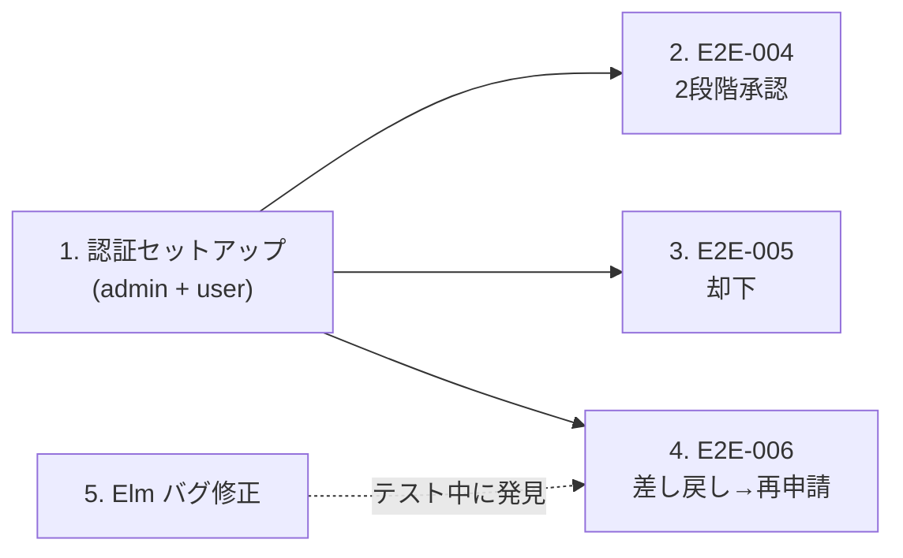
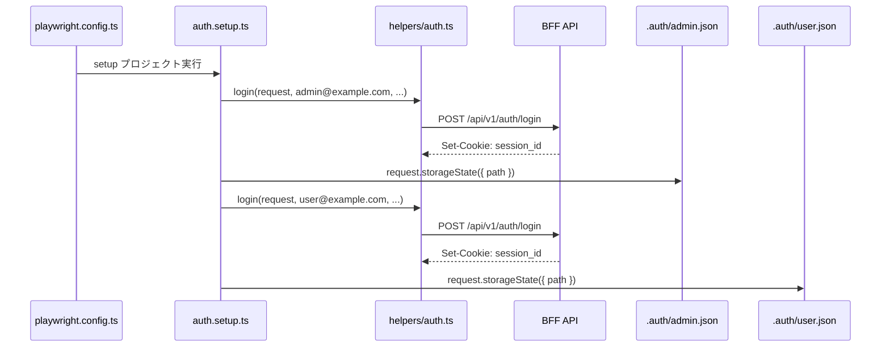
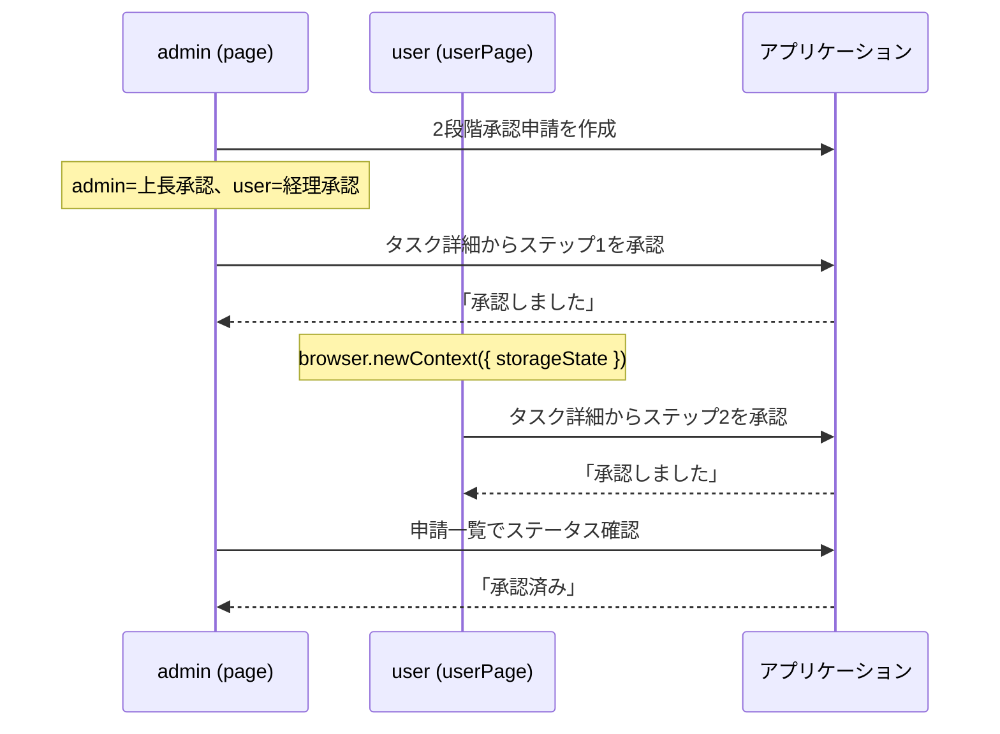
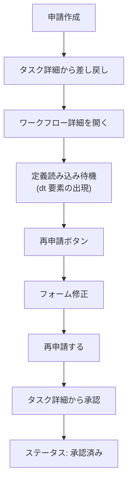
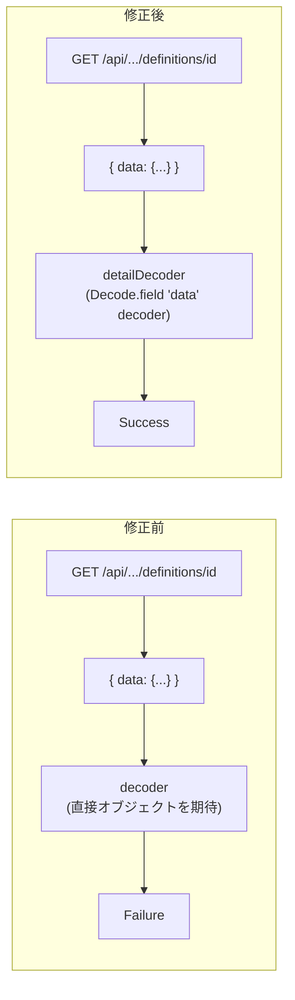
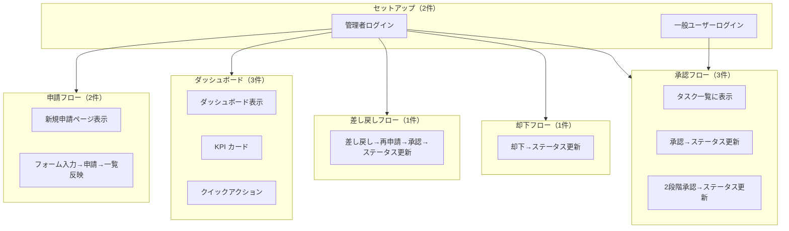
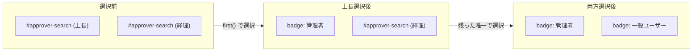

# E2E テスト多段階承認 - コード解説

対応 PR: #717
対応 Issue: #713

## 主要な型・関数

### E2E テストヘルパー（`tests/e2e/helpers/workflow.ts`）

| 型/関数 | ファイル | 責務 |
|--------|---------|------|
| `createAndSubmitWorkflow()` | [`helpers/workflow.ts:15`](../../../tests/e2e/helpers/workflow.ts) | 汎用申請テンプレートでワークフローを作成・申請する（自己承認パターン） |
| `createAndSubmitMultiStepWorkflow()` | [`helpers/workflow.ts:42`](../../../tests/e2e/helpers/workflow.ts) | 2段階承認テンプレートでワークフローを作成・申請する（2名の承認者を順次選択） |
| `openTaskDetail()` | [`helpers/workflow.ts:87`](../../../tests/e2e/helpers/workflow.ts) | タスク一覧から指定タイトルのタスク詳細を開く |
| `approveTask()` | [`helpers/workflow.ts:99`](../../../tests/e2e/helpers/workflow.ts) | タスク詳細画面で承認操作を行う（確認ダイアログ含む） |
| `rejectTask()` | [`helpers/workflow.ts:108`](../../../tests/e2e/helpers/workflow.ts) | タスク詳細画面で却下操作を行う（確認ダイアログ含む） |
| `requestChanges()` | [`helpers/workflow.ts:117`](../../../tests/e2e/helpers/workflow.ts) | タスク詳細画面で差し戻し操作を行う（確認ダイアログ含む） |
| `verifyWorkflowStatus()` | [`helpers/workflow.ts:126`](../../../tests/e2e/helpers/workflow.ts) | 申請一覧でワークフローのステータスを検証する |

### テストデータ定数（`tests/e2e/helpers/test-data.ts`）

| 定数 | ファイル | 内容 |
|------|---------|------|
| `ADMIN_USER` | [`helpers/test-data.ts:11`](../../../tests/e2e/helpers/test-data.ts) | 管理者ユーザー（email, password, id, name） |
| `REGULAR_USER` | [`helpers/test-data.ts:19`](../../../tests/e2e/helpers/test-data.ts) | 一般ユーザー（email, password, id, name） |
| `MULTI_STEP_DEFINITION_ID` | [`helpers/test-data.ts:31`](../../../tests/e2e/helpers/test-data.ts) | 2段階承認申請テンプレートの定義 ID |
| `ADMIN_AUTH_FILE` | [`helpers/test-data.ts:34`](../../../tests/e2e/helpers/test-data.ts) | 管理者の storageState ファイルパス |
| `USER_AUTH_FILE` | [`helpers/test-data.ts:35`](../../../tests/e2e/helpers/test-data.ts) | 一般ユーザーの storageState ファイルパス |

### Elm デコーダー（`Data/WorkflowDefinition.elm`）

| 関数 | ファイル | 責務 |
|------|---------|------|
| `decoder` | [`Data/WorkflowDefinition.elm:66`](../../../frontend/src/Data/WorkflowDefinition.elm) | 単一の `WorkflowDefinition` をデコード |
| `detailDecoder` | [`Data/WorkflowDefinition.elm:84`](../../../frontend/src/Data/WorkflowDefinition.elm) | API レスポンス `{ data: {...} }` 形式に対応する単一定義デコーダー |
| `listDecoder` | [`Data/WorkflowDefinition.elm:94`](../../../frontend/src/Data/WorkflowDefinition.elm) | API レスポンス `{ data: [...] }` 形式に対応する一覧デコーダー |
| `approvalStepInfos` | [`Data/WorkflowDefinition.elm:117`](../../../frontend/src/Data/WorkflowDefinition.elm) | 定義 JSON から承認ステップの ID と名前を定義順で抽出する |

## コードフロー

コードをライフサイクル順に追う。PR #717 では E2E テストインフラの拡張、3つの E2E テストシナリオの追加、およびテスト中に発見された Elm のバグ修正を行っている。



### 1. 認証セットアップ（マルチユーザー対応）

PR #434 では管理者ユーザーのみだった認証セットアップを、一般ユーザーにも拡張した。



```typescript
// tests/e2e/tests/auth.setup.ts
setup("管理者ユーザーでログインする", async ({ request }) => {
  await login(request, ADMIN_USER.email, ADMIN_USER.password);
  await request.storageState({ path: ADMIN_AUTH_FILE });       // ① admin の Cookie を保存
});

setup("一般ユーザーでログインする", async ({ request }) => {
  await login(request, REGULAR_USER.email, REGULAR_USER.password);
  await request.storageState({ path: USER_AUTH_FILE });         // ② user の Cookie を保存
});
```

注目ポイント:

- ① ② それぞれの storageState を別ファイルに保存。テスト内で `browser.newContext({ storageState })` により任意のユーザーに切り替えられる
- `playwright.config.ts` の `chromium` プロジェクトはデフォルトで `ADMIN_AUTH_FILE` を使用する

### 2. E2E-004: 2段階承認フロー（マルチユーザー）

admin が上長承認、一般ユーザーが経理承認を行う2段階承認のフルフローを検証する。



```typescript
// tests/e2e/tests/approval.spec.ts:49-80
test("2段階承認フローで両ステップ承認後にワークフローが承認済みになる", async ({
  page,
  browser,  // ① Playwright の Browser fixture を受け取る
}) => {
  const uniqueTitle = `2段階承認テスト ${Date.now()}`;

  // Given: admin が2段階承認申請を作成
  await createAndSubmitMultiStepWorkflow(
    page, uniqueTitle,
    ADMIN_USER.name,     // 上長承認
    REGULAR_USER.name,   // 経理承認
  );

  // When: admin がステップ1を承認
  await openTaskDetail(page, uniqueTitle);
  await approveTask(page);

  // And: 一般ユーザーがステップ2を承認
  const userContext = await browser.newContext({  // ② 別ユーザーのコンテキスト
    storageState: USER_AUTH_FILE,
  });
  const userPage = await userContext.newPage();

  await openTaskDetail(userPage, uniqueTitle);
  await approveTask(userPage);

  await userContext.close();                      // ③ コンテキストを明示的にクローズ

  // Then: ステータスが「承認済み」に更新される
  await verifyWorkflowStatus(page, uniqueTitle, "承認済み");
});
```

注目ポイント:

- ① `browser` fixture を使って新しいブラウザコンテキストを作成する。`page` fixture は admin の storageState で初期化されている
- ② `browser.newContext({ storageState })` で一般ユーザーの認証状態を持つ独立したコンテキストを作成。Cookie が独立しているため admin セッションに影響しない
- ③ テスト完了後にコンテキストをクローズしてリソースを解放する

### 3. E2E-006: 差し戻し→再申請→承認フロー

差し戻しから再申請、そして承認までの全サイクルを検証する。定義の非同期読み込み待機パターンが鍵。



```typescript
// tests/e2e/tests/request-changes.spec.ts:20-63
test("差し戻し後にフォームを修正して再申請し、承認するとステータスが更新される", async ({
  page,
}) => {
  const uniqueTitle = `差し戻しテスト ${Date.now()}`;

  // Given + When: 申請 → 差し戻し
  await createAndSubmitWorkflow(page, uniqueTitle, ADMIN_USER.name);
  await openTaskDetail(page, uniqueTitle);
  await requestChanges(page);

  // And: ワークフロー詳細から再申請
  await page.goto("/workflows");
  await page.locator("tr").filter({ hasText: uniqueTitle })
    .getByRole("link").first().click();

  // ① 定義の非同期読み込み完了を待機
  await expect(page.locator("dt").filter({ hasText: "件名" })).toBeVisible();

  await page.getByRole("button", { name: "再申請する" }).click();

  // ② フォームフィールドを修正（承認者は既存選択が保持される）
  const contentField = page
    .locator(".space-y-1")
    .filter({ has: page.locator("label", { hasText: /^内容$/ }) })
    .locator("input");
  await contentField.fill("修正後のテスト内容");

  await page.getByRole("button", { name: "再申請する" }).click();
  await expect(page.getByText("再申請しました")).toBeVisible();

  // And: 承認 → Then: ステータス確認
  await openTaskDetail(page, uniqueTitle);
  await approveTask(page);
  await verifyWorkflowStatus(page, uniqueTitle, "承認済み");
});
```

注目ポイント:

- ① 定義の非同期読み込み待機については、[設計解説 > 1. 定義読み込み待機パターン](#1-定義読み込み待機パターン)で詳述
- ② `label` のテキストを正規表現 `/^内容$/` で完全一致させ、「内容」を含む他のラベルとの混同を防止

### 4. デコーダー修正: `detailDecoder` の追加と使用

E2E テスト実行中に、ワークフロー詳細ページで定義の取得が Failure になるバグを発見した。API レスポンスが `{ data: {...} }` 形式であるのに対し、`decoder` は直接のオブジェクトを期待していた。



```elm
-- frontend/src/Data/WorkflowDefinition.elm:84-86
detailDecoder : Decoder WorkflowDefinition
detailDecoder =
    Decode.field "data" decoder    -- ① "data" フィールドの中身を decoder でデコード
```

```elm
-- frontend/src/Api/WorkflowDefinition.elm:70-76
getDefinition { config, id, toMsg } =
    Api.get
        { config = config
        , url = "/api/v1/workflow-definitions/" ++ id
        , decoder = WorkflowDefinition.detailDecoder  -- ② listDecoder と同様に data ラッパーに対応
        , toMsg = toMsg
        }
```

注目ポイント:

- ① `detailDecoder` は `listDecoder` と同じく `Decode.field "data"` でラッパーを剥がす。一覧と詳細でレスポンス形式を統一する API 設計（`{ data: ... }`）に合わせた3つのデコーダー構成: `decoder`（生デコーダー）、`listDecoder`（一覧用）、`detailDecoder`（詳細用）
- ② 修正前は `decoder` を直接使っていたため、`data` フィールドが見つからず Failure になっていた

### 5. `buildApprovers` 修正: 定義順序の保持

`Dict.toList` がアルファベット順（AVL ツリーの順序）で返すことが原因で、承認ステップの順序が定義と異なる場合がある問題を修正した。

```elm
-- frontend/src/Page/Workflow/New.elm:668-689
buildApprovers : Model -> List WorkflowApi.StepApproverRequest
buildApprovers model =
    let
        -- ① 定義の承認ステップ順序を取得
        stepIds =
            case model.definitions of
                Success definitions ->
                    getSelectedDefinition model.selectedDefinitionId definitions
                        |> Maybe.map WorkflowDefinition.approvalStepInfos
                        |> Maybe.map (List.map .id)
                        |> Maybe.withDefault (Dict.keys model.approvers)

                _ ->
                    Dict.keys model.approvers  -- ② フォールバック: Dict のキー順
    in
    stepIds
        |> List.filterMap
            (\stepId ->
                Dict.get stepId model.approvers
                    |> Maybe.andThen (\state -> ApproverSelector.selectedUserId state.selection)
                    |> Maybe.map (\userId -> { stepId = stepId, assignedTo = userId })
            )
```

注目ポイント:

- ① `WorkflowDefinition.approvalStepInfos` は定義 JSON の `steps` 配列から `type == "approval"` のステップを**配列順（定義順）**で返す。これにより、バックエンドが期待するステップ順序と一致する
- ② 定義が利用不可の場合のフォールバック。`Dict.keys` はアルファベット順だが、この状態でフォームが表示されることはないため安全

## テスト

各テストがカバーする範囲を示す。



| テスト | ファイル | シナリオ | 検証内容 |
|-------|---------|---------|---------|
| `管理者ユーザーでログインする` | auth.setup.ts | E2E-001 | API ログイン + admin storageState 保存 |
| `一般ユーザーでログインする` | auth.setup.ts | E2E-001 | API ログイン + user storageState 保存 |
| `申請を作成すると承認者のタスク一覧に表示される` | approval.spec.ts | E2E-004 | 申請作成→タスク一覧確認 |
| `タスク詳細から承認するとステータスが更新される` | approval.spec.ts | E2E-004 | 1段階承認→ステータス更新 |
| `2段階承認フローで両ステップ承認後にワークフローが承認済みになる` | approval.spec.ts | E2E-004 | 2段階承認（マルチユーザー）→ステータス更新 |
| `タスク詳細から却下するとステータスが更新される` | rejection.spec.ts | E2E-005 | 却下→ステータス更新 |
| `差し戻し後にフォームを修正して再申請し、承認するとステータスが更新される` | request-changes.spec.ts | E2E-006 | 差し戻し→再申請→承認→ステータス更新 |
| `認証済みユーザーがダッシュボードを表示できる` | dashboard.spec.ts | (シナリオ外) | ダッシュボード見出し表示 |
| `KPI 統計カードが表示される` | dashboard.spec.ts | (シナリオ外) | KPI カード表示 |
| `クイックアクションが表示される` | dashboard.spec.ts | (シナリオ外) | クイックアクションリンク |
| `新規申請ページにアクセスできる` | workflow.spec.ts | E2E-003 | 新規申請見出し表示 |
| `申請フォームに入力して送信すると申請一覧に反映される` | workflow.spec.ts | E2E-003 | フォーム入力→送信→一覧確認 |

### 実行方法

```bash
# E2E テスト実行（環境構築 + テスト一括）
just test-e2e

# 全テスト実行（リント + テスト + API テスト + E2E テスト）
just check-all
```

## 設計解説

コード実装レベルの判断を記載する。

### 1. 定義読み込み待機パターン

場所: `tests/e2e/tests/request-changes.spec.ts:43`

```typescript
// 定義の非同期読み込み完了を待機
// Detail.elm: definition = Success → viewFormDataWithLabels が dt/dd を描画する
await expect(page.locator("dt").filter({ hasText: "件名" })).toBeVisible();
```

なぜこの実装か:
ワークフロー詳細ページではフォームデータのラベル表示に定義の非同期取得が必要。`RemoteData` の状態によって描画が変わる:

| RemoteData 状態 | 描画される要素 | テキスト「件名」 |
|----------------|--------------|----------------|
| NotAsked / Loading | スピナー | なし |
| Success | `<dt>件名</dt><dd>値</dd>` | あり |
| Failure | エラーメッセージ | なし |

`dt` 要素は Success 状態でのみ描画されるため、`dt` 要素の出現を待つことで定義の読み込み完了を確実に検知できる。テキスト内容（「件名」）での待機は、Failure 状態のエラーメッセージにも含まれる可能性があるため不適切。

代替案:

| 案 | メリット | デメリット | 判断 |
|----|---------|-----------|------|
| `dt` 要素の出現を待機（採用） | Success 状態でのみ描画される要素で確実に検知 | 特定のフォームフィールド名に依存 | 採用 |
| `page.waitForResponse()` で API 完了を待機 | API レベルの確実性 | Elm の状態更新・描画までのラグは検知できない | 見送り |
| `page.waitForTimeout()` で固定時間待機 | 実装が単純 | フレーキーテストの原因になる | 見送り |

### 2. `buildApprovers` の順序問題と `approvalStepInfos` による解決

場所: `frontend/src/Page/Workflow/New.elm:668-689`

Elm の `Dict` は AVL ツリーで実装されており、`Dict.toList` はキーのアルファベット順で要素を返す。承認ステップの ID（UUID）をキーとする `Dict` から `toList` すると、バックエンドが期待する定義上のステップ順序とは異なる順序になる可能性がある。

```
定義の steps 配列順:  [step-A (上長承認), step-B (経理承認)]
Dict.toList の順序:   UUID のアルファベット順（定義順と無関係）
```

解決策として `WorkflowDefinition.approvalStepInfos` を使用する。この関数は定義 JSON の `steps` 配列を走査し、`type == "approval"` のステップを配列順で返す。

```elm
-- frontend/src/Data/WorkflowDefinition.elm:117-124
approvalStepInfos : WorkflowDefinition -> List ApprovalStepInfo
approvalStepInfos def =
    case Decode.decodeValue approvalStepInfosDecoder def.definition of
        Ok infos ->
            infos       -- steps 配列の順序が保持される
        Err _ ->
            []
```

`Decode.list` は JSON 配列の順序を保持してデコードするため、`approvalStepInfos` から得た ID リストで `Dict` を参照すれば、定義順で承認者リストを構築できる。

### 3. 承認者の順次選択パターン

場所: `tests/e2e/helpers/workflow.ts:42-82`

2段階承認で2名の承認者を選択する際、各承認ステップの入力欄は同じ `id="approver-search"` を持つ。選択完了後に `input` が badge（選択済みユーザーの表示）に置き換わるという Elm の Virtual DOM 差分動作を活用する。

```typescript
// tests/e2e/helpers/workflow.ts:58-78
// 上長承認の承認者を選択（1つ目の #approver-search）
await page.locator("#approver-search").first().fill(step1ApproverSearch);
await page.locator("li").filter({ hasText: step1ApproverSearch }).first().click();

// ① 選択完了を待機（badge に置き換わり、#approver-search が1つになる）
await expect(page.locator("#approver-search")).toHaveCount(1);

// 経理承認の承認者を選択（残った唯一の #approver-search）
await page.locator("#approver-search").fill(step2ApproverSearch);
await page.locator("li").filter({ hasText: step2ApproverSearch }).first().click();

// ② 全承認者の選択完了を待機
await expect(page.locator("#approver-search")).toHaveCount(0);
```

なぜこの実装か:



- ① 1人目を選択すると、その input が badge に置換され DOM から消える。`toHaveCount(1)` で置換完了を確認してから2人目の入力に進む
- ② 2人目の選択後は全 input が badge に置換されるため `toHaveCount(0)` で全選択完了を確認
- `data-testid` 等の追加が不要で、Elm の Virtual DOM 差分動作をそのまま活用できる

## 関連ドキュメント

- [E2E テスト突合表](../../50_テスト/E2Eテスト突合表.md)
- [PR #434 E2E テスト コード解説](../PR434_E2Eテスト/01_Playwright_E2Eテスト_コード解説.md)
- [計画ファイル](../../../prompts/plans/713_e2e-multi-step-approval.md)
- [Playwright 公式: Authentication](https://playwright.dev/docs/auth)
