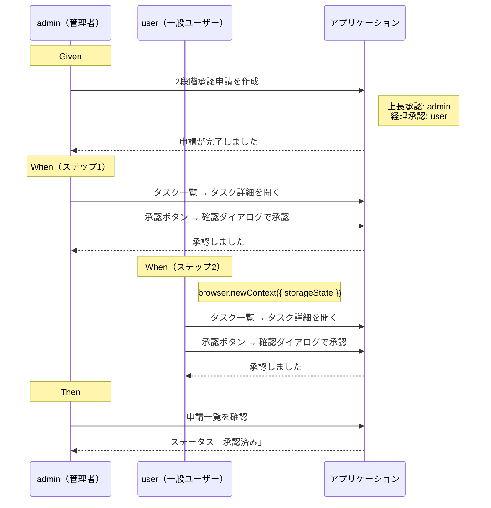
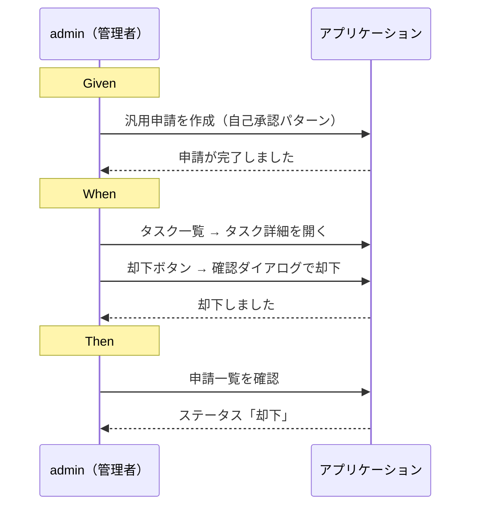
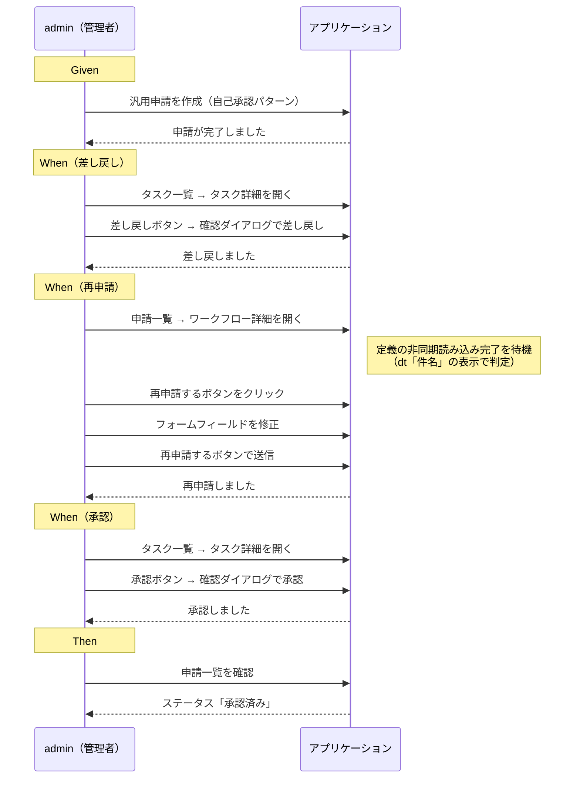
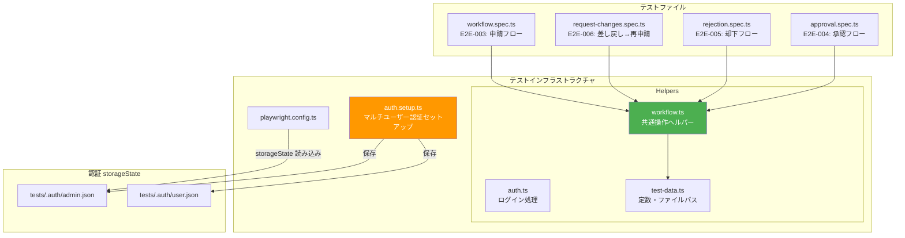
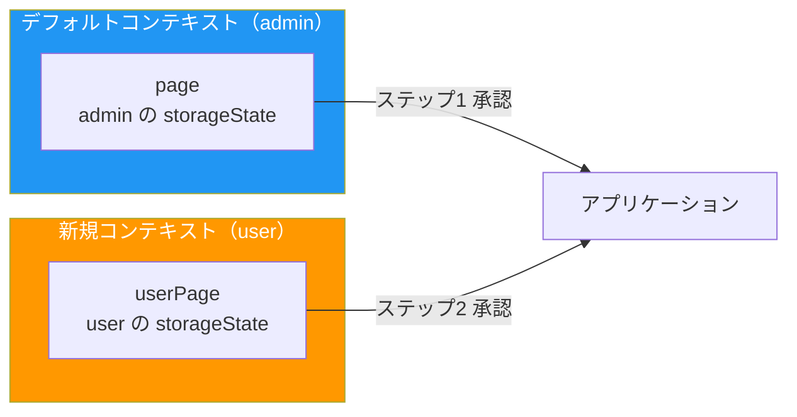
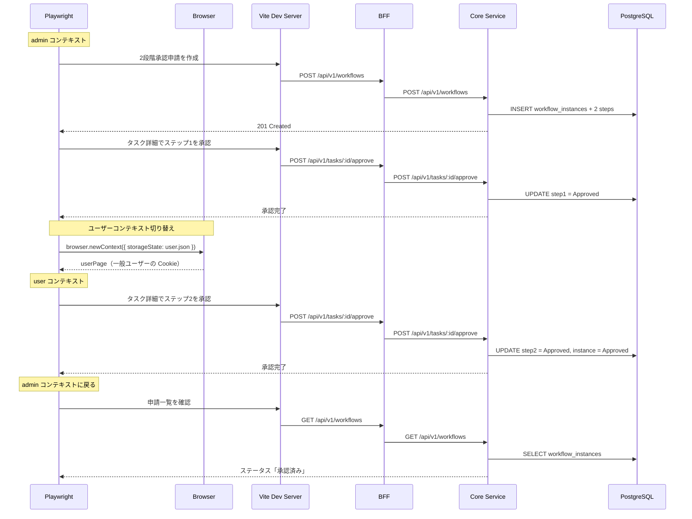
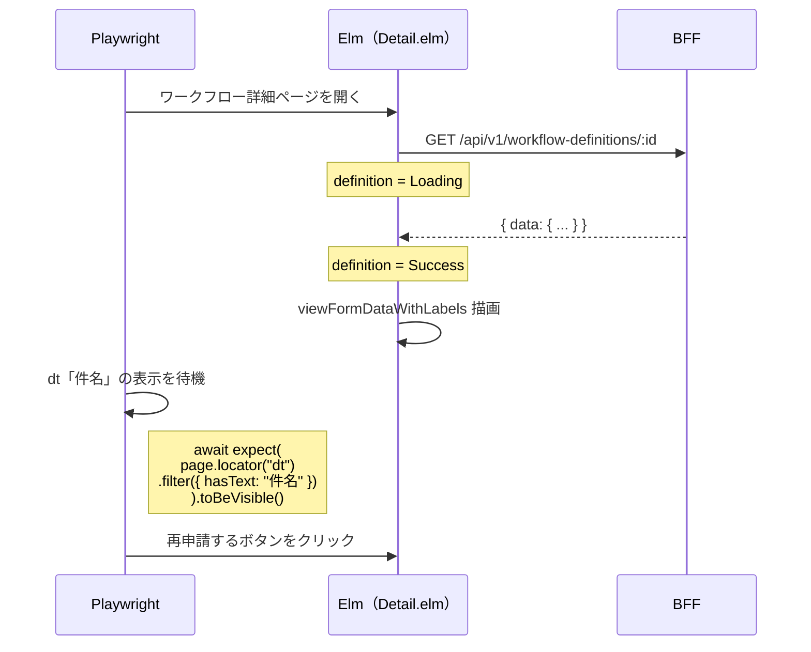

# E2E テスト多段階承認 - 機能解説

対応 PR: [#717](https://github.com/ka2kama/ringiflow/pull/717)
対応 Issue: [#713](https://github.com/ka2kama/ringiflow/issues/713)

## 概要

Phase 2-3 の主要シナリオ（多段階承認・却下・差し戻し→再申請）を検証する E2E テストを追加した。マルチユーザー認証基盤の構築、共通ヘルパーの抽出、E2E テスト実行中に発見された 2 件のバグ修正、およびトラブルシューティングフレームワークの強化を含む。

## 背景

### E2E テストカバレッジの現状

Epic #404（Phase 2-3: 多段階承認・却下・差し戻し）のバックエンド・フロントエンド実装は完了していたが、E2E テストは #434 で導入した 1 段階承認のみをカバーしていた。要件定義（CORE-12 セクション 12.6）で定義された以下のシナリオが未実装だった。

| シナリオID | シナリオ名 | 状態（実装前） |
|-----------|-----------|--------------|
| E2E-004 | 承認フロー | 1段階のみカバー、2段階未実装 |
| E2E-005 | 却下フロー | 未実装 |
| E2E-006 | 差し戻し→再申請 | 未実装 |

### E2E テスト実装中に発見されたバグ

E2E テストの実装過程で、フロントエンドに 2 件のバグを発見し修正した。

| バグ | 影響 | 原因 | 修正 |
|------|------|------|------|
| `WorkflowDefinition` のデコーダ欠落 | 定義詳細 API のレスポンスがデコードできない | 単一レスポンス用の `Decode.field "data"` ラッパーが未実装 | `detailDecoder` を `Data.WorkflowDefinition` に追加 |
| `buildApprovers` の順序不正 | 2段階承認で承認者とステップの対応がずれる | `Dict.toList` がアルファベット順で返すため、定義のステップ順と一致しない | 定義の承認ステップ順序を基準に構築するよう修正 |

これらはいずれもユニットテストや API テストでは発見が困難な、フロントエンド-バックエンド統合の問題であり、E2E テストの有効性を示している。

## 用語・概念

| 用語 | 説明 | 関連コード |
|------|------|-----------|
| E2E-004 | 2段階承認フローの E2E テストシナリオ。上長承認→経理承認の2ステップを検証 | `approval.spec.ts` |
| E2E-005 | 却下フローの E2E テストシナリオ。承認者による却下操作を検証 | `rejection.spec.ts` |
| E2E-006 | 差し戻し→再申請フローの E2E テストシナリオ。差し戻し→修正→再申請→承認を検証 | `request-changes.spec.ts` |
| storageState | Playwright の認証状態永続化機構。Cookie をファイルに保存しテスト間で共有する | `tests/.auth/*.json` |
| detailDecoder | 単一リソースの API レスポンスをデコードするデコーダ。`Decode.field "data"` ラッパー付き | `Data.WorkflowDefinition.detailDecoder` |
| 散弾銃デバッグ（shotgun debugging） | 根本原因を特定せずに推測ベースで修正を繰り返すアンチパターン | `.claude/rules/troubleshooting.md` |

## フロー

### E2E-004: 2段階承認フロー

### E2E-005: 却下フロー

### E2E-006: 差し戻し→再申請フロー

## アーキテクチャ

### テストインフラストラクチャの構成

### マルチユーザーテストパターン

2段階承認フロー（E2E-004）では、異なるユーザーで操作する必要がある。Playwright の `browser.newContext()` と storageState を組み合わせて、同一テスト内でユーザーを切り替える。

## データフロー

### E2E-004: ユーザーコンテキスト切り替えを伴う2段階承認

### E2E-006: 定義読み込み待機パターン

差し戻し→再申請フロー（E2E-006）では、ワークフロー詳細画面で定義の非同期読み込み完了を待機する必要がある。定義が読み込まれると `viewFormDataWithLabels` が `dt`/`dd` 要素を描画するため、`dt` 要素の表示を待機条件として使用する。

## 設計判断

### 1. マルチユーザー E2E テストの実現方式

2段階承認テスト（E2E-004）では、異なるユーザー（admin と一般ユーザー）で承認操作を行う必要がある。テスト内でのユーザー切り替え方式を選定した。

| 案 | 実装コスト | テストの読みやすさ | 制約 |
|----|-----------|------------------|------|
| `browser.newContext()` + storageState（採用） | 低い | コンテキスト切り替えが明示的 | テスト内に切り替えコードが必要 |
| Playwright project 分離 | 中程度 | テストが分離される | 同一テストで複数ユーザーの操作を表現できない |
| テスト内で API ログイン | 高い | ログイン処理が冗長 | セッション管理が煩雑 |

採用理由: `browser.newContext()` は Playwright 公式ドキュメントで推奨されるマルチユーザーテストパターンであり、同一テスト内で異なるユーザーの操作を自然に記述できる。storageState は `auth.setup.ts` で事前に取得済みのため、追加のログイン処理が不要。

### 2. 自己承認パターンとマルチユーザーパターンの使い分け

| テスト | パターン | 理由 |
|--------|---------|------|
| E2E-004（2段階承認） | マルチユーザー | 2つの異なるステップを異なる承認者が承認する必要がある |
| E2E-005（却下） | 自己承認 | 却下操作自体の検証が目的。マルチユーザーは不要な複雑さ |
| E2E-006（差し戻し→再申請） | 自己承認 | 差し戻し→再申請の一連フロー検証が目的。同一ユーザーで十分 |

設計原則: テストの目的に必要最小限の複雑さに留める。マルチユーザーが必須でないシナリオでは自己承認パターンを使用し、テストの安定性と可読性を優先する。

### 3. 共通ヘルパーの抽出

E2E テストの実装にあたり、申請作成・承認・却下・差し戻しなどの操作を `helpers/workflow.ts` に抽出した。

| 判断基準 | 結果 |
|---------|------|
| 3ファイル以上で使用されるか | `createAndSubmitWorkflow` は 4 ファイル、`approveTask` は 2 ファイル、`openTaskDetail` は 4 ファイルで使用 |
| テストの意図が読みやすくなるか | 操作の詳細がヘルパーに隠れ、Given-When-Then の意図が明確になる |

抽出したヘルパー:

| ヘルパー | 責務 |
|---------|------|
| `createAndSubmitWorkflow` | 汎用申請テンプレートでワークフローを作成・申請 |
| `createAndSubmitMultiStepWorkflow` | 2段階承認申請テンプレートでワークフローを作成・申請 |
| `openTaskDetail` | タスク一覧から指定タイトルのタスク詳細を開く |
| `approveTask` | タスク詳細画面で承認操作（確認ダイアログ含む） |
| `rejectTask` | タスク詳細画面で却下操作（確認ダイアログ含む） |
| `requestChanges` | タスク詳細画面で差し戻し操作（確認ダイアログ含む） |
| `verifyWorkflowStatus` | 申請一覧でワークフローのステータスを検証 |

### 4. デコーダ命名規約の制定

E2E テスト中に発見した `detailDecoder` 欠落バグを契機に、API レスポンスデコーダの命名規約を制定した。

| デコーダ | 責務 | 配置場所 |
|---------|------|---------|
| `decoder` | 内部デコーダ（`"data"` ラッパーなし） | `Data.*` モジュール |
| `detailDecoder` | 単一レスポンス用（`Decode.field "data" decoder`） | `Data.*` モジュール |
| `listDecoder` | 一覧レスポンス用（`Decode.field "data" (Decode.list decoder)`） | `Data.*` モジュール |

設計原則: `"data"` ラッパーのデコード責務を Data モジュールに集約し、Api モジュールでのインライン `Decode.field "data"` を禁止する。責務の一貫した配置により、同種のバグの再発を構造的に防止する。

## 関連ドキュメント

- [コード解説](./01_E2Eテスト多段階承認_コード解説.md)
- [E2E テストルール](../../../.claude/rules/e2e-test.md)
- [E2E テスト突合表](../../50_テスト/E2Eテスト突合表.md)
- [改善記録: 散弾銃デバッグによるトラブルシューティング効率低下](../../../process/improvements/2026-02/2026-02-20_0012_散弾銃デバッグによるトラブルシューティング効率低下.md)
- [トラブルシューティングフレームワーク](../../../.claude/rules/troubleshooting.md)
- [フロントエンドルール: デコーダ命名規約](../../../.claude/rules/frontend.md)
- [Playwright E2E テスト導入（PR #434）](../PR434_E2Eテスト/01_Playwright_E2Eテスト_機能解説.md)
