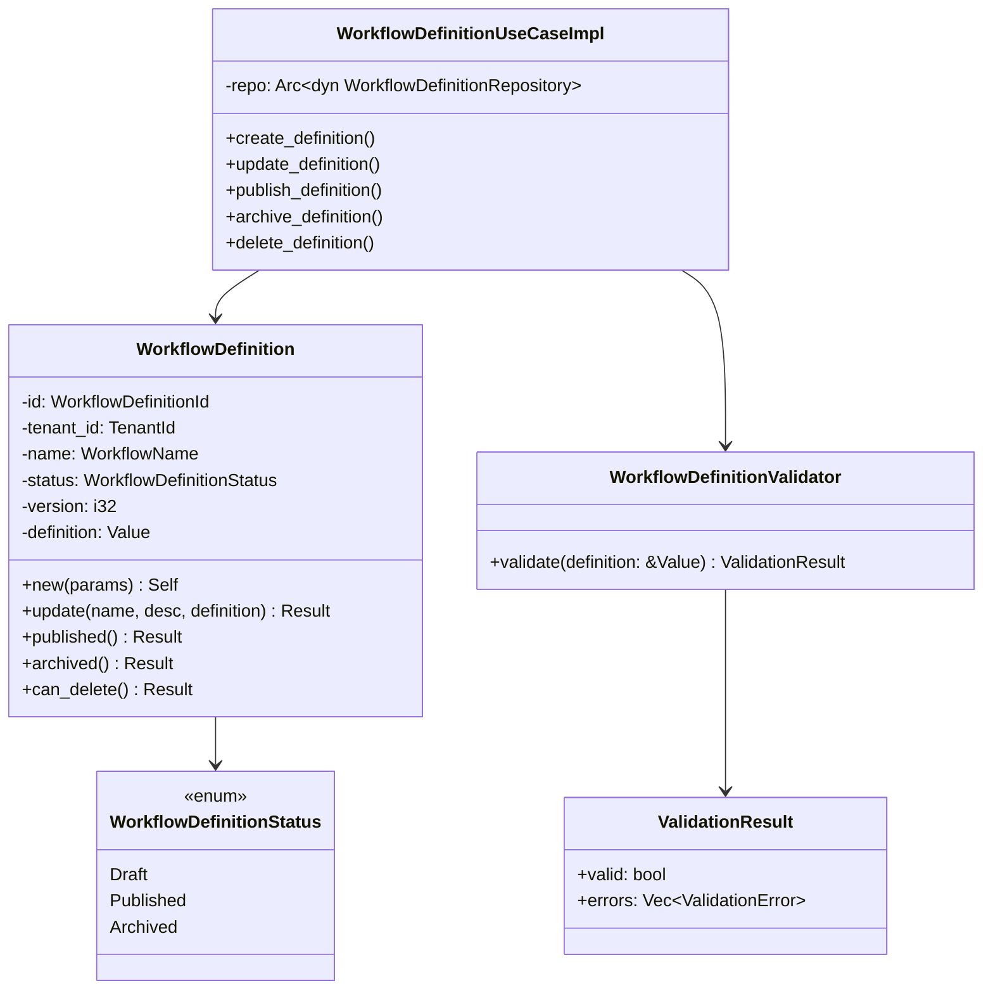
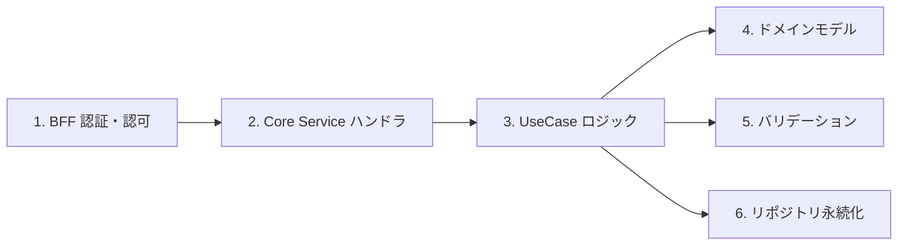
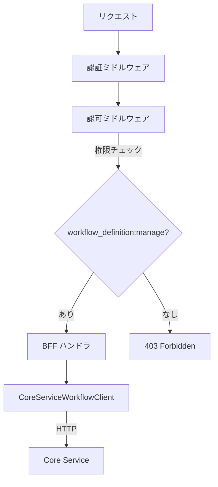
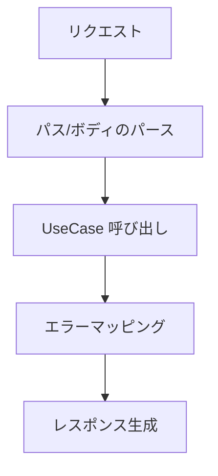
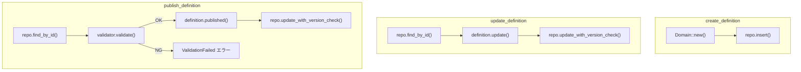
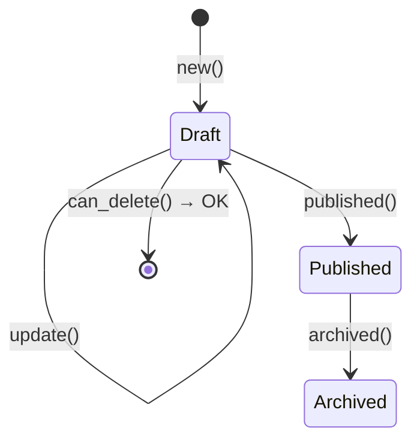
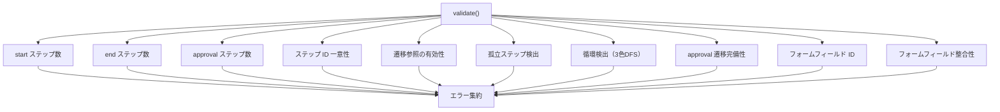
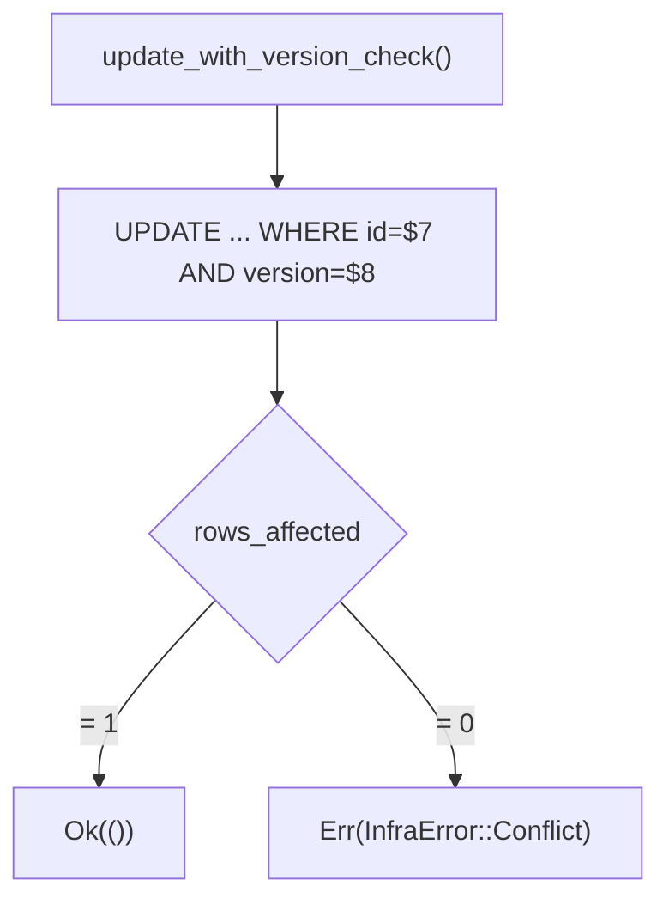
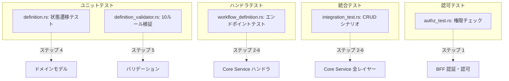

# ワークフロー定義 CRUD - コード解説

対応 PR: #730
対応 Issue: #723

## 主要な型・関数

| 型/関数 | ファイル | 責務 |
|--------|---------|------|
| `WorkflowDefinition` | `domain/src/workflow/definition.rs` | エンティティ。ステータス遷移・更新・削除チェックのビジネスロジック |
| `WorkflowDefinitionStatus` | `domain/src/workflow/definition.rs` | Draft / Published / Archived の状態 enum |
| `NewWorkflowDefinition` | `domain/src/workflow/definition.rs` | 新規作成時のパラメータ |
| `ValidationResult` | `domain/src/workflow/definition_validator.rs` | バリデーション結果（valid + errors） |
| `WorkflowDefinitionValidator` | `domain/src/workflow/definition_validator.rs` | 10 ルールの検証ロジック |
| `WorkflowDefinitionUseCaseImpl` | `core-service/src/usecase/workflow_definition.rs` | CRUD ユースケースの実装 |
| `WorkflowDefinitionRepository` | `infra/src/repository/workflow_definition_repository.rs` | DB 永続化（楽観的ロック付き） |

### 型の関係



## コードフロー

コードをライフサイクル順に追う。定義の作成から公開までの流れを辿る。



### 1. BFF 認証・認可（リクエスト受信時）

BFF ハンドラがリクエストを受信し、認証・認可を行った上で Core Service に転送する。



```rust
// apps/bff/src/handler/workflow_definition.rs:124-150
pub(crate) async fn create_definition(
    State(state): State<BffState>,
    session: SessionData,                          // ① 認証済みセッション
    Json(body): Json<CreateWorkflowDefinitionRequest>,
) -> Result<impl IntoResponse, BffError> {
    let session = authenticate(&session)?;         // ② 認証チェック
    let result = state
        .core_service_client
        .create_workflow_definition(&CreateWorkflowDefinitionBody {
            tenant_id: session.tenant_id,          // ③ テナント ID を注入
            created_by: session.user_id,
            name: body.name,
            description: body.description,
            definition: body.definition,
        })
        .await?;
    // ...
}
```

注目ポイント:
- ① `SessionData` は認可ミドルウェアを通過した結果として注入される
- ② `authenticate()` でセッションの有効性を再確認
- ③ テナント ID はセッションから取得し、クライアント入力には含めない（テナント分離の保証）

### 2. Core Service ハンドラ（リクエスト処理）

Core Service のハンドラはリクエストをパースし、UseCase に委譲する。



```rust
// apps/core-service/src/handler/workflow_definition.rs:154-174
async fn create_definition(
    State(state): State<CoreState>,
    Json(body): Json<CreateDefinitionRequest>,
) -> Result<impl IntoResponse, CoreError> {
    let name = WorkflowName::new(&body.name)       // ① ドメイン型に変換
        .map_err(|_| CoreError::ValidationFailed(
            "名前は1文字以上100文字以下にしてください".to_string()
        ))?;

    let definition = state
        .workflow_definition_usecase
        .create_definition(
            body.tenant_id.into(),                 // ② ID 型に変換
            name,
            body.description,
            body.definition,
            body.created_by.into(),
        )
        .await?;

    Ok((StatusCode::CREATED, Json(DefinitionResponse::from(definition))))  // ③ 201 Created
}
```

注目ポイント:
- ① リクエストの文字列をドメイン型（`WorkflowName`）に変換し、バリデーションを実施
- ② UUID をドメイン固有の ID 型（`TenantId`、`UserId`）に変換
- ③ 作成は 201 Created、更新は 200 OK、削除は 204 No Content と HTTP セマンティクスに準拠

### 3. UseCase ロジック（ビジネスルール適用）

UseCase がドメインモデルとリポジトリを組み合わせてビジネスロジックを実行する。



```rust
// apps/core-service/src/usecase/workflow_definition.rs:148-181
async fn publish_definition(
    &self,
    tenant_id: TenantId,
    id: WorkflowDefinitionId,
) -> Result<WorkflowDefinition, CoreError> {
    let definition = self
        .repo
        .find_by_id(id, tenant_id)
        .await?
        .or_not_found()?;                          // ① None → 404

    let validation_result = WorkflowDefinitionValidator::validate(
        definition.definition(),                    // ② 定義 JSON を検証
    );

    if !validation_result.valid {
        return Err(CoreError::ValidationFailed(     // ③ 全エラーを集約
            validation_result
                .errors
                .iter()
                .map(|e| format!("[{}] {}", e.code, e.message))
                .collect::<Vec<_>>()
                .join("; "),
        ));
    }

    let current_version = definition.version();
    let definition = definition
        .published()                               // ④ Draft → Published
        .map_err(|e| CoreError::BadRequest(e.to_string()))?;

    self.repo
        .update_with_version_check(                // ⑤ 楽観的ロック付き更新
            &definition,
            current_version,
        )
        .await
        .map_err(map_version_conflict)?;

    Ok(definition)
}
```

注目ポイント:
- ① `.or_not_found()` ヘルパーで `Option<T>` → `Result<T, CoreError::NotFound>` に変換
- ② バリデーションは公開時にのみ実行される（Draft 保存時はスキップ）
- ③ 全バリデーションエラーをセミコロン区切りで集約
- ④ ドメインモデルのメソッドで状態遷移（不正な遷移は `Err` を返す）
- ⑤ 楽観的ロック: 取得時の version と DB の version を照合

### 4. ドメインモデル（状態遷移ロジック）

`WorkflowDefinition` エンティティが状態遷移の制約を管理する。



```rust
// crates/domain/src/workflow/definition.rs:203-234
pub fn update(
    mut self,
    name: WorkflowName,
    description: Option<String>,
    definition: Value,
) -> Result<Self, WorkflowDefinitionError> {
    if self.status != WorkflowDefinitionStatus::Draft {    // ① Draft のみ更新可能
        return Err(WorkflowDefinitionError::StatusError {
            operation: "update".to_string(),
            current_status: self.status.to_string(),
        });
    }
    self.name = name;
    self.description = description;
    self.definition = definition;
    self.version += 1;                                     // ② バージョンインクリメント
    self.updated_at = Utc::now();
    Ok(self)
}

pub fn published(mut self) -> Result<Self, WorkflowDefinitionError> {
    if !self.can_publish_status() {
        return Err(WorkflowDefinitionError::StatusError {
            operation: "publish".to_string(),
            current_status: self.status.to_string(),
        });
    }
    self.status = WorkflowDefinitionStatus::Published;     // ③ 状態遷移
    self.version += 1;
    self.updated_at = Utc::now();
    Ok(self)
}
```

注目ポイント:
- ① 状態チェックはドメインモデルに集約。UseCase やハンドラでは判断しない
- ② 更新のたびに version をインクリメント。楽観的ロックの基盤
- ③ `mut self` を消費する設計で、古い状態への参照を防止

### 5. バリデーション（定義 JSON の検証）

10 のルールを順次適用し、全エラーを集約する。



```rust
// crates/domain/src/workflow/definition_validator.rs:42-68
pub fn validate(definition: &Value) -> ValidationResult {
    let mut errors = Vec::new();
    let steps = definition
        .get("steps")
        .and_then(|s| s.as_array());

    let Some(steps) = steps else {
        errors.push(ValidationError::new(
            "MISSING_STEPS",
            "定義に steps が含まれていません",
        ));
        return ValidationResult::new(errors);      // ① steps がなければ即座に返却
    };

    // 各ルールは独立して検証し、エラーを追加する
    Self::validate_start_step(steps, &mut errors);
    Self::validate_end_step(steps, &mut errors);
    Self::validate_approval_step(steps, &mut errors);
    Self::validate_step_ids_unique(steps, &mut errors);
    Self::validate_transition_references(steps, &mut errors);
    Self::validate_no_orphaned_steps(steps, &mut errors);
    Self::validate_no_cycles(steps, &mut errors);       // ② 3色DFS
    Self::validate_approval_transitions(steps, &mut errors);
    Self::validate_form_field_ids_unique(steps, &mut errors);
    Self::validate_form_fields(steps, &mut errors);

    ValidationResult::new(errors)
}
```

注目ポイント:
- ① `steps` フィールドがない場合は早期リターン（後続ルールが前提とするため）
- ② 循環検出は 3 色（White/Gray/Black）DFS アルゴリズムを使用。Gray ノードの再訪問でサイクルを検出

### 6. リポジトリ永続化（楽観的ロック）

楽観的ロック付きの更新クエリで並行更新の競合を検出する。



```rust
// crates/infra/src/repository/workflow_definition_repository.rs:280-312
async fn update_with_version_check(
    &self,
    definition: &WorkflowDefinition,
    expected_version: i32,
) -> Result<(), InfraError> {
    let result = sqlx::query!(
        r#"
        UPDATE workflow_definitions SET
            name = $1,
            description = $2,
            version = $3,
            definition = $4,
            status = $5,
            updated_at = $6
        WHERE id = $7 AND version = $8 AND tenant_id = $9   -- ① version + tenant_id で条件付き更新
        "#,
        // ... バインドパラメータ
    )
    .execute(&*self.pool)
    .await?;

    if result.rows_affected() == 0 {               // ② 0 行更新 = 競合
        return Err(InfraError::Conflict(
            "バージョンが一致しません。他のユーザーが更新した可能性があります".to_string(),
        ));
    }

    Ok(())
}
```

注目ポイント:
- ① `WHERE version = $8` で楽観的ロックを実現。version が一致しなければ 0 行更新
- ② `rows_affected() == 0` で競合を検出し、`InfraError::Conflict` を返却

## テスト

各テストがライフサイクルのどのステップを検証しているかを示す。



| テスト | 検証対象のステップ | 検証内容 |
|-------|------------------|---------|
| `test_draft定義を更新できる` | 4 | Draft 状態の更新成功とバージョンインクリメント |
| `test_published定義の更新はエラー` | 4 | Published 状態での更新拒否 |
| `test_draft定義の削除チェックが成功` | 4 | Draft のみ削除可能 |
| `test_ステップidが重複している場合エラー` | 5 | ルール 4 の検証 |
| `test_サイクルがある場合エラー` | 5 | ルール 7（3 色 DFS）の検証 |
| 統合: 作成 → 取得 | 2-6 | CRUD のフルパス |
| 統合: バージョン競合 | 2-6 | 楽観的ロックの 409 レスポンス |
| 認可: manage 権限あり | 1 | ミドルウェア通過 |
| 認可: 権限なし | 1 | 403 Forbidden |
| 認可: 未認証 | 1 | 401 Unauthorized |

### 実行方法

```bash
# ユニットテスト
cd backend && cargo test workflow::definition --lib

# 統合テスト（DB 接続が必要）
just test-rust-integration

# 全テスト
just check-all
```

## マイグレーション

### `20260220000001_add_workflow_definition_manage_permission.sql`

ファイル: `backend/migrations/20260220000001_add_workflow_definition_manage_permission.sql`

```sql
UPDATE roles
SET permissions = permissions || '["workflow_definition:manage"]'::jsonb
WHERE id = '00000000-0000-0000-0000-000000000002'
  AND name = 'tenant_admin'
  AND NOT permissions ? 'workflow_definition:manage';
```

tenant_admin ロールに `workflow_definition:manage` 権限を追加する。`NOT permissions ? 'workflow_definition:manage'` でべき等性を保証。

## 設計解説

コード実装レベルの判断を記載する。機能・仕組みレベルの判断は[機能解説](./01_ワークフロー定義CRUD_機能解説.md#設計判断)を参照。

### 1. ドメインメソッドの `self` 消費パターン

場所: `domain/src/workflow/definition.rs`

```rust
pub fn published(mut self) -> Result<Self, WorkflowDefinitionError> { ... }
pub fn update(mut self, ...) -> Result<Self, WorkflowDefinitionError> { ... }
```

なぜこの実装か:
`mut self` を消費することで、呼び出し元が古い状態の `WorkflowDefinition` を保持し続けることを防止する。状態遷移後は新しいインスタンスのみが有効になる。

代替案:

| 案 | メリット | デメリット | 判断 |
|----|---------|-----------|------|
| `mut self` 消費（採用） | 古い状態への参照を防止 | 呼び出し元で再束縛が必要 | 採用 |
| `&mut self` 借用 | 再束縛不要 | 古い参照が残る可能性 | 見送り |

### 2. バリデーションの構造化パターン

場所: `domain/src/workflow/definition_validator.rs`

```rust
fn validate_no_cycles(steps: &[Value], errors: &mut Vec<ValidationError>) {
    // 3色DFS: White(未訪問) → Gray(処理中) → Black(完了)
    let mut color: HashMap<&str, u8> = HashMap::new();
    // ...
}
```

なぜこの実装か:
各バリデーションルールを独立した関数として分離し、`&mut Vec<ValidationError>` を共有する設計。全ルールが独立して実行でき、新ルール追加時は関数を追加して `validate()` に呼び出しを追加するだけで済む。

代替案:

| 案 | メリット | デメリット | 判断 |
|----|---------|-----------|------|
| `&mut Vec` 共有（採用） | シンプル、拡張容易 | グローバルな可変参照 | 採用 |
| Visitor パターン | OCP 準拠 | 過度な抽象化（YAGNI） | 見送り |
| Result チェイン | 関数型スタイル | エラー集約が困難 | 見送り |

### 3. 循環検出の 3 色 DFS アルゴリズム

場所: `domain/src/workflow/definition_validator.rs:242-314`

なぜこの実装か:
ワークフロー定義は DAG（有向非巡回グラフ）であるべきで、循環があると承認フローが無限ループする。3 色 DFS は O(V+E) で循環を検出でき、実装もシンプル。

| 色 | 意味 | 再訪問時の判定 |
|----|------|-------------|
| White (0) | 未訪問 | 探索開始 |
| Gray (1) | 処理中（スタック上） | サイクル検出 |
| Black (2) | 完了 | スキップ |

### 4. `or_not_found()` ヘルパー

場所: `core-service/src/usecase/workflow_definition.rs:23`

```rust
let definition = self.repo.find_by_id(id, tenant_id).await?.or_not_found()?;
```

なぜこの実装か:
`Option<T>` → `Result<T, CoreError::NotFound>` の変換を簡潔にするヘルパー。UseCase 全体で統一的に使用し、`None` の処理を宣言的に記述する。

## 関連ドキュメント

- [機能解説](./01_ワークフロー定義CRUD_機能解説.md)
- [機能仕様書: ワークフローデザイナー](../../20_機能仕様書/04_ワークフローデザイナー.md)
- [詳細設計: ワークフローデザイナー](../../40_詳細設計書/15_ワークフローデザイナー設計.md)
