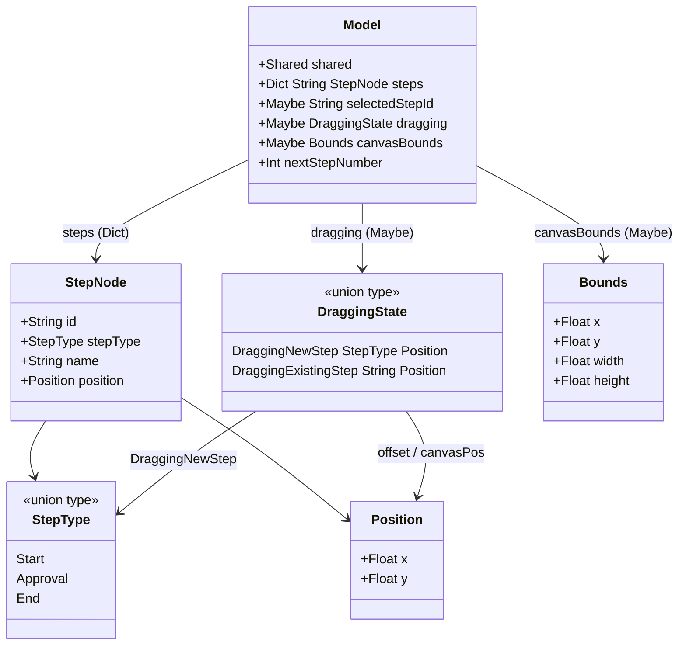
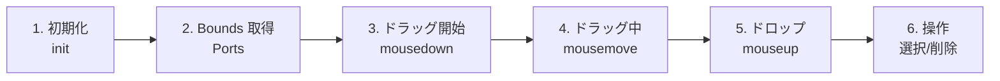
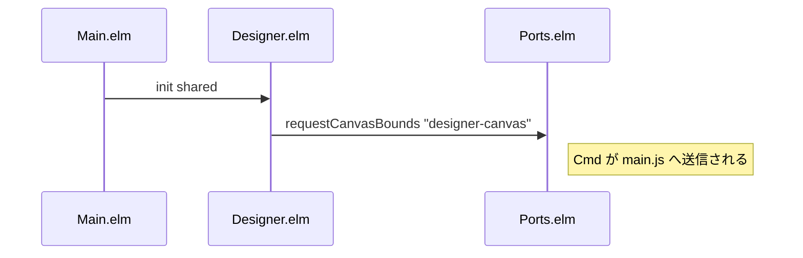
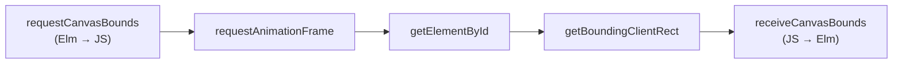
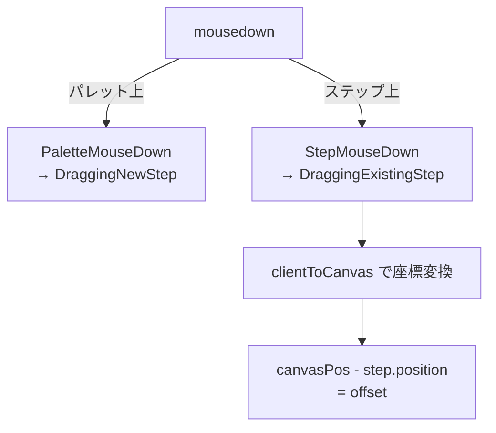
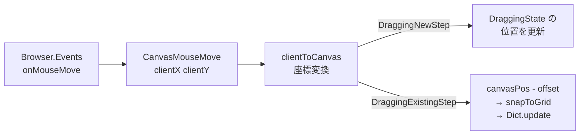
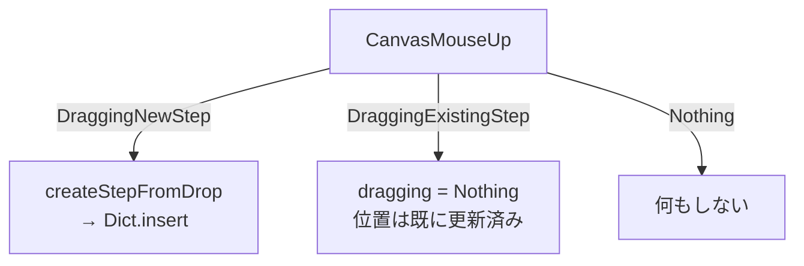
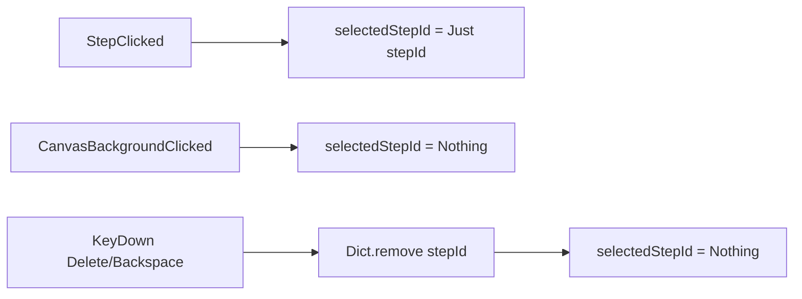
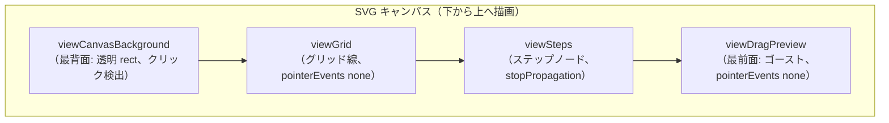
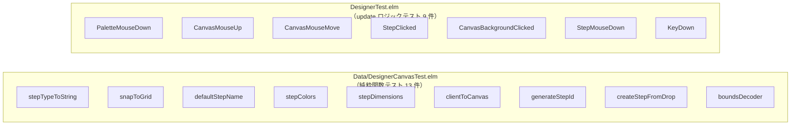

# ワークフローデザイナー キャンバス - コード解説

対応 PR: #733
対応 Issue: #725

## 主要な型・関数

| 型/関数 | ファイル | 責務 |
|--------|---------|------|
| `StepType` | `Data/DesignerCanvas.elm:33` | ステップ種別（Start / Approval / End） |
| `StepNode` | `Data/DesignerCanvas.elm:47` | キャンバス上のステップ（id, stepType, name, position） |
| `Position` | `Data/DesignerCanvas.elm:41` | キャンバス座標（x, y） |
| `Bounds` | `Data/DesignerCanvas.elm:57` | SVG 要素の画面上の矩形（x, y, width, height） |
| `DraggingState` | `Data/DesignerCanvas.elm:67` | ドラッグ状態の代数的データ型 |
| `Model` | `Designer.elm:54` | ページの状態（steps, selectedStepId, dragging, canvasBounds） |
| `Msg` | `Designer.elm:86` | ページのメッセージ型（8 バリアント） |
| `clientToCanvas` | `Data/DesignerCanvas.elm:179` | clientX/clientY → SVG viewBox 座標変換 |
| `snapToGrid` | `Data/DesignerCanvas.elm:98` | 座標を 20px グリッドにスナップ |
| `createStepFromDrop` | `Data/DesignerCanvas.elm:207` | ドロップ位置から StepNode を生成 |

### 型の関係



## コードフロー

コードをライフサイクル順に追う。各ステップの構造を図で示した後、対応するコードを解説する。



### 1. 初期化（ページ遷移時）

Route.elm のルートマッチから Main.elm 経由で `Designer.init` が呼ばれる。初期状態を構築し、キャンバスの Bounds 取得を発火する。



```elm
-- Designer.elm:64-74
init : Shared -> ( Model, Cmd Msg )
init shared =
    ( { shared = shared
      , steps = Dict.empty
      , selectedStepId = Nothing
      , dragging = Nothing
      , canvasBounds = Nothing      -- ① 初期は Nothing（座標変換不可）
      , nextStepNumber = 1
      }
    , Ports.requestCanvasBounds canvasElementId  -- ② Bounds 取得リクエスト
    )
```

注目ポイント:

- ① `canvasBounds` は `Maybe Bounds` で、Port からの応答を待つ。Nothing の間は座標変換が失敗するため、ドラッグ操作は無視される
- ② `canvasElementId = "designer-canvas"` をキーに SVG 要素の境界を取得

### 2. Bounds 取得（Elm ←→ JavaScript Port）

JavaScript 側で `getBoundingClientRect()` を呼び、結果を Elm に返送する。



```javascript
// main.js:241-254
app.ports.requestCanvasBounds.subscribe((elementId) => {
  requestAnimationFrame(() => {                     // ① DOM 更新完了を待つ
    const el = document.getElementById(elementId);
    if (el) {
      const rect = el.getBoundingClientRect();
      app.ports.receiveCanvasBounds.send({          // ② Elm に送信
        x: rect.x, y: rect.y,
        width: rect.width, height: rect.height,
      });
    }
  });
});
```

注目ポイント:

- ① `requestAnimationFrame`: Elm の Virtual DOM パッチが完了し、実際の DOM に SVG 要素が描画された後に Bounds を取得するため
- ② Elm 側では `GotCanvasBounds` メッセージとして受信し、`decodeBounds` でデコードしてキャッシュ

```elm
-- Designer.elm:217-225
GotCanvasBounds value ->
    case DesignerCanvas.decodeBounds value of
        Ok bounds ->
            ( { model | canvasBounds = Just bounds }, Cmd.none )
        Err _ ->
            ( model, Cmd.none )
```

### 3. ドラッグ開始（mousedown）

パレットと配置済みステップで異なる DraggingState に遷移する。



パレットからの新規配置:

```elm
-- Designer.elm:100-105
PaletteMouseDown stepType ->
    ( { model
        | dragging = Just (DraggingNewStep stepType { x = 0, y = 0 })  -- ① 初期位置は仮
      }
    , Ports.requestCanvasBounds canvasElementId  -- ② Bounds を再取得
    )
```

注目ポイント:

- ① 位置は `{ x = 0, y = 0 }` の仮値で開始。最初の `CanvasMouseMove` で正しい位置に更新される
- ② パレットクリック時にも Bounds を再取得。ウィンドウリサイズ等で Bounds が変化している可能性を考慮

既存ステップの移動:

```elm
-- Designer.elm:179-198
StepMouseDown stepId clientX clientY ->
    case ( Dict.get stepId model.steps, DesignerCanvas.clientToCanvas model.canvasBounds clientX clientY ) of
        ( Just step, Just canvasPos ) ->
            let
                offset =
                    { x = canvasPos.x - step.position.x  -- ① クリック位置とステップ原点の差
                    , y = canvasPos.y - step.position.y
                    }
            in
            ( { model
                | dragging = Just (DraggingExistingStep stepId offset)
                , selectedStepId = Just stepId  -- ② ドラッグ開始で選択も行う
              }
            , Cmd.none
            )
        _ ->
            ( { model | selectedStepId = Just stepId }, Cmd.none )
```

注目ポイント:

- ① offset 計算: clientX/clientY を一旦キャンバス座標に変換し、ステップの position との差分を求める。これがドラッグ中のアンカー点になる
- ② `selectedStepId` も同時に設定。ドラッグ後にそのまま Delete キーで削除可能

### 4. ドラッグ中（mousemove — Browser.Events）

条件付き subscription で、dragging /= Nothing の間だけグローバル mousemove を購読する。



```elm
-- Designer.elm:232-253
subscriptions : Model -> Sub Msg
subscriptions model =
    Sub.batch
        [ Ports.receiveCanvasBounds GotCanvasBounds
        , if model.dragging /= Nothing then                   -- ① 条件付き購読
            Sub.batch
                [ Browser.Events.onMouseMove
                    (Decode.map2 CanvasMouseMove
                        (Decode.field "clientX" Decode.float)
                        (Decode.field "clientY" Decode.float)
                    )
                , Browser.Events.onMouseUp
                    (Decode.succeed CanvasMouseUp)
                ]
          else
            Sub.none
        , Browser.Events.onKeyDown                            -- ② キーボードは常時購読
            (Decode.field "key" Decode.string |> Decode.map KeyDown)
        ]
```

注目ポイント:

- ① ドラッグ中のみ mousemove/mouseup を購読。ドラッグしていない状態では無駄なイベント処理を回避
- ② KeyDown は常時購読。Delete/Backspace によるステップ削除は任意のタイミングで発生する

座標変換（純粋関数）:

```elm
-- Data/DesignerCanvas.elm:179-189
clientToCanvas : Maybe Bounds -> Float -> Float -> Maybe Position
clientToCanvas maybeBounds clientX clientY =
    case maybeBounds of
        Just bounds ->
            Just
                { x = (clientX - bounds.x) / bounds.width * viewBoxWidth    -- ① 比率変換
                , y = (clientY - bounds.y) / bounds.height * viewBoxHeight
                }
        Nothing ->
            Nothing                                                          -- ② Bounds 未取得
```

注目ポイント:

- ① ブラウザの clientX/clientY は画面左上原点のピクセル座標。SVG 要素の左上位置（bounds.x/y）を引いて SVG 内の相対位置を求め、表示サイズと viewBox サイズの比率で変換
- ② Maybe で安全性を確保。Bounds が未取得の場合はドラッグ操作を無視

### 5. ドロップ（mouseup）

DraggingState に応じてステップの配置確定 or 移動確定を行う。



```elm
-- Designer.elm:145-167
CanvasMouseUp ->
    case model.dragging of
        Just (DraggingNewStep stepType dropPos) ->
            let
                newStep =
                    DesignerCanvas.createStepFromDrop stepType model.nextStepNumber dropPos  -- ①
            in
            ( { model
                | steps = Dict.insert newStep.id newStep model.steps  -- ②
                , dragging = Nothing
                , nextStepNumber = model.nextStepNumber + 1           -- ③
                , selectedStepId = Just newStep.id                    -- ④
              }
            , Cmd.none
            )
        Just (DraggingExistingStep _ _) ->
            ( { model | dragging = Nothing }, Cmd.none )              -- ⑤
        Nothing ->
            ( model, Cmd.none )
```

注目ポイント:

- ① `createStepFromDrop` がグリッドスナップ、ID 生成、デフォルト名設定を一括処理
- ② `Dict.insert` で steps に追加
- ③ `nextStepNumber` をインクリメント（次のステップ ID 用）
- ④ 配置直後のステップを自動選択
- ⑤ DraggingExistingStep の場合、位置は既に CanvasMouseMove で更新済み。dragging を Nothing にするだけ

### 6. ステップ操作（選択・削除）



```elm
-- Designer.elm:200-215
KeyDown key ->
    if (key == "Delete" || key == "Backspace") && model.selectedStepId /= Nothing then
        case model.selectedStepId of
            Just stepId ->
                ( { model
                    | steps = Dict.remove stepId model.steps  -- ① Dict から除去
                    , selectedStepId = Nothing                -- ② 選択解除
                  }
                , Cmd.none
                )
            Nothing ->
                ( model, Cmd.none )
    else
        ( model, Cmd.none )
```

注目ポイント:

- ① `Dict.remove` は存在しないキーに対しては何もしない安全な操作
- ② 削除後に選択状態をリセット

## SVG レンダリング

### レイヤー順序

SVG は後に描画した要素が前面になる（z-index なし）。レイヤー順序はイベント伝播に直接影響する。



| レイヤー | pointerEvents | イベント | 理由 |
|---------|-------------|---------|------|
| Background | all（デフォルト） | onClick | 空白クリックで選択解除 |
| Grid | none | なし | グリッド線がクリックを奪わない |
| Steps | デフォルト | stopPropagationOn mousedown | ステップのクリックが背景に伝播しない |
| DragPreview | none | なし | プレビューの下のステップをクリック可能 |

### イベント伝播制御

ステップの mousedown で `stopPropagationOn` を使用:

```elm
-- Designer.elm:500-504
, Html.Events.stopPropagationOn "mousedown"
    (Decode.map2 (\cx cy -> ( StepMouseDown step.id cx cy, True ))  -- ① True で伝播停止
        (Decode.field "clientX" Decode.float)
        (Decode.field "clientY" Decode.float)
    )
```

注目ポイント:

- ① タプルの第2要素 `True` が `stopPropagation` の呼び出しに相当。これがないとステップのクリックが背景の `CanvasBackgroundClicked` も発火する

## テスト

各テストがライフサイクルのどのステップを検証しているかを示す。



| テスト | 検証対象のステップ | 検証内容 |
|-------|------------------|---------|
| `stepTypeToString` | — | 各 StepType を文字列に正しく変換 |
| `snapToGrid` | 4 (移動) | 各値を 20px グリッドにスナップ（境界値 6 件） |
| `defaultStepName` | 5 (ドロップ) | StepType ごとの日本語名 |
| `stepColors` | — (描画) | StepType ごとの fill/stroke 色 |
| `stepDimensions` | — (描画) | 幅 120, 高さ 60 の固定値 |
| `clientToCanvas` | 4 (座標変換) | Bounds に基づくマウス→SVG 座標変換、Bounds 未取得時の Nothing |
| `generateStepId` | 5 (ドロップ) | "stepType_番号" 形式の ID 生成 |
| `createStepFromDrop` | 5 (ドロップ) | パレットドロップからグリッドスナップされた StepNode 生成 |
| `boundsDecoder` | 2 (Bounds) | JSON を Bounds にデコード |
| `PaletteMouseDown` | 3 (ドラッグ開始) | dragging が DraggingNewStep に遷移 |
| `CanvasMouseUp` (新規) | 5 (ドロップ) | StepNode が追加され dragging がリセット |
| `CanvasMouseUp` (既存) | 5 (ドロップ) | dragging がリセットされ位置が確定 |
| `CanvasMouseMove` (新規) | 4 (ドラッグ中) | DraggingNewStep の位置更新 |
| `CanvasMouseMove` (既存) | 4 (ドラッグ中) | ステップ位置がグリッドスナップで更新 |
| `StepClicked` | 6 (選択) | selectedStepId が設定 |
| `CanvasBackgroundClicked` | 6 (選択解除) | selectedStepId が Nothing |
| `StepMouseDown` | 3 (ドラッグ開始) | DraggingExistingStep に遷移、offset 計算 |
| `KeyDown Delete` | 6 (削除) | 選択中ステップが削除 |
| `KeyDown Backspace` | 6 (削除) | Delete と同じ削除動作 |

### テストのアーキテクチャ

テストはデータ層とページ層に分離されており、Data/ の純粋関数テストは Elm ランタイムへの依存が一切ない。

- `Data/DesignerCanvasTest.elm`: 純粋関数のユニットテスト。入力→出力の検証のみ
- `Page/WorkflowDefinition/DesignerTest.elm`: `update` 関数の状態遷移テスト。テスト用の Model を構築し、Msg を投入して結果の Model を検証

```elm
-- DesignerTest.elm:50-54 — テストモデルの段階的構築
modelWithBounds : Model
modelWithBounds =
    { initModel
        | canvasBounds = Just { x = 0, y = 0, width = 1200, height = 800 }  -- 1:1 変換
    }
```

テストの `canvasBounds` を `{ x = 0, y = 0, width = 1200, height = 800 }` に設定すると、clientX/clientY がそのまま SVG 座標になる（1:1 変換）。テストの期待値計算を単純化するテクニック。

### 実行方法

```bash
cd frontend && pnpm run test
# 特定テストのみ
cd frontend && pnpm run test -- --watch tests/Data/DesignerCanvasTest.elm
cd frontend && pnpm run test -- --watch tests/Page/WorkflowDefinition/DesignerTest.elm
```

## 設計解説

コード実装レベルの判断を記載する。機能・仕組みレベルの判断は[機能解説](./01_ワークフローデザイナーキャンバス_機能解説.md#設計判断)を参照。

### 1. StepMouseDown に clientX/clientY を渡す（offset ではなく）

場所: `Designer.elm:92`, `Designer.elm:500-504`

```elm
-- Msg 定義
| StepMouseDown String Float Float -- stepId, clientX, clientY

-- View: SVG 要素の mousedown イベント
Html.Events.stopPropagationOn "mousedown"
    (Decode.map2 (\cx cy -> ( StepMouseDown step.id cx cy, True ))
        (Decode.field "clientX" Decode.float)
        (Decode.field "clientY" Decode.float)
    )
```

なぜこの実装か:
SVG の mousedown イベントからは要素内の offset（要素左上からの相対座標）を直接取得できない。`offsetX`/`offsetY` はブラウザの挙動が SVG 要素では信頼できない。clientX/clientY を受け取り、update 内で `clientToCanvas` → ステップ位置との差分計算で offset を求める方が正確。

代替案:

| 案 | メリット | デメリット | 判断 |
|----|---------|-----------|------|
| **clientX/clientY → update で変換（採用）** | 正確、SVG viewBox 対応 | update 内での2段階計算 | 採用 |
| offsetX/offsetY を直接使用 | シンプル | SVG 要素では不正確 | 見送り |
| 追加の Port で offset 取得 | 正確 | Port の複雑さ増大 | 見送り |

### 2. 条件付き subscription の実装パターン

場所: `Designer.elm:232-253`

```elm
subscriptions : Model -> Sub Msg
subscriptions model =
    Sub.batch
        [ Ports.receiveCanvasBounds GotCanvasBounds
        , if model.dragging /= Nothing then
            Sub.batch [ {- mousemove, mouseup -} ]
          else
            Sub.none
        , Browser.Events.onKeyDown {- ... -}
        ]
```

なぜこの実装か:
`subscriptions` が `Model -> Sub Msg` 型であることを利用し、`model.dragging` の状態に基づいて動的にイベントを購読/解除する。dragging が Nothing になると、Elm ランタイムが自動的に document レベルのイベントリスナーを解除するため、明示的なクリーンアップが不要。

Main.elm では他ページの subscriptions が `Sub Msg` 型（Model を受け取らない）であるのに対し、Designer は `Model -> Sub Msg` 型。Main.elm の subscriptions ルーティングで `subModel` を渡すことで対応:

```elm
-- Main.elm:764-765
DesignerPage subModel ->
    Sub.map DesignerMsg (Designer.subscriptions subModel)
```

### 3. SVG レイヤー順序とイベント伝播の制御

場所: `Designer.elm:381-387`, `Designer.elm:456`, `Designer.elm:500-504`

```elm
svg [ {- attributes -} ]
    [ viewCanvasBackground  -- 最背面: 空白クリック検出
    , viewGrid              -- グリッド線: pointerEvents "none"
    , viewSteps model       -- ステップ: stopPropagationOn
    , viewDragPreview model -- 最前面: pointerEvents "none"
    ]
```

なぜこの実装か:
SVG には CSS の z-index が存在せず、描画順序がそのままレイヤー順序。イベント伝播も描画順序に従うため、3つの仕組みで制御する:

1. `fill "transparent"` の背景 rect を最背面に配置（空白クリック検出）
2. グリッドとプレビューに `pointerEvents "none"` でクリック判定から除外
3. ステップに `stopPropagationOn` で背景への伝播を停止

代替案:

| 案 | メリット | デメリット | 判断 |
|----|---------|-----------|------|
| **描画順序 + pointerEvents + stopPropagation（採用）** | SVG の標準的な手法 | 3つの仕組みの組み合わせ | 採用 |
| 全イベントを1つのハンドラで処理 | シンプル | ヒット判定を自前で実装 | 見送り |

## 関連ドキュメント

- [機能解説](./01_ワークフローデザイナーキャンバス_機能解説.md)
- [ADR-053: ワークフローデザイナー技術選定](../../70_ADR/053_ワークフローデザイナー技術選定.md)
- [ナレッジベース: SVG キャンバスと Browser.Events](../../80_ナレッジベース/elm/SVGキャンバスとBrowserEvents.md)
