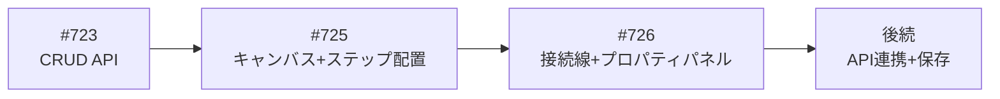
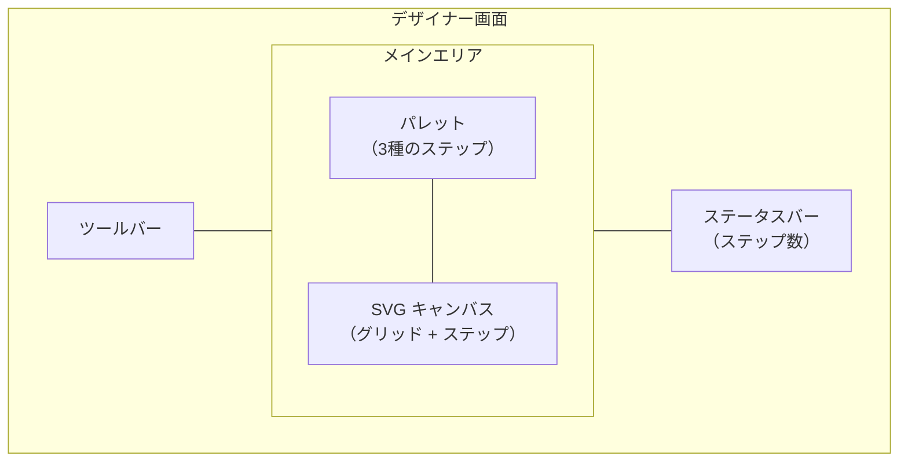
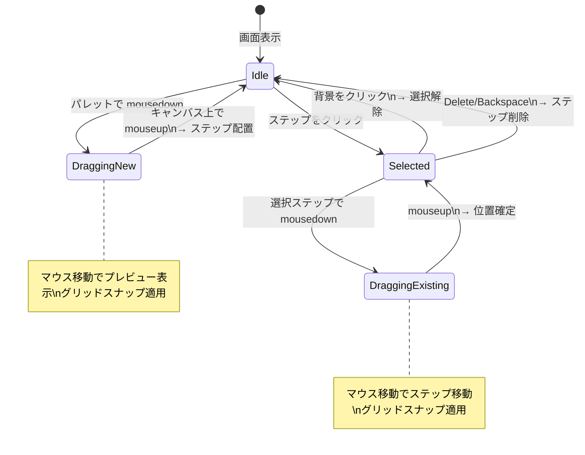
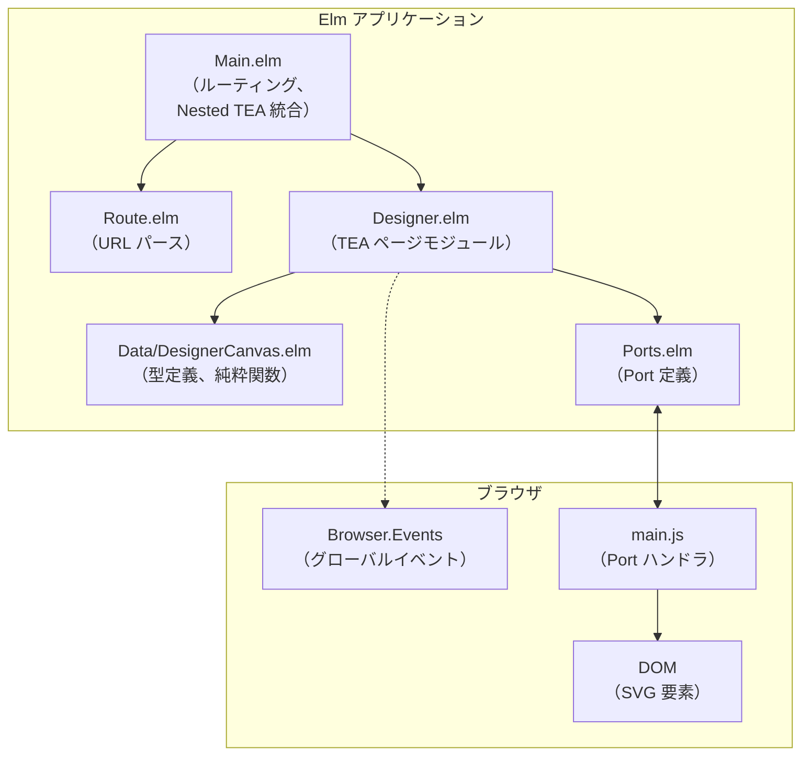
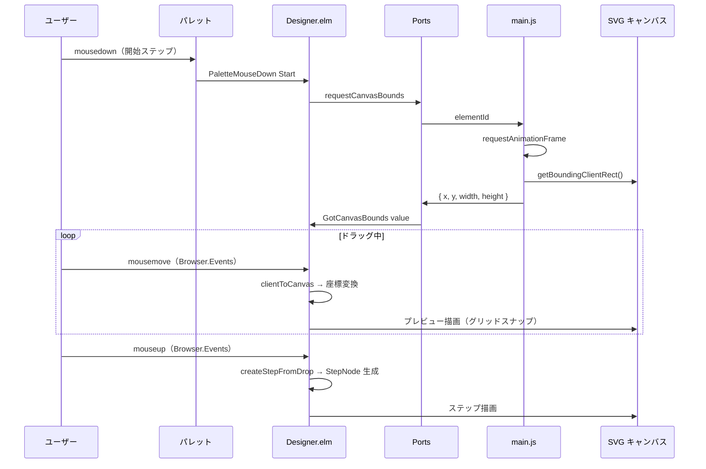
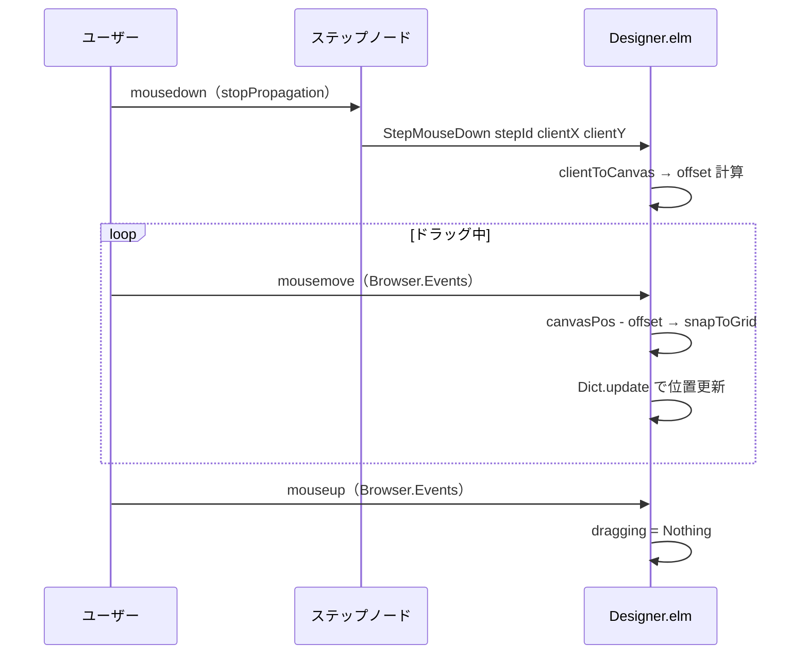
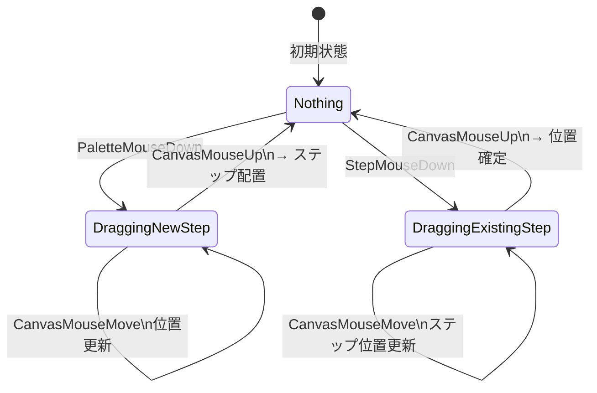

# ワークフローデザイナー キャンバス - 機能解説

対応 PR: #733
対応 Issue: #725

## 概要

SVG キャンバス上にワークフローのステップを配置・操作するビジュアルエディタを実装した。パレットからステップをドラッグ&ドロップで配置し、選択・移動・削除の操作を提供する。ADR-053 で決定した「SVG + Elm 直接レンダリング方式」に基づく、ワークフローデザイナーの中核 UI。

## 背景

### ワークフロー定義のビジュアル編集

ワークフロー定義の CRUD API（#723）は実装済みだが、フロントエンドの編集 UI がなかった。承認フローの定義は複数のステップとその接続で構成されるため、テキスト編集ではなくビジュアルエディタが適している。

### ADR-053 の技術方式

ADR-053 で以下の方式を決定済み:

| 項目 | 決定内容 |
|------|---------|
| 描画方式 | SVG（Canvas API ではなく） |
| ライブラリ | elm/svg による直接レンダリング（外部グラフライブラリ不使用） |
| インタラクション | Elm Ports + Browser.Events によるドラッグ&ドロップ |
| 座標系 | SVG viewBox による論理座標（レスポンシブ対応） |

### Epic 全体の中での位置づけ

ワークフローデザイナーは複数の Story で段階的に構築する。

| Issue | 内容 | 状態 |
|-------|------|------|
| #723 | ワークフロー定義 CRUD API | 完了 |
| #725 | キャンバスとステップ配置（本 PR） | 完了 |
| #726 | 接続線とプロパティパネル | 未着手 |
| 後続 | API 連携（保存・読込・公開） | 未着手 |

## 用語・概念

| 用語 | 説明 | 関連コード |
|------|------|-----------|
| StepType | ステップの種別。Start（開始）/ Approval（承認）/ End（終了） | `Data.DesignerCanvas.StepType` |
| StepNode | キャンバス上に配置されたステップ。ID、種別、名前、位置を持つ | `Data.DesignerCanvas.StepNode` |
| DraggingState | ドラッグ操作の状態。新規配置と既存移動の2種 | `Data.DesignerCanvas.DraggingState` |
| viewBox | SVG の論理座標系。表示サイズに依存しない内部座標 | `0 0 1200 800` |
| Bounds | SVG 要素の画面上の位置とサイズ（getBoundingClientRect 結果） | `Data.DesignerCanvas.Bounds` |
| グリッドスナップ | ステップ位置を 20px 間隔の格子に吸着させる仕組み | `DesignerCanvas.snapToGrid` |
| Ports | Elm と JavaScript の通信チャネル。DOM API へのアクセスに使用 | `Ports.elm`, `main.js` |

## フロー

新規機能のため、現在のフローのみ記述する。

### 画面構成

### ユーザー操作フロー

## アーキテクチャ

### Nested TEA 統合（7 integration points）

Designer ページは Nested TEA パターンで Main.elm に統合される。

| # | Integration Point | Main.elm での対応 |
|---|-------------------|------------------|
| 1 | Page | `DesignerPage Designer.Model` |
| 2 | Msg | `DesignerMsg Designer.Msg` |
| 3 | initPage | `Designer.init shared` |
| 4 | update | `Designer.update subMsg subModel` |
| 5 | viewPage | `Designer.view subModel` |
| 6 | subscriptions | `Designer.subscriptions subModel` |
| 7 | updatePageShared | `Designer.updateShared shared subModel` |

subscriptions が `Model -> Sub Msg` 型（他ページは `Sub Msg`）である点が本 PR 固有。ドラッグ中のみ mousemove/mouseup を購読する条件付き subscription のため。

## データフロー

### フロー 1: パレットからステップを配置

| # | レイヤー | ファイル:関数 | 処理内容 |
|---|---------|-------------|---------|
| 1 | View | `Designer.elm:viewPaletteItem` | パレットの mousedown を検出 |
| 2 | Update | `Designer.elm:update PaletteMouseDown` | dragging を DraggingNewStep に遷移 |
| 3 | Ports | `Ports.elm:requestCanvasBounds` | SVG 要素の Bounds をリクエスト |
| 4 | JS | `main.js:requestCanvasBounds` | getBoundingClientRect を取得して返送 |
| 5 | Update | `Designer.elm:update GotCanvasBounds` | Bounds をキャッシュ |
| 6 | Subscription | `Designer.elm:subscriptions` | mousemove/mouseup を購読開始 |
| 7 | Update | `Designer.elm:update CanvasMouseMove` | clientToCanvas で座標変換、位置更新 |
| 8 | Update | `Designer.elm:update CanvasMouseUp` | createStepFromDrop でステップ生成、Dict に追加 |

### フロー 2: 既存ステップの移動

offset の計算: マウスの clientX/clientY をキャンバス座標に変換し、ステップの position との差分を保持する。これにより、ステップの角ではなくクリックした位置を基準にドラッグできる。

## 状態遷移

### DraggingState

### selectedStepId

| 操作 | 遷移 |
|------|------|
| StepClicked stepId | Nothing/Just → Just stepId |
| StepMouseDown stepId | Nothing/Just → Just stepId |
| CanvasMouseUp（新規配置） | Nothing → Just newStep.id |
| CanvasBackgroundClicked | Just → Nothing |
| KeyDown "Delete"/"Backspace" | Just → Nothing（ステップ削除） |

## 設計判断

機能・仕組みレベルの判断を記載する。コード実装レベルの判断は[コード解説](./01_ワークフローデザイナーキャンバス_コード解説.md#設計解説)を参照。

### 1. 座標変換をどこで行うか

SVG の viewBox 座標系とブラウザの画面座標系は異なる。マウスイベントの clientX/clientY を SVG 座標に変換する必要がある。

| 案 | 実現可能性 | 精度 | 複雑さ |
|----|-----------|------|--------|
| **Ports + getBoundingClientRect（採用）** | Elm から DOM API にアクセス可能 | Bounds キャッシュにより正確 | Port 定義が必要 |
| SVG の getScreenCTM() | より正確 | 回転・スケール対応 | 毎フレーム Port 呼び出しが必要 |
| 固定比率で概算 | Port 不要 | リサイズで狂う | シンプル |

**採用理由**: init 時に1回 Bounds を取得してキャッシュする方式で十分な精度を実現。viewBox と width="100%" の組み合わせで比率変換が単純。

### 2. ドラッグイベントをどこで処理するか

| 案 | イベント取りこぼし | スクロール外対応 | 実装 |
|----|------------------|----------------|------|
| **Browser.Events グローバル（採用）** | なし | 対応 | 条件付き subscription |
| SVG 要素のローカルイベント | マウスが要素外に出ると失う | 非対応 | シンプル |

**採用理由**: ドラッグ中にマウスが SVG 要素外に出てもイベントを受け取れる。条件付き subscription（dragging /= Nothing のとき購読）で不要な購読を避ける。

### 3. ステップ ID の生成方式

| 案 | 一意性保証 | 読みやすさ | API 連携 |
|----|-----------|-----------|---------|
| **stepType + 連番（採用）** | ローカルで十分 | "approval_1" と可読 | UUID に置換可能 |
| UUID | グローバル一意 | 不可読 | そのまま使用可能 |
| ランダム文字列 | 衝突可能性あり | 不可読 | 不可 |

**採用理由**: API 未連携の段階では可読性を優先。`nextStepNumber` のインクリメントで局所的な一意性は十分。API 連携時に UUID に差し替える設計。

### 4. データ型をどこに配置するか

| 案 | テスタビリティ | 一貫性 | ファイル数 |
|----|-------------|--------|----------|
| **Data/DesignerCanvas.elm に分離（採用）** | 純粋関数を独立テスト可能 | Data/ パターンに準拠 | 2 ファイル |
| Designer.elm に同居 | テスト時に全モジュールをインポート | 自己完結 | 1 ファイル |

**採用理由**: 既存の Data/ パターン（Data.WorkflowDefinition 等）に準拠。座標変換やグリッドスナップ等の純粋関数を TEA サイクルから独立してテストできる。

## 関連ドキュメント

- [コード解説](./01_ワークフローデザイナーキャンバス_コード解説.md)
- [ADR-053: ワークフローデザイナー技術選定](../../70_ADR/053_ワークフローデザイナー技術選定.md)
- [機能仕様書: ワークフローデザイナー](../../20_機能仕様書/04_ワークフローデザイナー.md)
- [詳細設計書: ワークフローデザイナー](../../40_詳細設計書/15_ワークフローデザイナー設計.md)
- [ナレッジベース: SVG キャンバスと Browser.Events](../../80_ナレッジベース/elm/SVGキャンバスとBrowserEvents.md)
