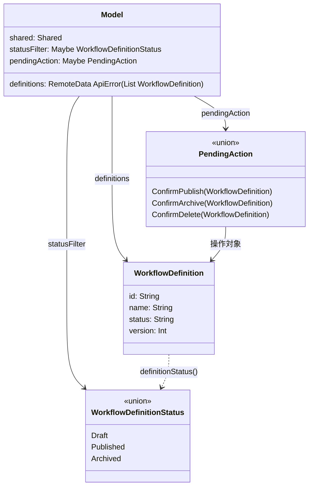
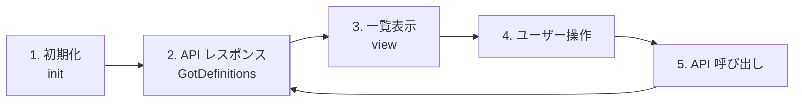
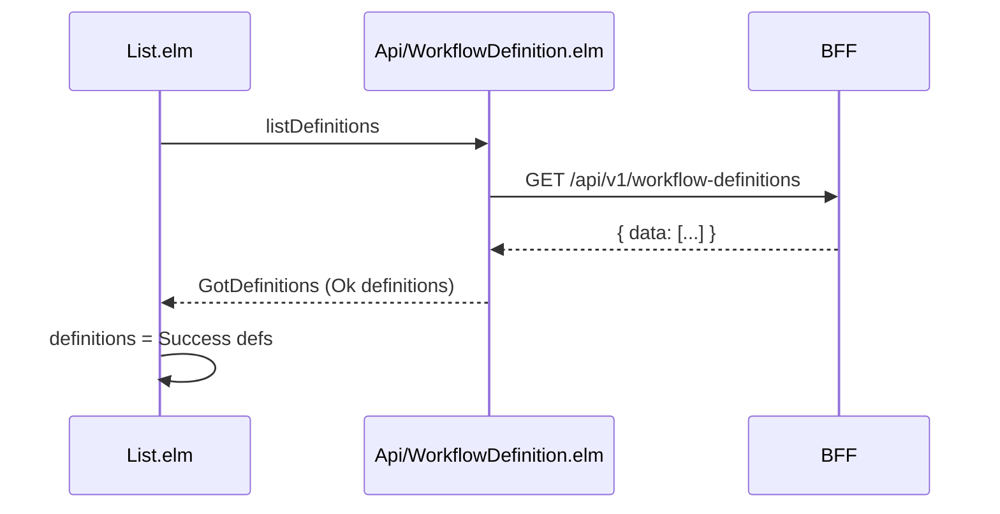
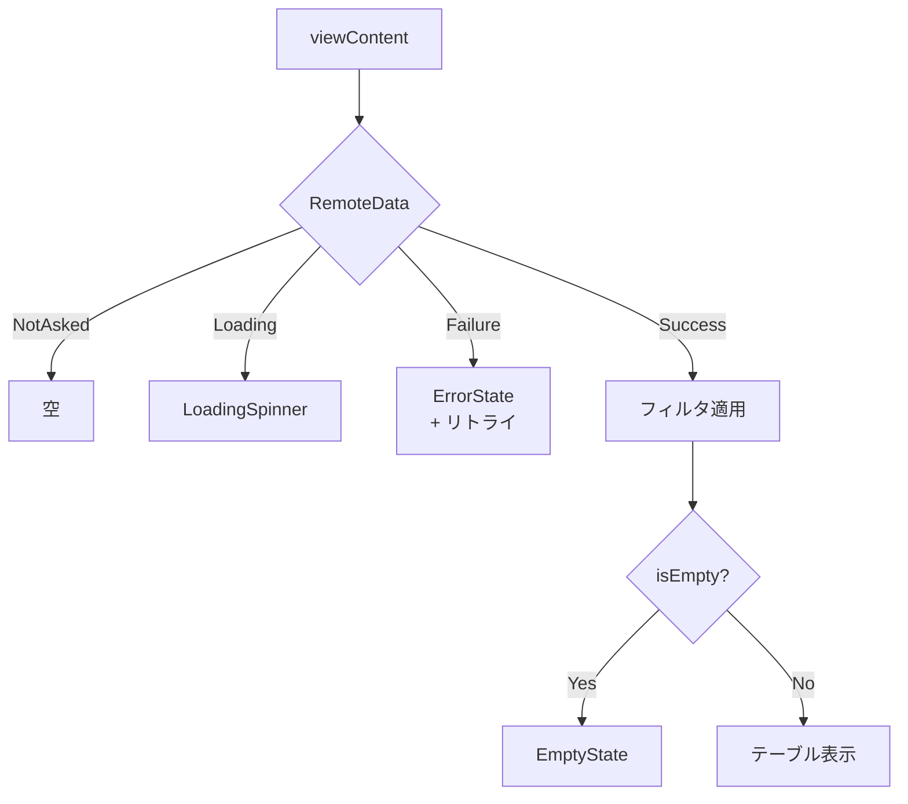
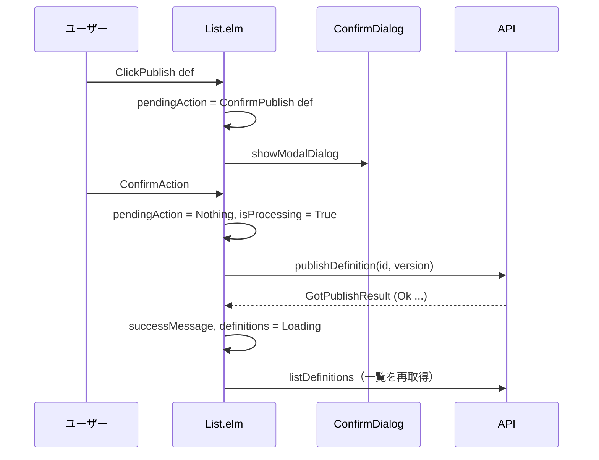
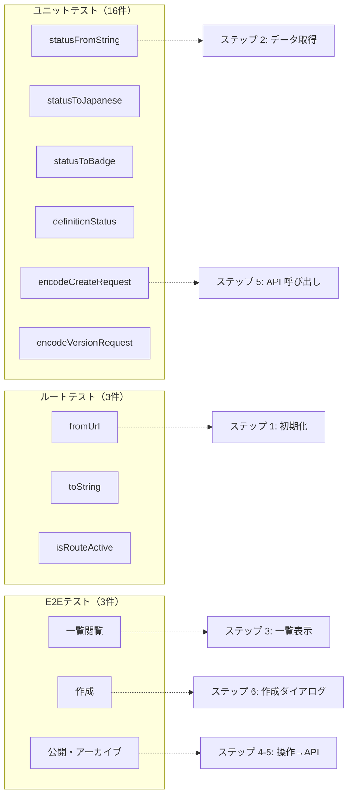

# ワークフロー定義管理画面 - コード解説

対応 PR: #734
対応 Issue: #724

## 主要な型・関数

| 型/関数 | ファイル | 責務 |
|--------|---------|------|
| `WorkflowDefinitionStatus` | [`Data/WorkflowDefinition.elm:75`](../../../frontend/src/Data/WorkflowDefinition.elm) | 定義の状態を型で表現（Draft/Published/Archived） |
| `PendingAction` | [`Page/WorkflowDefinition/List.elm:57`](../../../frontend/src/Page/WorkflowDefinition/List.elm) | 確認ダイアログの操作種別を型安全に管理 |
| `Model` | [`Page/WorkflowDefinition/List.elm:39`](../../../frontend/src/Page/WorkflowDefinition/List.elm) | ページ全体の状態（一覧データ、フィルタ、ダイアログ、フォーム） |
| `handleOperationResult` | [`Page/WorkflowDefinition/List.elm:299`](../../../frontend/src/Page/WorkflowDefinition/List.elm) | 公開・アーカイブの成功/エラーを共通処理 |
| `encodeCreateRequest` | [`Data/WorkflowDefinition.elm:159`](../../../frontend/src/Data/WorkflowDefinition.elm) | 作成リクエストの JSON 生成（デフォルト definition 含む） |
| `encodeVersionRequest` | [`Data/WorkflowDefinition.elm:173`](../../../frontend/src/Data/WorkflowDefinition.elm) | 楽観的ロック用の version JSON 生成 |

### 型の関係



## コードフロー

コードをライフサイクル順に追う。TEA（The Elm Architecture）の init → update → view サイクルに沿って解説する。



### 1. 初期化（ページ遷移時）

Main.elm の `initPage` が `Route.WorkflowDefinitions` にマッチすると、`List.init` が呼ばれる。

```elm
-- Page/WorkflowDefinition/List.elm:62-80
init : Shared -> ( Model, Cmd Msg )
init shared =
    ( { shared = shared
      , definitions = Loading            -- ① 初期状態は Loading
      , statusFilter = Nothing           -- ② フィルタなし（全件表示）
      , pendingAction = Nothing
      , ...
      }
    , WorkflowDefinitionApi.listDefinitions  -- ③ API 一覧取得を即座に発行
        { config = Shared.toRequestConfig shared
        , toMsg = GotDefinitions
        }
    )
```

注目ポイント:

- ① `RemoteData` の `Loading` 状態で初期化し、ローディングスピナーを表示
- ② ステータスフィルタは `Nothing`（全件表示）で開始
- ③ `Cmd` で非同期に API 呼び出しを発行。結果は `GotDefinitions` メッセージで返る

### 2. データ取得（API レスポンス）



```elm
-- Api/WorkflowDefinition.elm:48-59
listDefinitions { config, toMsg } =
    Api.get
        { config = config
        , url = "/api/v1/workflow-definitions"
        , decoder = WorkflowDefinition.listDecoder  -- ① { data: [...] } をデコード
        , toMsg = toMsg
        }
```

注目ポイント:

- ① `listDecoder` は `Decode.field "data" (Decode.list decoder)` で、BFF のレスポンスラッパーを処理

### 3. 一覧表示（view）

4 状態の `RemoteData` をパターンマッチで処理し、Success 時にステータスフィルタを適用する。



```elm
-- Page/WorkflowDefinition/List.elm:403-428
viewContent model =
    case model.definitions of
        Success defs ->
            let
                filtered =
                    case model.statusFilter of
                        Just status ->
                            List.filter (\d -> WorkflowDefinition.definitionStatus d == status) defs
                                                                -- ① クライアントサイドフィルタ
                        Nothing ->
                            defs
            in
            viewDefinitionList filtered
        ...
```

注目ポイント:

- ① フィルタはサーバーサイドではなくクライアントサイドで実行。全データを取得済みのため、再リクエスト不要

### 4. ステータスに応じた操作ボタン

各行のアクションボタンはステータスによって異なる。

```elm
-- Page/WorkflowDefinition/List.elm:488-518
viewActions status def =
    div [ class "flex gap-2" ]
        (case status of
            Draft ->
                [ Button.view { variant = Button.Success, ... } [ text "公開" ]
                , Button.view { variant = Button.Error, ... } [ text "削除" ]
                ]
            Published ->
                [ Button.view { variant = Button.Warning, ... } [ text "アーカイブ" ] ]
            Archived ->
                [ span [ class "text-secondary-400" ] [ text "—" ] ]
        )
```

Elm のパターンマッチにより、ステータスに対する操作ボタンの網羅が コンパイラで保証される。

### 5. 確認ダイアログ → API 呼び出し → 一覧更新

操作ボタンのクリックから API 完了までの流れ。



```elm
-- Page/WorkflowDefinition/List.elm:228-237
ConfirmAction ->
    case model.pendingAction of
        Just (ConfirmPublish def) ->
            ( { model | pendingAction = Nothing, isProcessing = True }
            , WorkflowDefinitionApi.publishDefinition
                { config = Shared.toRequestConfig model.shared
                , id = def.id
                , body = WorkflowDefinition.encodeVersionRequest { version = def.version }
                    -- ① 楽観的ロック: version を送信
                , toMsg = GotPublishResult
                }
            )
```

注目ポイント:

- ① `version` を送信することで、他のユーザーが同時に編集していた場合にバックエンドが 409 Conflict を返す

### 6. 作成ダイアログ

HTML `<dialog>` 要素を使用。`Ports.showModalDialog` で `showModal()` を呼び出し、ブラウザネイティブのフォーカストラップとバックドロップを利用する。

```elm
-- Page/WorkflowDefinition/List.elm:565-611
viewCreateDialog model =
    Html.node "dialog"
        [ id createDialogId
        , Html.Events.preventDefaultOn "cancel"                 -- ① ESC キーでの閉じるを制御
            (Json.Decode.succeed ( CloseCreateDialog, True ))
        , Html.Events.on "click"
            (ConfirmDialog.backdropClickDecoder CloseCreateDialog)  -- ② バックドロップクリック
        ]
        [ ... ]
```

注目ポイント:

- ① `cancel` イベントの `preventDefault` で、ESC キーのデフォルト動作を抑制しつつ `CloseCreateDialog` メッセージを発行
- ② `ConfirmDialog.backdropClickDecoder` を再利用し、`.dialog-content` 外のクリックでダイアログを閉じる

## テスト

各テストがコードフローのどのステップを検証しているかを示す。



| テスト | 検証対象のステップ | 検証内容 |
|-------|------------------|---------|
| `statusFromString` | 2 | バックエンドの文字列→型変換の正確性 |
| `statusToJapanese` / `statusToBadge` | 3 | UI 表示用のラベル・スタイル |
| `definitionStatus` | 3 | WorkflowDefinition → Status 変換 |
| `encodeCreateRequest` | 5 | 作成リクエストの JSON 構造 |
| `encodeVersionRequest` | 5 | 楽観的ロック用 JSON 構造 |
| `fromUrl` / `toString` / `isRouteActive` | 1 | URL ↔ Route 型の変換 |
| E2E: 一覧閲覧 | 1-3 | ページアクセス→API→テーブル表示 |
| E2E: 作成 | 6 | ダイアログ→入力→送信→Draft 表示 |
| E2E: 公開・アーカイブ | 4-5 | 確認ダイアログ→ステータス遷移 |

### 実行方法

```bash
# ユニットテスト
cd frontend && pnpm run test -- --watch tests/Data/WorkflowDefinitionStatusTest.elm

# ルートテスト
cd frontend && pnpm run test -- --watch tests/RouteTest.elm

# E2E テスト（要: just dev-all）
just test-e2e
```

## 設計解説

コード実装レベルの判断を記載する。機能・仕組みレベルの判断は[機能解説](./01_ワークフロー定義管理_機能解説.md#設計判断)を参照。

### 1. statusFromString のフォールバック方針

場所: `Data/WorkflowDefinition.elm:87`

```elm
statusFromString : String -> WorkflowDefinitionStatus
statusFromString str =
    case str of
        "draft" -> Draft
        "published" -> Published
        "archived" -> Archived
        _ -> Draft          -- Maybe ではなくフォールバック
```

なぜこの実装か:
戻り値を `Maybe WorkflowDefinitionStatus` にすると、全ての呼び出し箇所で `Nothing` のハンドリングが必要になる。ステータスフィルタや一覧表示で使用するため、安全なデフォルト値（Draft）を返す方が実用的。

代替案:

| 案 | メリット | デメリット | 判断 |
|----|---------|-----------|------|
| `Maybe` を返す | 不正値を明示的に扱える | 全呼び出し箇所でケース分岐が必要 | 見送り |
| **`Draft` フォールバック（採用）** | 呼び出し側がシンプル | 不正値が黙殺される | 採用 |

不正値が黙殺されるリスクは、バックエンドが正しいステータス文字列を返すことで軽減される。

### 2. PendingAction 型による操作の型安全な管理

場所: `Page/WorkflowDefinition/List.elm:56`

```elm
type PendingAction
    = ConfirmPublish WorkflowDefinition
    | ConfirmArchive WorkflowDefinition
    | ConfirmDelete WorkflowDefinition
```

なぜこの実装か:
確認ダイアログを 1 つの `ConfirmDialog.view` で共有しつつ、`ConfirmAction` メッセージで操作を実行する際にどの操作かを型で特定できる。`String` で操作名を持つ方式と比べ、Elm コンパイラが全分岐の網羅を強制する。

### 3. handleOperationResult による共通化

場所: `Page/WorkflowDefinition/List.elm:299`

```elm
handleOperationResult : String -> Result ApiError WorkflowDefinition -> Model -> ( Model, Cmd Msg )
```

なぜこの実装か:
公開（`GotPublishResult`）とアーカイブ（`GotArchiveResult`）の結果ハンドリングは、成功メッセージのテキスト以外が同一。操作名を引数で受け取り、重複コードを排除する。削除は戻り値の型が `Result ApiError ()` で異なるため共通化の対象外。

### 4. ConfirmDialog.backdropClickDecoder の再利用

場所: `Page/WorkflowDefinition/List.elm:573`

```elm
Html.Events.on "click"
    (ConfirmDialog.backdropClickDecoder CloseCreateDialog)
```

なぜこの実装か:
作成ダイアログのバックドロップクリック処理は、`ConfirmDialog` で実装済みの `.dialog-content` クラスの有無で判定するロジックと同一。新たにデコーダーを書くのではなく、既存実装を再利用する。

## 関連ドキュメント

- [機能解説](./01_ワークフロー定義管理_機能解説.md)
- [ワークフローデザイナー詳細設計](../../40_詳細設計書/15_ワークフローデザイナー設計.md)
- [CRUD API 実装解説](../PR730_ワークフロー定義CRUD/)
