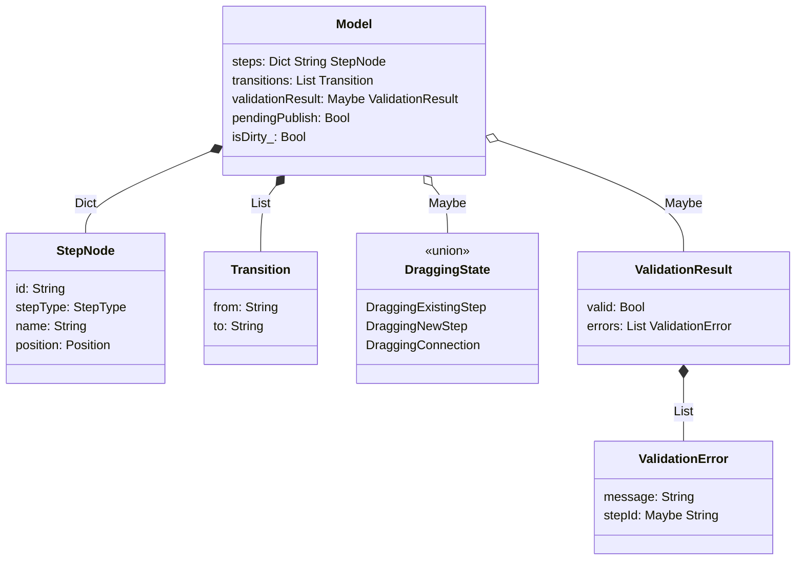
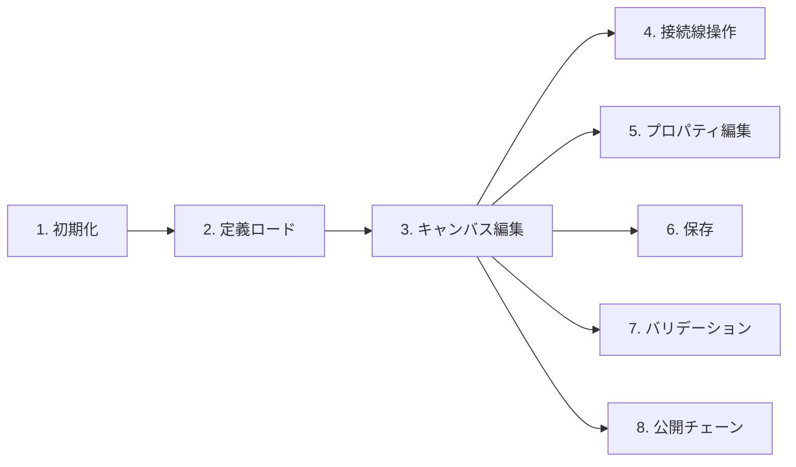
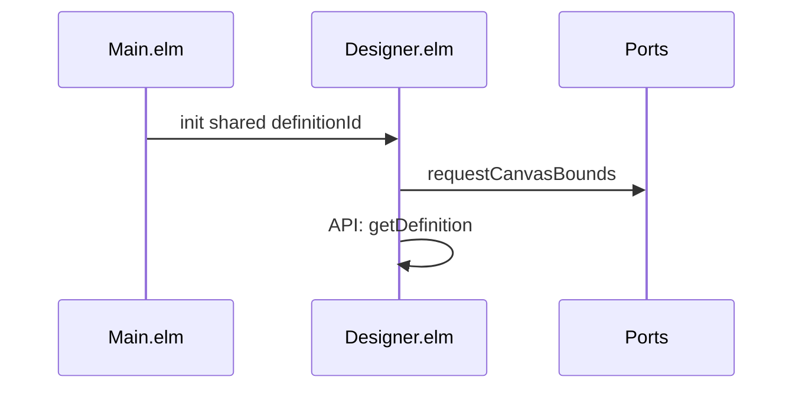
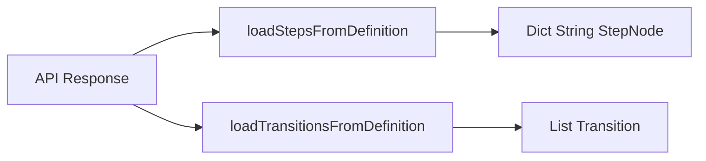
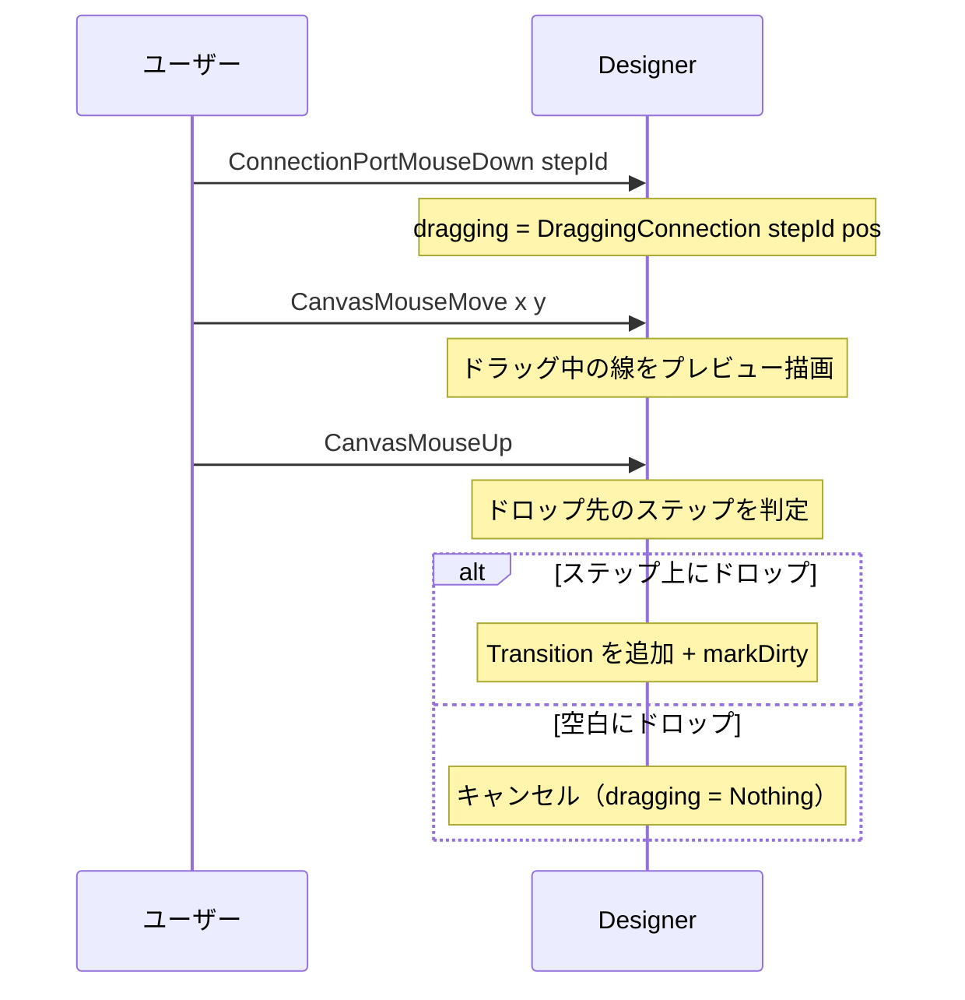
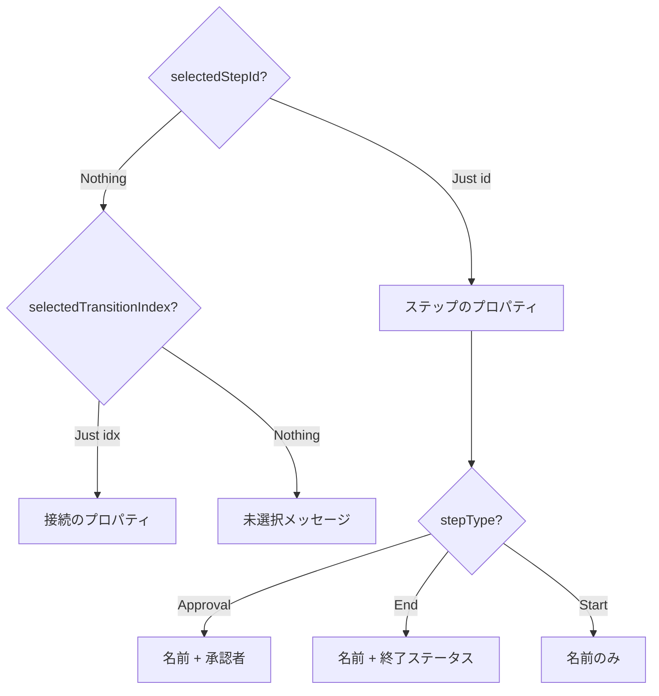
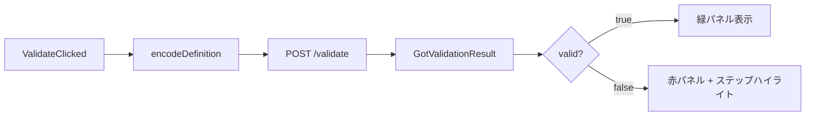
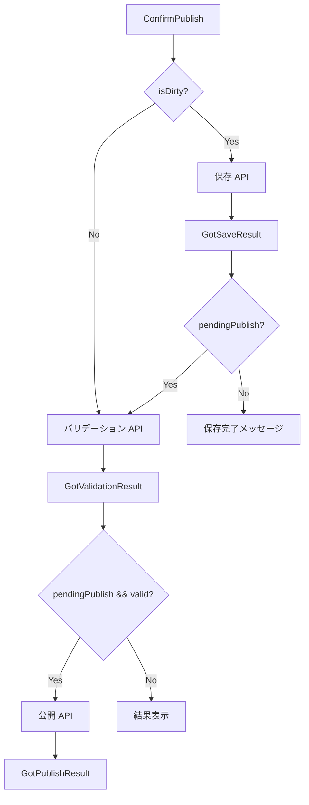
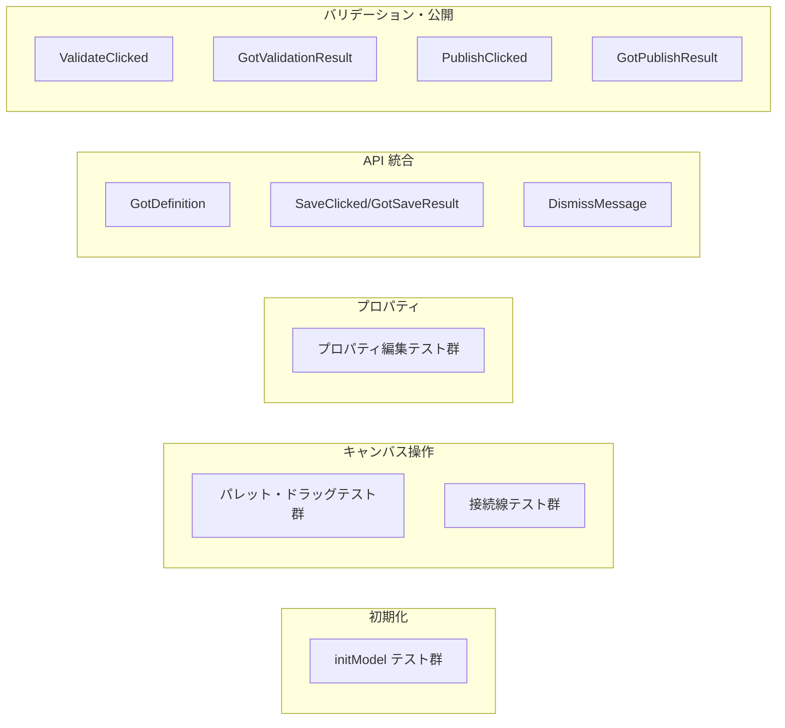

# ワークフローデザイナー接続線・バリデーション - コード解説

対応 PR: #740
対応 Issue: #726

## 主要な型・関数

| 型/関数 | ファイル | 責務 |
|--------|---------|------|
| `Model` | `Page/WorkflowDefinition/Designer.elm` | デザイナーページの全状態 |
| `Msg` | `Page/WorkflowDefinition/Designer.elm` | ユーザー操作と API レスポンスのイベント |
| `StepNode` | `Data/DesignerCanvas.elm` | キャンバス上のステップノード |
| `Transition` | `Data/DesignerCanvas.elm` | ステップ間の遷移 |
| `DraggingState` | `Data/DesignerCanvas.elm` | ドラッグ操作の 3 種類の状態 |
| `ValidationResult` | `Data/WorkflowDefinition.elm` | バリデーション API の結果型 |
| `encodeDefinition` | `Data/DesignerCanvas.elm` | ステップ・遷移を API 送信用 JSON にエンコード |
| `loadStepsFromDefinition` | `Data/DesignerCanvas.elm` | API レスポンスからステップ Dict を復元 |

### 型の関係



## コードフロー

コードをライフサイクル順に追う。



### 1. 初期化（ページ遷移時）

ルートから `definitionId` を受け取り、API から定義をロードする。



```elm
-- Page/WorkflowDefinition/Designer.elm:78-110
init : Shared -> String -> ( Model, Cmd Msg )
init shared definitionId =
    ( { shared = shared
      , definitionId = definitionId
      , loadState = RemoteData.Loading        -- ① Loading 状態で開始
      , steps = Dict.empty
      , transitions = []
      , pendingPublish = False                -- ② 公開チェーンフラグ初期化
      , isDirty_ = False
      -- ...
      }
    , Cmd.batch
        [ Ports.requestCanvasBounds canvasElementId  -- ③ SVG 境界情報を要求
        , WorkflowDefinitionApi.getDefinition        -- ④ API から定義をロード
            { config = Shared.toRequestConfig shared
            , id = definitionId
            , toMsg = GotDefinition
            }
        ]
    )
```

注目ポイント:
- ① `RemoteData.Loading` で非同期ロード状態を型で表現
- ②③ pendingPublish とキャンバス境界情報は初期化時に設定
- ④ `GotDefinition` Msg で API レスポンスを受信

### 2. 定義ロード（GotDefinition）

API レスポンスからステップ Dict と遷移リストを復元する。



```elm
-- Data/DesignerCanvas.elm（概要）
loadStepsFromDefinition : Encode.Value -> Dict String StepNode
-- JSON の steps 配列を Dict に変換。各ステップの position, stepType, name を復元

loadTransitionsFromDefinition : Encode.Value -> List Transition
-- JSON の transitions 配列を List に変換。from/to のステップ ID ペア
```

### 3. 接続線の作成（ドラッグ操作）

接続ポートからのドラッグで新しい Transition を作成する。



```elm
-- Designer.elm update の CanvasMouseUp ハンドラ（接続作成部分）
DraggingConnection fromId _ ->
    case findStepAtPosition model pos of  -- ① ドロップ位置のステップを検索
        Just toId ->
            if fromId /= toId then        -- ② 自己ループを防止
                let
                    newTransition = { from = fromId, to = toId, trigger = Nothing }
                    ( dirtyModel, dirtyCmd ) = DirtyState.markDirty model  -- ③
                in
                ( { dirtyModel
                    | transitions = model.transitions ++ [ newTransition ]
                    , dragging = Nothing
                  }
                , dirtyCmd
                )
```

注目ポイント:
- ① `findStepAtPosition` でマウス座標からステップを特定（バウンディングボックス判定）
- ② 自己ループ（同一ステップへの接続）を型レベルではなくロジックで防止
- ③ `DirtyState.markDirty` で未保存変更を追跡

### 4. プロパティパネル（viewPropertyPanel）

選択中のステップまたは接続のプロパティを右パネルに表示・編集する。



### 5. バリデーション（ValidateClicked → GotValidationResult）

バリデーション API を呼び出し、結果をパネルとステップハイライトで表示する。



```elm
-- Designer.elm: バリデーションエラーのステップハイライト
viewSteps : Model -> Svg.Svg Msg
viewSteps model =
    let
        errorStepIds =
            model.validationResult
                |> Maybe.map .errors
                |> Maybe.withDefault []
                |> List.filterMap .stepId   -- ① エラーに紐づくステップ ID を抽出
    in
    Svg.g []
        (model.steps
            |> Dict.values
            |> List.map (viewStepNode model.selectedStepId errorStepIds)  -- ② リストを渡す
        )
```

```elm
-- viewStepNode 内のハイライトロジック
hasError = List.member step.id errorStepIds

strokeColor =
    if hasError then "#dc2626"      -- ③ エラーステップは赤
    else colors.stroke

strokeWidth =
    if isSelected then "3"
    else if hasError then "3"       -- ④ エラーステップも太い枠線
    else "2"
```

注目ポイント:
- ① `List.filterMap .stepId` で `Maybe String` から `Just` のみ抽出
- ② `errorStepIds` を `viewStepNode` に渡し、各ステップが自身のエラー状態を判定
- ③④ 赤色ストロークと太い枠線の 2 つの視覚的手がかり

### 6. 公開チェーン（ConfirmPublish → GotSaveResult → GotValidationResult → GotPublishResult）

`pendingPublish` フラグで各ハンドラの分岐を制御する。



```elm
-- GotSaveResult の pendingPublish 分岐
GotSaveResult result ->
    case result of
        Ok def ->
            if model.pendingPublish then
                -- ① チェーン継続: バリデーション API を呼び出し
                ( { cleanModel | isValidating = True, validationResult = Nothing }
                , WorkflowDefinitionApi.validateDefinition { ... }
                )
            else
                -- ② 通常の保存完了
                ( { cleanModel | successMessage = Just "保存しました" }, cleanCmd )
```

注目ポイント:
- ① `pendingPublish = True` なら保存成功後にバリデーションに遷移
- ② `pendingPublish = False`（通常の保存ボタン）なら完了メッセージを表示

## テスト

各テストがライフサイクルのどのステップを検証しているかを示す。



| テスト | 検証対象 | 検証内容 |
|-------|---------|---------|
| `initModel` 群 | 初期化 | 初期状態のフィールド値 |
| `GotDefinition Ok` | 定義ロード | ステップ・遷移の復元、loadState の更新 |
| `GotDefinition Err` | 定義ロード | Failure 状態への遷移 |
| `SaveClicked` | 保存 | isSaving フラグの設定 |
| `GotSaveResult Ok` | 保存完了 | version 更新、成功メッセージ、isDirty リセット |
| `GotSaveResult Err` | 保存失敗 | エラーメッセージ表示 |
| `ValidateClicked` | バリデーション | isValidating フラグの設定 |
| `GotValidationResult Ok (valid)` | バリデーション成功 | validationResult の設定 |
| `GotValidationResult Ok (invalid)` | バリデーション失敗 | エラーリストの設定 |
| `PublishClicked` | 公開開始 | pendingPublish フラグの設定 |
| `GotPublishResult Ok` | 公開成功 | 成功メッセージ、pendingPublish リセット |

### 実行方法

```bash
cd frontend && pnpm run test -- --watch tests/Page/WorkflowDefinition/DesignerTest.elm
```

## 設計解説

コード実装レベルの判断を記載する。機能・仕組みレベルの判断は[機能解説](./01_デザイナー接続線・バリデーション_機能解説.md#設計判断)を参照。

### 1. strokeColor の let バインディング分離

場所: `Page/WorkflowDefinition/Designer.elm` viewStepNode 関数

```elm
strokeColor =
    if hasError then "#dc2626"
    else colors.stroke

strokeWidth =
    if isSelected then "3"
    else if hasError then "3"
    else "2"
```

なぜこの実装か:
条件付きスタイルを SVG 属性に直接埋め込むと、選択状態とエラー状態の条件が混在して可読性が下がる。let バインディングで分離することで、各状態の視覚効果が独立して定義・テスト・変更できる。

代替案:

| 案 | メリット | デメリット | 判断 |
|----|---------|-----------|------|
| **let バインディング分離（採用）** | 各状態が独立、読みやすい | 変数が増える | 採用 |
| SVG 属性に直接 if 式 | 変数なし | 条件が混在して読みにくい | 見送り |
| CSS クラス切り替え | CSS で管理 | SVG と CSS の混在、Elm の型安全性が活かせない | 見送り |

### 2. errorStepIds の List 渡し

場所: `Page/WorkflowDefinition/Designer.elm` viewSteps/viewStepNode

```elm
viewStepNode : Maybe String -> List String -> StepNode -> Svg.Svg Msg
```

なぜこの実装か:
`validationResult` 全体を渡すのではなく、`errorStepIds` の `List String` に変換してから渡す。viewStepNode は「このステップがエラーかどうか」だけを知ればよく、バリデーション結果の構造に依存させない。

代替案:

| 案 | メリット | デメリット | 判断 |
|----|---------|-----------|------|
| **List String 渡し（採用）** | 最小限の依存、シンプル | 呼び出し側で変換が必要 | 採用 |
| Maybe ValidationResult 渡し | 変換不要 | viewStepNode がバリデーション型に依存 | 見送り |
| Set String 渡し | O(log n) ルックアップ | ステップ数が少ないため List.member で十分 | 見送り |

### 3. MessageAlert の統合 view パターン

場所: `Page/WorkflowDefinition/Designer.elm` viewMessages

```elm
viewMessages : Model -> Html Msg
viewMessages model =
    MessageAlert.view
        { onDismiss = DismissMessage
        , successMessage = model.successMessage
        , errorMessage = model.errorMessage
        }
```

なぜこの実装か:
`MessageAlert` コンポーネントは `viewSuccess` / `viewError` のような個別関数ではなく、1 つの `view` 関数で成功・エラーの両方を受け取る設計。同時に 1 つしか表示されないため、コンポーネント側で排他制御する。

## 関連ドキュメント

- [機能解説](./01_デザイナー接続線・バリデーション_機能解説.md)
- [ワークフローデザイナー詳細設計](../../40_詳細設計書/15_ワークフローデザイナー設計.md)
- [PR #733 キャンバス実装解説](../PR733_ワークフローデザイナーキャンバス/)
