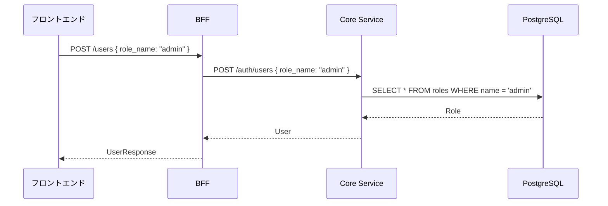
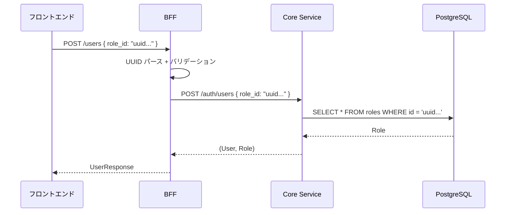
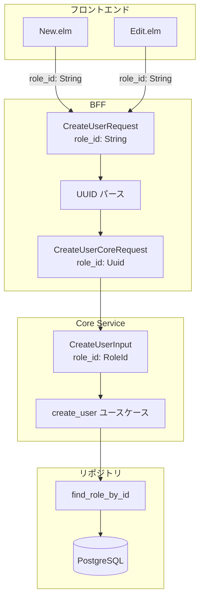
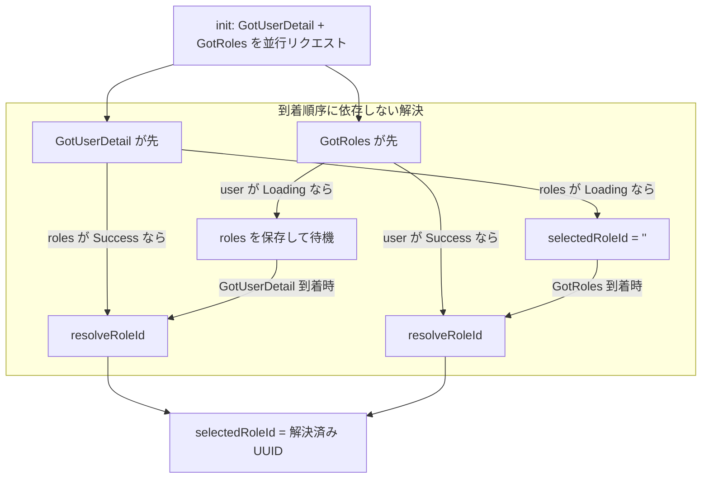

# ユーザー API role_id 化 - 機能解説

対応 PR: #771
対応 Issue: #769

## 概要

ユーザー作成・編集 API がロールの指定に `role_name`（ロール名文字列）を使用していた設計を、`role_id`（UUID）ベースに変更した。リポジトリ / Core Service / BFF / フロントエンド / OpenAPI の全レイヤーを一貫して修正。

## 背景

### ロール参照方式の問題

暫定修正 #770 でフロントエンドを現行 API に合わせたが、変数名 `selectedRoleId` のまま `role.name` を送信するねじれた状態になっていた。REST API の慣例としてリソースは一意識別子（ID）で参照すべきであり、ロール名変更に対する堅牢性も向上する。

| 項目 | Before | After |
|------|--------|-------|
| API フィールド | `role_name: String` | `role_id: UUID` |
| フロントエンドの select value | `role.name` | `role.id` |
| ロール検索 | `find_role_by_name` | `find_role_by_id` |

### Issue 全体の中での位置づけ

| Issue | 内容 | 状態 |
|-------|------|------|
| #769 | ユーザー作成・編集 API を role_id ベースに変更 | 本 PR で対応 |
| #770 | フロントエンドのフィールド名不一致の暫定修正 | マージ済み |

## 用語・概念

| 用語 | 説明 | 関連コード |
|------|------|-----------|
| RoleId | ロールの一意識別子（UUID ラッパー型） | `ringiflow_domain::role::RoleId` |
| utoipa | Rust の構造体アノテーションから OpenAPI 仕様を自動生成するライブラリ | `#[derive(ToSchema)]` |
| resolveRoleId | ロール名 → ロール ID の変換ヘルパー（Elm） | `Page.User.Edit.resolveRoleId` |

## ビフォー・アフター

### Before（変更前）

#### 制約・課題

- ロール名が変更されると API リクエストが壊れる
- フロントエンドの変数名 `selectedRoleId` と実際に送信する値 `role.name` にねじれがある
- REST API の慣例に反する（名前ではなく ID で参照すべき）

### After（変更後）

#### 改善点

- ロール名変更に対して堅牢
- フロントエンドの変数名と送信値が一致
- BFF で UUID バリデーションを実施し、不正な形式を早期に拒否

## アーキテクチャ

## データフロー

### フロー 1: ユーザー作成

| # | レイヤー | ファイル:関数 | 処理内容 |
|---|---------|-------------|---------|
| 1 | Frontend | `New.elm:SubmitForm` | `role_id` フィールドで `selectedRoleId` を JSON エンコード |
| 2 | BFF | `user.rs:create_user` | `uuid::Uuid::parse_str` で UUID パース、失敗時 400 |
| 3 | BFF | `user.rs:create_user` | `CreateUserCoreRequest { role_id: Uuid }` を組み立て |
| 4 | Core | `auth/mod.rs:create_user` | `RoleId::from_uuid(req.role_id)` で型変換 |
| 5 | Core | `user.rs:create_user` | `find_role_by_id` でロール存在確認 |
| 6 | Core | `user.rs:create_user` | `(User, Role)` を返却 |
| 7 | Core | `auth/mod.rs:create_user` | `role.name().to_string()` でレスポンスにロール名を含める |

### フロー 2: ユーザー編集（フロントエンドのロール ID 解決）

## エラーハンドリング

| エラー | 発生箇所 | HTTP Status | ユーザーへの表示 |
|-------|---------|-------------|---------------|
| role_id の UUID 形式不正 | BFF | 400 Bad Request | "role_id の形式が不正です" |
| 存在しない role_id | Core Service | 400 Bad Request | "ロール ID 'xxx' が見つかりません" |

## 設計判断

機能・仕組みレベルの判断を記載する。コード実装レベルの判断は[コード解説](./01_role_id化_コード解説.md#設計解説)を参照。

### 1. create_user の戻り値をどうするか

ハンドラのレスポンスにロール名を含める必要がある。`role_name` を直接受け取っていた Before ではリクエストの値をそのまま使えたが、`role_id` ベースではロール名を取得する手段が必要。

| 案 | DB アクセス | コード変更量 | 責務の明確さ |
|----|-----------|-------------|------------|
| **ユースケースから `(User, Role)` を返す（採用）** | 追加なし（既に取得済み） | 小 | ユースケースが必要な情報を提供 |
| ハンドラで `find_role_by_id` を再度呼ぶ | 1回追加 | 中 | 冗長な DB アクセス |

**採用理由**: ユースケース内でロール存在確認のために既に取得済みのデータを返すだけで済み、無駄な DB アクセスを回避できる。

### 2. Edit.elm でロール ID の初期値をどう解決するか

ユーザー詳細 API は `roles: Vec<String>`（ロール名配列）を返す。編集画面の select 初期値にはロール ID が必要。

| 案 | API 変更 | フロントエンド複雑度 | 影響範囲 |
|----|---------|------------------|---------|
| **ロール名からロール ID に変換するヘルパー（採用）** | なし | 中（resolveRoleId 追加） | フロントエンドのみ |
| レスポンスの `roles` を ID 配列に変更 | あり | 低 | 別 Issue のスコープ |

**採用理由**: レスポンスの `roles` の ID 化は別 Issue のスコープとして分離されている。本 Issue ではフロントエンド側で解決する。

## 関連ドキュメント

- [コード解説](./01_role_id化_コード解説.md)
- [計画ファイル](../../../prompts/plans/769_user-api-role-id-based.md)
