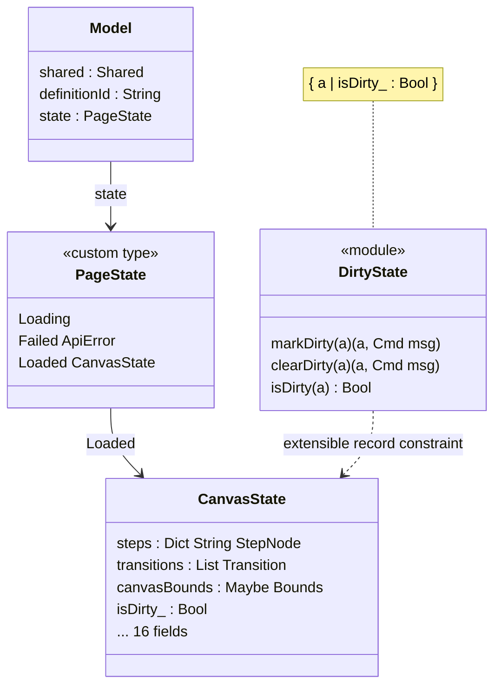
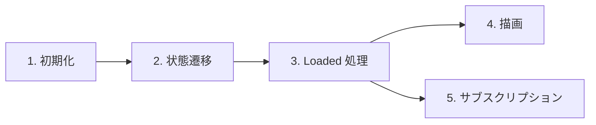
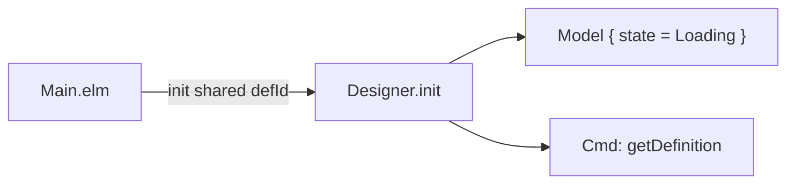
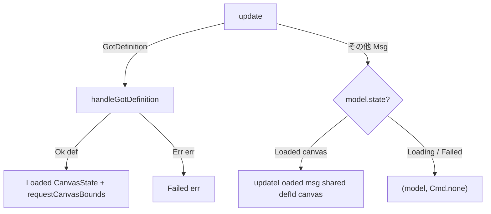
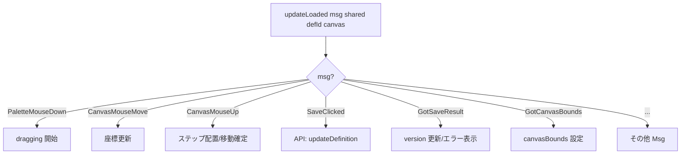
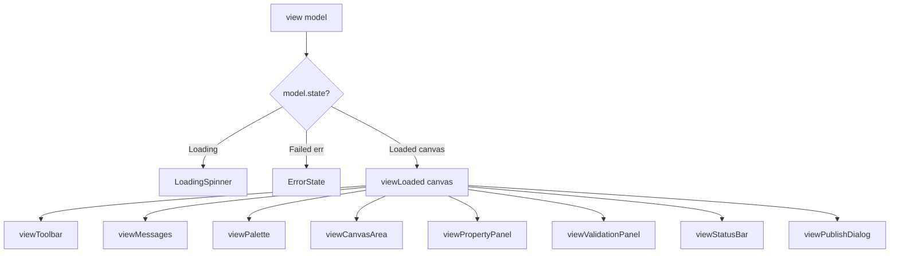
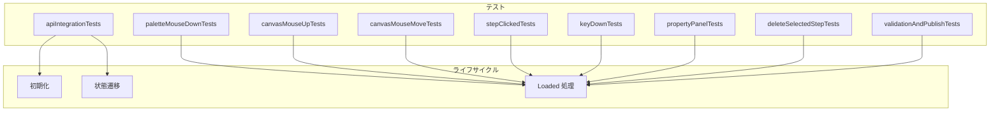
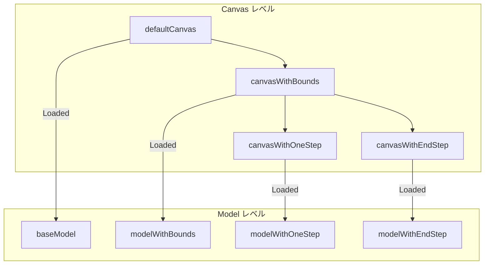

# Designer 型安全ステートマシン - コード解説

対応 PR: #802
対応 Issue: #796

## 主要な型・関数

| 型/関数 | ファイル | 責務 |
|--------|---------|------|
| `Model` | [`Designer.elm:57`](../../../frontend/src/Page/WorkflowDefinition/Designer.elm) | 外側 Model。共通フィールド + PageState |
| `PageState` | [`Designer.elm:70`](../../../frontend/src/Page/WorkflowDefinition/Designer.elm) | 状態 ADT（Loading / Failed / Loaded） |
| `CanvasState` | [`Designer.elm:78`](../../../frontend/src/Page/WorkflowDefinition/Designer.elm) | Loaded 時のキャンバス状態（20 フィールド） |
| `update` | [`Designer.elm:162`](../../../frontend/src/Page/WorkflowDefinition/Designer.elm) | 外側 update。GotDefinition をディスパッチ |
| `handleGotDefinition` | [`Designer.elm:183`](../../../frontend/src/Page/WorkflowDefinition/Designer.elm) | 状態遷移: Loading → Loaded / Failed |
| `updateLoaded` | [`Designer.elm:239`](../../../frontend/src/Page/WorkflowDefinition/Designer.elm) | Loaded 状態の全 Msg 処理 |
| `view` | [`Designer.elm:812`](../../../frontend/src/Page/WorkflowDefinition/Designer.elm) | PageState をパターンマッチして描画 |
| `viewLoaded` | [`Designer.elm:829`](../../../frontend/src/Page/WorkflowDefinition/Designer.elm) | Loaded 状態の view |
| `expectLoaded` | [`DesignerTest.elm:170`](../../../frontend/tests/Page/WorkflowDefinition/DesignerTest.elm) | テスト: Loaded 状態のアサーションヘルパー |

### 型の関係



## コードフロー

コードをライフサイクル順に追う。各ステップの構造を図で示した後、対応するコードを解説する。



### 1. 初期化（`init` 呼び出し時）

Main.elm がページ遷移時に `Designer.init` を呼び出す。`state = Loading` で初期化し、API リクエストを発行する。



```elm
-- Designer.elm:102-113
init : Shared -> String -> ( Model, Cmd Msg )
init shared definitionId =
    ( { shared = shared
      , definitionId = definitionId
      , state = Loading                              -- ① Loading で開始
      }
    , WorkflowDefinitionApi.getDefinition             -- ② API リクエスト
        { config = Shared.toRequestConfig shared
        , id = definitionId
        , toMsg = GotDefinition
        }
    )
```

注目ポイント:

- ① `state = Loading` にはキャンバスフィールドが存在しない。この時点で `canvas.steps` のようなアクセスはコンパイルエラーになる
- ② API レスポンスは `GotDefinition` として外側 `update` に届く

### 2. 状態遷移（`GotDefinition` 受信時）

外側 `update` が `GotDefinition` を `handleGotDefinition` にディスパッチする。成功時は `CanvasState` を構築して `Loaded` に遷移し、同時に `requestCanvasBounds` を発行する。



```elm
-- Designer.elm:162-178
update : Msg -> Model -> ( Model, Cmd Msg )
update msg model =
    case msg of
        GotDefinition result ->
            handleGotDefinition result model           -- ① 状態遷移はここだけ

        _ ->
            case model.state of
                Loaded canvas ->
                    let
                        ( newCanvas, cmd ) =
                            updateLoaded msg model.shared model.definitionId canvas  -- ②
                    in
                    ( { model | state = Loaded newCanvas }, cmd )

                _ ->
                    ( model, Cmd.none )                -- ③ Loading/Failed では無視
```

注目ポイント:

- ① `GotDefinition` のみ外側で処理。状態遷移（Loading → Loaded/Failed）の責務
- ② Loaded 状態のときだけ `updateLoaded` に委譲。`shared` と `definitionId` をパラメータとして渡す
- ③ Loading/Failed 状態では GotDefinition 以外の Msg を安全に無視

```elm
-- Designer.elm:183-230
handleGotDefinition : Result ApiError WorkflowDefinition -> Model -> ( Model, Cmd Msg )
handleGotDefinition result model =
    case result of
        Ok def ->
            let
                steps = DesignerCanvas.loadStepsFromDefinition def.definition
                    |> Result.withDefault Dict.empty
                transitions = DesignerCanvas.loadTransitionsFromDefinition def.definition
                    |> Result.withDefault []
                nextNumber = Dict.size steps + 1
            in
            ( { model
                | state = Loaded                       -- ① 全 20 フィールドを初期化
                    { steps = steps
                    , transitions = transitions
                    , canvasBounds = Nothing            -- ② 非同期取得待ち
                    , isDirty_ = False
                    , ...
                    }
              }
            , Ports.requestCanvasBounds canvasElementId -- ③ DOM サイズ取得
            )

        Err err ->
            ( { model | state = Failed err }, Cmd.none )
```

注目ポイント:

- ① `Loaded` 遷移時に全フィールドを明示的に初期化。デフォルト値の漏れがコンパイルエラーで検出される
- ② `canvasBounds = Nothing` は「非同期取得中」の単一の意味のみ（Before では「Loading 中で存在しない」の意味も混在していた）
- ③ `requestCanvasBounds` は Loaded 遷移と同時に発行。DOM 要素は Loaded の view で描画されるため確実に存在する

### 3. Loaded 状態での処理（`updateLoaded`）

`updateLoaded` は CanvasState を直接操作する。`shared` と `definitionId` はパラメータとして受け取り、API 呼び出し時にのみ使用する。



```elm
-- Designer.elm:239-240
updateLoaded : Msg -> Shared -> String -> CanvasState -> ( CanvasState, Cmd Msg )
updateLoaded msg shared definitionId canvas =
    case msg of
        SaveClicked ->
            ...
            ( { canvas | isSaving = True, ... }
            , WorkflowDefinitionApi.updateDefinition     -- ① shared を使用
                { config = Shared.toRequestConfig shared
                , id = definitionId                      -- ② definitionId を使用
                , body = body
                , toMsg = GotSaveResult
                }
            )
        ...
```

注目ポイント:

- ① `shared` は API 呼び出し時にのみ使用。CanvasState のフィールドではなくパラメータ
- ② `definitionId` も同様。キャンバス状態と API 接続情報の責務を分離

### 4. 描画（`view`）

`view` で `model.state` をパターンマッチし、各状態に応じた UI を描画する。Loaded 状態では `viewLoaded` に CanvasState のみを渡す。



```elm
-- Designer.elm:812-824
view : Model -> Html Msg
view model =
    case model.state of
        Loading ->
            div [ ... ] [ LoadingSpinner.view ]         -- ① Loading 画面

        Failed err ->
            div [ ... ] [ ErrorState.viewSimple ... ]    -- ② エラー画面

        Loaded canvas ->
            viewLoaded canvas                            -- ③ CanvasState のみ渡す
```

注目ポイント:

- ③ `viewLoaded` のシグネチャは `CanvasState -> Html Msg`。`Model` ではなく `CanvasState` を受け取るため、view サブ関数群も全て `CanvasState ->` のシグネチャになる

### 5. サブスクリプション（`subscriptions`）

状態に応じてサブスクリプションを制御する。

```elm
-- Designer.elm:766-805
subscriptions : Model -> Sub Msg
subscriptions model =
    Sub.batch
        [ Ports.receiveCanvasBounds GotCanvasBounds     -- ① 全状態で購読
        , case model.state of
            Loaded canvas ->
                Sub.batch
                    [ if canvas.dragging /= Nothing then
                        Sub.batch                        -- ② ドラッグ中のみ
                            [ Browser.Events.onMouseMove ...
                            , Browser.Events.onMouseUp ...
                            ]
                      else
                        Sub.none
                    , Browser.Events.onKeyDown ...       -- ③ Loaded のみ
                    ]

            _ ->
                Sub.none                                 -- ④ Loading/Failed は無購読
        ]
```

注目ポイント:

- ① `receiveCanvasBounds` は全状態で購読。`handleGotDefinition` で `requestCanvasBounds` を発行した直後に Loaded に遷移するが、レスポンスは非同期で到着するため遷移前から購読が必要
- ④ Loading/Failed では DOM イベントを購読しない（無駄な処理を防止）

## テスト

各テストがライフサイクルのどのステップを検証しているかを示す。



| テスト群 | 検証対象 | 検証内容 |
|---------|---------|---------|
| `apiIntegrationTests` | 初期化, 状態遷移 | GotDefinition → Loaded/Failed 遷移、保存/公開 API |
| `paletteMouseDownTests` | Loaded 処理 | パレットからのドラッグ開始 |
| `canvasMouseUpTests` | Loaded 処理 | ステップ配置、接続線作成 |
| `canvasMouseMoveTests` | Loaded 処理 | ドラッグ中の座標更新 |
| `stepClickedTests` | Loaded 処理 | ステップ選択、プロパティ同期 |
| `keyDownTests` | Loaded 処理 | Delete/Backspace キーでの削除 |
| `propertyPanelTests` | Loaded 処理 | プロパティ編集 |
| `deleteSelectedStepTests` | Loaded 処理 | ステップと関連接続線の削除 |
| `validationAndPublishTests` | Loaded 処理 | バリデーション、公開チェーン |

### テストヘルパーの構造



### 実行方法

```bash
just elm-test
```

## 設計解説

コード実装レベルの判断を記載する。機能・仕組みレベルの判断は[機能解説](./01_Designer-型安全ステートマシン_機能解説.md#設計判断)を参照。

### 1. update 関数の 2 層分割

場所: `Designer.elm:162-178`

```elm
update msg model =
    case msg of
        GotDefinition result -> handleGotDefinition result model
        _ ->
            case model.state of
                Loaded canvas ->
                    let (newCanvas, cmd) = updateLoaded msg model.shared model.definitionId canvas
                    in ({ model | state = Loaded newCanvas }, cmd)
                _ -> (model, Cmd.none)
```

なぜこの実装か:
状態遷移（Loading → Loaded/Failed）と Loaded 状態内の処理を明確に分離する。`updateLoaded` は `CanvasState -> ( CanvasState, Cmd Msg )` シグネチャで、Model を意識せずにキャンバスロジックに集中できる。

代替案:

| 案 | メリット | デメリット | 判断 |
|----|---------|-----------|------|
| 2 層分割（採用） | 責務が明確、CanvasState に集中 | case の 2 段ネスト | 採用 |
| 全 Msg をフラットに処理 | ネストなし | Loaded チェックを全 Msg で繰り返す | 見送り |

### 2. DirtyState extensible record 互換性

場所: `Designer.elm:94`（`isDirty_` フィールド）

```elm
type alias CanvasState =
    { ...
    , isDirty_ : Bool    -- DirtyState の extensible record 制約を満たす
    , ...
    }
```

なぜこの実装か:
`DirtyState.markDirty` のシグネチャは `{ a | isDirty_ : Bool } -> ( { a | isDirty_ : Bool }, Cmd msg )`。CanvasState に `isDirty_` フィールドを持たせることで、`DirtyState.markDirty canvas` が型チェックを通る。

代替案:

| 案 | メリット | デメリット | 判断 |
|----|---------|-----------|------|
| `isDirty_` を CanvasState に配置（採用） | 既存 DirtyState モジュールと互換 | フィールド名がやや不自然 | 採用 |
| DirtyState を ADT 対応に修正 | より自然な API | 他ページへの波及、スコープ外 | 見送り |

### 3. テスト用 `expectLoaded` ヘルパー

場所: `DesignerTest.elm:170`

```elm
expectLoaded : (CanvasState -> Expect.Expectation) -> Model -> Expect.Expectation
expectLoaded assertion model =
    case model.state of
        Loaded canvas -> assertion canvas
        _ -> Expect.fail "Expected Loaded state"
```

なぜこの実装か:
リファクタリング前は `newModel.selectedStepId` のように直接フィールドアクセスしていた（40+ 箇所）。ADT 導入後はパターンマッチが必要になるが、毎回 `case model.state of Loaded canvas -> ...` を書くと冗長。`expectLoaded` でラップすることで `newModel |> expectLoaded (\c -> c.selectedStepId |> Expect.equal ...)` と書ける。

代替案:

| 案 | メリット | デメリット | 判断 |
|----|---------|-----------|------|
| `expectLoaded` ヘルパー（採用） | 簡潔、一貫性 | 間接的 | 採用 |
| 毎回パターンマッチ | 直接的 | 40+ 箇所で冗長 | 見送り |
| テストを CanvasState 単位に分離 | 純粋 | update が Model を返すためラッパーが必要 | 見送り |

### 4. テストヘルパーの 2 層設計

場所: `DesignerTest.elm:63-165`

```elm
-- Canvas レベル: キャンバス状態のバリエーション
defaultCanvas : CanvasState
canvasWithBounds : CanvasState
canvasWithOneStep : CanvasState

-- Model レベル: Canvas を Loaded で包む
baseModel : Model
modelWithBounds : Model     -- { baseModel | state = Loaded canvasWithBounds }
```

なぜこの実装か:
テスト内の record update が `{ modelWithOneStep | selectedStepId = ... }` から `{ baseModel | state = Loaded { canvasWithOneStep | selectedStepId = ... } }` に変わる。Canvas レベルのヘルパーを用意することで、CanvasState のカスタマイズが直感的になる。

## 関連ドキュメント

- [機能解説](./01_Designer-型安全ステートマシン_機能解説.md)
- [ADR-054: 型安全ステートマシンパターンの標準化](../../70_ADR/054_型安全ステートマシンパターンの標準化.md)
- [計画ファイル](../../../prompts/plans/796_designer-adt-state-machine.md)
