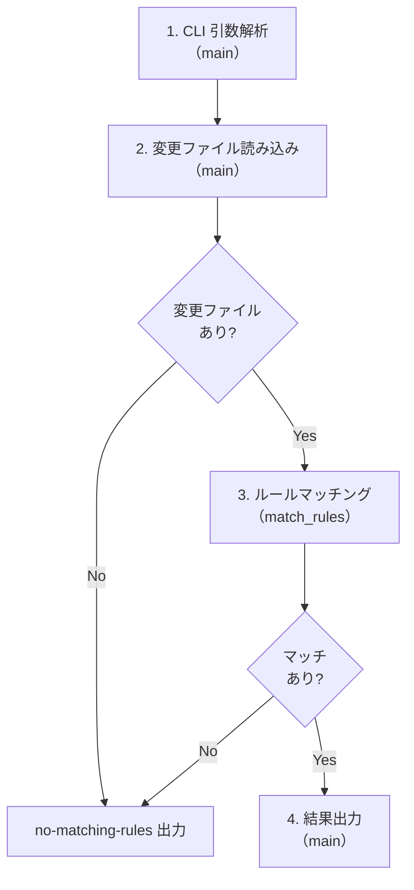
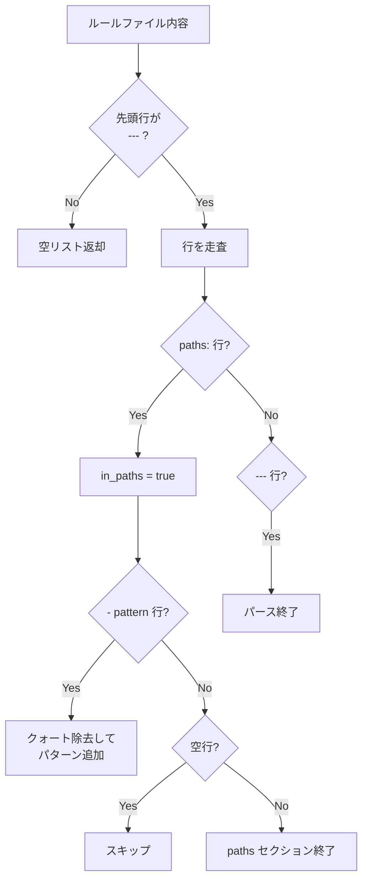
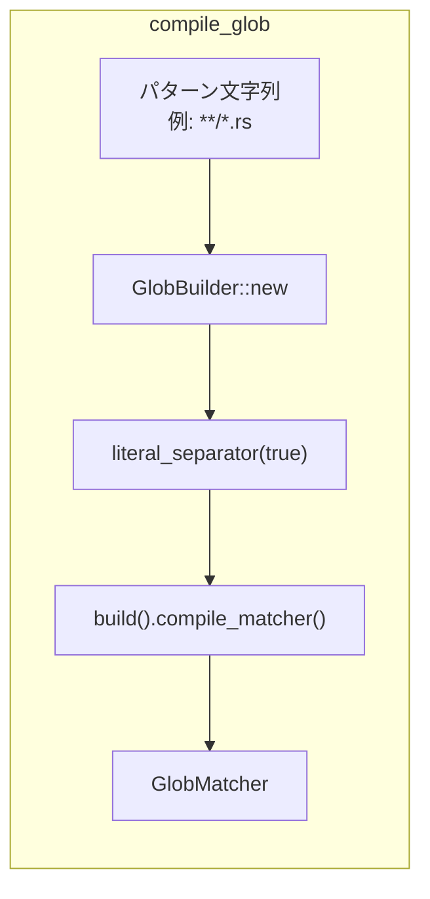
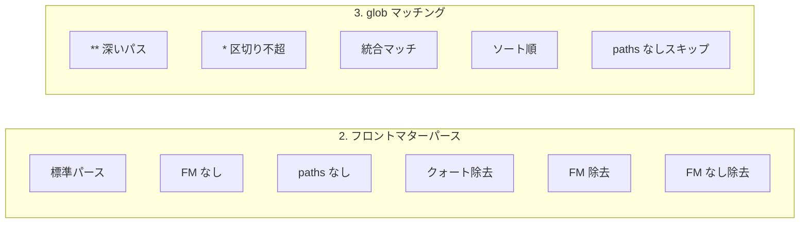

# match-rules Rust 移行 - コード解説

対応 PR: #825
対応 Issue: #815

## 主要な型・関数

| 型/関数 | ファイル | 責務 |
|--------|---------|------|
| `compile_glob` | [`.github/scripts/match-rules.rs:24`](../../../.github/scripts/match-rules.rs) | glob パターンを `GlobMatcher` にコンパイル |
| `parse_frontmatter_paths` | [`.github/scripts/match-rules.rs:40`](../../../.github/scripts/match-rules.rs) | YAML フロントマターから `paths` パターンを抽出 |
| `strip_frontmatter` | [`.github/scripts/match-rules.rs:79`](../../../.github/scripts/match-rules.rs) | フロントマターを除去してルール本文を返す |
| `MatchedRule` | [`.github/scripts/match-rules.rs:113`](../../../.github/scripts/match-rules.rs) | マッチしたルールのパスと本文を保持 |
| `match_rules` | [`.github/scripts/match-rules.rs:123`](../../../.github/scripts/match-rules.rs) | 変更ファイルにマッチするルールを検索 |
| `main` | [`.github/scripts/match-rules.rs:164`](../../../.github/scripts/match-rules.rs) | CLI エントリポイント |

## コードフロー

コードをライフサイクル順に追う。



### 1. CLI 引数解析と変更ファイル読み込み（main）

エントリポイントでファイルパスを受け取り、変更ファイル一覧を読み込む。

```rust
// .github/scripts/match-rules.rs:164-192
fn main() {
    let args: Vec<String> = std::env::args().collect();
    if args.len() < 2 {
        eprintln!("Usage: match-rules.rs <changed-files.txt>");
        std::process::exit(1);
    }

    let changed_files_path = &args[1];          // ① 変更ファイル一覧のパス
    let rules_dir = Path::new(".claude/rules"); // ② ルールディレクトリは固定

    let content = match fs::read_to_string(changed_files_path) { /* ... */ };

    let changed_files: Vec<String> = content
        .lines()
        .map(str::trim)
        .filter(|l| !l.is_empty())             // ③ 空行を除外
        .map(String::from)
        .collect();
}
```

注目ポイント:
- ① CI ワークフローが `gh pr diff --name-only > /tmp/changed-files.txt` で生成したファイルを受け取る
- ② ルールディレクトリはリポジトリルートからの固定パス
- ③ `trim` + 空行フィルタで、末尾改行等に対応

### 2. フロントマターパース（parse_frontmatter_paths）

各ルールファイルの YAML フロントマターから `paths` パターンを抽出する。



```rust
// .github/scripts/match-rules.rs:40-76
fn parse_frontmatter_paths(content: &str) -> Vec<String> {
    let mut lines = content.lines();
    match lines.next() {
        Some(line) if line.trim() == "---" => {}  // ① フロントマター開始
        _ => return Vec::new(),
    }

    let mut paths = Vec::new();
    let mut in_paths = false;

    for line in lines {
        let trimmed = line.trim();
        if trimmed == "---" { break; }            // ② フロントマター終了
        if trimmed == "paths:" {
            in_paths = true;                      // ③ paths セクション開始
            continue;
        }
        if in_paths {
            if let Some(value) = trimmed.strip_prefix("- ") {
                let pattern = value.trim()
                    .trim_matches('"')
                    .trim_matches('\'');           // ④ クォート除去
                paths.push(pattern.to_string());
            } else if !trimmed.is_empty() {
                break;                            // ⑤ 別キーに遭遇 → 終了
            }
        }
    }
    paths
}
```

注目ポイント:
- ①② `---` で囲まれた YAML フロントマターを認識
- ③ `paths:` キーの出現で paths セクションに入る
- ④ ダブルクォート・シングルクォートの両方に対応
- ⑤ paths 以外のキーに遭遇したら paths セクション終了

### 3. glob コンパイルとマッチング（compile_glob, match_rules）

`globset` クレートで glob パターンをコンパイルし、変更ファイルとマッチングする。



```rust
// .github/scripts/match-rules.rs:24-30
fn compile_glob(pattern: &str) -> Option<GlobMatcher> {
    GlobBuilder::new(pattern)
        .literal_separator(true)  // ① * がパス区切りを超えない
        .build()
        .ok()
        .map(|g| g.compile_matcher())
}
```

```rust
// .github/scripts/match-rules.rs:123-162（match_rules の核心部分）
fn match_rules(changed_files: &[String], rules_dir: &Path) -> Vec<MatchedRule> {
    let mut rule_files: Vec<_> = fs::read_dir(rules_dir)
        .into_iter().flatten()
        .filter_map(|e| e.ok())
        .filter(|e| e.path().extension().is_some_and(|ext| ext == "md")) // ② .md のみ
        .collect();

    rule_files.sort_by_key(|e| e.file_name()); // ③ ファイル名順ソート

    let mut matched = Vec::new();
    for entry in &rule_files {
        let content = match fs::read_to_string(entry.path()) { /* ... */ };
        let patterns = parse_frontmatter_paths(&content);
        if patterns.is_empty() { continue; }    // ④ paths なしはスキップ

        let matchers: Vec<_> = patterns.iter()
            .filter_map(|p| compile_glob(p))
            .collect();
        let rule_matched = matchers.iter()
            .any(|m| changed_files.iter().any(|f| m.is_match(f))); // ⑤ any-any マッチ

        if rule_matched {
            let body = strip_frontmatter(&content);
            matched.push(MatchedRule { /* ... */ });
        }
    }
    matched
}
```

注目ポイント:
- ① `literal_separator(true)` が Python 互換の鍵。これがないと `*.rs` が `src/main.rs` にもマッチする
- ② `.md` 拡張子のファイルのみ対象
- ③ 出力の安定性のためファイル名でソート
- ④ `paths` フロントマターがないルールはスキップ（マッチ条件なし）
- ⑤ いずれかのパターンがいずれかの変更ファイルにマッチすれば OK

### 4. 結果出力（main）

Python 版と同一の出力フォーマットを生成する。CI ワークフローが `contains(outputs.MATCHED_RULES, '<!-- no-matching-rules -->')` で判定するため、フォーマットの互換性が必須。

```rust
// .github/scripts/match-rules.rs:196-213
if matched.is_empty() {
    println!("<!-- no-matching-rules -->");  // ① マッチなしマーカー
    return;
}

// サマリー
println!("マッチしたルール: {} 件\n", matched.len());
for rule in &matched {
    println!("- `{}`", rule.path);           // ② パスをバッククォートで囲む
}
println!();

// 各ルールの本文
for rule in &matched {
    println!("### {}\n", rule.path);         // ③ h3 見出し
    println!("{}", rule.body);
    println!();
}
```

## テスト

各テストがコードフローのどのステップを検証しているかを示す。



| テスト | 検証対象 | 検証内容 |
|-------|---------|---------|
| `test_parse_frontmatter_paths_標準的なフロントマターからpathsを抽出` | Step 2 | 標準的なフロントマターから paths を正しく抽出する |
| `test_parse_frontmatter_paths_フロントマターがない場合は空` | Step 2 | フロントマターがなければ空リスト |
| `test_parse_frontmatter_paths_pathsキーがない場合は空` | Step 2 | paths キーがなければ空リスト |
| `test_parse_frontmatter_paths_クォートが除去される` | Step 2 | ダブル・シングルクォートが除去される |
| `test_strip_frontmatter_フロントマターを除去` | Step 2 | フロントマター除去後の本文が正しい |
| `test_strip_frontmatter_フロントマターがない場合はそのまま` | Step 2 | フロントマターなしなら元のコンテンツ |
| `test_glob_recursive_wildcard_が深いパスにマッチ` | Step 3 | `**/*.rs` が深いパスにマッチ |
| `test_glob_single_wildcard_がディレクトリ区切りを超えない` | Step 3 | `*.rs` が `/` を超えない |
| `test_match_rules_マッチングが動作する` | Step 3 | 一時ディレクトリでの統合マッチング |
| `test_match_rules_ファイル名順でソート` | Step 3 | 出力がファイル名の辞書順 |
| `test_match_rules_pathsなしのルールはスキップ` | Step 3 | paths なしルールが除外される |

### 実行方法

```bash
rust-script --test .github/scripts/match-rules.rs
```

## 依存関係

| クレート | バージョン | 追加理由 |
|---------|-----------|---------|
| `globset` | `0.4` | ネイティブ glob パターンマッチング。手動 regex 変換を代替 |
| `tempfile` | `3` | テスト用一時ディレクトリ（プロダクション動作には不要） |

## 設計解説

コード実装レベルの判断を記載する。機能・仕組みレベルの判断は[機能解説](./01_match-rules-Rust移行_機能解説.md#設計判断)を参照。

### 1. literal_separator の必要性

場所: `.github/scripts/match-rules.rs:25-26`

```rust
GlobBuilder::new(pattern)
    .literal_separator(true)  // これがないと * が / を超える
```

なぜこの実装か:
`globset` のデフォルト動作では `*` がパスセパレータ `/` を超えてマッチする（`*.rs` が `src/main.rs` にもマッチ）。Python の `fnmatch` や Shell の glob では `*` は `/` を超えない。`literal_separator(true)` で Python 版と同等の挙動を実現した。

代替案:

| 案 | メリット | デメリット | 判断 |
|----|---------|-----------|------|
| `literal_separator(true)` | Python/Shell 互換、1行追加 | なし | 採用 |
| `Glob::new()` のみ | コードが短い | `*` の挙動が変わり互換性が崩れる | 見送り |
| 正規表現で独自フィルタ | 柔軟 | globset を使う意味が薄れる | 見送り |

### 2. tempfile を dependencies に含める理由

場所: `.github/scripts/match-rules.rs:5`

```rust
//! [dependencies]
//! globset = "0.4"
//! tempfile = "3"  # テスト専用だが [dependencies] に記述
```

なぜこの実装か:
rust-script はインライン Cargo.toml で `[dev-dependencies]` をサポートしない。`#[cfg(test)]` 内でのみ使用するクレートも `[dependencies]` に記述する必要がある。プロダクション実行時には `tempfile` のコードパスに到達しないため、実害はない。

### 3. into_iter().flatten() によるエラーハンドリング

場所: `.github/scripts/match-rules.rs:124-126`

```rust
let mut rule_files: Vec<_> = fs::read_dir(rules_dir)
    .into_iter()   // Result を Option 的に扱う
    .flatten()     // Err の場合は空イテレータ
    .filter_map(|e| e.ok())
    .collect();
```

なぜこの実装か:
`read_dir` が `Err` を返す場合（ディレクトリが存在しない等）、空のルールリストとして処理する。CI 環境では `.claude/rules/` は必ず存在するが、テスト等で柔軟に動作させるため、パニックではなく空結果で対応した。

## 関連ドキュメント

- [機能解説](./01_match-rules-Rust移行_機能解説.md)
- [ADR-056: CI スクリプトの言語選定方針](../../70_ADR/056_CIスクリプトの言語選定方針.md)
- [ナレッジベース: rust-script](../../80_ナレッジベース/devtools/rust-script.md)
