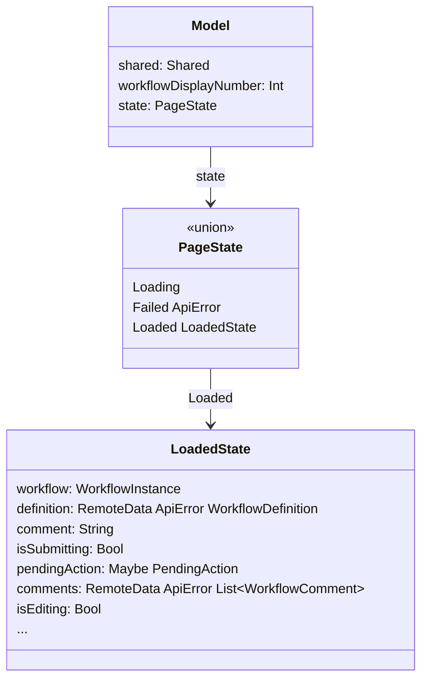
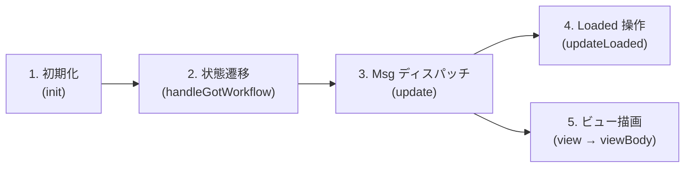
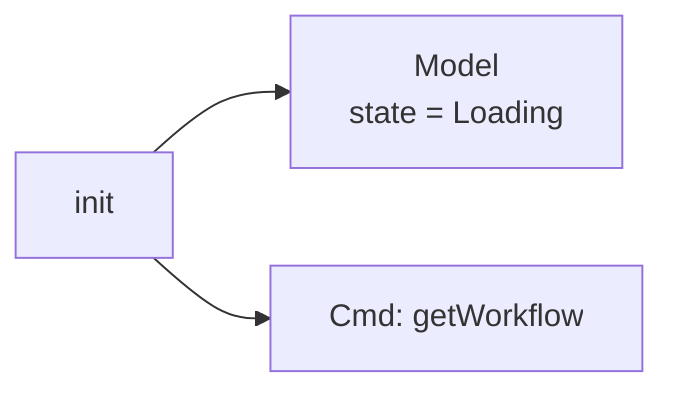
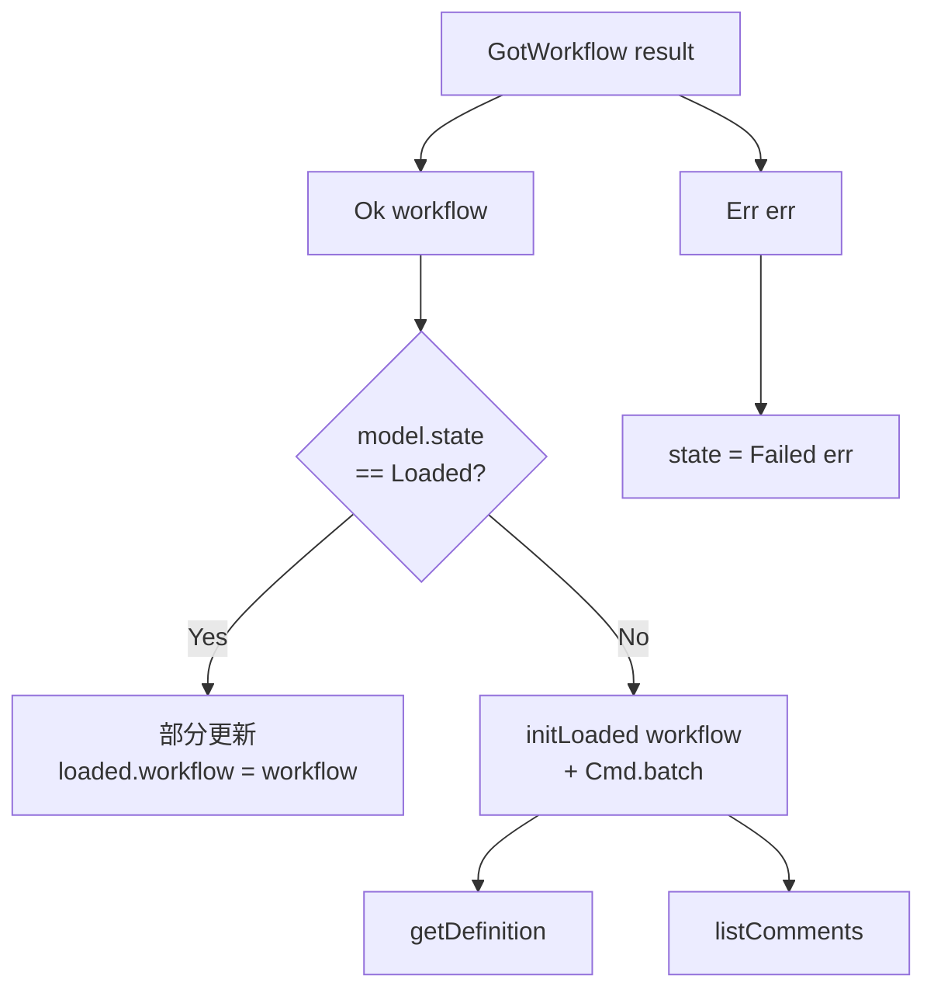
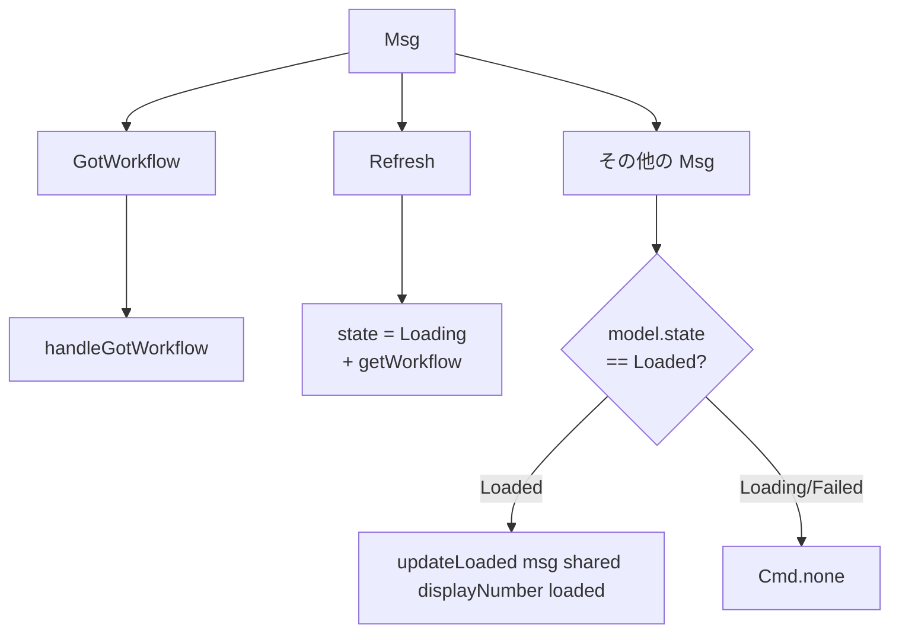
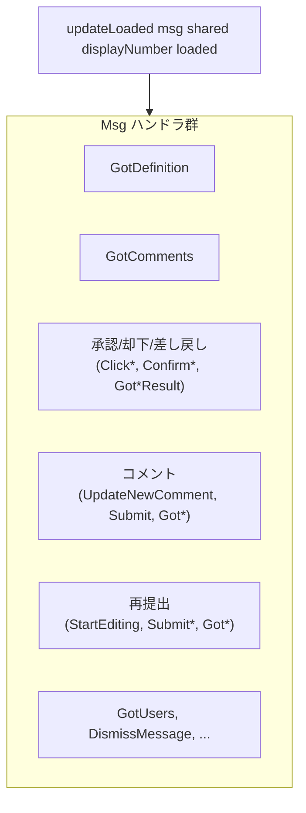
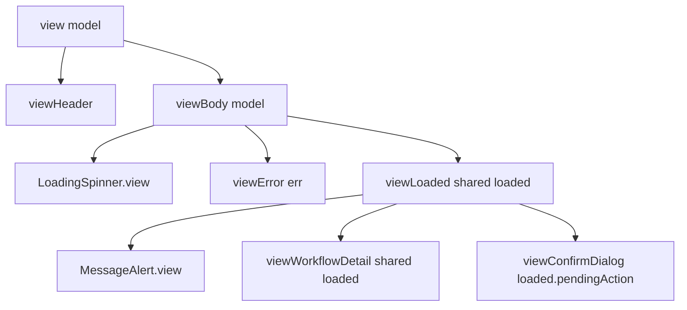

# Workflow/Detail.elm 型安全ステートマシン - コード解説

対応 PR: #839
対応 Issue: #816
Epic: #822（型安全ステートマシンの既存コード適用）

## 主要な型・関数

| 型/関数 | ファイル | 責務 |
|--------|---------|------|
| `Model` | [`Detail.elm:82`](../../../frontend/src/Page/Workflow/Detail.elm) | 共通フィールド（shared, workflowDisplayNumber）+ 状態を保持 |
| `PageState` | [`Detail.elm:91`](../../../frontend/src/Page/Workflow/Detail.elm) | Loading / Failed / Loaded の状態遷移を表現 |
| `LoadedState` | [`Detail.elm:103`](../../../frontend/src/Page/Workflow/Detail.elm) | Loaded 時のみ存在する 16 フィールドの集約 |
| `initLoaded` | [`Detail.elm:135`](../../../frontend/src/Page/Workflow/Detail.elm) | WorkflowInstance から LoadedState を構築 |
| `handleGotWorkflow` | [`Detail.elm:261`](../../../frontend/src/Page/Workflow/Detail.elm) | Loading→Loaded 遷移と Loaded 時の部分更新を処理 |
| `updateLoaded` | [`Detail.elm:298`](../../../frontend/src/Page/Workflow/Detail.elm) | Loaded 状態専用の Msg ハンドラ |
| `handleApprovalResult` | [`Detail.elm:635`](../../../frontend/src/Page/Workflow/Detail.elm) | 承認/却下/差し戻しの結果を LoadedState に反映 |

### 型の関係



## コードフロー

コードをライフサイクル順に追う。各ステップの構造を図で示した後、対応するコードを解説する。



### 1. 初期化（ページ遷移時）

ページ遷移時に `Main.elm` から呼び出される。Model を `Loading` 状態で構築し、`getWorkflow` のみ発行する。



```elm
-- Detail.elm:158-169
init : Shared -> Int -> ( Model, Cmd Msg )
init shared workflowDisplayNumber =
    ( { shared = shared
      , workflowDisplayNumber = workflowDisplayNumber
      , state = Loading                                     -- ① Loading で初期化
      }
    , WorkflowApi.getWorkflow                               -- ② getWorkflow のみ発行
        { config = Shared.toRequestConfig shared
        , displayNumber = workflowDisplayNumber
        , toMsg = GotWorkflow
        }
    )
```

注目ポイント:

- ① 変更前は 18 フィールドすべてを初期化していたが、`Loading` 一つで済む
- ② 変更前は `Cmd.batch [getWorkflow, listComments]` だったが、Loading に格納先がないため `getWorkflow` のみ。`listComments` はステップ 2 に移動

### 2. 状態遷移（GotWorkflow 受信時）

`handleGotWorkflow` は 2 つのケースを処理する。初回ロード時（Loading/Failed → Loaded）と、承認後の部分更新（Loaded → Loaded）。



```elm
-- Detail.elm:261-290
handleGotWorkflow : Result ApiError WorkflowInstance -> Model -> ( Model, Cmd Msg )
handleGotWorkflow result model =
    case result of
        Ok workflow ->
            case model.state of
                Loaded loaded ->                                       -- ① Loaded 時は部分更新
                    ( { model | state = Loaded { loaded | workflow = workflow } }
                    , Cmd.none
                    )

                _ ->                                                    -- ② Loading/Failed → Loaded
                    ( { model | state = Loaded (initLoaded workflow) }
                    , Cmd.batch
                        [ WorkflowDefinitionApi.getDefinition           -- ③ definition + comments を並列発行
                            { config = Shared.toRequestConfig model.shared
                            , id = workflow.definitionId
                            , toMsg = GotDefinition
                            }
                        , WorkflowApi.listComments
                            { config = Shared.toRequestConfig model.shared
                            , displayNumber = model.workflowDisplayNumber
                            , toMsg = GotComments
                            }
                        ]
                    )

        Err err ->
            ( { model | state = Failed err }, Cmd.none )
```

注目ポイント:

- ① 承認/却下後に `GotApproveResult Ok workflow` → `handleApprovalResult` で `loaded.workflow` を更新するため、Loaded 時に `handleGotWorkflow` が呼ばれるのは Refresh 経由。Refresh は `state = Loading` にリセットするため、実質的にはこのパスは通らないが、型の安全性のために保持
- ② `initLoaded` で 16 フィールドを初期値で構築。`definition = RemoteData.Loading`, `comments = RemoteData.Loading`
- ③ この並列発行が変更前の `init` にあった `listComments` の移動先

### 3. Msg ディスパッチ（update のトップレベル）

`update` は 2 層構造になっている。状態遷移メッセージ（`GotWorkflow`, `Refresh`）は外側で処理し、操作メッセージは `Loaded` 状態でのみ `updateLoaded` に委譲する。



```elm
-- Detail.elm:226-251
update : Msg -> Model -> ( Model, Cmd Msg )
update msg model =
    case msg of
        GotWorkflow result ->
            handleGotWorkflow result model

        Refresh ->                                              -- ① Loading にリセット
            ( { model | state = Loading }
            , WorkflowApi.getWorkflow
                { config = Shared.toRequestConfig model.shared
                , displayNumber = model.workflowDisplayNumber
                , toMsg = GotWorkflow
                }
            )

        _ ->
            case model.state of
                Loaded loaded ->                                -- ② Loaded 時のみ委譲
                    let
                        ( newLoaded, cmd ) =
                            updateLoaded msg model.shared model.workflowDisplayNumber loaded
                    in
                    ( { model | state = Loaded newLoaded }, cmd )

                _ ->                                            -- ③ Loading/Failed では無視
                    ( model, Cmd.none )
```

注目ポイント:

- ① Refresh は `state = Loading` にリセットし、`getWorkflow` のみ発行。変更前は `comments = Loading` のリセットも必要だったが、ADT 分離で不要に
- ② `updateLoaded` は `LoadedState` を受け取り `LoadedState` を返す。`model` を引き回さないため、操作ハンドラ内で `model.state` を意識する必要がない
- ③ Loading/Failed で操作 Msg を受けても何もしない。型レベルで `LoadedState` が存在しないため、フィールドアクセスは不可能

### 4. Loaded 操作（updateLoaded）

全 20+ の Msg を処理する Loaded 専用ハンドラ。`shared` と `workflowDisplayNumber` を引数で受け取ることで、API 呼び出しに必要な情報を確保する。



```elm
-- Detail.elm:298-299 (シグネチャ)
updateLoaded : Msg -> Shared -> Int -> LoadedState -> ( LoadedState, Cmd Msg )
updateLoaded msg shared workflowDisplayNumber loaded =
```

変更前との主な差異:

| 観点 | 変更前 | 変更後 |
|------|--------|--------|
| 引数の型 | `Model` | `LoadedState` + `Shared` + `Int` |
| レコード更新 | `{ model \| ... }` | `{ loaded \| ... }` |
| API 設定の取得 | `model.shared` | `shared`（引数） |
| workflow アクセス | `case model.workflow of Success w -> ...` | `loaded.workflow`（直値） |

`StartEditing` ハンドラの簡素化が顕著。変更前は `case model.workflow of Success workflow -> ...` のガード付きだったが、`updateLoaded` 自体が Loaded 時にしか呼ばれないため、`loaded.workflow` に直接アクセスできる。

### 5. ビュー描画（view → viewBody → viewLoaded）

ビューも 2 層構造。`viewBody` が `PageState` で分岐し、Loaded 時のみ `viewLoaded` を呼ぶ。



```elm
-- Detail.elm:738-748
viewBody : Model -> Html Msg
viewBody model =
    case model.state of
        Loading ->
            LoadingSpinner.view

        Failed err ->                           -- ① ApiError を viewError に渡す
            viewError err

        Loaded loaded ->
            viewLoaded model.shared loaded       -- ② Shared と LoadedState を分離して渡す
```

注目ポイント:

- ① 変更前は `viewError` がハードコードされた「データの取得に失敗しました。」を表示。変更後は `ErrorMessage.toUserMessage` でエラー内容に応じたメッセージを表示
- ② `viewLoaded` 以降の view 関数は `Model` ではなく `LoadedState`（と必要に応じて `Shared`）を受け取る。これにより Loading/Failed で誤って操作 UI を描画する可能性を排除

## テスト

各テストがライフサイクルのどのステップを検証しているかを示す。

| テスト | 検証対象のステップ | 検証内容 |
|-------|-----------------|---------|
| `approval.spec.ts` | 1→2→3→4→5 | ページロード → 承認ボタン → 確認ダイアログ → 承認完了 |
| `rejection.spec.ts` | 1→2→3→4→5 | ページロード → 却下ボタン → 確認ダイアログ → 却下完了 |
| `request-changes.spec.ts` | 1→2→3→4→5 | ページロード → 差し戻し → 再申請 → 承認 + コメント投稿 |

純粋リファクタリングのため新規テストは不要。既存 E2E テスト（21/21 通過）がそのまま検証基準。

### 実行方法

```bash
just check-all    # lint + テスト + API テスト + E2E テスト
```

## 設計解説

コード実装レベルの判断を記載する。機能・仕組みレベルの判断は[機能解説](./01_型安全ステートマシン_機能解説.md#設計判断)を参照。

### 1. RemoteData.Loading の修飾

場所: `Detail.elm:138`, `Detail.elm:144`, `Detail.elm:479`, `Detail.elm:1071`, `Detail.elm:1141`

```elm
-- PageState.Loading とのコンストラクタ名衝突
, definition = RemoteData.Loading     -- RemoteData.Loading で修飾
, comments = RemoteData.Loading       -- RemoteData.Loading で修飾
```

なぜこの実装か:
`import RemoteData exposing (RemoteData(..))` で `Loading` が公開されるが、`PageState = Loading | ...` と名前が衝突する。Elm はスコープ内で後に定義された名前が優先されるため、無修飾の `Loading` は `PageState.Loading` を指す。

代替案:

| 案 | メリット | デメリット | 判断 |
|----|---------|-----------|------|
| 衝突する `Loading` のみ修飾（採用） | 非衝突コンストラクタ（NotAsked, Success, Failure）はそのまま使える | 修飾が必要な箇所を見落とすとコンパイルエラー | 採用 |
| `RemoteData exposing (RemoteData)` に変更して全修飾 | 一貫性がある | `NotAsked`, `Success`, `Failure` まで冗長になる | 見送り |
| `PageState` のコンストラクタ名を変更（`PageLoading` 等） | RemoteData は無修飾のまま | Workflow/New.elm, Task/Detail.elm のパターンと不一致 | 見送り |

Workflow/New.elm が同じパターン（衝突する `Loading` のみ修飾）を採用済みであり、一貫性を優先した。

### 2. viewError の ApiError 引数追加

場所: `Detail.elm:775-780`

```elm
-- 変更前
viewError : Html Msg
viewError =
    ErrorState.view
        { message = "データの取得に失敗しました."
        , onRefresh = Refresh
        }

-- 変更後
viewError : ApiError -> Html Msg
viewError err =
    ErrorState.view
        { message = ErrorMessage.toUserMessage { entityName = "ワークフロー" } err
        , onRefresh = Refresh
        }
```

なぜこの実装か:
elm-review の `NoUnused.CustomTypeConstructorArgs` が `Failed ApiError` の引数未使用を検出した。`Failed _ -> viewError` を `Failed err -> viewError err` に変更し、エラー内容に応じたメッセージ表示に改善。Task/Detail.elm が同じパターン（`ErrorMessage.toUserMessage`）を採用済み。

### 3. updateLoaded のシグネチャ設計

場所: `Detail.elm:298`

```elm
updateLoaded : Msg -> Shared -> Int -> LoadedState -> ( LoadedState, Cmd Msg )
```

なぜこの実装か:
`Shared` と `workflowDisplayNumber` を `LoadedState` ではなく引数で渡す。これは `Model` の共通フィールドであり `LoadedState` に含めるべきではない。Task/Detail.elm が同じパターン（`Msg -> Shared -> Int -> LoadedState -> ...`）を採用済み。

代替案:

| 案 | メリット | デメリット | 判断 |
|----|---------|-----------|------|
| 引数で渡す（採用） | LoadedState が純粋な状態に留まる | 引数が多い | 採用 |
| Model を引数で渡す | 引数が少ない | Model の全フィールドにアクセス可能になり、型の制約が弱まる | 見送り |
| LoadedState に shared を含める | 引数が少ない | 共通フィールドと状態固有フィールドの境界が曖昧になる | 見送り |

## 関連ドキュメント

- [機能解説](./01_型安全ステートマシン_機能解説.md)
- [ADR-054: 型安全ステートマシンパターンの標準化](../../70_ADR/054_型安全ステートマシンパターンの標準化.md)
- Task/Detail.elm（`frontend/src/Page/Task/Detail.elm`）— 参照パターン
