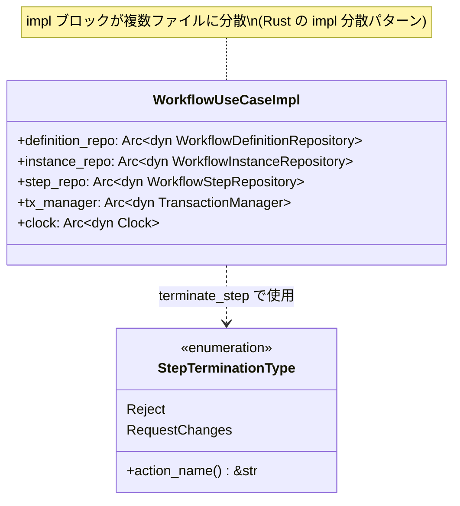
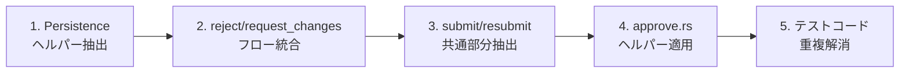
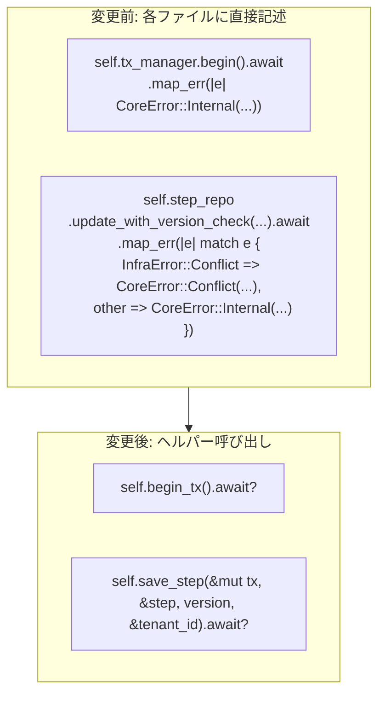
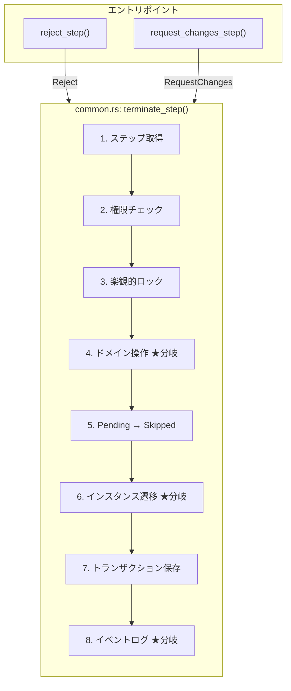
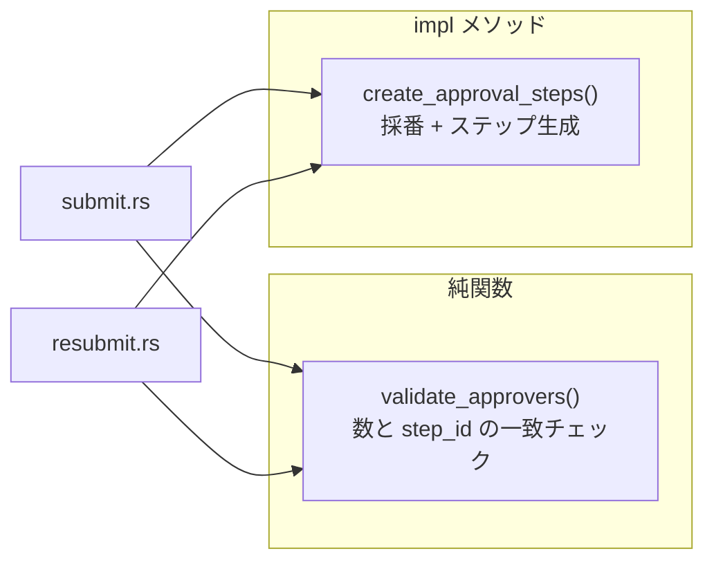
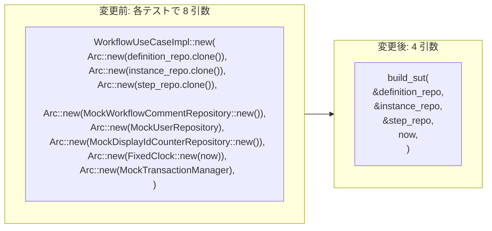
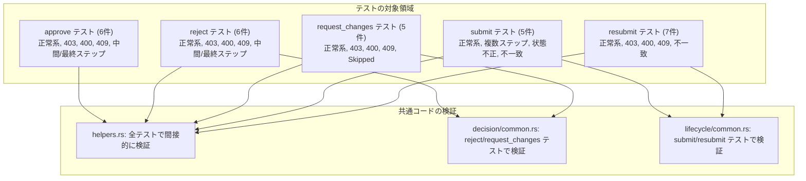

# ワークフローコマンド重複解消 - コード解説

対応 PR: #904
対応 Issue: #902

## 主要な型・関数

| 型/関数 | ファイル | 責務 |
|--------|---------|------|
| `WorkflowUseCaseImpl` | `workflow.rs` | ワークフローユースケースの実装。`Arc<dyn Trait>` で DI |
| `StepTerminationType` | `decision/common.rs:22` | reject/request_changes の変動点を切り替える enum |
| `terminate_step()` | `decision/common.rs:52` | reject/request_changes の共通 8 ステップフロー |
| `validate_approvers()` | `lifecycle/common.rs:27` | 承認者と定義ステップの整合性検証（純関数） |
| `create_approval_steps()` | `lifecycle/common.rs:55` | 定義と承認者に基づくステップ一括作成 |
| `begin_tx()` | `helpers.rs:18` | トランザクション開始 |
| `commit_tx()` | `helpers.rs:26` | トランザクションコミット |
| `save_step()` | `helpers.rs:33` | version check 付きステップ更新 |
| `save_instance()` | `helpers.rs:52` | version check 付きインスタンス更新 |
| `fetch_instance_steps()` | `helpers.rs:72` | インスタンスに紐づくステップ一覧取得 |
| `build_sut()` | `command.rs:45` | テスト用 SUT ビルダー。8 引数 → 4 引数に簡素化 |

### 型の関係



## コードフロー

コードをライフサイクル順に追う。各ステップの構造を図で示した後、対応するコードを解説する。



### 1. Persistence ヘルパー（全コマンド共通の基盤）

5 つのコマンドファイルすべてで繰り返されるトランザクション操作と version check 付き更新を `helpers.rs` に抽出した。



```rust
// command/helpers.rs:33-49
pub(super) async fn save_step(
    &self,
    tx: &mut TxContext,
    step: &WorkflowStep,
    expected_version: Version,
    tenant_id: &TenantId,
) -> Result<(), CoreError> {
    self.step_repo
        .update_with_version_check(tx, step, expected_version, tenant_id)
        .await
        .map_err(|e| match e {
            InfraError::Conflict { .. } => CoreError::Conflict(  // ① Conflict → 409
                "ステップは既に更新されています。...".to_string(),
            ),
            other => CoreError::Internal(format!("ステップの保存に失敗: {}", other)),  // ② その他 → 500
        })
}
```

注目ポイント:

- ① `InfraError::Conflict` を `CoreError::Conflict` に変換する楽観的ロックの共通パターン。5 ファイルで同一のエラーメッセージ・変換ロジックが繰り返されていた
- ② それ以外のインフラエラーは Internal（500）に変換。この分岐も全コマンド共通

### 2. reject/request_changes フロー統合（enum dispatch）

95% 同一だった reject と request_changes を `StepTerminationType` enum と `terminate_step()` メソッドに統合した。



変動点は enum の match で分岐:

```rust
// decision/common.rs:140-156 — ステップへのドメイン操作（変動点 1）
fn apply_step_termination(
    step: WorkflowStep,
    termination: &StepTerminationType,
    input: &ApproveRejectInput,
    now: chrono::DateTime<chrono::Utc>,
) -> Result<WorkflowStep, CoreError> {
    let comment = input.comment.clone();
    match termination {
        StepTerminationType::Reject => step          // ① Reject → step.reject()
            .reject(comment, now)
            .map_err(|e| CoreError::BadRequest(e.to_string())),
        StepTerminationType::RequestChanges => step   // ② RequestChanges → step.request_changes()
            .request_changes(comment, now)
            .map_err(|e| CoreError::BadRequest(e.to_string())),
    }
}
```

注目ポイント:

- ① ② 変動点はドメインメソッドの呼び分けのみ。シグネチャが同一（`comment`, `now`）なため enum dispatch が自然に嵌まる
- `apply_step_termination` は `fn`（非 async の関連関数）。`&self` を取らないためテストでも独立して呼べる

統合後の reject.rs / request_changes.rs は委譲のみ:

```rust
// decision/reject.rs:24-39
pub async fn reject_step(
    &self,
    input: ApproveRejectInput,
    step_id: WorkflowStepId,
    tenant_id: TenantId,
    user_id: UserId,
) -> Result<WorkflowWithSteps, CoreError> {
    self.terminate_step(input, step_id, tenant_id, user_id, StepTerminationType::Reject)
        .await
}
```

### 3. submit/resubmit 共通部分抽出

承認者検証とステップ作成ループを `lifecycle/common.rs` に抽出した。



```rust
// lifecycle/common.rs:27-49 — 純関数として impl ブロック外に配置
pub(super) fn validate_approvers(
    approvers: &[StepApprover],
    approval_step_defs: &[ApprovalStepDef],
) -> Result<(), CoreError> {
    if approvers.len() != approval_step_defs.len() {   // ① 数の一致チェック
        return Err(CoreError::BadRequest(format!(
            "承認者の数({})が定義のステップ数({})と一致しません",
            approvers.len(), approval_step_defs.len()
        )));
    }
    for (approver, step_def) in approvers.iter().zip(approval_step_defs) {
        if approver.step_id != step_def.id {            // ② step_id の一致チェック
            return Err(CoreError::BadRequest(format!(
                "承認者のステップ ID({})が定義のステップ ID({})と一致しません",
                approver.step_id, step_def.id
            )));
        }
    }
    Ok(())
}
```

注目ポイント:

- ① ② 2 種類のバリデーション（数の一致、ID の一致）を順にチェック。submit と resubmit で完全に同一だったロジック
- `impl` ブロック外の自由関数として配置。`&self` が不要な純関数のため、テスタビリティも高い

```rust
// lifecycle/common.rs:55-89 — 最初のステップのみ Active
pub(super) async fn create_approval_steps(&self, ...) -> Result<Vec<WorkflowStep>, CoreError> {
    let mut steps = Vec::with_capacity(approval_step_defs.len());
    for (i, (step_def, approver)) in approval_step_defs.iter().zip(approvers).enumerate() {
        let display_number = self.counter_repo
            .next_display_number(tenant_id, DisplayIdEntityType::WorkflowStep)
            .await
            .map_err(|e| CoreError::Internal(format!("採番に失敗: {}", e)))?;

        let step = WorkflowStep::new(NewWorkflowStep { /* ... */ });
        let step = if i == 0 { step.activated(now) } else { step };  // ① 最初のみ Active
        steps.push(step);
    }
    Ok(steps)
}
```

注目ポイント:

- ① `i == 0` で最初のステップのみ Active にするパターン。承認フローの「逐次承認」モデルを実装

### 4. approve.rs への Persistence ヘルパー適用

approve.rs は独自の次ステップ判定ロジックを持つため、フロー統合の対象外とした。ただし Persistence ヘルパーは適用し、ボイラープレートを置換した。

```rust
// decision/approve.rs:114-132 — ヘルパー適用後
let mut tx = self.begin_tx().await?;                                        // ① begin_tx
self.save_step(&mut tx, &approved_step, step_expected_version, &tenant_id)  // ② save_step
    .await?;
if let Some((ref activated_step, next_expected_version)) = activated_next_step {
    self.save_step(&mut tx, activated_step, next_expected_version, &tenant_id) // ③ 次ステップも save
        .await?;
}
self.save_instance(&mut tx, &updated_instance, instance_expected_version, &tenant_id) // ④ save_instance
    .await?;
self.commit_tx(tx).await?;                                                  // ⑤ commit_tx
```

注目ポイント:

- ② ③ approve は `save_step` を 2 回呼ぶ（承認ステップ + 次の Active ステップ）。reject/request_changes は 1 + N 回（対象ステップ + Skipped ステップ群）。パターンは異なるがヘルパーは共通
- approve が独立を維持する理由: 次ステップ判定（定義から承認ステップ順序を取得し、`current_index + 1` で判定）は approve 固有のロジック

### 5. テストコードの重複解消（build_sut）

5 ファイルの全テストで繰り返されていた 8 引数の SUT 構築を、`build_sut` 関数で 4 引数に簡素化した。



```rust
// command.rs:45-61
pub fn build_sut(
    definition_repo: &MockWorkflowDefinitionRepository,
    instance_repo: &MockWorkflowInstanceRepository,
    step_repo: &MockWorkflowStepRepository,
    now: chrono::DateTime<chrono::Utc>,
) -> WorkflowUseCaseImpl {
    WorkflowUseCaseImpl::new(
        Arc::new(definition_repo.clone()),   // ① clone で共有ステート維持
        Arc::new(instance_repo.clone()),
        Arc::new(step_repo.clone()),
        Arc::new(MockWorkflowCommentRepository::new()),  // ② テストで未使用の依存はデフォルト
        Arc::new(MockUserRepository),
        Arc::new(MockDisplayIdCounterRepository::new()),
        Arc::new(FixedClock::new(now)),
        Arc::new(MockTransactionManager),
    )
}
```

注目ポイント:

- ① Mock repos は内部に `Arc<RwLock<...>>` を持つため、`.clone()` で共有ステートが維持される。テストで `insert_for_test` した後に `build_sut` を呼んでも、挿入済みデータが参照できる
- ② `MockWorkflowCommentRepository` 等のテストで未使用の依存は `build_sut` 内でデフォルト値を設定。テスト側は必要な 3 つの repo のみ意識すれば良い
- 41 箇所の置換により、5 ファイルから計 7 つの未使用インポート（`Arc`, `FixedClock`, 4 Mock 型, `WorkflowUseCaseImpl`）を削除

## テスト

各テストがライフサイクルのどのステップを検証しているかを示す。



| テスト | 検証対象 | 検証内容 |
|-------|---------|---------|
| `test_approve_step_正常系` | approve 全フロー | 1 段階承認の正常系、Approved 状態遷移 |
| `test_reject_step_中間ステップ_残りのpendingステップがskippedになる` | terminate_step + skip_pending_steps | 2 段階承認で中間却下時に Pending → Skipped |
| `test_request_changes_step_バージョン不一致で409` | terminate_step 楽観的ロック | 不一致バージョンで Conflict エラー |
| `test_submit_workflow_正常系` | validate_approvers + create_approval_steps | 定義に基づくステップ作成、最初のみ Active |
| `test_resubmit_workflow_正常系` | validate_approvers + create_approval_steps | ChangesRequested → InProgress 遷移 |

リファクタリング（振る舞い変更なし）のため、既存テスト 99 件がすべて安全ネットとして機能。共通ヘルパーの個別テストは追加不要。

### 実行方法

```bash
# ワークフローコマンドのテストのみ
cargo test -p ringiflow-core-service workflow::command

# 全テスト
just check
```

## 設計解説

コード実装レベルの判断を記載する。機能・仕組みレベルの判断は[機能解説](./01_ワークフローコマンド重複解消_機能解説.md#設計判断)を参照。

### 1. ヘルパーの visibility を `pub(super)` にした理由

場所: `command/helpers.rs`

```rust
pub(super) async fn begin_tx(&self) -> Result<TxContext, CoreError> { ... }
```

なぜこの実装か:
`command/` モジュール内でのみ使用されるヘルパーのため、`pub(super)` で可視性を制限。`pub(crate)` にすると他のユースケース（query など）からもアクセス可能になるが、これらのヘルパーはコマンド固有の永続化パターンに特化しており、汎用的ではない。

代替案:

| 案 | メリット | デメリット | 判断 |
|----|---------|-----------|------|
| `pub(super)` | モジュール境界が明確 | サブモジュール以外からは使えない | 採用 |
| `pub(crate)` | 他のユースケースでも再利用可能 | 不要な可視性拡大 | 見送り |
| 既存の `usecase/helpers.rs` に追加 | 一元管理 | ユースケース横断の汎用ヘルパーとの責務混在 | 見送り |

### 2. `validate_approvers` を `impl` ブロック外に配置した理由

場所: `lifecycle/common.rs:27`

```rust
pub(super) fn validate_approvers(
    approvers: &[StepApprover],
    approval_step_defs: &[ApprovalStepDef],
) -> Result<(), CoreError> { ... }
```

なぜこの実装か:
`&self` を取らない純関数のため、`impl WorkflowUseCaseImpl` ブロック内に置く必然性がない。自由関数にすることで「この関数はインスタンスの状態に依存しない」ことが型シグネチャから自明になる。

代替案:

| 案 | メリット | デメリット | 判断 |
|----|---------|-----------|------|
| 自由関数 | `&self` 不要が型で表現される | 呼び出し時の `self.` が使えない | 採用 |
| `impl` の関連関数 | `Self::validate_approvers()` で呼べる | `&self` 不要なのに `impl` に入れる動機が弱い | 見送り |

### 3. テストの SUT ビルダーに構造体ではなく自由関数を採用した理由

場所: `command.rs:45`

計画段階では `WorkflowCommandTestContext` 構造体を検討したが、既存の `WorkflowTestBuilder`（`test_utils` モジュール）がトレイトオブジェクトを返すため Mock 固有メソッド（`add_definition` 等）が呼べないという制約があった。

```rust
// 採用: シンプルな自由関数
let sut = build_sut(&definition_repo, &instance_repo, &step_repo, now);

// 見送り: 構造体ベース（Mock 固有メソッドへのアクセスが制限される）
let ctx = WorkflowCommandTestContext::new();
ctx.definition_repo.add_definition(definition); // ← 構造体内部の repo に直接アクセスが必要
```

代替案:

| 案 | メリット | デメリット | 判断 |
|----|---------|-----------|------|
| 自由関数 `build_sut` | シンプル、Mock に直接アクセス可能 | セットアップが分散する | 採用 |
| `WorkflowCommandTestContext` 構造体 | セットアップを集約 | 既存の `WorkflowTestBuilder` と責務重複、Mock 固有メソッドの扱いが煩雑 | 見送り |

## 関連ドキュメント

- [機能解説](./01_ワークフローコマンド重複解消_機能解説.md)
- [セッションログ](../../../prompts/runs/2026-02/2026-02-24_2129_workflow-command-dedup.md)
- [計画ファイル](../../../prompts/plans/902_workflow-command-dedup.md)
