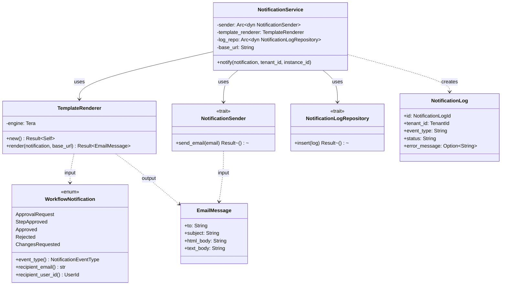
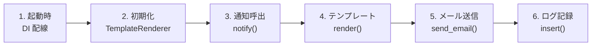
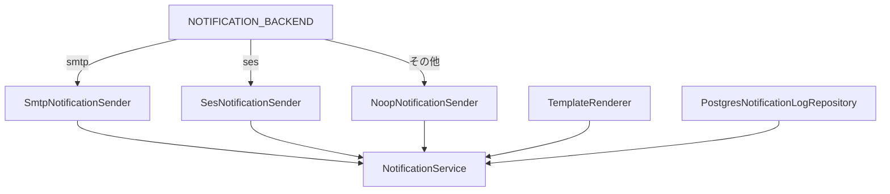
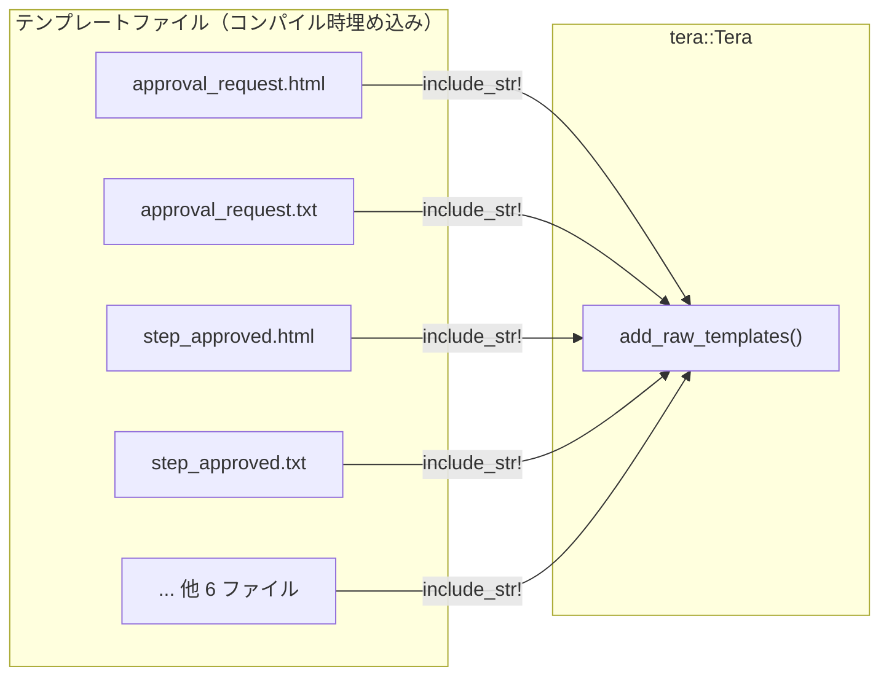
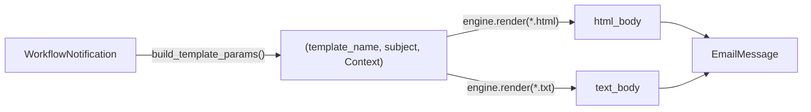
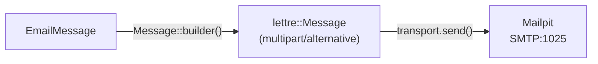
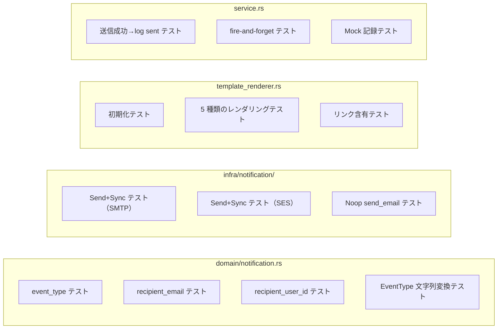
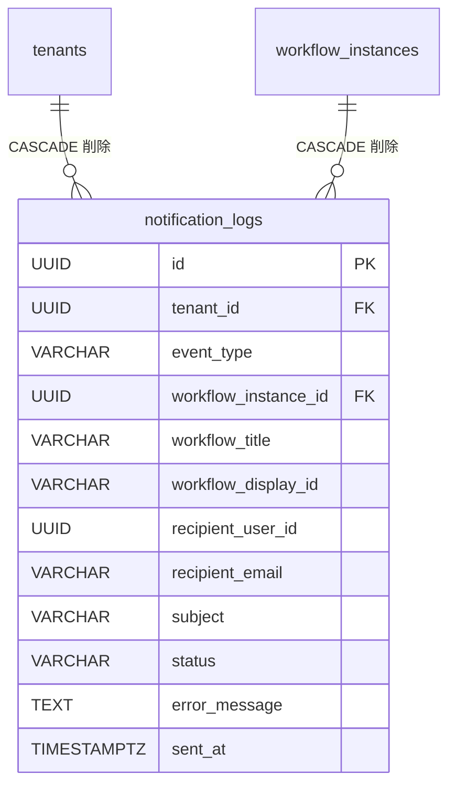

# 通知基盤 - コード解説

対応 PR: #916
対応 Issue: #875

## 主要な型・関数

| 型/関数 | ファイル | 責務 |
|--------|---------|------|
| `WorkflowNotification` | [`domain/src/notification.rs:99`](../../../backend/crates/domain/src/notification.rs) | 5 種類の通知イベントを表現する enum |
| `NotificationEventType` | [`domain/src/notification.rs:66`](../../../backend/crates/domain/src/notification.rs) | 通知イベント種別（strum で snake_case シリアライズ） |
| `EmailMessage` | [`domain/src/notification.rs:83`](../../../backend/crates/domain/src/notification.rs) | to, subject, html_body, text_body を持つメール構造体 |
| `NotificationError` | [`domain/src/notification.rs:34`](../../../backend/crates/domain/src/notification.rs) | SendFailed / TemplateFailed / LogFailed の 3 バリアント |
| `NotificationLogId` | [`domain/src/notification.rs:26`](../../../backend/crates/domain/src/notification.rs) | `define_uuid_id!` マクロによる UUID v7 newtype |
| `NotificationSender` | [`infra/src/notification.rs:28`](../../../backend/crates/infra/src/notification.rs) | メール送信の async trait |
| `SmtpNotificationSender` | [`infra/src/notification/smtp.rs:21`](../../../backend/crates/infra/src/notification/smtp.rs) | lettre による SMTP 送信 |
| `SesNotificationSender` | [`infra/src/notification/ses.rs:19`](../../../backend/crates/infra/src/notification/ses.rs) | aws-sdk-sesv2 による SES 送信 |
| `NoopNotificationSender` | [`infra/src/notification/noop.rs:13`](../../../backend/crates/infra/src/notification/noop.rs) | ログ出力のみ |
| `NotificationLogRepository` | [`infra/src/repository/notification_log_repository.rs:43`](../../../backend/crates/infra/src/repository/notification_log_repository.rs) | 通知ログの永続化 trait |
| `NotificationLog` | [`infra/src/repository/notification_log_repository.rs:26`](../../../backend/crates/infra/src/repository/notification_log_repository.rs) | INSERT 用データ型 |
| `TemplateRenderer` | [`core-service/src/usecase/notification/template_renderer.rs:22`](../../../backend/apps/core-service/src/usecase/notification/template_renderer.rs) | tera テンプレートエンジンラッパー |
| `NotificationService` | [`core-service/src/usecase/notification/service.rs:33`](../../../backend/apps/core-service/src/usecase/notification/service.rs) | render + send + log の統合サービス |
| `NotificationConfig` | [`core-service/src/config.rs:27`](../../../backend/apps/core-service/src/config.rs) | 通知設定（環境変数から読み込み） |

### 型の関係



## コードフロー

コードをライフサイクル順に追う。各ステップの構造を図で示した後、対応するコードを解説する。



### 1. DI 配線（起動時）

Core Service の `main.rs` で `NOTIFICATION_BACKEND` 環境変数に基づいて `NotificationSender` の実装を選択し、`NotificationService` を構築する。



```rust
// apps/core-service/src/main.rs:268-298
let notification_sender: Arc<dyn NotificationSender> =
    match config.notification.backend.as_str() {
        "smtp" => {                                           // ①
            tracing::info!(
                host = %config.notification.smtp_host,
                port = config.notification.smtp_port,
                "SMTP バックエンドで通知サービスを初期化します"
            );
            Arc::new(SmtpNotificationSender::new(
                &config.notification.smtp_host,
                config.notification.smtp_port,
                config.notification.from_address.clone(),
            ))
        }
        _ => {                                                // ②
            tracing::info!("Noop バックエンドで通知サービスを初期化します");
            Arc::new(NoopNotificationSender)
        }
    };
let template_renderer = TemplateRenderer::new()               // ③
    .expect("テンプレートエンジンの初期化に失敗");
let _notification_service = Arc::new(NotificationService::new( // ④
    notification_sender, template_renderer, notification_log_repo,
    config.notification.base_url,
));
```

注目ポイント:

- ① `"smtp"` の場合、lettre の `AsyncSmtpTransport` で Mailpit に接続
- ② SES バックエンドは #879 で有効化予定。現在は noop にフォールバック
- ③ tera テンプレートエンジンの初期化（10 テンプレートを `include_str!` で埋め込み）
- ④ `_notification_service`: 後続 Story（#876-#879）で `WorkflowUseCaseImpl` に注入するまで未使用

### 2. テンプレート初期化（起動時）

`TemplateRenderer::new()` で tera エンジンに 10 テンプレートを登録する。



```rust
// apps/core-service/src/usecase/notification/template_renderer.rs:31-80
pub fn new() -> Result<Self, NotificationError> {
    let mut engine = Tera::default();
    engine
        .add_raw_templates(vec![
            (
                "approval_request.html",
                include_str!("../../../templates/notifications/approval_request.html"),  // ①
            ),
            (
                "approval_request.txt",
                include_str!("../../../templates/notifications/approval_request.txt"),
            ),
            // ... 5 種類 × 2 形式 = 10 テンプレート
        ])
        .map_err(|e| NotificationError::TemplateFailed(e.to_string()))?;
    Ok(Self { engine })
}
```

注目ポイント:

- ① `include_str!` はコンパイル時にテンプレートファイルをバイナリに埋め込む。実行時にファイルシステムを参照しない

### 3. 通知呼出（ワークフロー操作後）

`NotificationService::notify()` が通知の全体フローを統制する。fire-and-forget パターンにより、戻り値は `()` 型。

```rust
// apps/core-service/src/usecase/notification/service.rs:60-141
pub async fn notify(
    &self,
    notification: WorkflowNotification,
    tenant_id: &TenantId,
    workflow_instance_id: &WorkflowInstanceId,
) {
    let event_type = notification.event_type();              // ①
    let event_type_str: &str = event_type.into();            // ②
    // ... メタデータ抽出 ...

    // テンプレートレンダリング
    let email = match self.template_renderer.render(&notification, &self.base_url) {
        Ok(email) => email,
        Err(e) => {
            tracing::error!(/* ... */);
            return;                                          // ③
        }
    };

    // メール送信
    let (status, error_message) = match self.sender.send_email(&email).await {
        Ok(()) => { /* log_business_event! */ ("sent".to_string(), None) },
        Err(e) => { /* log_business_event! */ ("failed".to_string(), Some(e.to_string())) },
    };

    // 通知ログ記録
    let log = NotificationLog { /* ... */ };
    if let Err(e) = self.log_repo.insert(&log).await {       // ④
        tracing::error!(/* ... */);
    }
}
```

注目ポイント:

- ① `WorkflowNotification::event_type()` で enum バリアントから `NotificationEventType` を導出
- ② `IntoStaticStr` により `&'static str` への変換が可能（tera コンテキストとログで使用）
- ③ テンプレートレンダリング失敗時は early return。ログ記録に必要な `subject` が未生成のため
- ④ ログ記録失敗も `tracing::error!` のみ（二次障害防止）

### 4. テンプレートレンダリング

`TemplateRenderer::render()` が `WorkflowNotification` から `EmailMessage` を生成する。



```rust
// apps/core-service/src/usecase/notification/template_renderer.rs:88-111
pub fn render(
    &self,
    notification: &WorkflowNotification,
    base_url: &str,
) -> Result<EmailMessage, NotificationError> {
    let (template_name, subject, context) =
        self.build_template_params(notification, base_url);    // ①

    let html_body = self.engine
        .render(&format!("{template_name}.html"), &context)    // ②
        .map_err(|e| NotificationError::TemplateFailed(e.to_string()))?;

    let text_body = self.engine
        .render(&format!("{template_name}.txt"), &context)     // ③
        .map_err(|e| NotificationError::TemplateFailed(e.to_string()))?;

    Ok(EmailMessage {
        to: notification.recipient_email().to_string(),
        subject,
        html_body,
        text_body,
    })
}
```

注目ポイント:

- ① `build_template_params()` がバリアント固有のフィールドを tera `Context` に設定
- ② ③ HTML とプレーンテキストを同じ Context から生成。multipart/alternative で両方を送信

### 5. メール送信（SMTP 実装）

`SmtpNotificationSender` が lettre を使って SMTP でメールを送信する。



```rust
// crates/infra/src/notification/smtp.rs:34-44
pub fn new(host: &str, port: u16, from_address: String) -> Self {
    let transport = AsyncSmtpTransport::<Tokio1Executor>::builder_dangerous(host)  // ①
        .port(port)
        .build();
    Self { transport, from_address }
}

// crates/infra/src/notification/smtp.rs:49-81
async fn send_email(&self, email: &EmailMessage) -> Result<(), NotificationError> {
    let message = Message::builder()
        .from(self.from_address.parse().map_err(/* ... */)?)
        .to(email.to.parse().map_err(/* ... */)?)
        .subject(&email.subject)
        .multipart(
            MultiPart::alternative()                                                 // ②
                .singlepart(SinglePart::builder()
                    .header(ContentType::TEXT_PLAIN)
                    .body(email.text_body.clone()))
                .singlepart(SinglePart::builder()
                    .header(ContentType::TEXT_HTML)
                    .body(email.html_body.clone())),
        )
        .map_err(/* ... */)?;

    self.transport.send(message).await.map_err(/* ... */)?;                          // ③
    Ok(())
}
```

注目ポイント:

- ① `builder_dangerous`: TLS なしで SMTP 接続する。Mailpit はローカル SMTP のため TLS 不要
- ② `MultiPart::alternative()`: HTML とプレーンテキストの両方を含む。メールクライアントが対応形式を選択
- ③ `AsyncSmtpTransport` は Tokio ランタイム上で非同期送信

### 6. 通知ログ記録

`PostgresNotificationLogRepository` が `notification_logs` テーブルにレコードを INSERT する。

```rust
// crates/infra/src/repository/notification_log_repository.rs:64-92
async fn insert(&self, log: &NotificationLog) -> Result<(), InfraError> {
    sqlx::query!(
        r#"
        INSERT INTO notification_logs (
            id, tenant_id, event_type, workflow_instance_id,
            workflow_title, workflow_display_id,
            recipient_user_id, recipient_email,
            subject, status, error_message, sent_at
        )
        VALUES ($1, $2, $3, $4, $5, $6, $7, $8, $9, $10, $11, $12)
        "#,
        log.id.as_uuid(),                   // ① UUID v7
        log.tenant_id.as_uuid(),
        log.event_type,                     // ② snake_case 文字列
        log.workflow_instance_id.as_uuid(),
        log.workflow_title,                 // ③ 送信時点のスナップショット
        // ...
    )
    .execute(&self.pool)
    .await?;
    Ok(())
}
```

注目ポイント:

- ① `NotificationLogId::new()` で UUID v7 を生成（時系列ソート可能）
- ② `event_type` は `NotificationEventType` の `IntoStaticStr` 変換結果（`"approval_request"` 等）
- ③ `workflow_title` はスナップショット。ワークフロータイトルが後で変更されても送信時の値を保持

## テスト

各テストがライフサイクルのどのステップを検証しているかを示す。



| テスト | 検証対象のステップ | 検証内容 |
|-------|------------------|---------|
| `notification_event_type_の文字列変換が正しい` | 3 | `Display`/`FromStr` が snake_case で正しく動作 |
| `event_typeが各バリアントで正しい値を返す` | 3 | 5 バリアントの `event_type()` メソッド |
| `recipient_emailが各バリアントで正しいメールアドレスを返す` | 3 | ApprovalRequest は承認者、他は申請者 |
| `recipient_user_idが各バリアントで正しいユーザーidを返す` | 3 | 同上のユーザー ID 版 |
| `トレイトはsendとsyncを実装している`（SMTP/SES） | 5 | コンパイル時の `Send + Sync` 検証 |
| `send_emailがエラーを返さない`（Noop） | 5 | Noop 実装の正常動作 |
| `newが正常に初期化される` | 2 | tera エンジンの初期化成功 |
| `approval_requestのレンダリングが正しい` 等 | 4 | 件名、HTML、プレーンテキストの内容検証 |
| `htmlにワークフロー詳細リンクが含まれる` | 4 | base_url + display_id のリンク生成 |
| `送信成功時にlog_repoにstatus_sentで記録する` | 3-6 | 統合フロー: render → send → log(sent) |
| `送信失敗してもエラーを返さない` | 3 | `notify()` の戻り値が `()` 型 |
| `mock_notification_senderが送信メッセージを記録する` | 5 | Mock の `sent_emails()` に記録されている |

### 実行方法

```bash
# 全テスト
just test-backend

# 通知関連のみ
cd backend && cargo test --lib -- notification
```

## マイグレーション

### 20260225000001_create_notification_logs.sql

ファイル: `backend/migrations/20260225000001_create_notification_logs.sql`

```sql
CREATE TABLE notification_logs (
    id                   UUID         PRIMARY KEY DEFAULT gen_random_uuid(),
    tenant_id            UUID         NOT NULL REFERENCES tenants(id) ON DELETE CASCADE,
    event_type           VARCHAR(50)  NOT NULL,
    workflow_instance_id UUID         NOT NULL REFERENCES workflow_instances(id) ON DELETE CASCADE,
    workflow_title       VARCHAR(255) NOT NULL,
    workflow_display_id  VARCHAR(50)  NOT NULL,
    recipient_user_id    UUID         NOT NULL,
    recipient_email      VARCHAR(255) NOT NULL,
    subject              VARCHAR(500) NOT NULL,
    status               VARCHAR(20)  NOT NULL,
    error_message        TEXT,
    sent_at              TIMESTAMPTZ  NOT NULL DEFAULT NOW()
);
```



RLS ポリシーとインデックス:
- `notification_logs_tenant_isolation`: `tenant_id = current_setting('app.current_tenant_id')::uuid`
- インデックス: `tenant_id`, `workflow_instance_id`, `recipient_user_id`, `sent_at DESC`

## 依存関係

| クレート/パッケージ | バージョン | 追加先 | 追加理由 |
|-------------------|-----------|-------|---------|
| `lettre` | workspace | infra | SMTP メール送信（`AsyncSmtpTransport<Tokio1Executor>`） |
| `aws-sdk-sesv2` | workspace | infra | AWS SES v2 API によるメール送信 |
| `tera` | workspace | core-service | Jinja2 互換テンプレートエンジン |

## 設計解説

コード実装レベルの判断を記載する。機能・仕組みレベルの判断は[機能解説](./01_通知基盤_機能解説.md#設計判断)を参照。

### 1. builder_dangerous を使用した SMTP 接続

場所: `infra/src/notification/smtp.rs:36`

```rust
let transport = AsyncSmtpTransport::<Tokio1Executor>::builder_dangerous(host)
    .port(port)
    .build();
```

なぜこの実装か:
lettre の `builder()` は TLS 必須の SMTP 接続を構築するが、Mailpit はローカルの SMTP サーバーであり TLS をサポートしない。`builder_dangerous()` は TLS なしの接続を明示的に許可する。

代替案:

| 案 | メリット | デメリット | 判断 |
|----|---------|-----------|------|
| `builder_dangerous()` | Mailpit との互換性 | 名前が「dangerous」 | 採用 |
| `builder()` + STARTTLS | セキュリティ強制 | Mailpit で接続不可 | 見送り |

本番環境では SES を使用するため、SMTP は開発・テスト環境限定。

### 2. include_str! によるテンプレート埋め込み

場所: `core-service/src/usecase/notification/template_renderer.rs:35-76`

```rust
engine.add_raw_templates(vec![
    ("approval_request.html", include_str!("../../../templates/notifications/approval_request.html")),
    // ...
])
```

なぜこの実装か:
`include_str!` はコンパイル時にファイル内容をバイナリに埋め込む。実行時にファイルシステムを参照しないため、デプロイ時にテンプレートファイルを別途配布する必要がない。

代替案:

| 案 | メリット | デメリット | 判断 |
|----|---------|-----------|------|
| `include_str!` 埋め込み | ファイル配布不要、パス解決不要 | テンプレート変更にリコンパイル必要 | 採用 |
| 実行時ファイル読み込み | ホットリロード可能 | ファイルパス管理、配布が必要 | 見送り |

テンプレート変更の頻度は低く（機能変更時のみ）、運用のシンプルさを優先した。

### 3. NotificationLog を infra 内部の構造体として定義

場所: `infra/src/repository/notification_log_repository.rs:26-39`

```rust
pub struct NotificationLog {
    pub id: NotificationLogId,
    pub tenant_id: TenantId,
    pub event_type: String,
    // ...
}
```

なぜこの実装か:
`NotificationLog` は `notification_logs` テーブルへの INSERT 専用データ型。他のリポジトリの入力型（`User`, `WorkflowInstance` 等）がドメインエンティティであるのに対し、`NotificationLog` はドメインロジックを持たない純粋なデータ転送用の型であるため、infra クレートに配置した。

代替案:

| 案 | メリット | デメリット | 判断 |
|----|---------|-----------|------|
| infra 内部の構造体 | シンプル、ドメインを汚さない | レイヤー間の一貫性がやや低下 | 採用 |
| domain エンティティ | 他のエンティティと一貫 | ドメインロジックなしの空エンティティ | 見送り |

### 4. strum の IntoStaticStr による効率的な文字列変換

場所: `domain/src/notification.rs:53-65`

```rust
#[derive(IntoStaticStr, strum::Display, strum::EnumString)]
#[strum(serialize_all = "snake_case")]
pub enum NotificationEventType {
    ApprovalRequest,
    // ...
}
```

なぜこの実装か:
`IntoStaticStr` は `NotificationEventType` から `&'static str` への変換を提供する。`Display` trait の `to_string()` と異なり、ヒープアロケーションなしで文字列に変換できる。`NotificationService::notify()` 内で `event_type_str: &str = event_type.into()` として使用。

代替案:

| 案 | メリット | デメリット | 判断 |
|----|---------|-----------|------|
| `IntoStaticStr` | ゼロコスト変換 | strum 依存 | 採用 |
| `Display::to_string()` | 追加 derive 不要 | String アロケーション | 見送り |
| 手動 `impl` | 依存なし | ボイラープレート多い | 見送り |

プロジェクト全体で strum を標準的に使用しているため、一貫性の観点からも自然な選択。

### 5. Fake パターン: Arc<Mutex<Vec<T>>>

場所: `infra/src/fake.rs`

```rust
#[derive(Debug, Clone)]
pub struct FakeNotificationSender {
    sent: Arc<Mutex<Vec<EmailMessage>>>,
}
```

なぜこの実装か:
`Arc<Mutex<Vec<T>>>` は既存の mock リポジトリ（`MockUserRepository` 等）と同じパターン。テスト後に `sent_emails()` で送信されたメッセージを検証する。`Clone` を derive して `make_service()` と検証側で同じインスタンスを共有する。

## 関連ドキュメント

- [機能解説](./01_通知基盤_機能解説.md)
- [詳細設計: 通知機能設計](../../40_詳細設計書/16_通知機能設計.md)
- [実装計画](../../../prompts/plans/875_notification-infrastructure.md)
