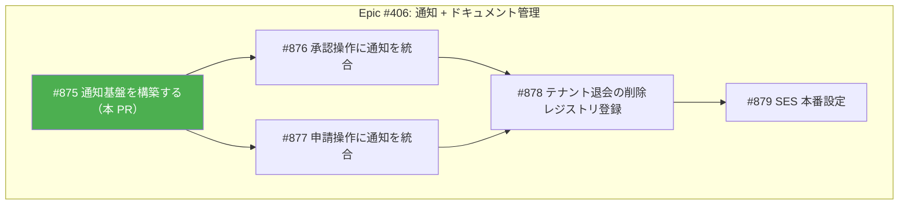
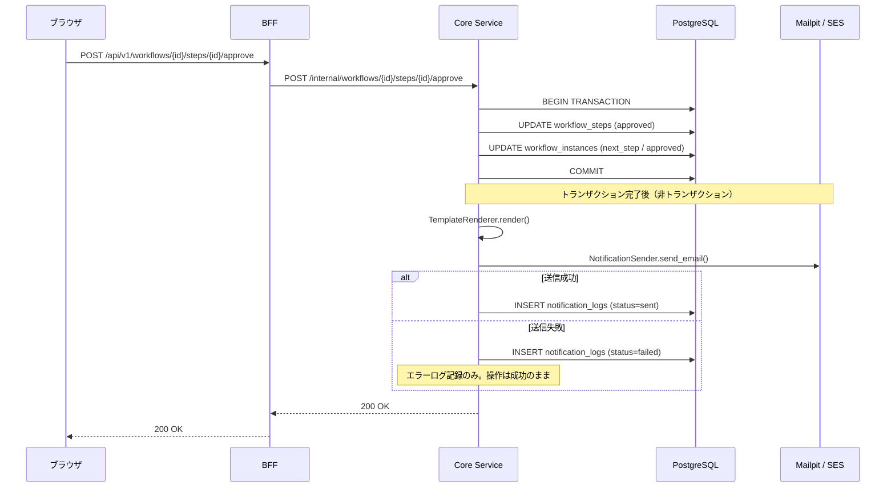
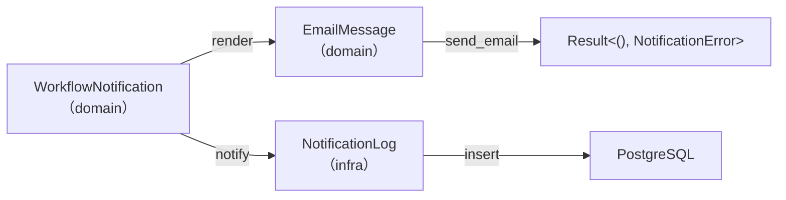
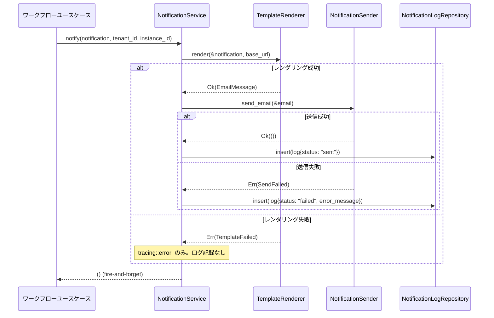

# 通知基盤 - 機能解説

対応 PR: #916
対応 Issue: #875

## 概要

ワークフロー操作（承認・却下・差し戻し等）に伴うメール通知の基盤を構築した。`NotificationSender` trait による送信抽象化、tera テンプレートエンジンによるメール生成、`NotificationService` による統合処理を実装し、後続 Story（#876-#879）がユースケース統合・SES 本番設定を積み上げる土台を完成させた。

## 背景

### Epic #406: 通知 + ドキュメント管理（Phase 2-5）

RingiFlow は承認フロー管理システムであり、ワークフローの進行状況を関係者にタイムリーに通知する機能が不可欠。Phase 2-5 ではメール通知基盤を構築し、承認依頼・承認完了・却下・差し戻しの 5 種類の通知を実装する。



| Issue | 内容 | 状態 |
|-------|------|------|
| #875 | 通知基盤を構築する（trait, テンプレート, Mailpit, DI 配線） | 本 PR |
| #876 | 承認操作（approve, reject, request-changes）に通知を統合 | 後続 |
| #877 | 申請操作（submit, resubmit）に通知を統合 | 後続 |
| #878 | テナント退会時の削除レジストリ登録 | 後続 |
| #879 | SES 本番設定・Terraform | 後続 |

### 設計書との対応

通知機能の詳細設計は `docs/40_詳細設計書/16_通知機能設計.md` に定められている。本 PR は設計書の以下のセクションを実装した。

| 設計書セクション | 本 PR での実装 |
|----------------|---------------|
| アーキテクチャ（コンポーネント構成） | NotificationSender trait + 3 実装 |
| ドメインロジック（WorkflowNotification） | domain クレートの通知型定義 |
| ドメインロジック（TemplateRenderer） | tera テンプレートエンジン + 10 テンプレート |
| ドメインロジック（NotificationService） | fire-and-forget 統合サービス |
| データモデル（notification_logs） | マイグレーション + リポジトリ |
| ローカル開発環境（Mailpit） | Docker Compose + 環境変数 |
| 環境切替 | NOTIFICATION_BACKEND 環境変数 |

## 用語・概念

| 用語 | 説明 | 関連コード |
|------|------|-----------|
| Fire-and-forget | 通知送信の失敗がワークフロー操作を失敗させない設計パターン | `NotificationService::notify()` |
| NotificationSender | メール送信を抽象化する trait。環境に応じて SMTP/SES/Noop を切り替え | `notification::NotificationSender` |
| WorkflowNotification | 5 種類の通知イベントを表現する enum | `domain::notification::WorkflowNotification` |
| TemplateRenderer | tera テンプレートエンジンで HTML/plaintext メールを生成 | `usecase::notification::TemplateRenderer` |
| Mailpit | 開発環境用のメール受信サーバー。SMTP でメールを受信し Web UI で確認 | `docker-compose.yaml` |

## フロー

本 PR は基盤構築のみで、ワークフローユースケースからの呼び出しは後続 Story（#876-#877）で統合する。以下は統合後の想定フローを示す。

### 承認操作 → 通知送信フロー



### 通知イベントと送信先

| 通知イベント | トリガー | 送信先 | 件名パターン |
|------------|---------|--------|------------|
| ApprovalRequest | ステップが active に | 承認者 | `[RingiFlow] 承認依頼: {title} {id}` |
| StepApproved | 中間ステップ承認 | 申請者 | `[RingiFlow] ステップ承認: {title} {id}` |
| Approved | 最終ステップ承認 | 申請者 | `[RingiFlow] 承認完了: {title} {id}` |
| Rejected | ステップ却下 | 申請者 | `[RingiFlow] 却下: {title} {id}` |
| ChangesRequested | ステップ差し戻し | 申請者 | `[RingiFlow] 要修正: {title} {id}` |

## アーキテクチャ

```mermaid
flowchart TB
    subgraph core["Core Service（apps/core-service）"]
        main["main.rs<br/>DI 配線"]
        WUC["WorkflowUseCaseImpl<br/>（#876-#879 で統合）"]
        NS["NotificationService"]
        TR["TemplateRenderer<br/>（tera）"]
    end

    subgraph infra["Infrastructure（crates/infra）"]
        NST["NotificationSender trait"]
        SMTP["SmtpNotificationSender<br/>（lettre）"]
        SES["SesNotificationSender<br/>（aws-sdk-sesv2）"]
        NOOP["NoopNotificationSender"]
        NLR["NotificationLogRepository"]
        PNLR["PostgresNotificationLogRepository"]
    end

    subgraph domain["Domain（crates/domain）"]
        WN["WorkflowNotification<br/>（5 バリアント）"]
        EM["EmailMessage"]
        NE["NotificationError"]
    end

    subgraph external["外部サービス"]
        Mailpit["Mailpit<br/>（開発環境）"]
        AWSSES["AWS SES<br/>（本番環境）"]
        PG["PostgreSQL<br/>notification_logs"]
    end

    main -->|構築| NS
    WUC -->|notify()| NS
    NS --> TR
    NS -->|send_email()| NST
    NS -->|insert()| NLR
    TR -->|生成| EM
    NST -.->|impl| SMTP
    NST -.->|impl| SES
    NST -.->|impl| NOOP
    NLR -.->|impl| PNLR
    SMTP --> Mailpit
    SES --> AWSSES
    PNLR --> PG
```

### レイヤー間の型の流れ



## データフロー

### フロー 1: 通知送信（NotificationService.notify）



#### 処理ステップ

| # | レイヤー | ファイル:関数 | 処理内容 |
|---|---------|-------------|---------|
| 1 | Core Service | `service.rs:notify` | 通知イベントからメタデータを抽出 |
| 2 | Core Service | `template_renderer.rs:render` | tera でコンテキスト構築 → HTML/txt 生成 |
| 3 | Infra | `smtp.rs:send_email` / `ses.rs:send_email` | lettre / aws-sdk-sesv2 でメール送信 |
| 4 | Infra | `notification_log_repository.rs:insert` | 送信結果を notification_logs に記録 |

## エラーハンドリング

| エラー | 発生箇所 | 結果 | 記録先 |
|-------|---------|------|--------|
| テンプレートレンダリング失敗 | TemplateRenderer | `tracing::error!` のみ | なし（ログ不可） |
| メール送信失敗（SMTP/SES） | NotificationSender | notification_logs に `status=failed` 記録 | notification_logs |
| ログ記録失敗 | NotificationLogRepository | `tracing::error!` のみ | なし（二次障害防止） |

全てのエラーはワークフロー操作に影響しない（fire-and-forget）。

## 設計判断

機能・仕組みレベルの判断を記載する。コード実装レベルの判断は[コード解説](./01_通知基盤_コード解説.md#設計解説)を参照。

### 1. NotificationSender trait の配置先をどうするか

`NotificationSender` は外部サービスとの通信を担当する trait であり、配置先として domain と infra の 2 つが候補となる。

| 案 | async-trait 依存 | 既存パターンとの一貫性 | ドメイン純粋性 |
|----|-----------------|--------------------|--------------|
| **infra クレート（採用）** | infra は async-trait に依存済み | 他の repository trait と同じ場所 | domain が async-trait に依存しない |
| domain クレート | domain に async-trait 追加が必要 | repository と異なる場所 | ドメインに外部依存が増える |

**採用理由**: 既存の repository trait が全て infra に定義されており、`async-trait` 依存も infra に閉じている。domain クレートの async-trait 非依存を維持するため。

### 2. 通知の送信方式をどうするか

通知をワークフロー操作と同期的に送信するか、非同期に送信するかの判断。

| 案 | 実装の複雑さ | スケーラビリティ | 信頼性 |
|----|-----------|---------------|--------|
| **直接 API 呼び出し（採用）** | 低い | Phase 2-5 の規模で十分 | trait 抽象化で将来移行可 |
| Outbox パターン | 高い | 大規模に対応 | メッセージ保証あり |
| SNS + Lambda | 中程度 | 高い | AWS 依存 |

**採用理由**: Phase 2-5 のテナント規模（10 社程度）では直接呼び出しで十分。`NotificationSender` trait の抽象化により、Phase 3 で Outbox パターンへの移行パスが確保されている。

### 3. テンプレート管理をどうするか

メールテンプレートの管理方法として、アプリ側レンダリングと SES テンプレートの 2 つが候補。

| 案 | バージョン管理 | ローカル開発 | 運用の独立性 |
|----|-------------|------------|------------|
| **アプリ側テンプレート（tera）（採用）** | Git で完結 | Mailpit でも動作 | SES 非依存 |
| SES テンプレート | AWS コンソールで管理 | ローカルで動作しない | SES ロックイン |

**採用理由**: コードでバージョン管理が完結し、ローカル開発（Mailpit）でもテンプレートが動作する。

### 4. 通知ログの格納先をどうするか

通知ログを PostgreSQL に格納するか DynamoDB に格納するかの判断。

| 案 | RLS 対応 | CASCADE 削除 | クエリの柔軟性 |
|----|---------|-------------|-------------|
| **PostgreSQL（採用）** | tenant_id ベースの RLS | tenants → notification_logs | SQL による柔軟なクエリ |
| DynamoDB | RLS 非対応 | 手動削除が必要 | PK ベースのみ |

**採用理由**: DynamoDB の `notifications` テーブルは Phase 3 のアプリ内通知（ユーザー別通知一覧）向け。Phase 2-5 の送信ログは tenant_id ベースの RLS と CASCADE 削除の恩恵を受ける PostgreSQL が適切。

### 5. ローカル開発のメール確認をどうするか

| 案 | メンテナンス状況 | Web UI | SMTP 互換 |
|----|----------------|--------|-----------|
| **Mailpit（採用）** | 活発に開発中 | あり | SMTP ポート 1025 |
| MailHog | 2020 年以降更新なし | あり | あり |
| コンソール出力 | 該当なし | なし | なし |

**採用理由**: MailHog のメンテナンスが停滞しており、Mailpit が後継として活発に開発されている。SMTP インターフェースで SES と互換。

## 関連ドキュメント

- [コード解説](./01_通知基盤_コード解説.md)
- [詳細設計: 通知機能設計](../../40_詳細設計書/16_通知機能設計.md)
- [機能仕様書: 通知機能](../../20_機能仕様書/05_通知機能.md)
- [セッションログ](../../../prompts/runs/2026-02/2026-02-25_2116_通知基盤の構築.md)
- [実装計画](../../../prompts/plans/875_notification-infrastructure.md)
