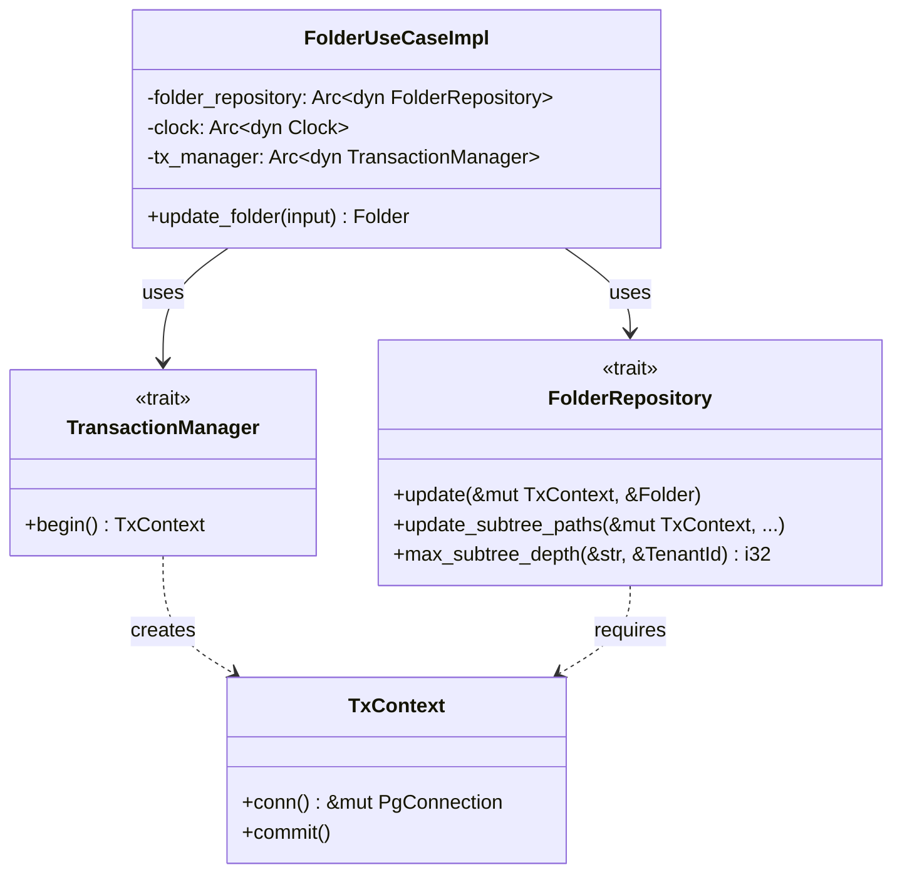
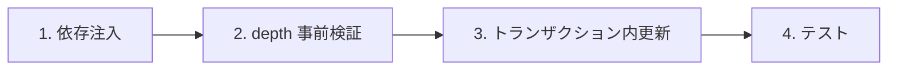
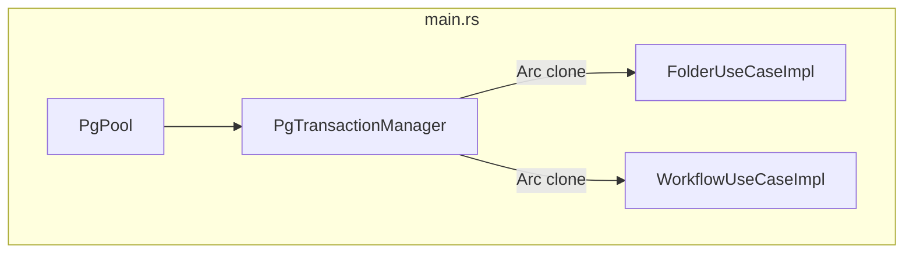
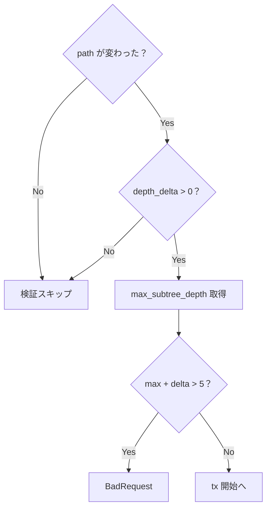
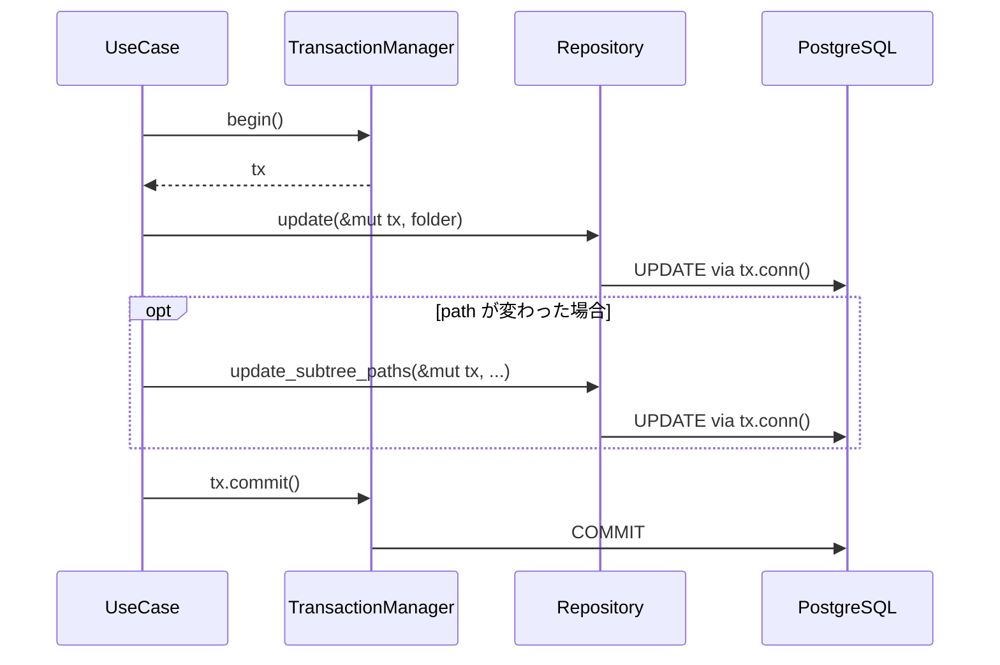
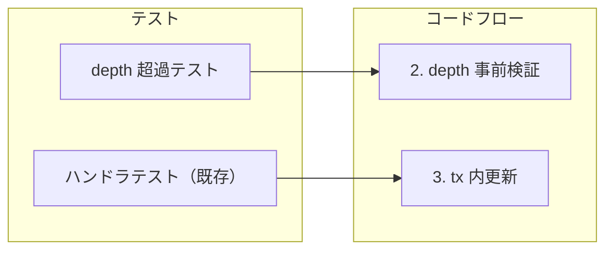

# フォルダ移動トランザクション - コード解説

対応 PR: #952
対応 Issue: #927

## 主要な型・関数

| 型/関数 | ファイル | 責務 |
|--------|---------|------|
| `FolderRepository` | [`backend/crates/infra/src/repository/folder_repository.rs:27`](../../../backend/crates/infra/src/repository/folder_repository.rs) | フォルダ永続化のトレイト定義 |
| `PostgresFolderRepository` | [`backend/crates/infra/src/repository/folder_repository.rs:105`](../../../backend/crates/infra/src/repository/folder_repository.rs) | PostgreSQL 実装 |
| `FolderUseCaseImpl` | [`backend/apps/core-service/src/usecase/folder.rs:37`](../../../backend/apps/core-service/src/usecase/folder.rs) | フォルダ操作のユースケース |
| `TxContext` | [`backend/crates/infra/src/db.rs`](../../../backend/crates/infra/src/db.rs) | トランザクションコンテキスト |
| `TransactionManager` | [`backend/crates/infra/src/db.rs`](../../../backend/crates/infra/src/db.rs) | トランザクション生成の抽象 |
| `FakeFolderRepository` | [`backend/crates/infra/src/fake.rs`](../../../backend/crates/infra/src/fake.rs) | テスト用インメモリ実装 |

### 型の関係



## コードフロー

コードをライフサイクル順に追う。`update_folder` の処理フローを中心に解説する。



### 1. 依存注入（アプリケーション起動時）

`FolderUseCaseImpl` に `TransactionManager` を注入する。`tx_manager` は `WorkflowUseCaseImpl` と共有する。



```rust
// backend/apps/core-service/src/main.rs:248-249
let tx_manager: Arc<dyn TransactionManager> =
    Arc::new(PgTransactionManager::new(pool.clone()));  // ① 共有インスタンスを生成

// backend/apps/core-service/src/main.rs:260
let folder_usecase = FolderUseCaseImpl::new(
    folder_repo, clock.clone(), tx_manager.clone()  // ② clone で共有
);
```

注目ポイント:

- ① `tx_manager` の生成を `WorkflowUseCaseImpl` より前に移動し、複数ユースケースで `Arc::clone` で共有する構造に変更
- ② `PgTransactionManager` は `PgPool` をラップするだけなので、共有してもリソース競合はない

### 2. サブツリー depth 事前検証（トランザクション外）

フォルダ移動時に、サブツリーの最大 depth が上限を超えないかを事前検証する。



```rust
// backend/apps/core-service/src/usecase/folder.rs:198-212
if old_path != folder.path() {                      // ① path 変更時のみ
    let depth_delta = folder.depth() - old_depth;
    if depth_delta > 0 {                            // ② 深い方向のみ
        let max_subtree_depth = self
            .folder_repository
            .max_subtree_depth(&old_path, &input.tenant_id)
            .await?;
        if max_subtree_depth + depth_delta > MAX_FOLDER_DEPTH {  // ③ 上限チェック
            return Err(CoreError::BadRequest(
                "移動先ではサブツリーの階層が上限（5 階層）を超えます".to_string(),
            ));
        }
    }
}
```

注目ポイント:

- ① 名前変更のみ（path 不変）の場合は検証不要
- ② `depth_delta <= 0`（浅い方向）では depth 超過が論理的に起きないためクエリを省略
- ③ `MAX_FOLDER_DEPTH`（= 5）はドメイン定数。DB の CHECK 制約 `depth <= 5` と対応

### 2.1 max_subtree_depth の SQL 実装

```rust
// backend/crates/infra/src/repository/folder_repository.rs:262-274
async fn max_subtree_depth(&self, path: &str, tenant_id: &TenantId) -> Result<i32, InfraError> {
    let max_depth = sqlx::query_scalar!(
        r#"
        SELECT COALESCE(MAX(depth), 0)::int4 as "max_depth!"  // ① COALESCE で NULL 安全
        FROM folders
        WHERE tenant_id = $1
          AND starts_with(path, $2)                            // ② Materialized Path のプレフィックスマッチ
        "#,
        tenant_id.as_uuid(),
        path
    )
    .fetch_one(&self.pool)  // ③ tx 外 — self.pool を使用
    .await?;

    Ok(max_depth)
}
```

注目ポイント:

- ① `COALESCE(MAX(depth), 0)` で結果が空でも 0 を返す。`::int4` で Rust の `i32` にマッピング
- ② `starts_with(path, $2)` で `/parent/` 配下の全フォルダを集計
- ③ 読み取り操作のため `self.pool` を使用。トランザクション外で実行する

### 3. トランザクション内更新

書き込み操作をトランザクションで囲む。



```rust
// backend/apps/core-service/src/usecase/folder.rs:215-244
let mut tx = self                                  // ① begin
    .tx_manager
    .begin()
    .await
    .map_err(|e| CoreError::Internal(format!("トランザクション開始に失敗: {}", e)))?;

self.folder_repository
    .update(&mut tx, &folder)                      // ② update は tx 必須
    .await
    .map_err(|e| {
        if let ringiflow_infra::InfraError::Database(ref db_err) = e
            && let Some(constraint) =
                db_err.as_database_error().and_then(|d| d.constraint())
            && constraint == "folders_tenant_id_parent_id_name_key"
        {
            return CoreError::Conflict("同名のフォルダが既に存在します".to_string());
        }
        CoreError::Database(e)
    })?;

if old_path != folder.path() {
    let depth_delta = folder.depth() - old_depth;
    self.folder_repository
        .update_subtree_paths(                     // ③ 同一 tx 内でサブツリー更新
            &mut tx,
            &old_path,
            folder.path(),
            depth_delta,
            &input.tenant_id,
        )
        .await?;
}

tx.commit()                                        // ④ commit
    .await
    .map_err(|e| CoreError::Internal(format!("トランザクションコミットに失敗: {}", e)))?;
```

注目ポイント:

- ① `begin()` で `TxContext` を取得。Drop 時に自動ロールバック
- ② `&mut tx` を渡すことで、`tx.conn()` 経由のコネクションで SQL が実行される
- ③ 同一の `TxContext` を渡すため、同一トランザクション内で実行される
- ④ 明示的に `commit()` を呼ぶ。呼ばなかった場合は Drop 時にロールバック

### 3.1 Repository の tx.conn() 利用

`update` と `update_subtree_paths` は `self.pool` の代わりに `tx.conn()` を使用する。

```rust
// backend/crates/infra/src/repository/folder_repository.rs:213
async fn update(&self, tx: &mut TxContext, folder: &Folder) -> Result<(), InfraError> {
    sqlx::query!(/* ... */)
        .execute(tx.conn())  // self.pool → tx.conn() に変更
        .await?;
    Ok(())
}
```

`tx.conn()` は `TxContext` が保持する `PgConnection` の可変参照を返す。sqlx の `execute` は `PgPool` でも `&mut PgConnection` でも受け付けるため、SQL 部分は変更不要。

### 4. テスト

テストがライフサイクルのどのステップを検証しているかを示す。



| テスト | 検証対象のステップ | 検証内容 |
|-------|------------------|---------|
| `test_update_folder_サブツリーdepth超過時にエラーを返す` | 2 | 3 階層サブツリーを depth 4 の下に移動 → `max_depth(3) + delta(4) = 7 > 5` で BadRequest |
| ハンドラテスト群（既存） | 3 | `StubFolderRepository` を新シグネチャに更新し、既存の正常系テストが通過 |

### 実行方法

```bash
# ユニットテスト
cargo test -p core-service -- usecase::folder

# ハンドラテスト
cargo test -p core-service -- handler::folder

# 全フォルダ関連テスト
cargo test -p core-service -- folder
```

## 設計解説

コード実装レベルの判断を記載する。機能・仕組みレベルの判断は[機能解説](./01_フォルダ移動トランザクション_機能解説.md#設計判断)を参照。

### 1. FakeFolderRepository のインメモリ実装

場所: `backend/crates/infra/src/fake.rs`

```rust
pub struct FakeFolderRepository {
    folders: Arc<Mutex<Vec<Folder>>>,
}

impl FolderRepository for MockFolderRepository {
    async fn max_subtree_depth(&self, path: &str, tenant_id: &TenantId) -> Result<i32, InfraError> {
        let folders = self.folders.lock().unwrap();
        let max = folders
            .iter()
            .filter(|f| f.tenant_id() == tenant_id && f.path().starts_with(path))  // テナント + パスプレフィックスマッチ
            .map(|f| f.depth())
            .max()
            .unwrap_or(0);
        Ok(max)
    }
}
```

なぜこの実装か:
`max_subtree_depth` はユニットテストで depth 検証ロジックを検証するために必要。`StubFolderRepository`（ハンドラテスト用）は固定値を返すだけだが、`MockFolderRepository` は実際のデータに基づいて計算する。これにより「3 階層サブツリーを depth 4 の下に移動 → depth 7 > 5 でエラー」のような具体的なシナリオをテストできる。

代替案:

| 案 | メリット | デメリット | 判断 |
|----|---------|-----------|------|
| **インメモリ実装（採用）** | 実際のデータに基づく計算 | 実装が必要 | 採用 |
| mockall クレート | シグネチャ変更に自動追従 | 戻り値をテストごとに設定する必要がある | 見送り（プロジェクトで mockall 未使用） |

### 2. StubFolderRepository の max_subtree_depth 固定値

場所: `backend/apps/core-service/src/handler/folder.rs:280`

```rust
async fn max_subtree_depth(&self, _path: &str, _tenant_id: &TenantId) -> Result<i32, InfraError> {
    Ok(1) // スタブ: 常に depth 1 を返す
}
```

なぜこの実装か:
ハンドラテストは HTTP レイヤーの入出力を検証する場であり、depth 検証のロジックはユニットテストで検証済み。`depth 1` を返すことで、どの移動操作でも `max_depth + delta <= 5` が成立し、depth 検証がハンドラテストに干渉しない。

## 関連ドキュメント

- [機能解説](./01_フォルダ移動トランザクション_機能解説.md)
- [フォルダ管理 API コード解説](../PR918_フォルダ管理API/01_フォルダ管理API_コード解説.md)
- [ADR-051: トランザクションコンテキストによる構造的強制](../../70_ADR/051_トランザクションコンテキストによる構造的強制.md)
