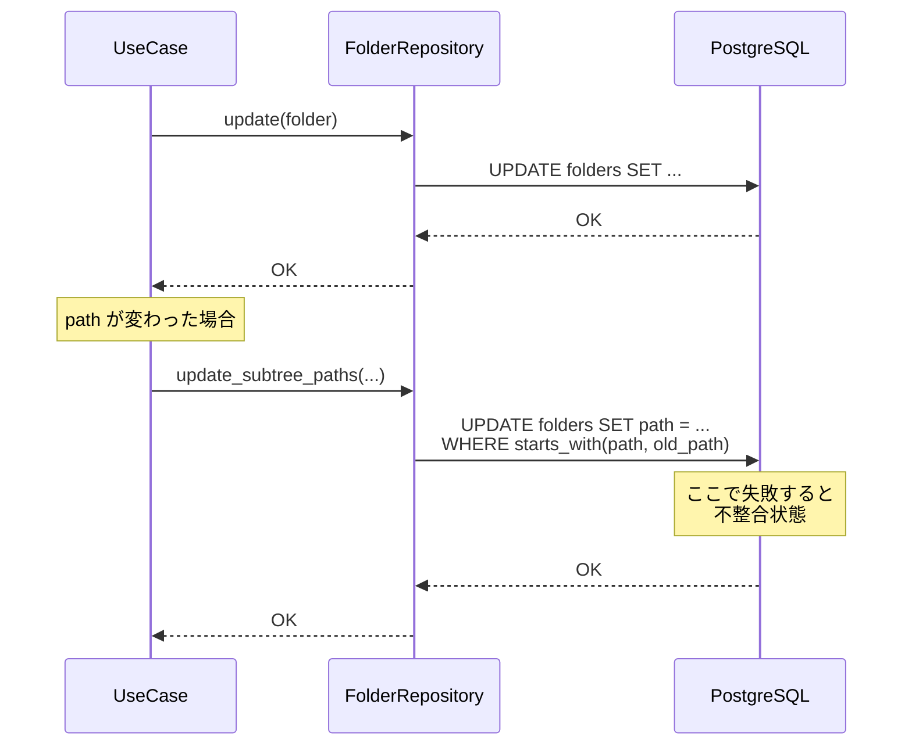
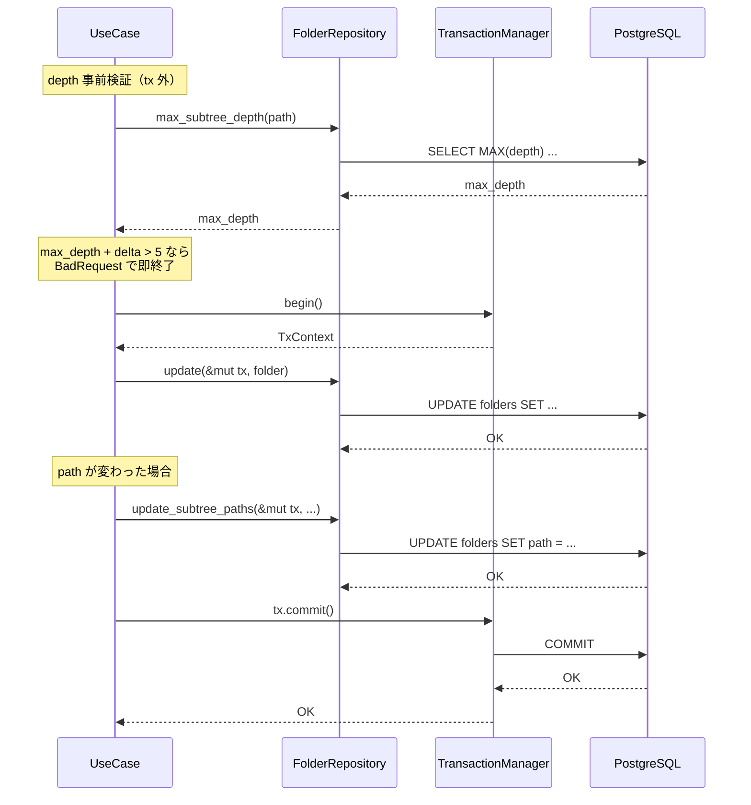
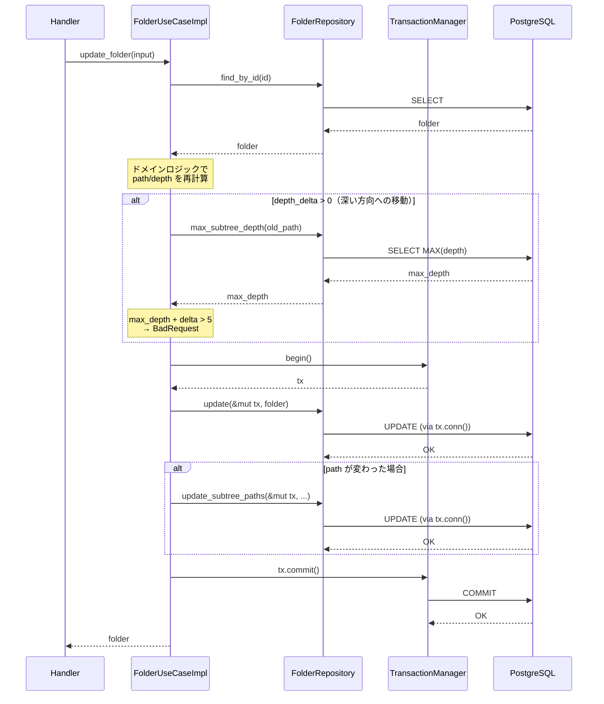

# フォルダ移動トランザクション - 機能解説

対応 PR: #952
対応 Issue: #927

## 概要

フォルダの移動/名前変更時に `update` と `update_subtree_paths` が別々の DB 操作として実行されていた問題を解消した。2つの操作をトランザクションで囲むことでアトミック性を保証し、加えてサブツリーの最大 depth 事前検証を導入して CHECK 制約違反をユーザーフレンドリーなエラーに変換した。

## 背景

### Materialized Path パターンとフォルダ移動

RingiFlow のフォルダ管理は Materialized Path パターンを採用しており、各フォルダが自身の `path`（例: `/親/子/孫/`）と `depth` を保持する。フォルダの移動や名前変更では、対象フォルダだけでなくサブツリー全体の `path` と `depth` を更新する必要がある。

→ フォルダ管理 API の詳細: [PR918 機能解説](../PR918_フォルダ管理API/01_フォルダ管理API_機能解説.md)

### 変更前の課題

PR #918（フォルダ管理 API）の Auto Review で指摘された問題:

- `update`（対象フォルダの更新）と `update_subtree_paths`（サブツリー一括更新）が個別の DB 操作
- `update` 成功後に `update_subtree_paths` が失敗すると、親フォルダの path は変わったがサブツリーの path が旧パスのまま残る不整合状態が発生する
- DB の CHECK 制約（`depth <= 5`）違反時のエラーがデータベースエラーとしてユーザーに返される

### ADR-051: TxContext による構造的強制

プロジェクトでは [ADR-051](../../70_ADR/051_トランザクションコンテキストによる構造的強制.md) に基づき、トランザクションが必要な操作には型レベルでの構造的強制を適用する。書き込みメソッドが `&mut TxContext` を引数に要求することで、非トランザクションでの書き込みがコンパイルエラーになる。

## 用語・概念

| 用語 | 説明 | 関連コード |
|------|------|-----------|
| Materialized Path | 各フォルダがルートからの完全パスを保持する階層表現方式 | `Folder::path()` |
| TxContext | トランザクションコンテキスト。構造的強制により書き込み操作にトランザクション参加を型レベルで要求する | `ringiflow_infra::db::TxContext` |
| TransactionManager | トランザクション生成の抽象。`begin()` で `TxContext` を返す | `ringiflow_infra::TransactionManager` |
| MAX_FOLDER_DEPTH | フォルダ階層の上限値（5）。DB の CHECK 制約と対応 | `ringiflow_domain::folder::MAX_FOLDER_DEPTH` |
| depth_delta | 移動前後の depth の差分。正なら深い方向、負または 0 なら浅い方向 | `folder.depth() - old_depth` |

## ビフォー・アフター

### Before（変更前）

`update_folder` では 2 つの書き込みが独立して実行されていた。

#### 制約・課題

- 2 つの UPDATE が非アトミック: 1 つ目が成功し 2 つ目が失敗すると不整合
- depth 超過時に DB の CHECK 制約エラーがそのまま返される（ユーザーフレンドリーでない）

### After（変更後）

書き込みをトランザクションで囲み、事前に depth 検証を実施する。

#### 改善点

- トランザクションにより 2 つの UPDATE がアトミック: 片方が失敗すれば両方ロールバック
- 事前検証により CHECK 制約違反をユーザーフレンドリーなエラーメッセージに変換
- TxContext の構造的強制により、トランザクション外での書き込みがコンパイルエラー

## データフロー

### フロー 1: フォルダ移動（depth 検証あり）

#### 処理ステップ

| # | レイヤー | 処理内容 |
|---|---------|---------|
| 1 | UseCase | `find_by_id` で既存フォルダを取得（tx 外） |
| 2 | Domain | 親フォルダ変更時に path/depth を再計算 |
| 3 | UseCase | `depth_delta > 0` の場合のみ `max_subtree_depth` を呼び出し（tx 外） |
| 4 | UseCase | `max_subtree_depth + depth_delta > 5` なら BadRequest を返却 |
| 5 | UseCase | `begin()` でトランザクション開始 |
| 6 | Repository | `update(&mut tx, folder)` でフォルダ本体を更新 |
| 7 | Repository | path 変更時のみ `update_subtree_paths(&mut tx, ...)` でサブツリーを一括更新 |
| 8 | UseCase | `commit()` でトランザクションをコミット |

## エラーハンドリング

| エラー | 発生箇所 | HTTP Status | ユーザーへの表示 |
|-------|---------|-------------|---------------|
| サブツリー depth 超過 | UseCase（事前検証） | 400 Bad Request | 「移動先ではサブツリーの階層が上限（5 階層）を超えます」 |
| 同名フォルダ重複 | Repository（UNIQUE 制約） | 409 Conflict | 「同名のフォルダが既に存在します」 |
| トランザクション開始失敗 | UseCase | 500 Internal | 内部エラー |
| トランザクションコミット失敗 | UseCase | 500 Internal | 内部エラー |

## 設計判断

機能・仕組みレベルの判断を記載する。コード実装レベルの判断は[コード解説](./01_フォルダ移動トランザクション_コード解説.md#設計解説)を参照。

### 1. TxContext の適用範囲をどこまでにするか

`FolderRepository` の全書き込みメソッド（`insert`, `update`, `update_subtree_paths`, `delete`）に TxContext を追加するか、必要なメソッドだけに限定するかの判断。

| 案 | アトミック性の保証 | 変更規模 | 呼び出し側の負荷 |
|----|------------------|---------|----------------|
| **`update` + `update_subtree_paths` のみ（採用）** | 必要な箇所のみ保証 | 小 | `update_folder` のみ tx 管理 |
| 全書き込みメソッド | 全メソッドで保証 | 大 | 全呼び出し元で tx 管理が必要 |

**採用理由**: `insert` と `delete` は単一の独立した DB 操作であり、アトミック性の要求がない。ADR-051 の「構造的強制は必要な箇所にのみ適用する」方針に準拠。

### 2. depth 検証のタイミングをいつにするか

サブツリーの depth 超過検証を、トランザクション内で実行するか外で実行するかの判断。

| 案 | ロック期間 | 実装パターン | TOCTOU リスク |
|----|----------|------------|--------------|
| **tx 外で検証（採用）** | 短い | Read outside tx パターン（既存踏襲） | DB CHECK 制約で二重防御 |
| tx 内で検証 | 長い（読み取りロック含む） | tx 内に読み取りも含める | なし |

**採用理由**: `WorkflowUseCaseImpl` で確立された「Read outside tx, Write inside tx」パターンを踏襲。TOCTOU リスクは DB の CHECK 制約（`depth <= 5`）で二重防御される。

### 3. depth 検証を常に実行するか条件付きにするか

移動の方向に関わらず `max_subtree_depth` クエリを常に実行するか、必要な場合のみに限定するかの判断。

| 案 | クエリ回数 | depth 超過の検出 | 実装の複雑さ |
|----|----------|----------------|------------|
| **depth_delta > 0 ガード（採用）** | 深い方向のみ | 完全 | 低（条件分岐 1 つ追加） |
| 常に実行 | 全移動で 1 回追加 | 完全 | 最低 |

**採用理由**: 浅い方向（`depth_delta <= 0`）への移動では depth 超過が論理的に起きないため、不要なクエリを省略してパフォーマンスを最適化。

## 関連ドキュメント

- [コード解説](./01_フォルダ移動トランザクション_コード解説.md)
- [フォルダ管理 API 機能解説](../PR918_フォルダ管理API/01_フォルダ管理API_機能解説.md)
- [ADR-051: トランザクションコンテキストによる構造的強制](../../70_ADR/051_トランザクションコンテキストによる構造的強制.md)
- [セッションログ](../../../prompts/runs/2026-02/2026-02-27_1818_フォルダ移動にトランザクション導入.md)
