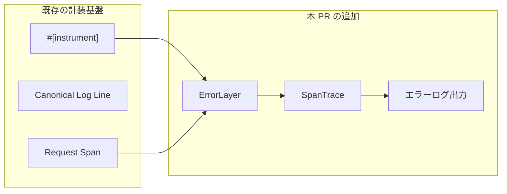
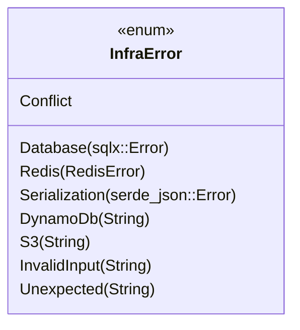
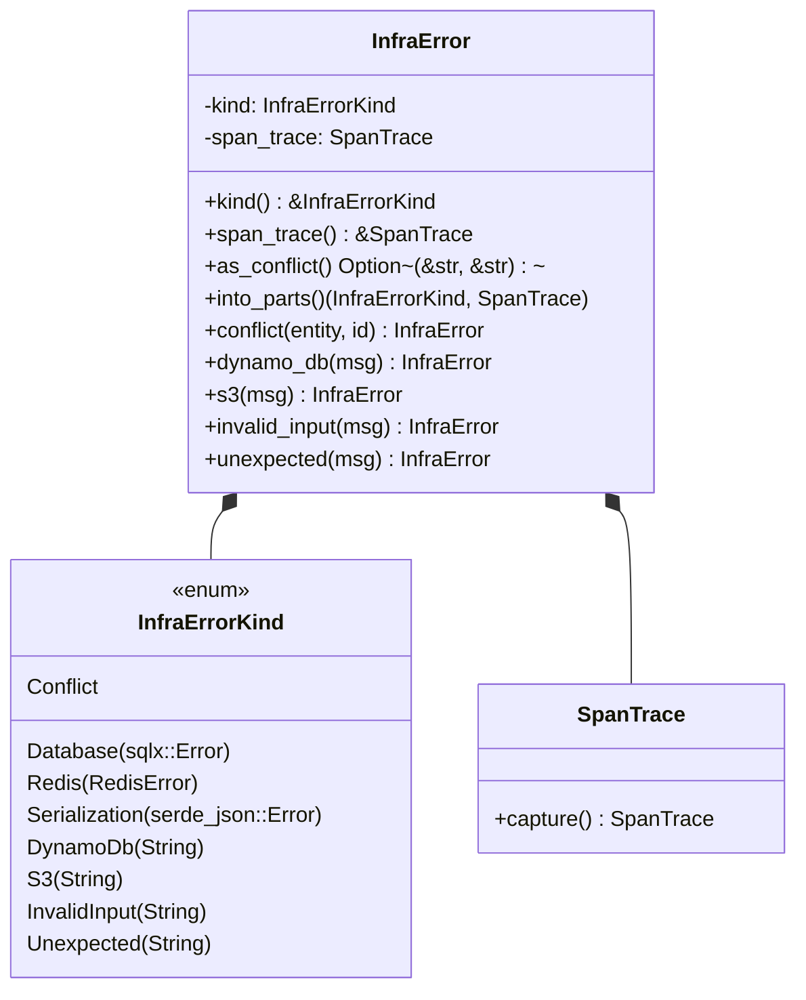
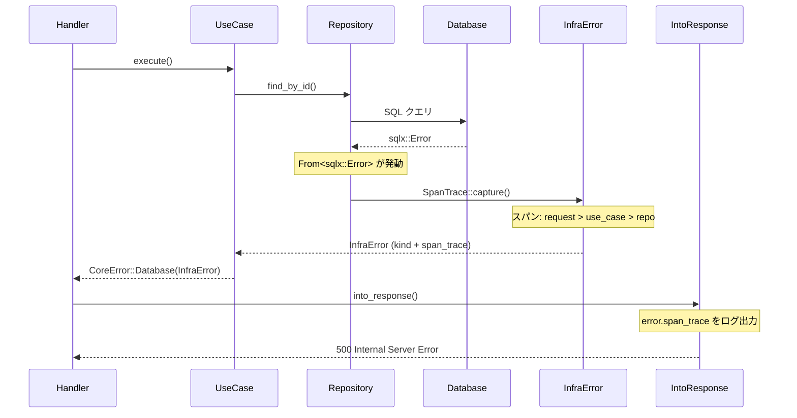

# SpanTrace 導入 - 機能解説

対応 PR: #974
対応 Issue: #972

## 概要

エラー型に `tracing-error::SpanTrace` を導入し、エラー発生時に「どのユースケース → どのリポジトリ呼び出しで発生したか」の論理的な呼び出しパスを自動記録する。非同期 Rust ではスタックトレースが分断されるため、tracing のスパン情報を活用した代替手段として SpanTrace を採用した。

## 背景

### 非同期 Rust におけるスタックトレースの問題

非同期 Rust（tokio ランタイム）では、`await` ポイントで実行が一時停止・再開されるため、従来のスタックトレースが分断される。エラー発生時のバックトレースには実際の呼び出し元が含まれず、tokio のタスクスケジューリング関連のフレームのみが表示される。

### 変更前の課題

- エラーログに「何のエラーか」は記録されるが、「どこから呼ばれたか」の経路情報がない
- 同じリポジトリメソッドが複数のユースケースから呼ばれる場合、どの経路で発生したか特定が困難
- 本番環境でのデバッグに必要な情報が不足している

### Observability 設計との位置づけ

本変更は [Observability 設計](../../40_詳細設計書/14_Observability設計.md) の SpanTrace セクションに対応する。既存の計装（`#[tracing::instrument]`）で設定されたスパン情報を、エラー時に自動キャプチャする仕組みを追加した。



## 用語・概念

| 用語 | 説明 | 関連コード |
|------|------|-----------|
| SpanTrace | エラー発生時点のアクティブなスパンの一覧を記録したもの。`std::backtrace::Backtrace` の論理的な代替 | `tracing_error::SpanTrace` |
| ErrorLayer | tracing の subscriber レイヤー。登録すると `SpanTrace::capture()` でスパン情報を取得可能になる | `tracing_error::ErrorLayer` |
| struct wrapper パターン | `std::io::Error` と同じ設計パターン。外側の struct がエラー種別（enum）とメタデータ（SpanTrace）を保持する | `InfraError` + `InfraErrorKind` |
| Convenience constructor | エラー生成と SpanTrace キャプチャを一体化した関連関数 | `InfraError::conflict()` 等 |

## ビフォー・アフター

### Before（変更前）

`InfraError` は単純な enum で、エラー種別のみを保持していた。



#### 制約・課題

- エラーに呼び出し経路情報がなく、ログから発生元のユースケースを特定できない
- パターンマッチは `match err { InfraError::Database(e) => ... }` で直接マッチ

### After（変更後）

`InfraError` を struct に変更し、エラー種別（`InfraErrorKind`）と `SpanTrace` を保持する。



#### 改善点

- エラー生成時に SpanTrace が自動キャプチャされ、呼び出し経路がエラーに埋め込まれる
- `IntoResponse` 実装でエラーログに `error.span_trace` フィールドを出力
- パターンマッチは `match err.kind() { InfraErrorKind::Database(e) => ... }` に統一

## アーキテクチャ

```mermaid
flowchart TB
    subgraph shared["shared crate"]
        InitTracing["init_tracing()"]
        ErrorLayerReg["ErrorLayer 登録"]
    end
    subgraph infra["infra crate"]
        InfraError["InfraError (struct)"]
        InfraErrorKind["InfraErrorKind (enum)"]
        SpanTraceField["SpanTrace フィールド"]
        FromImpl["From 実装"]
        ConvCtor["Convenience constructors"]
    end
    subgraph apps["apps (core-service / auth-service)"]
        IntoResponse["IntoResponse 実装"]
        ErrorLog["error.span_trace ログ出力"]
    end
    InitTracing --> ErrorLayerReg
    ErrorLayerReg -.->|SpanTrace::capture() を有効化| FromImpl
    ErrorLayerReg -.->|SpanTrace::capture() を有効化| ConvCtor
    InfraError --> InfraErrorKind
    InfraError --> SpanTraceField
    FromImpl --> SpanTraceField
    ConvCtor --> SpanTraceField
    InfraError --> IntoResponse
    SpanTraceField --> ErrorLog
```

## データフロー

### フロー 1: エラー発生からログ出力まで



## 設計判断

機能・仕組みレベルの判断を記載する。コード実装レベルの判断は[コード解説](./01_SpanTrace導入_コード解説.md#設計解説)を参照。

### 1. エラー発生経路の追跡をどう実現するか

非同期 Rust では `std::backtrace::Backtrace` が分断されるため、代替手段が必要。

| 案 | 経路情報の精度 | パフォーマンス | 既存コードへの影響 |
|----|-------------|-------------|----------------|
| **SpanTrace（採用）** | 計装済みスパンの論理パス | 低コスト（スパン情報の参照のみ） | エラー型の変更のみ |
| tokio-console | 全非同期タスクの追跡 | 高コスト（常時監視） | 開発ツールとして別途導入 |
| 手動コンテキスト付与 | 呼び出し元ごとに手動記録 | なし | 全呼び出し箇所の修正が必要 |

採用理由: 既存の `#[instrument]` 計装を活用でき、エラー型の変更のみで実現可能。パフォーマンスへの影響も最小限。

### 2. SpanTrace をどのエラー型に導入するか

全レイヤーのエラー型（`InfraError`, `CoreError`, `AuthError`）に個別に導入するか、`InfraError` のみに導入するか。

| 案 | 完全性 | 実装コスト | 保守性 |
|----|--------|----------|--------|
| **InfraError のみ（採用）** | 主要なエラー発生源をカバー | 低 | エラー型の変更が 1 箇所 |
| 全エラー型に導入 | 完全 | 高（3 エラー型すべてリファクタリング） | 高い保守コスト |

採用理由: エラーの大部分は infra 層（DB、Redis、外部サービス）で発生する。`CoreError::Internal` 等は `IntoResponse` 内で `SpanTrace::capture()` を直接呼ぶことで対応可能。

## 関連ドキュメント

- [コード解説](./01_SpanTrace導入_コード解説.md)
- [Observability 設計](../../40_詳細設計書/14_Observability設計.md)
- [Observability 構造的担保](../PR697_Observability構造的担保/)
- [アプリケーション計装](../PR692_アプリケーション計装/)
