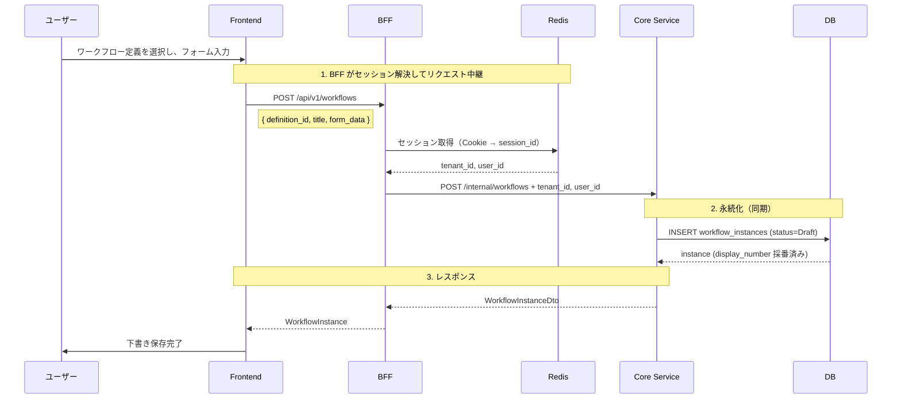
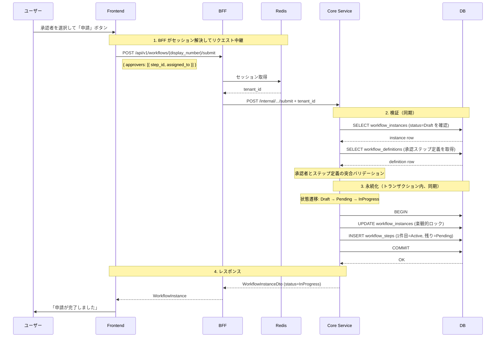
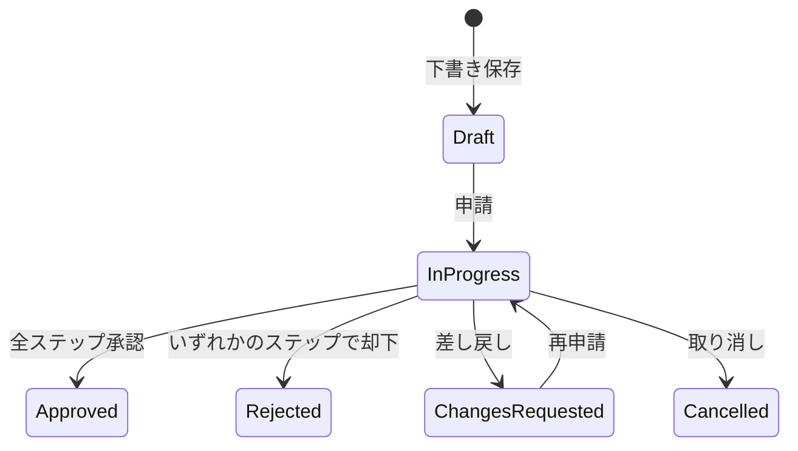

# ワークフロー申請フロー

対応 PR: #114, #479, #1031
対応 Issue: #27, #438

## 概要

ユーザーがワークフロー定義を選択し、フォームに入力して承認申請を行う。申請は「下書き保存」と「申請（承認依頼）」の2段階で処理される。

## E2E フロー

### 正常系: 下書き保存



### 正常系: 申請（承認依頼）

下書き保存済み（Draft 状態）のワークフローに対して、承認者を指定して申請する。下書き保存が前提条件であり、Draft 状態のインスタンスが存在しない場合は申請できない。下書き保存と申請は別のタイミングで実行できる（例: 途中まで入力して保存し、翌日に申請する）。



### 準正常系

| ケース | 検出箇所 | エラーレスポンス | ユーザーへの表示 |
|--------|---------|----------------|---------------|
| フォーム未入力 | Frontend（クライアント側バリデーション） | — | フォームエラー表示 |
| 承認者未選択 | Frontend（クライアント側バリデーション） | — | フォームエラー表示 |
| 承認者とステップ定義の不一致 | Core UseCase | 400 Bad Request | エラーメッセージ |
| ワークフローが Draft 以外 | Core UseCase | 400 Bad Request | エラーメッセージ |
| 楽観的ロック競合 | Repository | 409 Conflict | エラーメッセージ |

## コンポーネント間の境界

### API 契約

| エンドポイント | メソッド | 用途 |
|--------------|---------|------|
| `/api/v1/workflows` | POST | 下書き保存 |
| `/api/v1/workflows/{display_number}/submit` | POST | 申請（承認依頼） |

### 型変換の流れ

申請リクエストがレイヤーを通過する際の型変換:

```
Frontend SubmitWorkflowRequest { approvers: [{ step_id, assigned_to }] }
  ↓ JSON encode
BFF SubmitWorkflowRequest { approvers: [StepApproverRequest] }
  ↓ セッション情報を付加
Core Client SubmitWorkflowRequest { approvers: [...], tenant_id }
  ↓ HTTP POST (JSON)
Core Handler SubmitWorkflowRequest { approvers, tenant_id }
  ↓ UUID → Domain Newtype 変換
Core UseCase SubmitWorkflowInput { approvers: [StepApprover] }
```

BFF が担う役割: セッションから `tenant_id` を取得し、Core Service へのリクエストに付加する。フロントエンドはテナント情報を意識しない。

### エラー伝播

| エラー | 発生箇所 | 伝播経路 | HTTP Status |
|--------|---------|---------|-------------|
| 承認者不一致 | Core UseCase | Core → BFF → Frontend | 400 |
| Draft 以外の申請 | Core UseCase | Core → BFF → Frontend | 400 |
| 楽観的ロック競合 | Repository | InfraError → CoreError → BFF → Frontend | 409 |
| インスタンス不在 | Repository | InfraError → CoreError → BFF → Frontend | 404 |

## 状態遷移



申請時の内部遷移は Draft → Pending → InProgress の2段階だが、Pending は中間状態であり外部からは見えない。

## 設計判断

### 1. 下書き保存と申請を分離するか

申請操作を「下書き保存（create）」と「申請（submit）」の2つの API に分離している。

| 案 | 操作の柔軟性 | API の複雑さ | 途中保存 |
|----|------------|------------|---------|
| **2段階（採用）** | 高い | 2 エンドポイント | 可能 |
| 1段階（create + submit 一体） | 低い | 1 エンドポイント | 不可 |

採用理由: フォーム入力途中での保存を可能にし、長いフォームでの入力ロスを防ぐ。

### 2. 承認ステップの生成タイミング

承認ステップ（workflow_steps）レコードを申請時に生成する。

| 案 | データ整合性 | 実装の単純さ |
|----|------------|------------|
| **申請時に生成（採用）** | 定義変更の影響を受けない | 申請処理がやや複雑 |
| 下書き保存時に生成 | 定義変更で不整合の可能性 | 単純 |

採用理由: ワークフロー定義が申請前に更新された場合でも、申請時点の定義でステップを生成することで整合性を担保する。

## 関連ドキュメント

- [詳細設計書: ワークフロー申請フォームUI設計](../../40_詳細設計書/10_ワークフロー申請フォームUI設計.md)
- [詳細設計書: ワークフロー承認却下機能設計](../../40_詳細設計書/11_ワークフロー承認却下機能設計.md)
