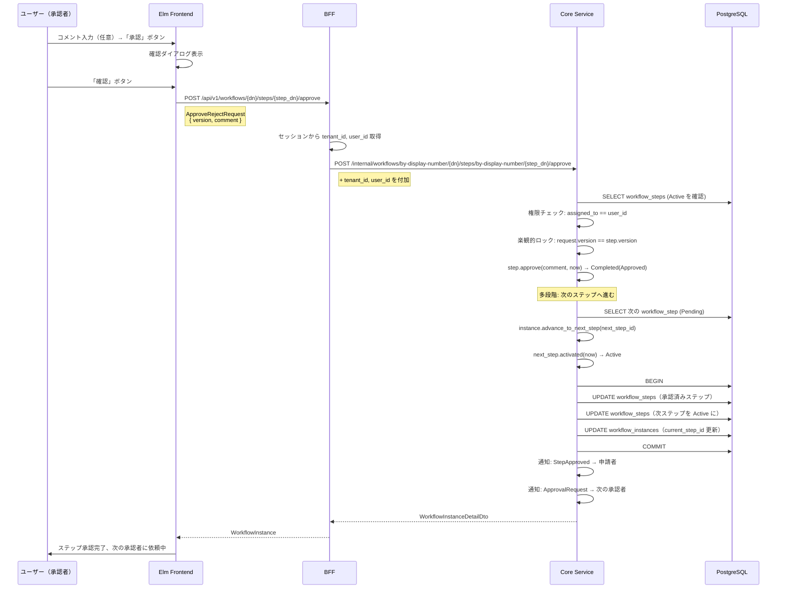
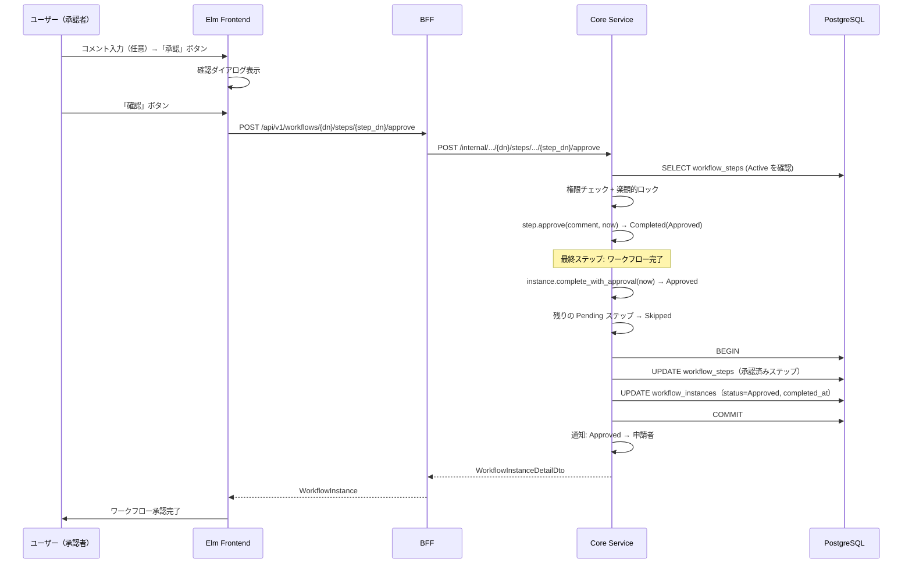
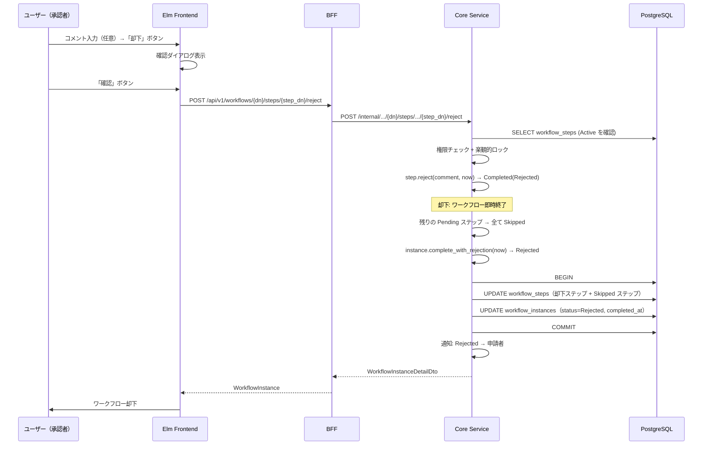
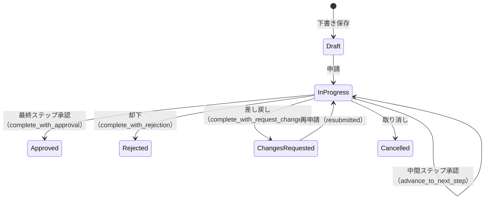
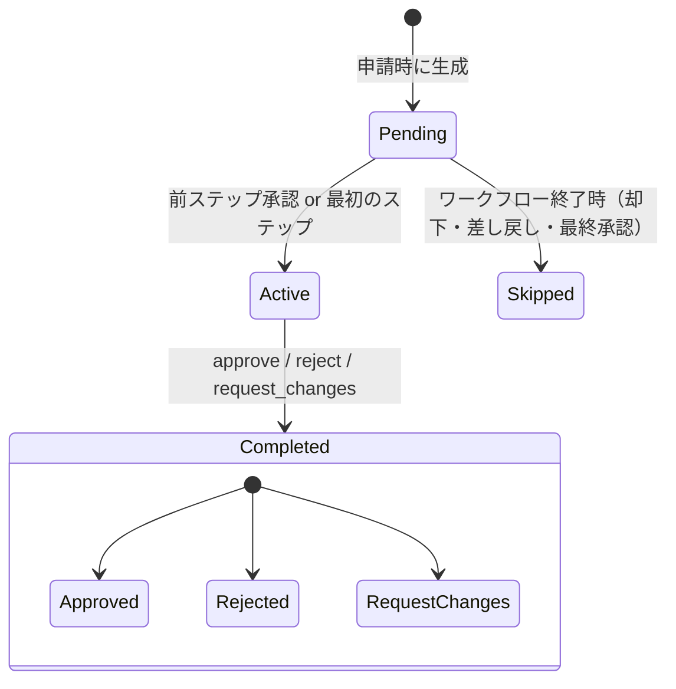

# ワークフロー承認・却下フロー

対応 PR: #141, #479
対応 Issue: #75, #438

## 概要

承認者がワークフロー詳細画面から、割り当てられたステップに対して「承認」「却下」「差し戻し」のいずれかの操作を行う。多段階承認では、各ステップの承認者が順番に判断し、全ステップ承認で完了、いずれかで却下・差し戻しになるとワークフローが終了する。

## E2E フロー

### 正常系: 承認（中間ステップ）



### 正常系: 承認（最終ステップ）



### 正常系: 却下



### 正常系: 差し戻し

却下と同じ構造だが、ステップ遷移とインスタンス遷移が異なる:

- `step.request_changes(comment, now)` → Completed(RequestChanges)
- `instance.complete_with_request_changes(now)` → ChangesRequested
- 通知: ChangesRequested → 申請者

差し戻し後、申請者は再申請（resubmit）が可能。再申請時は ChangesRequested → InProgress に遷移する。

### 準正常系

| ケース | 検出箇所 | HTTP Status | ユーザーへの表示 |
|--------|---------|-------------|---------------|
| 権限なし（別の承認者に割当済み） | Core UseCase | 403 Forbidden | エラーメッセージ |
| ステップが Active 以外 | Core Domain | 400 Bad Request | エラーメッセージ |
| 楽観的ロック競合（他者が先に操作） | Repository | 409 Conflict | エラーメッセージ |
| ステップが見つからない | Repository | 404 Not Found | エラーメッセージ |

## コンポーネント間の境界

### API 契約

3つの操作は同じリクエスト/レスポンス型を共有する。

| エンドポイント | メソッド | 用途 |
|--------------|---------|------|
| `/api/v1/workflows/{dn}/steps/{step_dn}/approve` | POST | 承認 |
| `/api/v1/workflows/{dn}/steps/{step_dn}/reject` | POST | 却下 |
| `/api/v1/workflows/{dn}/steps/{step_dn}/request-changes` | POST | 差し戻し |

### 型変換の流れ

```
Elm ApproveRejectRequest { version: Int, comment: Maybe String }
  ↓ JSON encode
BFF ApproveRejectRequest { version: i64, comment: Option<String> }
  ↓ セッション情報を付加
Core ApproveRejectRequest { version, comment, tenant_id, user_id }
  ↓ Newtype 変換
Core UseCase ApproveRejectInput { version: Version, comment: Option<String> }
```

BFF がセッションから `tenant_id` と `user_id` を取得し、Core Service へのリクエストに付加する。フロントエンドは認証情報を意識しない。

### エラー伝播

| エラー | 発生箇所 | 伝播経路 | HTTP Status |
|--------|---------|---------|-------------|
| 権限なし | Core UseCase (`check_step_assigned_to`) | Core → BFF → Elm | 403 |
| 不正な状態遷移 | Domain (`step.approve()`) | DomainError → CoreError → BFF → Elm | 400 |
| 楽観的ロック競合 | Repository (`save()`) | InfraError → CoreError → BFF → Elm | 409 |
| ステップ不在 | Repository | InfraError → CoreError → BFF → Elm | 404 |

## 状態遷移

### ワークフローインスタンス



### 承認ステップ



型安全ステートマシンにより、各状態で有効なフィールドのみを保持する:

- `Active`: `started_at` を持つ
- `Completed`: `decision`, `comment`, `started_at`, `completed_at` を持つ
- `Pending`, `Skipped`: 追加フィールドなし

## 設計判断

### 1. 承認・却下・差し戻しで API を分けるか

3つの操作を別エンドポイントとして提供している。

| 案 | 明確さ | API 数 | リクエスト型の統一性 |
|----|-------|--------|-------------------|
| **エンドポイント分離（採用）** | 操作の意図が URL で明確 | 3 エンドポイント | 同一型を共有 |
| 単一エンドポイント + action パラメータ | URL からは操作が不明 | 1 エンドポイント | action フィールドが必要 |

採用理由: RESTful な設計として操作の意図が URL に表れる方が明確。リクエスト/レスポンス型は同一（`ApproveRejectRequest`）なので、型の重複はない。

### 2. 却下・差し戻しの共通化

却下と差し戻しは「ワークフローを終了する」という共通の振る舞いを持つため、`terminate_step()` として共通化し、`StepTerminationType` enum で分岐する。

| 共通処理 | 差異 |
|---------|------|
| 権限チェック、楽観的ロック | ドメインメソッド（`reject` / `request_changes`） |
| 残ステップの Skipped 化 | インスタンス遷移先（`Rejected` / `ChangesRequested`） |
| トランザクション内保存 | 通知種別（`Rejected` / `ChangesRequested`） |

### 3. 通知の発火タイミング

通知はトランザクションコミット後に fire-and-forget で送信する。通知失敗がワークフロー操作をブロックしない設計。

## 関連ドキュメント

- [ワークフロー申請フロー](01_申請フロー.md)
- [詳細設計書: ワークフロー承認却下機能設計](../../40_詳細設計書/11_ワークフロー承認却下機能設計.md)
