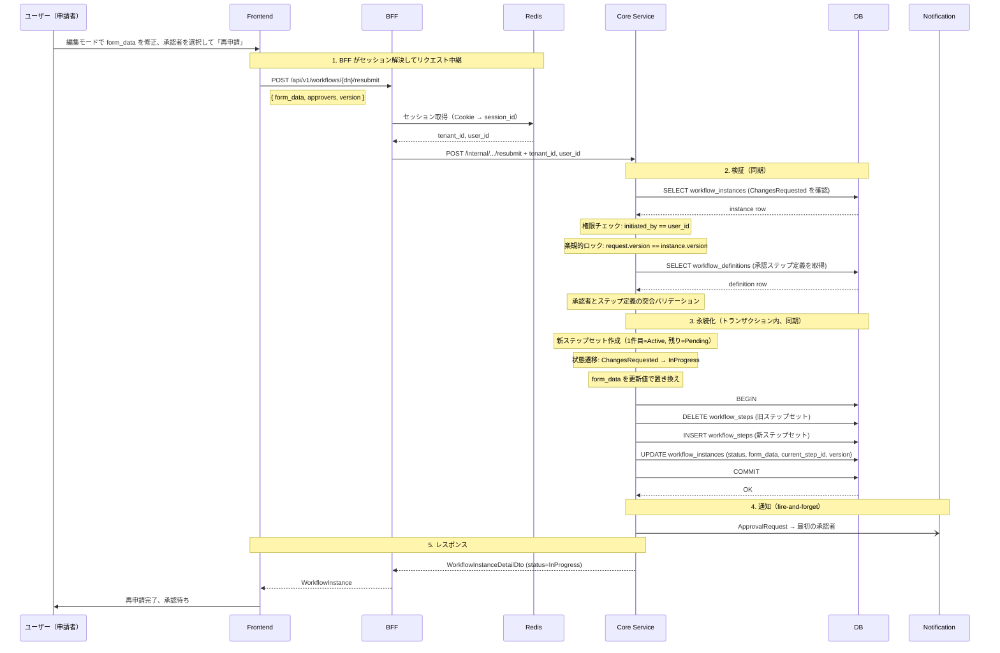
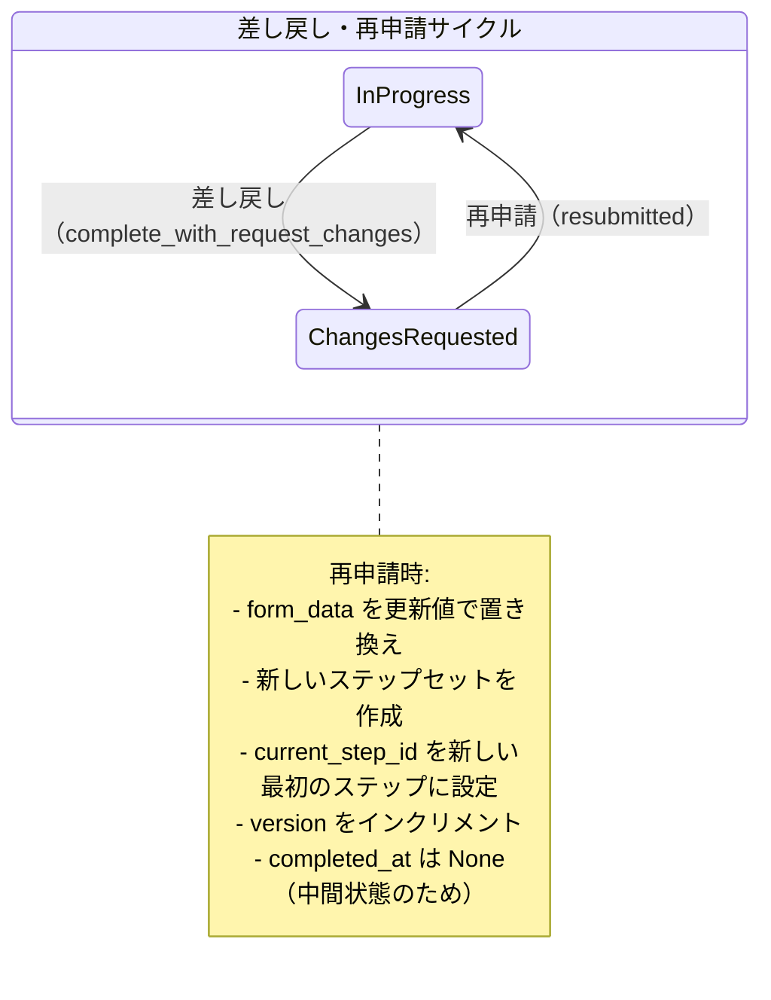

# ワークフロー差し戻し・再申請フロー

対応 PR: #488, #491, #716
対応 Issue: #476, #478, #712

## 概要

承認者がワークフローを差し戻し（Request Changes）し、申請者がフォームを修正して再申請（Resubmit）する。差し戻しは却下と異なり、申請者に修正の機会を与える操作である。再申請時は新しいステップセットが作成され、承認フローが最初からやり直しになる。

## E2E フロー

### 正常系: 差し戻し

差し戻しの API 呼び出しは承認・却下と同じ構造。02_承認・却下フロー.md の「正常系: 差し戻し」を参照。ここではインスタンスとステップの状態遷移の差異に焦点を当てる。

差し戻し時の状態遷移:

| 対象 | 遷移 | メソッド |
|------|------|---------|
| ステップ | Active → Completed(RequestChanges) | `step.request_changes(comment, now)` |
| 残りの Pending ステップ | Pending → Skipped | `step.skipped(now)` |
| インスタンス | InProgress → ChangesRequested | `instance.complete_with_request_changes(now)` |

通知: ChangesRequested → 申請者へ送信（fire-and-forget）。

### 正常系: 再申請

申請者が差し戻されたワークフローを修正し、再度承認依頼を行う。



### 準正常系

| ケース | 検出箇所 | HTTP Status | ユーザーへの表示 |
|--------|---------|-------------|---------------|
| 申請者以外が再申請 | Core UseCase | 403 Forbidden | エラーメッセージ |
| ChangesRequested 以外で再申請 | Core UseCase | 400 Bad Request | エラーメッセージ |
| 承認者とステップ定義の不一致 | Core UseCase | 400 Bad Request | エラーメッセージ |
| 楽観的ロック競合 | Repository | 409 Conflict | エラーメッセージ |
| ワークフロー不在 | Repository | 404 Not Found | エラーメッセージ |

## コンポーネント間の境界

### API 契約

| エンドポイント | メソッド | 用途 |
|--------------|---------|------|
| `/api/v1/workflows/{dn}/steps/{step_dn}/request-changes` | POST | 差し戻し |
| `/api/v1/workflows/{dn}/resubmit` | POST | 再申請 |

差し戻しは承認・却下と同じリクエスト型（`ApproveRejectRequest`）を共有する。再申請は申請の submit と類似した専用型を使用する。

### 型変換の流れ（再申請）

```
Frontend ResubmitRequest { form_data: JsonValue, approvers: [StepApprover], version: Int }
  ↓ JSON encode
BFF ResubmitWorkflowRequest { form_data, approvers: [StepApproverRequest], version }
  ↓ セッション情報を付加
Core ResubmitWorkflowRequest { form_data, approvers, tenant_id, user_id }
  ↓ Newtype 変換
Core UseCase ResubmitWorkflowInput { form_data, approvers: [StepApprover], version: Version }
```

### エラー伝播

| エラー | 発生箇所 | 伝播経路 | HTTP Status |
|--------|---------|---------|-------------|
| 権限なし（申請者以外） | Core UseCase | Core → BFF → Frontend | 403 |
| 不正な状態（ChangesRequested 以外） | Core UseCase | Core → BFF → Frontend | 400 |
| 承認者不一致 | Core UseCase | Core → BFF → Frontend | 400 |
| 楽観的ロック競合 | Repository | InfraError → CoreError → BFF → Frontend | 409 |

## 状態遷移



再申請時の特徴:

- 旧ステップセットは削除され、新しいステップセットが生成される
- 承認フローは最初からやり直し（前回の承認結果は引き継がない）
- form_data は再申請時の入力で上書きされる
- 前回の承認者がプリセレクトされるが、変更可能

## 設計判断

### 1. 再申請時にステップセットを再生成するか

| 案 | データ整合性 | 監査容易性 | 実装の複雑さ |
|----|------------|-----------|------------|
| **再生成（採用）** | 常に最新の定義と一致 | 旧ステップの履歴は失われる | 単純（DELETE + INSERT） |
| 旧ステップをリセット | 定義変更時に不整合の可能性 | 変更履歴を保持 | 状態リセットのロジックが必要 |

採用理由: 差し戻し後にワークフロー定義が更新された場合でも、再申請時は最新の定義でステップを生成し整合性を保つ。旧ステップの判定結果は、ステップの decision/comment フィールドと通知履歴で確認可能。

### 2. 再申請の権限を申請者に限定するか

| 案 | セキュリティ | 柔軟性 |
|----|-----------|--------|
| **申請者のみ（採用）** | 強い | 代理再申請は不可 |
| 関係者全員 | 弱い | 代理が可能 |

採用理由: フォームデータの修正を伴うため、申請の意思と責任を持つ本人のみに限定する。

## 関連ドキュメント

- [ワークフロー承認・却下フロー](02_承認・却下フロー.md)（差し戻しの API 構造）
- [ワークフロー申請フロー](01_申請フロー.md)（再申請の申請構造との類似性）
- [詳細設計書: ワークフロー承認却下機能設計](../../40_詳細設計書/11_ワークフロー承認却下機能設計.md)
