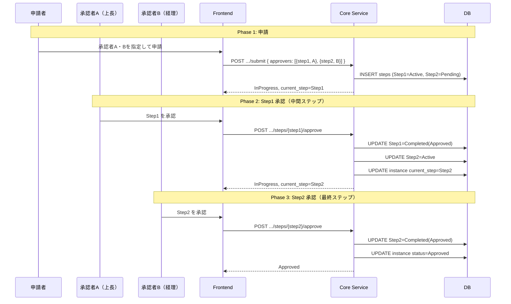
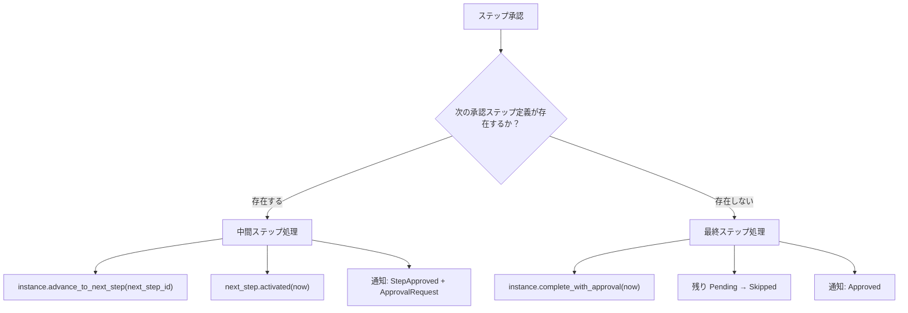
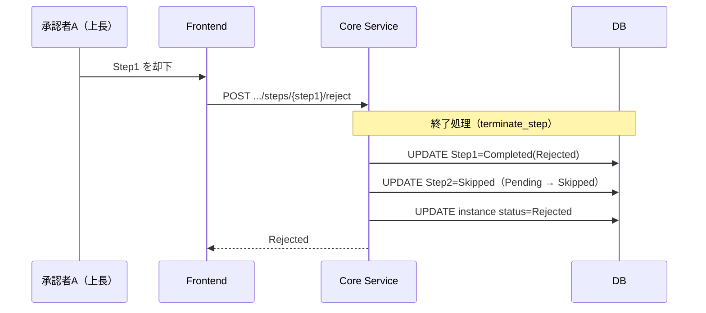
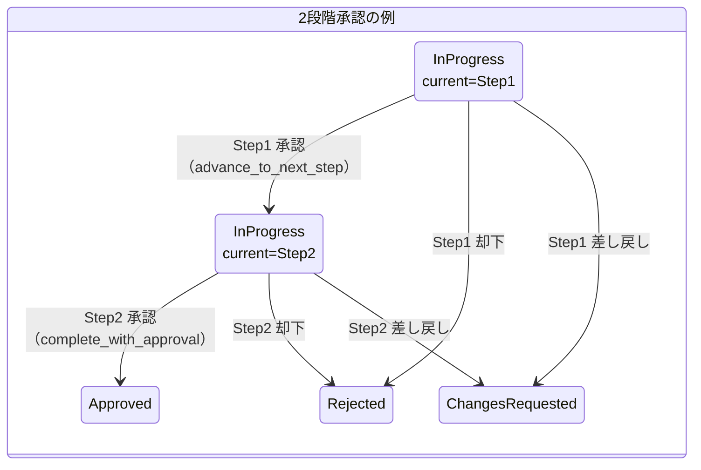

# ワークフロー多段階承認フロー

対応 PR: #479, #491, #717
対応 Issue: #438, #475, #478, #713

## 概要

ワークフロー定義に複数の承認ステップが含まれる場合、各ステップの承認者が順番に判断する。中間ステップの承認では次のステップが Active になり、最終ステップの承認でワークフローが完了する。いずれかのステップで却下・差し戻しが行われると、残りのステップは Skipped になる。

## E2E フロー

### 正常系: 2段階承認の全体フロー



### ステップ進行の判定ロジック

中間ステップか最終ステップかの判定は、ワークフロー定義の承認ステップ順序で決まる。



この判定は `approve.rs` のユースケースで、ワークフロー定義から `extract_approval_steps()` で承認ステップの順序リストを取得し、現在のステップの次が存在するかどうかで分岐する。

### 準正常系: 中間ステップでの却下



中間ステップで却下されると、後続の Pending ステップはすべて Skipped に遷移し、ワークフロー全体が Rejected になる。差し戻しも同様の構造で、Rejected の代わりに ChangesRequested になる。

## コンポーネント間の境界

### ステップ順序の決定

ステップの実行順序はワークフロー定義の `steps` 配列で決まる。

```
ワークフロー定義 JSON:
  steps: [
    { id: "start", type: "start" },
    { id: "manager_approval", type: "approval", name: "上長承認" },  ← Step 1
    { id: "finance_approval", type: "approval", name: "経理承認" },  ← Step 2
    { id: "end_approved", type: "end" },
    { id: "end_rejected", type: "end" }
  ]
```

`extract_approval_steps()` が `type == "approval"` のステップを配列順に抽出する。この順序が承認の実行順になる。

### Frontend: ステップ進捗表示

`StepProgress.elm` が水平プログレスバーでステップの状態を表示する（2ステップ以上の場合のみ表示）。

| ステップ状態 | 色 | 表示 |
|------------|-----|------|
| Completed(Approved) | 緑（`bg-success-100`） | 承認済み |
| Completed(Rejected) | 赤（`bg-error-100`） | 却下 |
| Completed(RequestChanges) | 黄（`bg-warning-100`） | 差し戻し |
| Active | 青（`bg-info-100`、リング付き） | 処理中 |
| Pending | 灰（`bg-secondary-100`） | 待機中 |
| Skipped | 灰（`bg-secondary-100`） | スキップ |

各ステップにはステップ番号、ステップ名、承認者名が表示される。ステップ間はコネクタ線で結ばれ、前ステップが完了済みなら緑、それ以外は灰色。

### トランザクション保証

中間ステップ承認時の3つの更新は単一トランザクション内で実行される:

1. 承認済みステップの保存（Active → Completed）
2. 次ステップの活性化（Pending → Active）
3. インスタンスの `current_step_id` 更新

いずれかが失敗すると全体がロールバックされ、不整合な状態を防ぐ。

## 状態遷移

### 多段階承認におけるインスタンスとステップの連動



インスタンスは中間ステップ承認時にステータスが変わらない（InProgress のまま）。変わるのは `current_step_id` のみ。これにより、外部から見た「進行中」の意味は一貫する。

## 設計判断

### 1. ステップ順序を定義の配列順で決定するか

| 案 | 柔軟性 | 実装の単純さ | 明確さ |
|----|--------|------------|--------|
| **配列順（採用）** | 順序は定義で固定 | 単純（extract でフィルタするだけ） | 定義を見れば順序が分かる |
| 明示的な order フィールド | 任意の順序指定が可能 | order の管理が必要 | 定義 + order の両方を確認 |

採用理由: 承認ステップの順序は定義の構造に内在しており、別途 order フィールドを持つ必要がない。JSON 配列の順序保証は仕様で定められている。

### 2. 中間ステップと最終ステップで API を分けるか

| 案 | 明確さ | API 数 | フロントエンドの実装 |
|----|--------|--------|-----------------|
| **統一 API（採用）** | 操作は同じ「承認」 | 1 エンドポイント | 結果の状態で UI を切り替え |
| 分離 API | 呼び出し側が判定必要 | 2 エンドポイント | 呼び分けが必要 |

採用理由: フロントエンドは「このステップを承認する」という操作だけを知ればよい。中間か最終かの判定はバックエンドの責務であり、レスポンスの状態（InProgress のままか Approved になったか）で結果が分かる。

## 関連ドキュメント

- [ワークフロー承認・却下フロー](02_承認・却下フロー.md)（承認・却下の詳細な E2E フロー）
- [ワークフロー差し戻し・再申請フロー](03_差し戻し・再申請フロー.md)（差し戻し後の再申請）
- [詳細設計書: ワークフロー承認却下機能設計](../../40_詳細設計書/11_ワークフロー承認却下機能設計.md)
