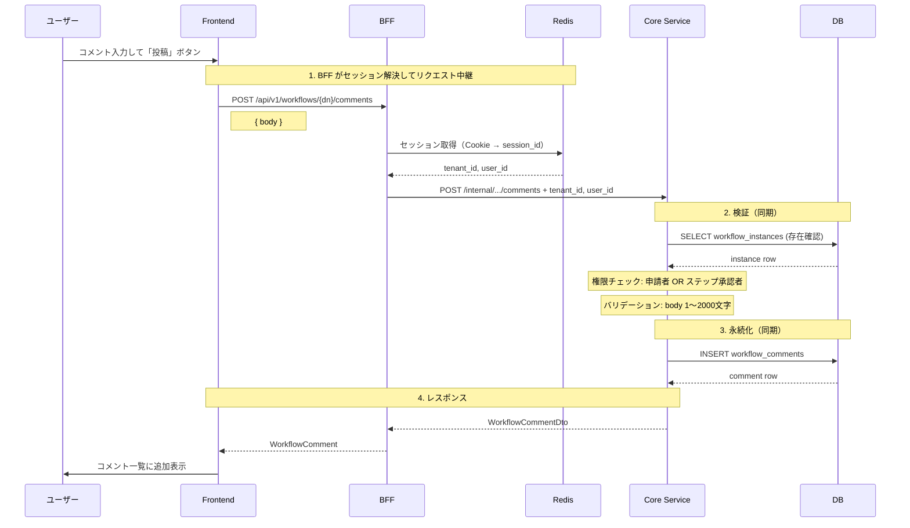
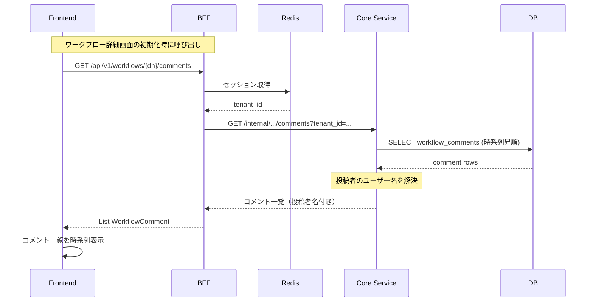

# ワークフローコメント機能

対応 PR: #487, #491
対応 Issue: #477, #478

## 概要

ワークフローに対してコメントスレッドを提供する。申請者と承認者が承認プロセス中に自由にやり取りできる。ステップの判定コメント（承認・却下時に入力するコメント）とは独立した機能であり、ワークフロー単位のコミュニケーションチャネルとして機能する。

## E2E フロー

### 正常系: コメント投稿



### 正常系: コメント一覧取得



### 準正常系

| ケース | 検出箇所 | HTTP Status | ユーザーへの表示 |
|--------|---------|-------------|---------------|
| コメント本文が空 | Domain バリデーション | 400 Bad Request | バリデーションエラー |
| コメント本文が2001文字以上 | Domain バリデーション | 400 Bad Request | バリデーションエラー |
| 権限なし（関係者以外） | Core UseCase | 403 Forbidden | エラーメッセージ |
| ワークフロー不在 | Repository | 404 Not Found | エラーメッセージ |

## コンポーネント間の境界

### API 契約

| エンドポイント | メソッド | 用途 |
|--------------|---------|------|
| `/api/v1/workflows/{dn}/comments` | POST | コメント投稿 |
| `/api/v1/workflows/{dn}/comments` | GET | コメント一覧取得 |

### 型変換の流れ（コメント投稿）

```
Frontend PostCommentRequest { body: String }
  ↓ JSON encode
BFF PostCommentRequest { body }
  ↓ セッション情報を付加
Core PostCommentRequest { body, tenant_id, user_id }
  ↓ Domain 型変換
Core UseCase PostCommentInput { body: CommentBody }
```

### エラー伝播

| エラー | 発生箇所 | 伝播経路 | HTTP Status |
|--------|---------|---------|-------------|
| 本文バリデーション | Domain バリデーション | DomainError → CoreError → BFF → Frontend | 400 |
| 権限なし | Core UseCase | Core → BFF → Frontend | 403 |
| ワークフロー不在 | Repository | InfraError → CoreError → BFF → Frontend | 404 |

## コメントとステップ判定コメントの違い

| 項目 | ワークフローコメント | ステップ判定コメント |
|------|-------------------|-------------------|
| テーブル | `workflow_comments` | `workflow_steps.comment` |
| 投稿タイミング | いつでも | 承認・却下・差し戻し時のみ |
| 投稿者 | 申請者 OR 承認者 | ステップの承認者のみ |
| 目的 | 自由なコミュニケーション | 判定理由の記録 |
| 数 | 複数（スレッド形式） | ステップごとに1件 |

## 設計判断

### 1. コメント投稿権限の範囲

| 案 | セキュリティ | 柔軟性 |
|----|-----------|--------|
| **申請者 + ステップ承認者（採用）** | ワークフロー関係者に限定 | 十分 |
| テナント内全ユーザー | 弱い | 高い |
| 申請者のみ | 強い | コミュニケーション不可 |

採用理由: コメントは承認プロセスの文脈で行われるため、ワークフローに関わる関係者に限定する。テナント内の無関係なユーザーがコメントできる必要はない。

### 2. コメント本文の長さ制限

| 制約 | 値 | 強制箇所 |
|------|-----|---------|
| 最小文字数 | 1 | Domain（Newtype）+ DB（`CHECK` 制約） |
| 最大文字数 | 2000 | Domain（Newtype）+ DB（`CHECK` 制約） |

Newtype パターンにより、不正な長さのコメントが型レベルで作成不可能。DB の `CHECK` 制約で二重保護。

## 関連ドキュメント

- [ワークフロー承認・却下フロー](02_承認・却下フロー.md)（ステップ判定コメントの文脈）
