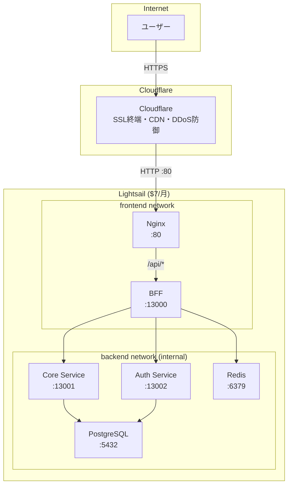

# RingiFlow Lightsail デプロイ手順書

AWS Lightsail 単一インスタンスに RingiFlow をデプロイする手順。
Cloudflare を前段に配置し、SSL 終端・CDN・DDoS 防御を提供する。

## 前提条件

- AWS アカウント
- Cloudflare アカウント
- 独自ドメイン（Cloudflare で DNS 管理）
- ローカル環境に Docker がインストール済み

## アーキテクチャ



## 手順

### 1. Lightsail インスタンスの作成

1. [AWS Lightsail コンソール](https://lightsail.aws.amazon.com/)にアクセス
2. 「インスタンスの作成」をクリック
3. 以下の設定でインスタンスを作成:

| 項目 | 設定値 |
|------|--------|
| リージョン | 東京 (ap-northeast-1) |
| プラットフォーム | Linux/Unix |
| ブループリント | OS のみ → AlmaLinux 9.4 |
| インスタンスプラン | $7 USD/月（1GB RAM, 40GB SSD、デュアルスタック） |
| インスタンス名 | ringiflow-demo |

4. SSH キーを設定:
   - 自分の公開鍵を使う場合: インスタンス作成時に「既存のキーを使用」で公開鍵をアップロード
   - Lightsail デフォルトキーを使う場合: ダウンロードして `~/.ssh/ringiflow-demo.pem` に保存（`chmod 600`）

5. 「ネットワーキング」タブで静的 IP を作成してアタッチ

### 2. ファイアウォールの設定

Lightsail コンソールの「ネットワーキング」タブで以下のルールを設定:

| アプリケーション | プロトコル | ポート |
|------------------|------------|--------|
| SSH | TCP | 22 |
| HTTP | TCP | 80 |

HTTPS (443) は不要（Cloudflare で終端するため）。

### 3. Lightsail インスタンスの初期セットアップ

#### 方法 A: 起動スクリプトとして指定（推奨）

インスタンス作成時に「起動スクリプトの追加」欄に以下を貼り付ける:

```bash
#!/bin/bash
curl -fsSL https://raw.githubusercontent.com/ka2kama/ringiflow/main/infra/lightsail/setup.sh | bash
```

起動スクリプトは root で実行されるが、setup.sh が自動的に ec2-user 用にセットアップする。
インスタンス起動後、SSH でログインすれば Docker が使える状態になっている。

```bash
ssh ec2-user@<LIGHTSAIL_IP>
docker --version
```

#### 方法 B: SSH ログイン後に手動実行

```bash
# SSH 接続
ssh ec2-user@<LIGHTSAIL_IP>

# セットアップスクリプトを実行
curl -fsSL https://raw.githubusercontent.com/ka2kama/ringiflow/main/infra/lightsail/setup.sh | bash

# 一度ログアウトして再ログイン（docker グループを有効化）
exit
ssh ec2-user@<LIGHTSAIL_IP>

# Docker が使えることを確認
docker --version
```

### 4. 環境変数の設定

Lightsail 上で .env ファイルを作成:

```bash
cd ~/ringiflow
cp .env.example .env
vim .env
```

以下の値を設定:

```bash
# PostgreSQL（強力なパスワードを生成）
POSTGRES_USER=ringiflow
POSTGRES_PASSWORD=$(openssl rand -base64 24)
POSTGRES_DB=ringiflow

# Redis（強力なパスワードを生成）
REDIS_PASSWORD=$(openssl rand -base64 24)

# ログレベル
RUST_LOG=info
```

パスワードは安全な場所に控えておくこと。

### 5. Cloudflare の設定

#### 5.1 DNS レコードの追加

1. [Cloudflare ダッシュボード](https://dash.cloudflare.com/)にアクセス
2. 対象ドメインを選択
3. DNS → レコードを追加:

| タイプ | 名前 | コンテンツ | プロキシ状態 |
|--------|------|------------|--------------|
| A | @ または app | Lightsail の静的 IP | プロキシ済み（オレンジ雲） |

#### 5.2 SSL/TLS の設定

1. SSL/TLS → 概要
2. 暗号化モード: **Flexible** を選択

Flexible モードの理由:
- オリジン（Lightsail）側に SSL 設定がないため
- Full にすると Cloudflare がポート 443 に接続しようとし、522 エラーになる

→ 詳細: [IPv6-only 環境での Docker 運用 > SSL モードの選択](../../docs/80_ナレッジベース/infra/IPv6-only環境でのDocker運用.md#ssl-モードの選択)

#### 5.3 キャッシュルールの設定

1. キャッシュ → キャッシュルール
2. 以下のルールを作成:

API キャッシュバイパス:

| 項目 | 設定 |
|------|------|
| ルール名 | API Cache Bypass |
| 条件 | URI パスが `/api/` で始まる |
| アクション | キャッシュをバイパス |

#### 5.4 セキュリティ設定（推奨）

1. セキュリティ → 設定
   - セキュリティレベル: 中
   - チャレンジ有効期間: 1日

2. セキュリティ → ボット
   - ボットファイトモード: オン

### 6. ローカルからデプロイ

#### 6.1 デプロイ設定

ローカルの `infra/lightsail/.env` を作成:

```bash
cd infra/lightsail
cp .env.example .env
vim .env
```

デプロイ用の設定のみ記入:

```bash
LIGHTSAIL_HOST=<LIGHTSAIL_IP または ドメイン>
LIGHTSAIL_USER=ec2-user
LIGHTSAIL_SSH_KEY=~/.ssh/ringiflow-demo.pem
```

#### 6.2 デプロイ実行

```bash
./deploy.sh
```

処理内容:
1. Docker イメージをローカルでビルド
2. イメージを tar.gz にエクスポート
3. SCP で Lightsail に転送
4. Lightsail 上で docker load + compose up

#### 6.3 動作確認

```bash
# ヘルスチェック（HTTP）
curl http://<LIGHTSAIL_IP>/health

# Cloudflare 経由（HTTPS）
curl https://your-domain.com/health
curl https://your-domain.com/api/health
```

### 7. マイグレーションの実行

初回デプロイ時およびスキーマ変更があった場合は、マイグレーションを手動実行する。

#### 7.1 マイグレーションファイルの転送

ローカルから:

```bash
scp -r backend/migrations/ ec2-user@<LIGHTSAIL_IP>:~/ringiflow/migrations/
```

#### 7.2 マイグレーション実行

Lightsail 上でマイグレーションを実行する。

##### 方法 A: sqlx-cli で実行（推奨）

sqlx-cli を使用してマイグレーションを実行する。適用履歴が `_sqlx_migrations` テーブルで管理される:

```bash
ssh ec2-user@<LIGHTSAIL_IP>
cd ~/ringiflow

docker run --rm \
    --network ringiflow-backend \
    -v "$(pwd)/migrations:/app/migrations:z" \
    -e DATABASE_URL="postgres://<POSTGRES_USER>:<POSTGRES_PASSWORD>@postgres:5432/<POSTGRES_DB>" \
    rust:1.84-slim-bookworm \
    bash -c "cargo install sqlx-cli --no-default-features --features postgres && sqlx migrate run --source /app/migrations"
```

注意: 初回は sqlx-cli のインストールに時間がかかる。頻繁に実行する場合は sqlx-cli を含む専用イメージの作成を推奨。

##### 方法 B: psql で直接実行（フォールバック）

sqlx-cli が使えない場合のフォールバック。PostgreSQL コンテナ内の psql を使って直接実行する:

```bash
ssh ec2-user@<LIGHTSAIL_IP>
cd ~/ringiflow

# 全マイグレーションをファイル名順に実行
ls migrations/*.sql | sort | while read f; do
  echo "Running $f..."
  docker exec -i ringiflow-postgres psql -U ringiflow -d ringiflow < "$f"
done
```

注意: この方法では sqlx の `_sqlx_migrations` テーブルによる適用履歴管理が行われない。既に適用済みのマイグレーションを再実行しないよう注意すること。

## 運用

### ログ確認

```bash
ssh ec2-user@<LIGHTSAIL_IP>
cd ~/ringiflow

# 全サービスのログ
docker compose logs -f

# 特定サービスのログ
docker compose logs -f bff
docker compose logs -f core-service
docker compose logs -f auth-service
docker compose logs -f nginx
```

### データリセット（初期シードに戻す）

全データストアを初期シード状態にリセットする。デモ環境のデータが汚れた場合に使用する。

```bash
# ローカルから実行
ssh ec2-user@<LIGHTSAIL_IP> 'cd ~/ringiflow && ./reset.sh'

# Lightsail 上で直接実行
cd ~/ringiflow
./reset.sh
```

リセット前にバックアップを取ることを推奨:

```bash
./backup.sh && ./reset.sh
```

事前にマイグレーションファイルが最新であることを確認すること:

```bash
# ローカルから転送
scp -r backend/migrations/ ec2-user@<LIGHTSAIL_IP>:~/ringiflow/migrations/
```

### バックアップ

手動実行:

```bash
ssh ec2-user@<LIGHTSAIL_IP>
cd ~/ringiflow
./backup.sh
```

自動バックアップ（cron 設定）:

```bash
crontab -e
# 以下を追加（毎日 AM 3:00）
0 3 * * * /home/ec2-user/ringiflow/backup.sh >> /home/ec2-user/ringiflow/logs/backup.log 2>&1
```

### リストア

```bash
cd ~/ringiflow
./backup.sh --restore
```

### 再デプロイ

コード変更後、ローカルから:

```bash
./deploy.sh
```

ビルド済みイメージを使う場合:

```bash
./deploy.sh --skip-build
```

## トラブルシューティング

### コンテナが起動しない

```bash
# コンテナのステータス確認
docker compose ps

# 特定コンテナのログ確認
docker compose logs bff
docker compose logs core-service
docker compose logs auth-service

# 環境変数の確認
docker compose config
```

### ヘルスチェックが失敗する

```bash
# Nginx 設定の構文チェック
docker exec ringiflow-nginx nginx -t

# BFF へ直接アクセス（Nginx コンテナ内の wget を利用）
docker exec ringiflow-nginx wget -qO- http://bff:13000/health

# Core Service の疎通確認（BFF コンテナ内から）
docker exec ringiflow-bff bash -c 'echo > /dev/tcp/core-service/13001 && echo OK'

# Auth Service の疎通確認（BFF コンテナ内から）
docker exec ringiflow-bff bash -c 'echo > /dev/tcp/auth-service/13002 && echo OK'
```

### Cloudflare 経由でアクセスできない

1. DNS 設定を確認（プロキシ状態がオレンジ雲になっているか）
2. SSL/TLS モードが Flexible になっているか確認
3. Lightsail のファイアウォールで Port 80 が開いているか確認

### SELinux 関連のエラー

AlmaLinux では SELinux がデフォルト有効。バインドマウントでパーミッションエラーが出る場合:

```bash
# SELinux の状態確認
getenforce

# 拒否ログを確認
sudo ausearch -m avc -ts recent

# Docker のバインドマウントに :z または :Z フラグが付いているか確認
docker compose config | grep -A2 volumes
```

docker-compose.yaml と deploy.sh のバインドマウントには `:Z`（プライベート）または `:z`（共有）フラグが設定済み。
手動でボリュームマウントする場合は、同様にフラグを付けること。

### ディスク容量が不足

```bash
# 使用状況確認
df -h

# Docker の不要データを削除
docker system prune -a

# 古いバックアップを削除
find ~/ringiflow/backup -mtime +7 -delete
```

## コスト

| サービス | 月額 |
|----------|------|
| Lightsail 1GB（デュアルスタック） | $7 |
| Cloudflare Free | $0 |
| 合計 | $7 |

## 関連ドキュメント

- [ADR-030: Lightsail 個人環境の構築](../../docs/70_ADR/030_Lightsail個人環境の構築.md)
- [IPv6-only 環境での Docker 運用](../../docs/80_ナレッジベース/infra/IPv6-only環境でのDocker運用.md)
- [docker-compose.yaml](./docker-compose.yaml)
