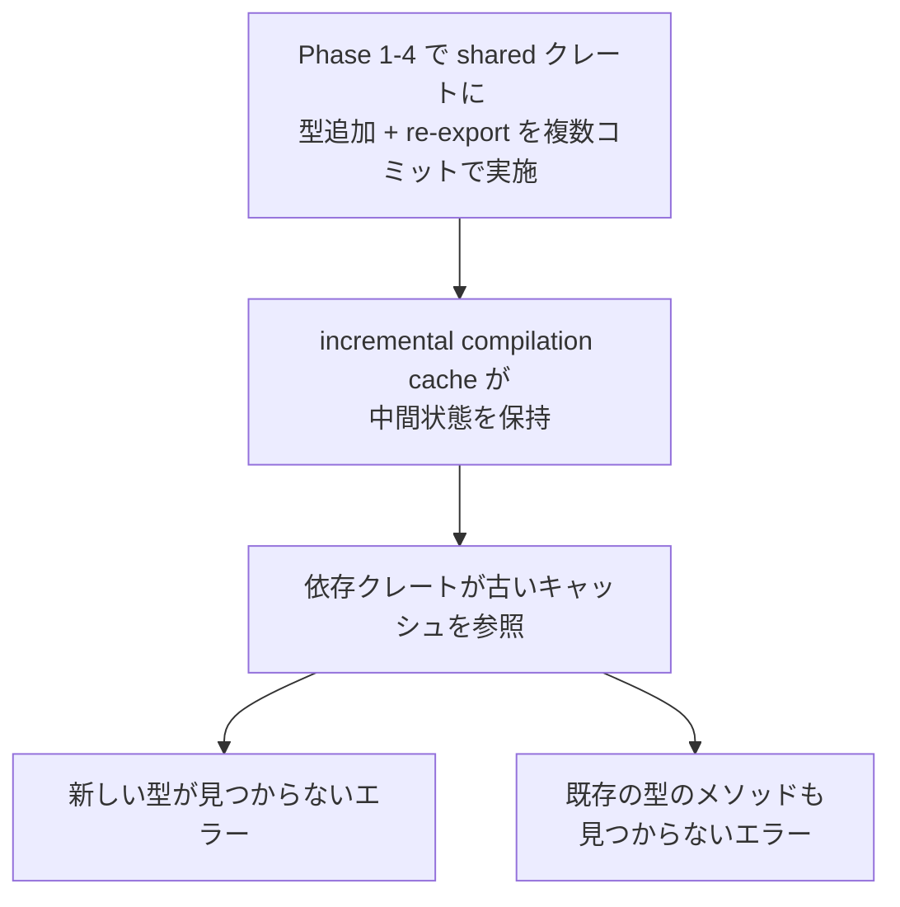

# Cargo incremental compilation cache の stale 問題

関連: #736、PR #737

## 症状

- `cargo sqlx prepare --check` が `CheckStatus`、`ReadinessStatus`、`ReadinessResponse` を `ringiflow_shared` のルートに見つけられないエラーで失敗
- `cargo check --workspace --all-targets` でも同一のエラーが発生（`cargo sqlx prepare` 固有の問題ではない）
- 既存の `WorkflowDefinition` 関連のメソッド not found エラーも同時に発生

エラーメッセージ:
```
error[E0432]: unresolved import `ringiflow_shared::CheckStatus`
 --> apps/core-service/src/handler/health.rs
  |
  | use ringiflow_shared::{CheckStatus, ReadinessResponse, ReadinessStatus};
  |                        ^^^^^^^^^^^ no `CheckStatus` in the root
```

- 発生タイミング: Phase 1-4 の実装コミット後、Phase 5 の品質ゲート実行時
- 影響範囲: workspace 全体のコンパイル

## 環境

| 項目 | 値 |
|------|-----|
| ブランチ | `feature/736-readiness-check` |
| 実行環境 | ローカル |
| 関連コミット | `a07f4b9`〜`bda3925`（Phase 1-4 の実装コミット） |

## 仮説と検証

| # | 仮説 | 予測（正しければ何が観察されるか） | 検証手段 | 結果 | 判定 |
|---|------|--------------------------------|---------|------|------|
| 1 | `cargo sqlx prepare` 固有の問題 | `cargo check` では成功する | `cargo check --workspace --all-targets` | 同一エラー発生 | 棄却 |
| 2 | 型定義・re-export の不備 | `lib.rs` に re-export がない or `health.rs` に型定義がない | Read ツールで `lib.rs` と `health.rs` を確認 | 正しく定義・re-export されている | 棄却 |
| 3 | incremental compilation cache の stale | 個別クレートのコンパイルは成功するが workspace では失敗する | `cargo check -p ringiflow-shared` + `cargo clean` + `cargo check --workspace` | 個別クレート OK、clean 後 workspace も OK | 支持 |

### 仮説 1: `cargo sqlx prepare` 固有の問題

予測: `cargo check --workspace --all-targets` では成功する
検証手段: 直接 `cargo check` を実行

検証データ:
```
$ cargo check --workspace --all-targets
error[E0432]: unresolved import `ringiflow_shared::CheckStatus`
```

判定: 棄却
理由: `cargo check` でも同一エラー。`cargo sqlx prepare` 固有ではない

### 仮説 2: 型定義・re-export の不備

予測: `lib.rs` に re-export がない、または `health.rs` に型定義がない
検証手段: Read ツールでファイル内容を確認

検証データ:
- `lib.rs`: `pub use health::{CheckStatus, HealthResponse, ReadinessResponse, ReadinessStatus};` — 正しく re-export
- `health.rs`: `CheckStatus`, `ReadinessStatus`, `ReadinessResponse` が正しく定義。feature gate なし

判定: 棄却
理由: 定義も re-export も正しい

### 仮説 3: incremental compilation cache の stale

予測: `cargo clean` 後にコンパイルが成功する
検証手段: `cargo check -p ringiflow-shared` → `cargo clean` → `cargo check --workspace --all-targets`

検証データ:
```
$ cargo check -p ringiflow-shared
# 成功（個別クレートは問題なし）

$ cargo clean
# Removed 36.2 GiB

$ cargo check --workspace --all-targets
# 成功
```

判定: 支持
理由: 個別クレートでは問題なく、`cargo clean` で workspace のコンパイルも成功。incremental compilation cache が stale だった

## 根本原因

Rust の incremental compilation cache が、workspace クレートに新しい型を追加して re-export する複数のコミットを跨いで stale になった。個別クレート（`ringiflow-shared`）のコンパイルは成功するが、依存側クレート（`core-service` 等）が古いキャッシュを参照して新しい型を認識できなかった。

### 因果関係



## 修正と検証

修正内容: `cargo clean` で incremental compilation cache を削除（36.2 GiB）
検証結果: `cargo check --workspace --all-targets` 成功、`just check-all` 全チェック通過（exit code 0）

## 診断パターン

- 症状「workspace クレートに追加した新しい型・関数が他クレートから見つからない」が見られたら、まず `cargo check -p <対象クレート>` で個別コンパイルを確認する
- 個別クレートは成功するが workspace で失敗する場合、`cargo clean` で cache を削除する
- 特に、workspace の共有クレートに対して複数のコミットで型の追加・変更を行った場合に発生しやすい

## 関連ドキュメント

- セッションログ: [ReadinessCheckエンドポイント実装](../../prompts/runs/2026-02/2026-02-20_2115_ReadinessCheckエンドポイント実装.md)
