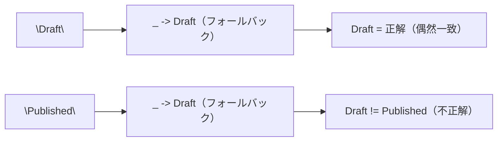

# E2E テスト: 公開後にステータスが「下書き」のまま表示される

関連: #724, PR #734

## 症状

- E2E テスト「テナント管理者が定義を公開・アーカイブできる」がタイムアウト（5000ms）で失敗
- 公開操作の成功メッセージは表示されるが、一覧のステータス列が「公開済み」ではなく「下書き」のまま
- `publishedRow.getByText("公開済み")` が 5000ms 以内に見つからない

## 環境

| 項目 | 値 |
|------|-----|
| ブランチ | `feature/724-workflow-definition-management` |
| 実行環境 | ローカル |
| 関連コミット | `c2958f8` |

## 仮説と検証

| # | 仮説 | 予測 | 検証手段 | 結果 | 判定 |
|---|------|------|---------|------|------|
| 1 | 一覧取得と公開で異なる Core Service クライアントを使用 | クライアント実装が異なり、公開後の一覧取得が古いデータを返す | BFF ソースコード（`WorkflowState` vs `WorkflowDefinitionState`）を読み比較 | 両方とも同じ `CoreServiceClientImpl` の `Arc::clone` を使用 | 棄却 |
| 2 | ドメインモデルの `published()` がステータスを変更しない | `publish` 呼び出し後も `status` が `Draft` のまま | ドメインモデルのソースを確認 | `published()` は正しく `Published` を設定 | 棄却 |
| 3 | DB の UPDATE 文が失敗 | Core Service の API レスポンスがエラーまたは古いデータを返す | Hurl API テストで `status == "Published"` のアサーションを確認 | API テストは通過しており、DB は正しく更新されている | 棄却 |
| 4 | ブラウザが GET レスポンスをキャッシュ | `Cache-Control: no-store` を追加すれば解決する | BFF に Cache-Control ミドルウェアを追加して E2E テストを再実行 | ミドルウェア追加後も症状は変わらず | 棄却 |
| 5 | BFF ルーティングの問題（一覧と公開で異なるパスを使用） | 一覧の GET と公開の POST が異なる Core Service エンドポイントを叩く | BFF の `main.rs` でルーティング定義を確認 | 両方とも正しい `/internal/workflow-definitions` 系エンドポイントを使用 | 棄却 |
| 6 | Core Service 内部のルーティング不一致 | Core Service 側でリクエストが別のハンドラにルーティングされる | Core Service の `main.rs` でルーティングを確認 | ルーティングは正しく設定されている | 棄却 |
| 7 | **Debug フォーマット `{:?}` が PascalCase を生成するが、Elm は lowercase を期待** | Core Service のレスポンスに `"Published"` が含まれ、Elm の `statusFromString` がフォールバックで `Draft` を返す | Core Service の DTO 変換コードと Elm のデコーダを照合 | `format!("{:?}", def.status())` は `"Published"` を生成、`statusFromString` は `"published"` を期待 | **支持** |

### 仮説 7: Debug フォーマットと Elm デコーダのケース不一致（根本原因）

予測: Core Service の `WorkflowDefinitionDto` 変換が `format!("{:?}", def.status())` を使用し、Rust の `Debug` フォーマットが PascalCase（`"Draft"`, `"Published"`, `"Archived"`）を返すが、Elm の `statusFromString` は lowercase を期待している。

検証手段: Core Service の `handler/workflow.rs` と Elm の `Data/WorkflowDefinition.elm` を読んで照合。

検証データ:

- `core-service/src/handler/workflow.rs:171`: `status: format!("{:?}", def.status())`
- `domain/src/workflow/definition.rs`: `#[strum(serialize_all = "lowercase")]` は `Debug` フォーマットに影響しない
- `Data/WorkflowDefinition.elm`: `statusFromString "published" -> Published`（修正前）
- Hurl API テスト: `jsonpath "$.data[0].status" == "Published"`（PascalCase を期待）

判定: **支持**。`"Draft"` のケースでは `_ -> Draft` のフォールバックが偶然正しい結果を返すため、作成テストでは発覚しなかった。`"Published"` はフォールバックで `Draft` になり、「下書き」と表示された。

## 切り分け（Isolate）

| 確認レイヤー | 確認手段 | 結果 |
|------------|---------|------|
| DB | Hurl API テストのアサーション | 正常（`status == "Published"`） |
| Core Service | DTO 変換コード確認 | 正常だが `Debug` フォーマット使用 |
| BFF | ルーティングとクライアントコード確認 | 正常（パススルー） |
| フロントエンド | `statusFromString` のケース分岐確認 | **異常**（lowercase 期待 vs PascalCase 入力） |

## 根本原因

Core Service の `From<WorkflowDefinition> for WorkflowDefinitionDto` 実装が `format!("{:?}", def.status())` を使用しており、Rust の `Debug` トレイトはバリアント名をそのまま出力する（PascalCase）。ドメインモデルに設定された `#[strum(serialize_all = "lowercase")]` や `#[serde(rename_all = "lowercase")]` は `Debug` フォーマットには影響しない。

一方、Elm の `statusFromString` は lowercase（`"draft"`, `"published"`, `"archived"`）を期待していた。

### 因果関係

```mermaid
flowchart TD
    A["WorkflowDefinitionStatus::Published"] --> B["format!(\"{:?}\", status)"]
    B --> C["文字列 \"Published\"（PascalCase）"]
    C --> D["JSON レスポンス: status = \"Published\""]
    D --> E["Elm statusFromString \"Published\""]
    E --> F["case 分岐にマッチせず _ に到達"]
    F --> G["Draft にフォールバック"]
    G --> H["UI に「下書き」と表示"]
```

### なぜ「Draft」では問題が発覚しなかったか



## 修正と検証

修正内容: Elm 側を PascalCase に統一。既存の `WorkflowInstance` モジュールが PascalCase パターンを使用しており、整合性を保つためフロントエンド側を修正した。

変更ファイル:
- `frontend/src/Data/WorkflowDefinition.elm`: `statusFromString` のケース分岐を PascalCase に変更
- `frontend/src/Page/WorkflowDefinition/List.elm`: フィルタオプションの `value` を PascalCase に変更
- `frontend/tests/Data/WorkflowDefinitionStatusTest.elm`: テスト期待値を PascalCase に更新

検証結果: `just check-all` 通過（Elm 401 テスト、E2E 15 テスト、API 24 テストすべて通過）

## 診断パターン（Knowledge）

- Rust で `format!("{:?}", enum_value)` を使ってシリアライゼーションしている場合、`#[serde(rename_all)]` や `#[strum(serialize_all)]` が効かない点に注意する。`Debug` フォーマットは常にバリアント名をそのまま出力する
- 症状「特定のステータスだけ正しく表示されない」が見られたら、フォールバック値と偶然一致しているケースがないか確認する
- Elm の `statusFromString` のようなフォールバック付きパターンマッチでは、すべてのバリアントでテストし、フォールバック値との偶然一致を排除する
- 既存の類似モジュール（`WorkflowInstance`）のパターンを先に確認し、ケース規約を統一する

## 関連ドキュメント

- セッションログ: [E2E テストデバッグとステータス修正](../../../prompts/runs/2026-02/2026-02-20_2211_E2Eテストデバッグとステータス修正.md)
