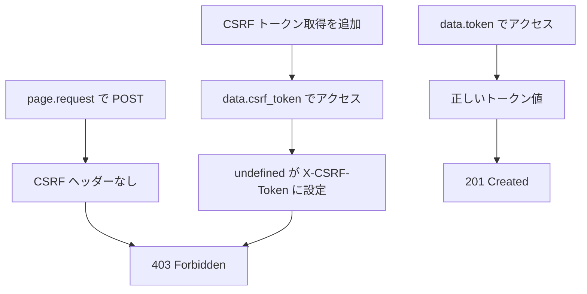

# E2E テスト CSRF トークン取得失敗

関連: #727, PR #758

## 症状

- エラーメッセージ: `expect(received).toBe(expected) // Expected: 201, Received: 403`
- 発生タイミング: E2E テストで `page.request.post('/api/v1/workflow-definitions', ...)` を実行した際
- 影響範囲: 新規追加の `designer-workflow-flow.spec.ts` のみ

## 環境

| 項目 | 値 |
|------|-----|
| ブランチ | feature/727-migrate-fixed-templates |
| 実行環境 | ローカル |
| 関連コミット | 410ccca |

## 仮説と検証

| # | 仮説 | 予測（正しければ何が観察されるか） | 検証手段 | 結果 | 判定 |
|---|------|--------------------------------|---------|------|------|
| 1 | `sqlx::migrate!()` のコンパイル時埋め込みにより新マイグレーションがバイナリに含まれていない | サーバー起動時に `VersionMissing` エラーが発生する | サーバーログ確認 | `VersionMissing(20260221000001)` で panic | 支持 |
| 2 | `page.request` が CSRF トークンなしで POST しているため 403 になる | CSRF ヘッダーを追加すれば 201 になる | CSRF トークン取得 + ヘッダー追加 | 依然として 403 | 棄却（部分的） |
| 3 | CSRF レスポンスのフィールド名が `csrf_token` ではなく `token` | `csrfBody.data.csrf_token` が `undefined` になっている | デバッグログで CSRF レスポンス全体を出力 | `data.token` が正しいフィールド名 | 支持 |

### 仮説 1: sqlx::migrate!() のコンパイル時埋め込み

予測: バイナリが新マイグレーションを認識していないため、DB に適用済みのマイグレーション番号がバイナリの期待と不一致になる。

検証手段: サーバーログ確認

検証データ:

```
thread 'main' panicked at apps/core-service/src/main.rs:186:10:
マイグレーションの実行に失敗しました: VersionMissing(20260221000001)
```

判定: 支持
修正: `touch backend/crates/infra/src/db.rs` → `cargo build` で再コンパイル。`sqlx::migrate!()` マクロがソースの変更を検知し、マイグレーションファイルを再埋め込みする。

### 仮説 2: CSRF トークン未送信

予測: `X-CSRF-Token` ヘッダーを追加すれば 403 が解消する。

検証手段: CSRF トークン取得（`GET /api/v1/auth/csrf`）を追加し、ヘッダーに `X-CSRF-Token` を設定。

検証データ: 依然として 403。レスポンスボディ: `"CSRF トークンが必要です"`

判定: 棄却（CSRF 検証の仕組み自体は正しいが、トークン値が `undefined` で送信されていた）

### 仮説 3: CSRF レスポンスのフィールド名不一致

予測: CSRF エンドポイントのレスポンスが `{ data: { token: "..." } }` 形式で、`csrf_token` ではなく `token` がフィールド名。

検証手段: `console.log` でレスポンス JSON を出力。

検証データ:

```
CSRF response body: { data: { token: "e91b0b27..." } }
```

判定: 支持
修正: `csrfBody.data.csrf_token` → `csrfBody.data.token` に変更。

## 根本原因

3 つの独立した問題が連鎖的に発生:

1. `sqlx::migrate!()` のコンパイル時埋め込み: 新マイグレーションファイルを追加しても `cargo build` がキャッシュヒットし、マクロが再展開されない場合がある
2. `page.request` の CSRF 非自動付与: Playwright の `page.request` はブラウザの Cookie は共有するが、Elm フロントエンドが自動付与する CSRF/テナントヘッダーは含まれない
3. CSRF レスポンスのフィールド名: API レスポンスの `data.token` を `data.csrf_token` と誤認

### 因果関係



## 修正と検証

修正内容:
1. `touch backend/crates/infra/src/db.rs` + `cargo build` で再コンパイル
2. CSRF トークン取得（`GET /api/v1/auth/csrf`）を追加し、`X-Tenant-ID` + `X-CSRF-Token` ヘッダーを設定
3. `csrfBody.data.csrf_token` → `csrfBody.data.token` に修正

検証結果: `just test-e2e` で 16 テスト全パス、`just check-all` で全チェック通過

## 診断パターン（Knowledge）

- `page.request` で API を直接呼び出す E2E テストで 403 が発生したら、まず CSRF トークンの有無を確認する
- CSRF トークンを追加しても 403 が続く場合は、レスポンスのフィールド名を `console.log` で確認する（API ドキュメントと実装が異なる場合がある）
- `sqlx::migrate!()` を含むクレートで新マイグレーションが認識されない場合は、`touch` でソースファイルのタイムスタンプを更新して再コンパイルを強制する

## 関連ドキュメント

- セッションログ: [固定テンプレート新スキーマ移行](../../prompts/runs/2026-02/2026-02-21_2125_固定テンプレート新スキーマ移行.md)
