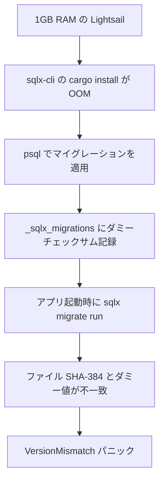

# Lightsail リセットでの sqlx マイグレーション互換性問題

関連: #814

## 症状

Lightsail デモ環境で `reset.sh` を実行後、core-service と auth-service が起動時にパニックする。

- エラーメッセージ: `マイグレーションの実行に失敗しました: VersionMismatch(20260115000001)`
- 発生タイミング: reset.sh 実行後、サービス再起動時
- 影響範囲: core-service, auth-service の両方

## 環境

| 項目 | 値 |
|------|-----|
| ブランチ | feature/add-lightsail-reset-script |
| 実行環境 | Lightsail ($7, 1GB RAM) |
| 関連コミット | reset.sh 初回実装 |

## 仮説と検証

| # | 仮説 | 予測（正しければ何が観察されるか） | 検証手段 | 結果 | 判定 |
|---|------|--------------------------------|---------|------|------|
| 1 | `sqlx database reset` で全データストアをリセットできる | sqlx-cli が正常にインストール・実行される | Docker コンテナ経由で cargo install + sqlx database reset | exit code 101（OOM） | 棄却 |
| 2 | psql でマイグレーションを適用し、ダミーチェックサムを記録すれば sqlx と互換 | サービスが正常に起動する | reset.sh でチェックサム `\x00` を記録して実行 | `VersionMismatch(20260115000001)` で panic | 棄却 |
| 3 | `sha384sum` で計算したチェックサムが sqlx の内部チェックサムと一致する | ローカル DB の checksum 値と `sha384sum` 出力が一致 | ローカル DB クエリと sha384sum の比較 | 完全一致 | 支持 |

### 仮説 1: sqlx-cli で直接リセット

予測: `cargo install sqlx-cli` と `sqlx database reset` が Lightsail 上で正常に動作する

検証手段: Docker コンテナ（`rust:1.84-slim-bookworm`）経由で実行

検証データ: exit code 101（Rust のパニック / OOM kill）。1GB RAM では Rust のコンパイルに必要なメモリが不足。

判定: 棄却。低メモリ環境では sqlx-cli のコンパイルが不可能。

### 仮説 2: ダミーチェックサムで sqlx 互換

予測: `_sqlx_migrations` テーブルにダミーチェックサム（`\x00`）を記録すれば、sqlx はマイグレーション適用済みと認識する

検証手段: reset.sh でダミーチェックサムを使用して実行

検証データ:
```
sqlx::postgres::notice: relation "_sqlx_migrations" already exists, skipping
thread 'main' panicked at apps/core-service/src/main.rs:186:10:
マイグレーションの実行に失敗しました: VersionMismatch(20260115000001)
```

判定: 棄却。sqlx は起動時にファイルのチェックサムと DB の記録を比較し、不一致の場合は VersionMismatch エラーを返す。

### 仮説 3: sha384sum でチェックサム互換

予測: `sha384sum` コマンドの出力が sqlx の内部チェックサム計算と同じ結果を返す

検証手段: ローカル開発 DB の `_sqlx_migrations.checksum` と `sha384sum` の出力を比較

検証データ:
```
# ローカル DB
SELECT encode(checksum, 'hex') FROM _sqlx_migrations WHERE version = 20260115000001;
→ 6a28a3d1163020d3118533ca12e135863223180fadc8e5040e6130b767e9187fe07ee75e7b4a9ecf2d6141e5b6d50f8b

# sha384sum
sha384sum backend/migrations/20260115000001_create_tenants.sql | cut -d' ' -f1
→ 6a28a3d1163020d3118533ca12e135863223180fadc8e5040e6130b767e9187fe07ee75e7b4a9ecf2d6141e5b6d50f8b
```

判定: 支持。完全一致。

## 根本原因

sqlx の `migrate run` は、`_sqlx_migrations` テーブルに記録されたチェックサムとマイグレーションファイルの SHA-384 ハッシュを比較し、不一致の場合は `VersionMismatch` エラーを返す。ダミーチェックサムでは互換性を確保できない。

### 因果関係



## 修正と検証

修正内容: `sha384sum` コマンドでマイグレーションファイルのチェックサムを計算し、`_sqlx_migrations` テーブルに正しい値を記録するように reset.sh を修正。

検証結果: リセット後に全サービスが正常に起動（全コンテナ healthy）。

## 診断パターン（Knowledge）

- `VersionMismatch(<version>)` エラーが発生したら、`_sqlx_migrations` テーブルの `checksum` と対応するマイグレーションファイルの `sha384sum` を比較する
- sqlx-cli が使えない環境でマイグレーションを手動適用する場合、チェックサムの正確な記録が必須。sqlx は SHA-384（`sha2::Sha384`）を使用する
- 低メモリ環境（1GB 以下）では Rust のコンパイルが OOM になる可能性がある。pre-built バイナリまたは代替ツールを検討する

## 関連ドキュメント

- セッションログ: [Lightsail デモ環境リセットスクリプト](../../prompts/runs/2026-02/2026-02-23_2108_Lightsailデモ環境リセットスクリプト.md)
- ナレッジベース: [sqlx マイグレーションチェックサム互換](../../docs/80_ナレッジベース/infra/sqlxマイグレーションチェックサム互換.md)
