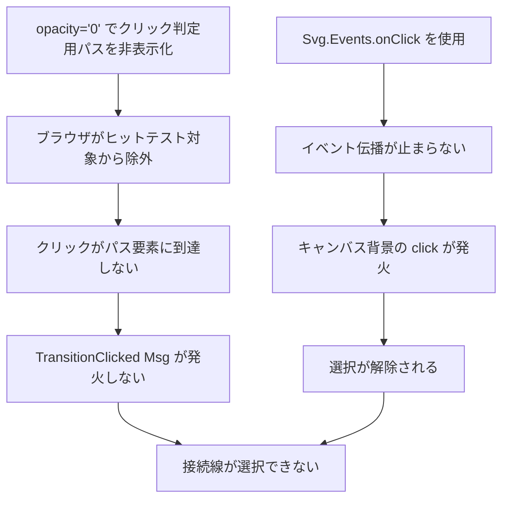

# SVG 接続線クリックのヒットテスト失敗

関連: #907

## 症状

- ワークフローデザイナーで接続線（Transition）をクリックしても選択状態にならない
- 接続線のクリック判定用に設置した透明な太いパス（`strokeWidth="12"`）が機能していない
- 発生タイミング: #907 の端点ドラッグ付け替え機能の実装後
- 影響範囲: 接続線の選択操作全般（再接続ハンドルが表示されない）

## 環境

| 項目 | 値 |
|------|-----|
| ブランチ | feature/907-designer-transition-reconnection |
| 実行環境 | ローカル（Chromium） |
| 関連コミット | `67afd718`〜`c63f8c90` |

## 仮説と検証

| # | 仮説 | 予測（正しければ何が観察されるか） | 検証手段 | 結果 | 判定 |
|---|------|--------------------------------|---------|------|------|
| 1 | `Svg.Events.onClick` がイベント伝播を止めていない | キャンバス背景の click が発火し選択解除される | `stopPropagationOn` に変更して確認 | 改善したが不十分 | 部分的に支持 |
| 2 | `opacity="0"` がヒットテストから除外されている | `elementsFromPoint` でパス要素が検出されない | Playwright で `elementsFromPoint` を実行 | パス要素が検出されない | 支持 |
| 3 | `stroke="transparent"` + `pointer-events: all` で解決する | `elementsFromPoint` でパス要素が検出される | 属性変更後に Playwright で再検証 | パス要素が検出された | 支持 |
| 4 | SVG の座標変換にオフセットがある | `getScreenCTM()` の変換結果が手動計算と異なる | CTM と手動計算の比較 | Y 軸 16px の差異 | 支持 |

### 仮説 1: イベント伝播の未制御

予測: `Svg.Events.onClick` はイベント伝播を止めないため、キャンバス背景の click ハンドラが接続線クリック後に発火し、選択が解除される。

検証手段: `Html.Events.stopPropagationOn "click"` に変更。

検証データ: 変更後、一部のケースでクリックが機能するようになったが、依然として機能しないケースがあった。

判定: 部分的に支持。イベント伝播は問題の一因だが、根本原因ではない。

### 仮説 2: `opacity="0"` によるヒットテスト除外

予測: `opacity="0"` を設定した要素はブラウザのヒットテストから完全に除外される。`pointer-events: all` を設定しても `document.elementsFromPoint()` で検出されない。

検証手段: Playwright E2E テストで接続線の中間点座標に対して `elementsFromPoint` を実行。

検証データ:
```javascript
// opacity="0" + pointer-events="all" の場合
const elements = document.elementsFromPoint(x, y);
// → path 要素が含まれない（SVG、rect、div のみ）
```

判定: 支持。`opacity="0"` はブラウザの描画パイプラインから要素を除外し、ヒットテスト対象外になる。

### 仮説 3: `stroke="transparent"` + `pointer-events: all`

予測: `opacity` ではなく `stroke="transparent"` で透明化すれば、要素はヒットテスト対象に残る。`pointer-events: all` と組み合わせることで、幾何学的な範囲でクリックを受け取れる。

検証手段: 属性変更後に `elementsFromPoint` で再検証。

検証データ:
```javascript
// stroke="transparent" + pointer-events="all" の場合
const elements = document.elementsFromPoint(x, y);
// → path 要素が検出される
```

判定: 支持。

### 仮説 4: SVG 座標変換のオフセット

E2E テストでクリック座標を計算する際、手動計算と `getScreenCTM()` の結果に差異があることを発見。

予測: `preserveAspectRatio="xMidYMid meet"` により、viewBox と実際のサイズのアスペクト比の差が Y 軸オフセットを生む。

検証手段: `getScreenCTM()` と手動計算の比較。

検証データ:
```
viewBox: 0 0 800 600
実際のサイズ: 528 x 492
preserveAspectRatio: xMidYMid meet

手動計算: scaleY = 492/600 = 0.82, offsetY = bounds.y
CTM: {a: 0.66, d: 0.66, e: 472, f: 207}
→ scale = min(528/800, 492/600) = min(0.66, 0.82) = 0.66
→ Y オフセット = (492 - 600*0.66) / 2 = (492 - 396) / 2 = 48px（viewBox 内の中央寄せ）
→ 手動計算との差: 約 16px
```

判定: 支持。E2E テストの座標計算に影響するが、実際のクリック操作（ユーザーが目視でクリック）には影響しない。

## 根本原因

2 つの問題が複合していた:

1. **`opacity="0"` によるヒットテスト除外**: ブラウザは `opacity="0"` の要素を描画パイプラインから除外し、ヒットテスト対象外にする。`pointer-events: all` を設定しても効果がない
2. **イベント伝播の未制御**: `Svg.Events.onClick` はイベント伝播を止めないため、キャンバス背景の click ハンドラが発火して選択が解除される

### 因果関係



## 修正と検証

修正内容:
1. `opacity="0"` → `stroke="transparent"` に変更（ヒットテスト対象を維持）
2. `Svg.Events.onClick` → `Html.Events.stopPropagationOn "click"` に変更（イベント伝播を制御）
3. `pointer-events: stroke` → `pointer-events: all` に変更（透明ストロークでの確実な判定）

検証結果:
- Playwright E2E テストで `elementsFromPoint` にパス要素が含まれることを確認
- CTM 座標を使ったクリックでハンドルが表示されることを確認
- 開発サーバーでの手動操作でも接続線の選択が正常に動作

## 診断パターン（Knowledge）

- SVG 要素がクリックできない場合、まず `document.elementsFromPoint(x, y)` で対象要素がヒットテスト対象に含まれるか確認する
- `opacity="0"` はヒットテストから除外される。不可視だがクリック可能にしたい場合は `stroke="transparent"` / `fill="transparent"` + `pointer-events: all` を使用する
- SVG の座標テストで座標がずれる場合、`getScreenCTM()` で実際の変換マトリクスを確認する。`preserveAspectRatio` によるオフセットが原因であることが多い

## 関連ドキュメント

- セッションログ: [SVG クリック判定とハンドル表示改善](../../../prompts/runs/2026-02/2026-02-24_2154_SVGクリック判定とハンドル表示改善.md)
- ナレッジベース: [SVG ポインターイベントとヒットテスト](../../../docs/80_ナレッジベース/frontend/SVGポインターイベントとヒットテスト.md)
