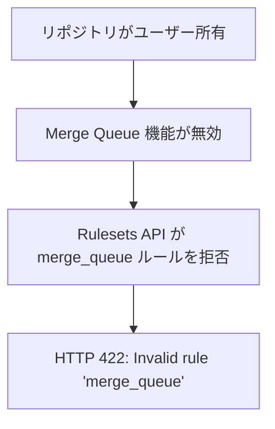

# Merge Queue の Rulesets API 制約

関連: #757, PR #1039

## 症状

- エラーメッセージ: GitHub Rulesets API が `merge_queue` ルールタイプで HTTP 422 を返す
- 発生タイミング: `PUT /repos/{owner}/{repo}/rulesets/{id}` で `merge_queue` ルールを追加しようとした時
- 影響範囲: Merge Queue の導入が完全にブロックされる

## 環境

| 項目 | 値 |
|------|-----|
| ブランチ | `feature/757-merge-queue` |
| 実行環境 | ローカル（`gh api` コマンド） |
| リポジトリ | ユーザー所有の公開リポジトリ（GitHub Free） |

## 仮説と検証

| # | 仮説 | 予測（正しければ何が観察されるか） | 検証手段 | 結果 | 判定 |
|---|------|--------------------------------|---------|------|------|
| 1 | `status_check_configuration` パラメータが不正 | パラメータを除外すればルール追加が成功する | パラメータなしで API を再実行 | `Invalid rule 'merge_queue'` エラーが継続 | 棄却 |
| 2 | ユーザー所有リポジトリでは Merge Queue が利用不可 | Organization 所有リポジトリのみで利用可能というドキュメントが存在する | GitHub Docs を確認 | ドキュメントに Organization 所有が要件と記載 | 支持 |

### 仮説 1: `status_check_configuration` パラメータが不正

予測: `status_check_configuration` を除外すれば `merge_queue` ルールが受け入れられる

検証手段: Rulesets API に `merge_queue` ルールのみ（パラメータなし）で PUT リクエスト

検証データ:

```
HTTP 422
{
  "message": "Validation Failed",
  "errors": ["Invalid rule 'merge_queue': "]
}
```

判定: 棄却
理由: パラメータの問題ではなく、`merge_queue` ルールタイプ自体が拒否されている

### 仮説 2: ユーザー所有リポジトリでは Merge Queue が利用不可

予測: GitHub のドキュメントに、Merge Queue は Organization 所有リポジトリでのみ利用可能と記載されている

検証手段: GitHub Docs の Merge Queue 要件ページを確認

検証データ:

GitHub Docs「Managing a merge queue > About merge queues」に以下の記載:

> Merge queue can be enabled with repository rulesets for repositories owned by organizations.

判定: 支持
理由: ユーザー所有リポジトリ（個人アカウント所有）は明示的にサポート対象外

## 根本原因

GitHub Merge Queue は Organization 所有リポジトリでのみ利用可能な機能であり、ユーザー所有リポジトリ（個人アカウント）では Rulesets API で `merge_queue` ルールタイプを追加できない。GitHub Free / Pro の個人プランでは Merge Queue を利用できない。

### 因果関係



## 修正と検証

修正内容: Merge Queue の導入を保留とし、全変更をリバートした。

- CI ワークフローへの `merge_group` トリガー追加を取り消し
- Rulesets の `strict_required_status_checks_policy` を `true` に復元（API で確認済み）
- ADR-064 のステータスを「保留」に変更

検証結果: `gh api /repos/ka2kama/ringiflow/rulesets/11811117 --jq '.rules[] | select(.type == "required_status_checks") | .parameters.strict_required_status_checks_policy'` で `true` を確認

## 診断パターン

- GitHub Rulesets API で `Invalid rule '<type>'` エラーが返る場合、そのルールタイプがリポジトリの所有形態（ユーザー / Organization）やプランで利用可能かを確認する
- Merge Queue の利用を検討する場合、リポジトリが Organization 所有であることを前提条件として最初に確認する
- GitHub の機能制限は API エラーメッセージが不親切な場合がある（`Invalid rule` としか表示されない）。エラーメッセージだけでなく、機能の前提条件をドキュメントで確認する

## 関連ドキュメント

- セッションログ: [Merge Queue 導入検討](../../../prompts/runs/2026-03/2026-03-05_2125_MergeQueue導入検討.md)
- ADR: [ADR-064: Merge Queue 導入と品質保証の再設計](../../../docs/70_ADR/064_MergeQueue導入と品質保証の再設計.md)
