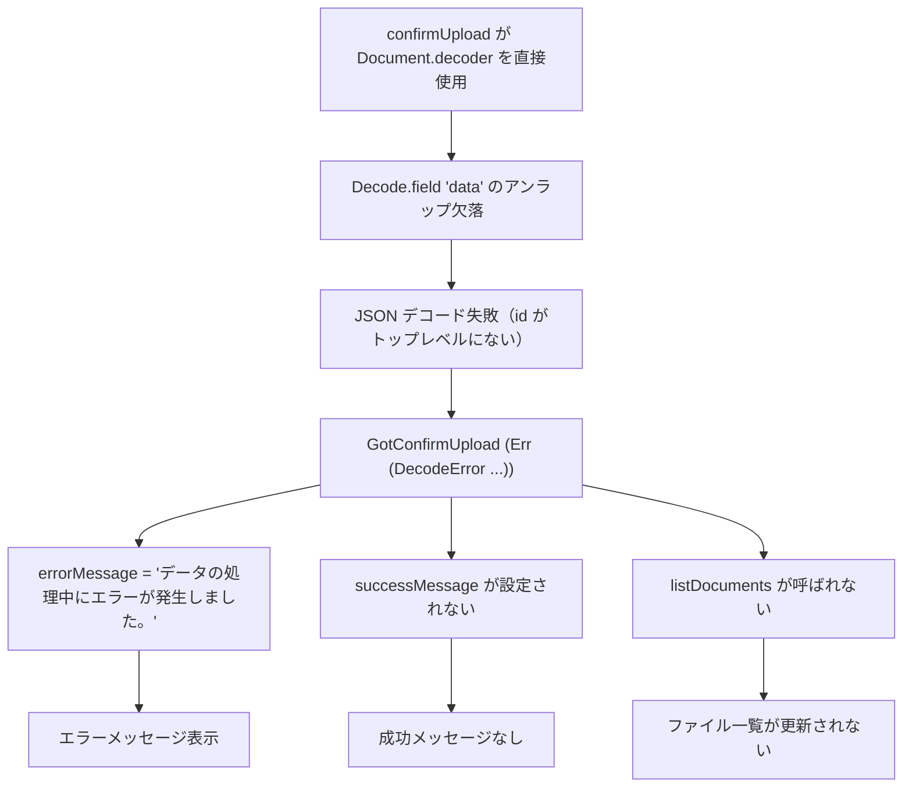

# confirmUpload デコーダーの data フィールドアンラップ欠落

関連: #1085, PR #1088

## 症状

- エラーメッセージ: 「データの処理中にエラーが発生しました。」（フロントエンドの `DecodeError` 由来）
- 発生タイミング: ドキュメント管理画面でファイルをアップロードし、S3 への PUT 完了後の confirm ステップ
- 影響範囲: ドキュメント管理画面のファイルアップロード。S3 へのアップロード自体は成功するが、UI に成功メッセージが表示されず、ファイル一覧が更新されない

## 環境

| 項目 | 値 |
|------|-----|
| ブランチ | feature/1085-file-upload-e2e-tests |
| 実行環境 | ローカル（E2E テスト環境） |
| 関連コミット | ff82ccb5 |

## 仮説と検証

### カテゴリ網羅

| # | カテゴリ | 判定 | 根拠 |
|---|---------|------|------|
| 1 | コード変更 | 該当 | 新規テストが既存機能のバグを検出 |
| 2 | データ変異 | 非該当 | シードデータは一定 |
| 3 | 内部設定 | 非該当 | 環境変数変更なし |
| 4 | インフラ変更 | 非該当 | Docker 構成変更なし |
| 5 | 外部サービス | 非該当 | MinIO 正常（ワークフロー添付テスト成功） |
| 6 | 時間依存要因 | 非該当 | 再現性のある失敗 |

### 仮説一覧

| # | 仮説 | 予測 | 検証手段 | 結果 | 判定 |
|---|------|------|---------|------|------|
| 1 | `getByRole` の部分一致で「作成」ボタンが「フォルダ作成」にもマッチ | strict mode violation | スクリーンショット確認 | ダイアログが開いた状態でフリーズ | 支持（修正後進展） |
| 2 | MinIO への接続/CORS 問題 | S3 PUT が失敗する | ワークフロー添付テストとの比較 | ワークフロー添付テストは成功 | 棄却 |
| 3 | Presigned URL のホスト名がブラウザからアクセス不可 | PUT リクエストが失敗する | ワークフロー添付テストとの比較 | ワークフロー添付テストは成功 | 棄却 |
| 4 | upload-url API レスポンスのデコード失敗 | レスポンスの構造がデコーダーと不一致 | `page.on("response")` でインターセプト | upload-url は 200 OK で正常データ | 棄却 |
| 5 | `confirmUpload` のデコーダーが `data` フィールドをアンラップしていない | confirm は 200 OK だが `Document.decoder` がトップレベル `id` を探して失敗 | コード確認 + API レスポンス確認 | confirm 200 OK, `{"data": {...}}` 形式、`Document.decoder` は `data` なし | 支持 |

### 仮説 1: getByRole 部分一致

予測: 「作成」ボタンクリックが「フォルダ作成」にも一致して strict mode violation
検証手段: スクリーンショット確認

検証データ: 最初のスクリーンショットでフォルダ作成ダイアログが開いたまま停止。`exact: true` 追加後は次のステップに進行。

判定: 支持（修正済み、根本原因ではなく副次的問題）

### 仮説 5: confirmUpload デコーダーの data フィールド欠落

予測: API は 200 OK を返すが、`Document.decoder` が `{"data": {...}}` のトップレベル `id` を見つけられず DecodeError
検証手段: `page.on("response")` でネットワークインターセプト + Elm コード確認

検証データ:

confirm API レスポンス（200 OK）:
```json
{"data":{"id":"019ccd79-0a09-7ec0-9748-be3a47843049","filename":"test-upload.txt","content_type":"text/plain","size":149,"status":"active","created_at":"2026-03-08T12:43:07.657033+00:00"}}
```

`confirmUpload` のデコーダー（修正前）:
```elm
confirmUpload { config, documentId, toMsg } =
    Api.post
        { ...
        , decoder = Document.decoder  -- data フィールドのアンラップなし
        }
```

`Document.decoder` は `id`, `filename` 等をトップレベルに期待するが、実際のレスポンスは `data` フィールドでラップされている。他のデコーダー（`uploadUrlResponseDecoder`, `listDecoder`, `downloadUrlResponseDecoder`）は全て `Decode.field "data"` でアンラップしている。

判定: 支持（根本原因）

## 根本原因

`Api/Document.elm` の `confirmUpload` 関数で、デコーダーに `Document.decoder` を直接渡していたが、BFF は `ApiResponse<T>` でラップした `{"data": {...}}` 形式でレスポンスを返す。`Decode.field "data"` によるアンラップが欠落しており、`Decode.decodeString` が `id` フィールドをトップレベルで探してデコード失敗していた。

### 因果関係



## 修正と検証

修正内容: `Api/Document.elm` の `confirmUpload` で `Document.decoder` を `Decode.field "data" Document.decoder` に変更。`Json.Decode` のインポートを追加。

検証結果: E2E テスト 26 件全通過（修正前は 1 件失敗）。`just check` も全通過。

## 診断パターン

- 「データの処理中にエラーが発生しました。」が表示されたら、DecodeError を疑う。API レスポンスは正常でもフロントエンドのデコーダーが不一致の可能性がある
- BFF の全エンドポイントは `ApiResponse<T>` でラップするため、デコーダーは必ず `Decode.field "data"` を含む必要がある。新しいデコーダーを追加する際は既存パターン（`uploadUrlResponseDecoder`, `listDecoder`）と照合する
- 2 つの E2E テストが同じ API エンドポイントを使うが片方だけ失敗する場合、共通部分（API 自体）ではなく、各テスト固有のコードパス（フロントエンドのハンドラ、デコーダー）を疑う

## 関連ドキュメント

- セッションログ: [ファイルアップロード E2E テスト追加](../../../prompts/runs/2026-03/2026-03-08_1918_ファイルアップロードE2Eテスト.md)
