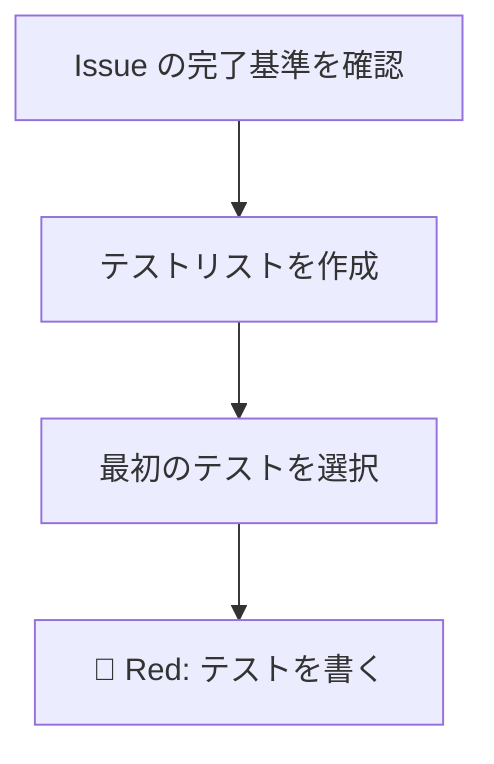
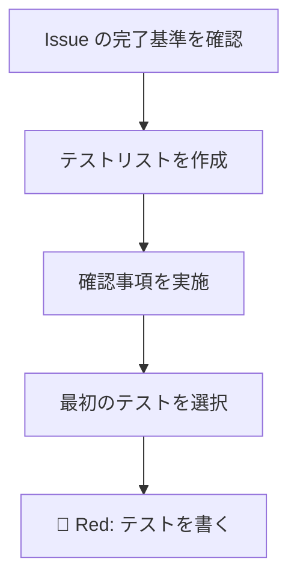

# pre-implementation.md の再設計

## Context

`.claude/rules/pre-implementation.md` が機能していない。セッションログ約30件中、明示的言及は1件のみ。構造的に「行動規範」にとどまり、トリガー・強制力・成果物のいずれも欠如している。

さらに、最大の失敗モードである**ライブラリ関数の推測**（存在しない関数を呼ぶ、引数が全然違う等）がカバーされていない。ライブラリソースは Read ツールで確認できないため、AI は訓練データの近似知識に頼り、それが不正確なことが多い。

ユーザーの指摘: コンパイラはガードレールであり、頼るものではない。「推測→コンパイル→修正」のサイクルは、結果が正しくても許容しない。理解してから書く discipline に固有の価値がある。

## 変更方針

行動規範 → 構造的プロセスチェックポイントへの変換。設計原則レンズと同じパターン（哲学は rules ファイル、手順は TDD フロー）を踏襲する。

既存計画ファイル（#333）が「事前確認」セクションを自然に含んでいた（L29-36）ことから、この構造を形式知化する。

## 変更内容

### 1. `.claude/rules/pre-implementation.md` — 全面リライト

**哲学 + 原則 + ライブラリ検証手順**に再構成。

現在の構造（Rust/Elm 言語別チェックリスト）→ リスク別3カテゴリに再編:

| カテゴリ | 内容 | リスク |
|---------|------|--------|
| 1. ライブラリ API | Grep 既存使用 → docs.rs 確認 → 訓練データだけに頼らない | 最高（AI 特有の失敗モード） |
| 2. プロジェクト内の型と構造 | Read で型定義・トレイトを確認 | 中（Read 可能） |
| 3. 既存パターン | 同種モジュールを先に読む | 中（コンパイラでは検出不可） |

構造的強制の定義: 計画ファイルに確認事項セクションを設ける（成果物要件）。

新しいファイルの全文:

```markdown
# 実装前の確認（Pre-Implementation Verification）

## 原則

コンパイラはガードレールであり、頼るものではない。

「推測 → コンパイル → エラー修正」のサイクルは、最終的に正しいコードを生み出すとしても許容しない。
理解してから書く規律には固有の価値がある。推測で書いて通ったコードは、なぜ動くのか説明できない。

- 「書いて試す」ではなく「読んで理解してから書く」
- 型システムは「エラー検出」ではなく「設計を導くもの」
- コンパイラに頼る前に、自分で型の整合性を確認する

## 確認の3カテゴリ

リスクの高い順。

### カテゴリ1: ライブラリ API（最重要）

AI の最大の失敗モード。プロジェクトコードと違い Read ツールでソースを確認できないため、訓練データに基づく推測が唯一の情報源になりやすい。訓練データは古い・不正確なことがある。

検証手順:

1. **Grep で既存の使用パターンを探す** — プロジェクト内で同じ関数・メソッドが既に使われていないか検索する。使われていれば、そのパターンに従う（最も信頼性が高い）
2. **初めて使う API の場合、公式ドキュメントを確認する** — Rust: docs.rs でクレートの該当バージョンを確認。Elm: package.elm-lang.org で該当パッケージを確認。関数シグネチャ、引数の型、戻り値の型を正確に把握する
3. **訓練データだけに頼らない** — 確認手段がない場合は、推測に基づく旨をコメントに残す

### カテゴリ2: プロジェクト内の型と構造

プロジェクトコードは Read ツールで直接確認できるため、検証コストが低い。

- 構造体のフィールド名と型
- enum のバリアント
- トレイトのメソッドシグネチャ
- エラー型の定義とバリアント
- インポートパス（既存コードのパターンに従う）

### カテゴリ3: 既存パターン

コンパイラでは一貫性を検出できない。類似の実装を先に読んでからパターンを踏襲する。

- 同じレイヤーの他のモジュール（ハンドラなら他のハンドラ）
- テストユーティリティ、テストのパターン
- エラーハンドリングのパターン

## 構造的な強制: 計画ファイルの確認事項

原則だけでは機能しない。計画ファイルに確認事項セクションを設け、成果物要件とする。

→ 計画ファイルの必須要素: [zoom-rhythm.md > 計画ファイルへの記載](zoom-rhythm.md#計画ファイルへの記載必須)
→ 実施タイミング: [TDD 開発フロー > 確認事項の実施](../../docs/04_手順書/04_開発フロー/02_TDD開発フロー.md#確認事項の実施)

各 Phase に「確認事項」を記載する:

    ### Phase N: コンポーネント名

    #### 確認事項
    - 型: UserState の定義 → `handler/auth.rs`
    - パターン: 既存ハンドラの引数パターン → `handler/workflow.rs`
    - ライブラリ: axum State 抽出子 → Grep `State(` in handlers

    #### テストリスト
    - [ ] ...

確認事項が不要な Phase（既知のパターンのみ）は「確認事項: なし（既知のパターンのみ）」と明示する。

## AI エージェントへの指示

- 計画作成時: 各 Phase で使用する型・パターン・ライブラリ API を確認事項として記載する
- Phase 開始時: 確認事項を Read/Grep で実施してからテストを書き始める
- ライブラリ API を初めて使う場合: 必ず Grep で既存使用を探し、なければ公式ドキュメントで確認する
- 確認手段がない場合: 推測で書いた旨を明示する

## 禁止事項

- 確認事項セクションのない計画で実装を開始すること
- ライブラリ API を既存使用パターンの確認なしに推測で書くこと
- 「コンパイルして確認すればいい」と考えること

## 改善の経緯

- [ルール実効性分析と設計原則レンズ導入](../../prompts/runs/2026-02/2026-02-08_2355_ルール実効性分析と設計原則レンズ導入.md)
- [往復のリズムが機能しない構造的原因](../../prompts/improvements/2026-02/2026-02-08_2355_往復のリズムが機能しない構造的原因.md)
```

### 2. `.claude/rules/zoom-rhythm.md` — 確認事項の成果物要件を追加

**変更箇所**: L304-306（計画ファイルへの記載セクション）

現在:
```
計画ファイル（plan mode で作成するファイル）には、末尾に以下の2つのセクションを記載する。
記載されていない計画は完成とみなさない。
```

変更後:
```
計画ファイル（plan mode で作成するファイル）には、以下を記載する。
記載されていない計画は完成とみなさない。
```

そして、「### ブラッシュアップループの記録」の前に以下を追加:

```markdown
### 確認事項（各 Phase）

各 Phase に「確認事項」セクションを記載する。実装前に確認すべき型・パターン・ライブラリ API を事前に洗い出す。

→ 哲学と原則: [実装前の確認](pre-implementation.md)

```markdown
### Phase N: コンポーネント名

#### 確認事項
- 型: [確認する型] → [ファイルパス]
- パターン: [参照するパターン] → [参照ファイル]
- ライブラリ: [使用する API] → [Grep 既存使用 or docs.rs URL]
```

確認事項が不要な Phase（既知のパターンのみ）は「確認事項: なし（既知のパターンのみ）」と明示する。

注意: 確認事項は Phase 内部に配置する（末尾ではない）。テストリストと同じレベルで Phase に紐づく情報のため。ブラッシュアップループや収束確認は計画全体の品質に関わるもので、引き続き末尾に配置する。
```

### 3. `docs/04_手順書/04_開発フロー/02_TDD開発フロー.md` — 確認ステップを追加

#### 3a. ワークフロー全体像のフローチャート更新（L362-373）

現在:


変更後:


#### 3b. Red ステップの前に新セクション追加（L27 の前、「🔴 Red」セクションの直前）

```markdown
### 確認事項の実施

**目的:** 推測ではなく事実に基づいてコードを書く

→ 哲学と原則: [実装前の確認](../../../.claude/rules/pre-implementation.md)

各 Phase のテストを書き始める前に、計画ファイルの確認事項を Read/Grep で実施する:

1. **型**: Read ツールで型定義を確認する
2. **パターン**: Read ツールで参照ファイルを確認する
3. **ライブラリ**: Grep で既存使用を確認する。初めて使う API は docs.rs / package.elm-lang.org で確認する

実装中に計画外の API が必要になった場合は、その場で同じ手順を実施する。

注意: これは Phase 開始時に1回実施する。TDD サイクルの各イテレーションで繰り返す必要はない。

---
```

#### 3c. 変更履歴に追記

```
| 2026-02-09 | 確認事項の実施ステップを追加。推測ではなく事実に基づくコード記述の構造的強制 |
```

### 4. `CLAUDE.md` — 変更不要

L423-425 の既存参照がリライト後も整合する:
```
コードを書く前に、関連する型定義と既存パターンを必ず確認する。推測で書かない。
→ 詳細: `.claude/rules/pre-implementation.md`
```

### 5. `README.md` — 変更不要

L77 の参照テキスト「実装前チェックリスト — 型定義・既存パターンを確認してから書く。推測で書かない」はリライト後も適切。

## 対象外

- 改善記録（`prompts/improvements/`）: 実装完了後に `/wrap-up` で作成
- セッションログ: 実装完了後に `/wrap-up` で作成

## 検証

1. 変更後の3ファイルの内容を通読し、相互参照（リンク）が正しいことを確認
2. zoom-rhythm.md の既存の必須セクション（ブラッシュアップループ、収束確認）との整合性を確認
3. TDD フローのフローチャートが正しく表示されることを確認

## ブラッシュアップループの記録

| ループ | きっかけ | 調査内容 | 結果 |
|-------|---------|---------|------|
| 1回目 | 初版完成 → 確認事項の配置場所の検証 | 既存計画ファイル #333 の Phase 構造を確認。L29-36 に「事前確認」セクションが自然に存在。ブラッシュアップループ/収束確認が末尾に配置されるパターンを確認 | 確認事項は Phase 内部に配置（テストリストと同レベル）が自然と判断。末尾には「確認事項セクションの存在が必須」という要件のみ記載 |
| 2回目 | エッジケースの網羅性 | Phase なしの計画、quick fix、既存使用なしのライブラリ、ノイズのリスクを検討 | 計画ファイルなしの場合は TDD フローステップで対応。「確認事項: なし」を許容しノイズを防止 |
| 3回目 | TDD フローの挿入位置の精査 | TDD フロー全文（L1-405）を通読。Red ステップ（L28）の前、テストリスト作成（L136-191）の後が適切か検証 | フローチャート上は「テストリスト作成」→「確認事項を実施」→「最初のテストを選択」の順が自然。本文上は Red セクション（L28）の直前に新セクションを挿入 |
| 4回目 | CLAUDE.md, README.md の影響確認 | CLAUDE.md L423-425、README.md L77 の既存参照テキストとリライト後の内容を照合 | いずれも変更不要。参照テキストがリライト後の原則と整合 |

## 収束確認（設計・計画）

| # | 観点 | 理想状態（To-Be） | 判定 | 確認内容 |
|---|------|------------------|------|---------|
| 1 | 網羅性 | 全変更対象ファイルが計画に含まれている | OK | pre-implementation.md（全面リライト）、zoom-rhythm.md（セクション追加）、TDD開発フロー（ステップ追加）の3ファイル。CLAUDE.md・README.md は変更不要を判断 |
| 2 | 曖昧さ排除 | 各ファイルの変更内容が具体的 | OK | pre-implementation.md は全文を提示。zoom-rhythm.md は追加内容を具体記載。TDD フローは挿入位置（L28前）とフローチャート変更を明示 |
| 3 | 設計判断の完結性 | 配置、分離、エッジケースに判断理由あり | OK | Phase 内配置 vs 末尾（理由記載）、哲学/手順の分離パターン（設計原則レンズ踏襲）、4つのエッジケース対応 |
| 4 | スコープ境界 | 対象と対象外が明記 | OK | 対象: 3ファイル。対象外: CLAUDE.md, README.md（変更不要の判断）、改善記録・セッションログ（/wrap-up で対応） |
| 5 | 技術的前提 | AI の制約が考慮されている | OK | 「ライブラリソースは Read で確認不可」というAI特有の制約を明示。docs.rs への WebFetch アクセスを代替手段として記載 |
| 6 | 既存ドキュメント整合 | 既存ルールと矛盾がない | OK | 設計原則レンズの分離パターン（zoom-rhythm.md=哲学、TDDフロー=手順）と同じ構造。zoom-rhythm.md の既存必須セクションとの共存を確認 |
