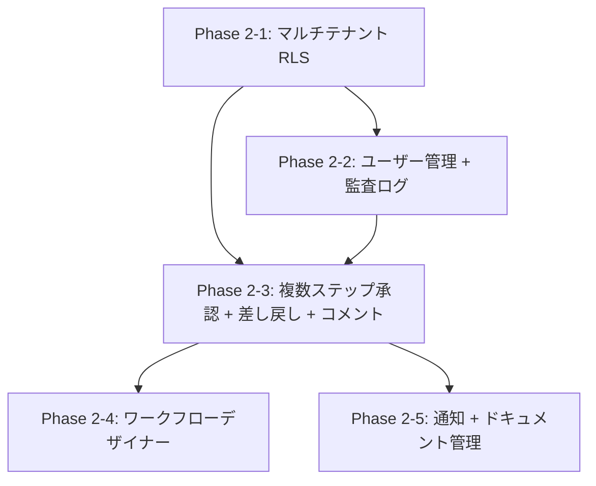

# #393 Phase 2 計画策定（マルチテナント RLS）

## Context

Phase 1（MVP）が機能的に完了し、品質改善期に入っている。健全性診断（2026-02-10）で Feature 比率 20%（守り 76%）と判明し、Phase 2 への移行計画が必要と診断された。既存ロードマップの Phase 2 セクションは初期設計時の概要レベル（9 機能列挙）のままであり、具体的なスコープ・サブフェーズ・完了基準が未定義。

## スコープ

**対象**: ドキュメント更新 + Issue 作成（コード実装は含まない）

- 実装ロードマップの Phase 2 セクションを 5 サブフェーズに詳細化
- 要件定義書・設計書の Phase 2 対応状況を確認
- Phase 2 の Epic Issue を作成

**対象外**:

- Phase 2-1 の詳細実装計画（別 Issue で策定）
- 要件定義書・設計書の新規作成（不足があれば Issue 化のみ）
- コード変更

## Phase 2 サブフェーズ構成

依存関係・学習効果・プロダクト完成度の 3 軸で 9 機能を 5 サブフェーズに分割する。



| サブフェーズ | 機能 | 要件 ID | 理由 |
|-------------|------|---------|------|
| 2-1 | マルチテナント RLS | CORE-03, AUTHZ-003 | 全機能の基盤。設計ドキュメント最充実。学習価値高 |
| 2-2 | ユーザー管理 + 監査ログ | ADM-002, ADM-003, RPT-004 | RLS の実運用検証。監査ログは後続機能の横断的基盤 |
| 2-3 | 複数ステップ承認 + 差し戻し + コメント | WF-002, WF-103, TASK-005 | ワークフロー実行層の拡張。デザイナーの前提 |
| 2-4 | ワークフローデザイナー | WF-001, WFD-001〜005 | Phase 2 の目玉。実行エンジンが動く状態が前提 |
| 2-5 | 通知 + ドキュメント管理 | NOTIFY-001, DOC-001, DOC-003 | AWS 連携（SES, S3）。独立した学習ドメイン |

## 作業手順

### Phase 1: ブランチ + Draft PR 作成

```bash
git checkout -b feature/393-phase2-planning
git commit --allow-empty -m "#393 WIP: Define Phase 2 scope and subphase plan"
git push -u origin HEAD
gh pr create --draft --title "#393 Define Phase 2 scope and subphase plan" \
  --body "## Issue\nCloses #393\n\n## Summary\nPhase 2 のスコープを 5 サブフェーズに分割し、実装ロードマップを更新する。\n\n## Test plan\n最終 Phase 完了後に確認\n\n🤖 Generated with [Claude Code](https://claude.com/claude-code)"
```

### Phase 2: 要件・設計書の確認

以下を読み、Phase 2 各機能の要件が実装開始に十分か確認する。

| ドキュメント | 確認内容 |
|-------------|---------|
| `docs/01_要件定義書/01_コア要件.md` | CORE-03, WF-002, WF-103, TASK-005, NOTIFY-001, DOC-001, DOC-003, ADM-002, ADM-003, RPT-004 の定義 |
| `docs/02_基本設計書/03_インフラとDB設計.md` | RLS 二重防御設計（7.1.3 節）の詳細度 |
| `docs/03_詳細設計書/06_テナント退会時データ削除設計.md` | Phase 2 追加データストア（監査ログ、S3）との整合性 |
| `docs/01_要件定義書/機能仕様書/01_ワークフロー管理.md` | 複数ステップ承認・差し戻しのシナリオ |

不足があれば Issue 化して記録する（本 PR では修正しない）。

### Phase 3: 実装ロードマップ更新

`docs/03_詳細設計書/00_実装ロードマップ.md` の Phase 2 セクションを更新する。

更新内容:
- 5 サブフェーズの目的・スコープ・完了基準・学習ポイント
- 依存関係のフローチャート（Mermaid）
- 各サブフェーズの推定作業量
- アーキテクチャ変更点をサブフェーズに紐づけ

### Phase 4: Epic Issue 作成

Phase 2 の GitHub Milestone が存在するか確認し、各サブフェーズの Epic Issue を作成する。

```
Epic: Phase 2-1 マルチテナント RLS
Epic: Phase 2-2 ユーザー管理 + 監査ログ
Epic: Phase 2-3 複数ステップ承認 + 差し戻し + コメント
Epic: Phase 2-4 ワークフローデザイナー
Epic: Phase 2-5 通知 + ドキュメント管理
```

Story 分解は各 Epic 着手時に実施する（本 PR のスコープ外）。

### Phase 5: 収束確認 + コミット

## 確認事項

- 型: なし（ドキュメント作業）
- パターン: 既存ロードマップの Phase 0-1 セクションの記述パターン → `docs/03_詳細設計書/00_実装ロードマップ.md`
- ライブラリ: なし

## 検証方法

1. 更新後のロードマップが既存の Phase 0-1 セクションと整合していること
2. 各サブフェーズの完了基準が具体的で検証可能であること
3. 要件 ID が要件定義書の記述と一致していること
4. Epic Issue が正しい Milestone とラベルで作成されていること
5. `just check-all` がパスすること（ドキュメントのみの変更だが念のため）

## ブラッシュアップループの記録

| ループ | 検出したギャップ | 観点 | 対応 |
|-------|----------------|------|------|
| 1回目 | 機能仕様書の不足が未明示（Phase 2-2〜2-5 の多くで機能仕様書が未作成） | 不完全なパス | 各サブフェーズに「設計ドキュメントの準備状況」セクションを追加し、不足箇所を ⚠️ で明示 |
| 2回目 | Phase 2-5（通知 + ドキュメント管理）が Phase 2-4（デザイナー）に依存する前提で設計していたが、実際には独立 | アーキテクチャ不整合 | 依存関係グラフを修正。2-5 は 2-3 に依存するが 2-4 とは独立とし、並列実行可能に |

## 収束確認（設計・計画）

| # | 観点 | 判定 | 確認内容 |
|---|------|------|---------|
| 1 | 網羅性 | OK | 既存ロードマップの 9 機能すべてがサブフェーズに割り当て済み |
| 2 | 曖昧さ排除 | OK | 各サブフェーズに具体的なスコープ・完了基準を定義 |
| 3 | 設計判断の完結性 | OK | サブフェーズ分割の判断基準（依存関係・学習効果・プロダクト完成度）を明示 |
| 4 | スコープ境界 | OK | 対象（ロードマップ更新 + Epic 作成）と対象外（詳細設計・コード）を明記 |
| 5 | 技術的前提 | OK | RLS の現状（未実装、アプリ層フィルタのみ）を確認済み |
| 6 | 既存ドキュメント整合 | OK | 要件定義書、基本設計書、ADR-007, ADR-023 と照合済み |
