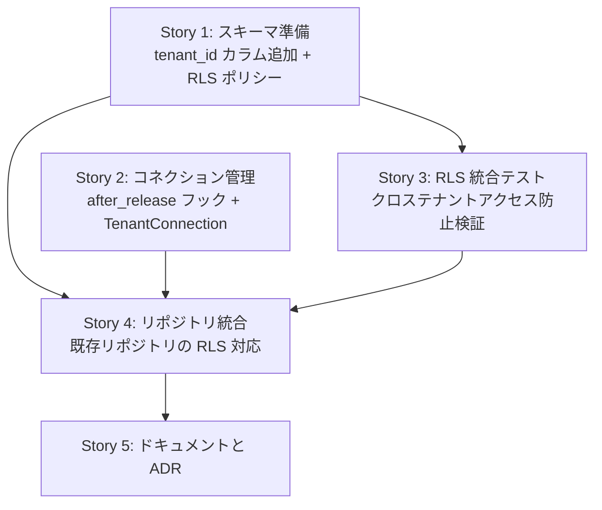

# #402 Phase 2-1: マルチテナント RLS 実装計画

## Context

Phase 1 ではアプリケーション層（リポジトリの WHERE 句 `tenant_id = $1`）でのみテナント分離を実現している。基本設計書 7.1.3 節で定義された二重防御（アプリ層 + DB 層）の DB 層が未実装。本 Epic で PostgreSQL RLS を導入し、DB レベルのテナント分離を確立する。

## スコープ

**対象**:

- 全テナントスコープテーブルに RLS ポリシーを設定
- `workflow_steps` と `user_roles` に `tenant_id` カラムを追加
- コネクション返却時のテナントコンテキストリセット（`after_release` フック）
- `TenantConnection` 型の導入（将来のリポジトリ統合の基盤）
- クロステナントアクセス防止の統合テスト
- ドキュメント・ADR 更新

**対象外**:

- リポジトリの `&self.pool` から `TenantConnection` への全面移行（段階的に実施）
- 監査ログ（Phase 2-2 のスコープ）
- SILO モードの実装（将来対応）

## 設計判断

### 1. コネクション管理方式: after_release フック + TenantConnection

| 方式 | 概要 | 判定 |
|------|------|------|
| **A: after_release フック + TenantConnection（採用）** | プール返却時に RESET、TenantConnection で SET | ✅ |
| B: リクエストスコープトランザクション | 全リクエストを BEGIN + SET LOCAL + COMMIT で包む | ❌ 全リポジトリの Executor 型変更が必要 |
| C: axum ミドルウェアで Connection を渡す | Extension でコネクションを共有 | ❌ Core Service は内部 API で axum Extension に依存 |

理由:
- `after_release` でコネクション返却時に `RESET` を実行し、テナントコンテキストの漏洩を防止
- 既存リポジトリの `&self.pool` パターンはそのまま維持（WHERE 句が主防御線）
- `TenantConnection` は将来のリファクタリング基盤として導入
- RLS ポリシーは `app.tenant_id` 未設定時にどの行もマッチしないよう設計し、二重防御のセーフティネットとして機能

### 2. tenant_id カラムがないテーブル: カラム追加（非正規化）

| 方式 | 判定 | 理由 |
|------|------|------|
| **A: tenant_id カラムを追加（採用）** | ✅ | RLS ポリシーが単純、パフォーマンス良好 |
| B: JOIN ベースの RLS ポリシー | ❌ | PostgreSQL 公式ドキュメントで非推奨。全行評価でパフォーマンス劣化 |

対象テーブル: `workflow_steps`（`workflow_instances` 経由）、`user_roles`（`users` 経由）

### 3. RLS ポリシーの SQL パターン

```sql
-- GUC の設定（set_config を使用。SET はパラメータ化クエリ非対応）
SELECT set_config('app.tenant_id', $1, false);

-- GUC のリセット
SELECT set_config('app.tenant_id', '', false);

-- RLS ポリシー（NULLIF で空文字列→NULL変換、UUID キャスト失敗を防止）
CREATE POLICY tenant_isolation ON users
    USING (tenant_id = NULLIF(current_setting('app.tenant_id', true), '')::UUID);
```

`current_setting('app.tenant_id', true)` の `true` は missing_ok パラメータ。未設定時にエラーではなく空文字列を返す。`NULLIF` で空文字列を NULL に変換し、`tenant_id = NULL` が常に false となることで、未設定時はどの行もマッチしない。

### 4. テスト戦略

`#[sqlx::test]` は superuser で接続するため RLS がデフォルトでバイパスされる。

| テストカテゴリ | 方法 |
|--------------|------|
| 既存リポジトリテスト | そのまま動作（superuser は BYPASSRLS） |
| RLS ポリシー検証 | テスト内で `SET ROLE` で非 superuser に切り替え |
| クロステナント防止 | テナント A のデータをテナント B の app.tenant_id で参照不可を検証 |

## Story 分解



Story 1 と Story 2 は並行着手可能。

### Story 1: スキーマ準備（tenant_id カラム追加 + RLS ポリシー設定）

#### スコープ

- `workflow_steps` に `tenant_id` カラムを追加（バックフィル + NOT NULL + FK）
- `user_roles` に `tenant_id` カラムを追加（バックフィル + NOT NULL + FK）
- 全テナントスコープテーブルに RLS を有効化 + ポリシー作成
- アプリケーション用 DB ロールの作成（非 superuser）

#### 確認事項

- パターン: 既存マイグレーションの命名規則 → `backend/migrations/`
- ライブラリ: sqlx マイグレーションの ALTER TABLE 構文 → 既存マイグレーション参照
- 型: `workflow_steps` の現在のカラム定義 → `backend/migrations/20260115000007_create_workflow_steps.sql`

#### RLS ポリシー一覧

| テーブル | ポリシー |
|---------|---------|
| `tenants` | `id = NULLIF(current_setting('app.tenant_id', true), '')::UUID` |
| `users` | `tenant_id = NULLIF(current_setting('app.tenant_id', true), '')::UUID` |
| `roles` | `tenant_id = NULLIF(current_setting('app.tenant_id', true), '')::UUID OR tenant_id IS NULL` |
| `user_roles` | `tenant_id = NULLIF(current_setting('app.tenant_id', true), '')::UUID` |
| `workflow_definitions` | `tenant_id = NULLIF(current_setting('app.tenant_id', true), '')::UUID` |
| `workflow_instances` | `tenant_id = NULLIF(current_setting('app.tenant_id', true), '')::UUID` |
| `workflow_steps` | `tenant_id = NULLIF(current_setting('app.tenant_id', true), '')::UUID` |
| `display_id_counters` | `tenant_id = NULLIF(current_setting('app.tenant_id', true), '')::UUID` |
| `auth.credentials` | `tenant_id = NULLIF(current_setting('app.tenant_id', true), '')::UUID` |

#### 完了基準

- [ ] `workflow_steps` に `tenant_id` カラムが追加され、既存データにバックフィル済み
- [ ] `user_roles` に `tenant_id` カラムが追加され、既存データにバックフィル済み
- [ ] 全テナントスコープテーブルに `ENABLE ROW LEVEL SECURITY` が設定済み
- [ ] 各テーブルに `tenant_isolation` ポリシーが作成済み
- [ ] `just sqlx-prepare` でキャッシュ更新済み
- [ ] `just check-all` がパス

#### ファイル変更

- `backend/migrations/YYYYMMDD000001_add_tenant_id_to_workflow_steps.sql`（新規）
- `backend/migrations/YYYYMMDD000002_add_tenant_id_to_user_roles.sql`（新規）
- `backend/migrations/YYYYMMDD000003_enable_rls_policies.sql`（新規）
- `.sqlx/`（キャッシュ更新）

### Story 2: コネクション管理（after_release フック + TenantConnection）

#### スコープ

- `db::create_pool` に `after_release` フックを追加（`set_config('app.tenant_id', '', false)` でリセット）
- `TenantConnection` 型を追加（`set_config` で tenant_id を設定済みの `PoolConnection` を返す）
- `TenantConnection` のテスト

#### 確認事項

- ライブラリ: `sqlx::pool::PoolOptions::after_release` のシグネチャ → docs.rs 確認済み
- ライブラリ: `sqlx::pool::PoolConnectionMetadata` の構造 → docs.rs
- パターン: 既存の `db.rs` のスタイル → `backend/crates/infra/src/db.rs`

#### 完了基準

- [ ] `create_pool` が `after_release` フック付きのプールを返す
- [ ] `after_release` で `set_config('app.tenant_id', '', false)` が実行される
- [ ] `TenantConnection::acquire(pool, tenant_id)` が `set_config` を実行してコネクションを返す
- [ ] `TenantConnection` のテストが存在
- [ ] 既存テストが壊れない
- [ ] `just check-all` がパス

#### ファイル変更

- `backend/crates/infra/src/db.rs`（`after_release` フック + `TenantConnection` 型）
- `backend/crates/infra/tests/tenant_connection_test.rs`（新規）

### Story 3: RLS 統合テスト（クロステナントアクセス防止検証）

#### スコープ

- テスト内で非 superuser ロールを作成し、`SET ROLE` で切り替えて RLS の動作を検証
- 全テナントスコープテーブルのクロステナントアクセス防止テスト
- `app.tenant_id` 未設定時にデータが返らないことのテスト
- system roles（`tenant_id IS NULL`）のテスト

#### 確認事項

- パターン: 既存統合テストの配置・命名 → `backend/crates/infra/tests/`
- ライブラリ: PostgreSQL `SET ROLE` の動作 → 公式ドキュメント確認
- 型: テスト共通ヘルパーの構造 → `backend/crates/infra/tests/common/mod.rs`

#### 完了基準

- [ ] 各テナントスコープテーブルのクロステナントアクセス防止テスト
- [ ] `app.tenant_id` 未設定時にデータが返らないことのテスト
- [ ] system roles が全テナントから参照できることのテスト
- [ ] `TenantConnection` を使った接続テスト
- [ ] `just check-all` がパス

#### ファイル変更

- `backend/crates/infra/tests/rls_policy_test.rs`（新規）
- `backend/crates/infra/tests/common/mod.rs`（RLS テスト用ヘルパー追加）

### Story 4: リポジトリ統合（既存リポジトリの RLS 対応）

#### スコープ

- `workflow_step_repository.rs` の INSERT/クエリに `tenant_id` を追加
- `user_repository.rs` の `user_roles` 関連クエリに `tenant_id` を追加
- 既存テストの更新

#### 設計判断: ドメインモデルへの影響

`workflow_steps.tenant_id` は RLS の二重防御のためのインフラ層の関心事。ドメインモデル（`WorkflowStep`）には追加しない。INSERT 時はリポジトリメソッドの引数 `tenant_id` を使用する（既存パターンと同じ）。

#### 確認事項

- 型: `WorkflowStep` のフィールド → `backend/crates/domain/src/workflow/`
- パターン: 既存リポジトリの INSERT パターン → `workflow_instance_repository.rs`
- パターン: `user_roles` JOIN のパターン → `user_repository.rs`

#### 完了基準

- [ ] `PostgresWorkflowStepRepository::insert` が `tenant_id` を含む INSERT を実行
- [ ] `workflow_step_repository.rs` の全クエリで tenant_id が正しく扱われる
- [ ] `user_roles` 関連クエリが `tenant_id` を含む
- [ ] 既存テストが正常動作
- [ ] `just sqlx-prepare` でキャッシュ更新済み
- [ ] `just check-all` がパス

#### ファイル変更

- `backend/crates/infra/src/repository/workflow_step_repository.rs`
- `backend/crates/infra/src/repository/user_repository.rs`
- `backend/crates/infra/tests/workflow_step_repository_test.rs`
- `backend/crates/infra/tests/user_repository_test.rs`
- `backend/crates/infra/tests/common/mod.rs`
- `.sqlx/`（キャッシュ更新）

### Story 5: ドキュメントと ADR

#### スコープ

- ADR 作成: RLS 導入の設計判断（コネクション管理方式、tenant_id カラム追加）
- 基本設計書の更新（RLS 実装状態の記載）
- ロードマップの Phase 2-1 実装状態マーカー更新

#### 確認事項

確認事項: なし（既知のパターンのみ）

#### 完了基準

- [ ] ADR 作成済み
- [ ] 基本設計書のマルチテナントセクション更新済み
- [ ] ロードマップの Phase 2-1 実装状態マーカー更新済み

#### ファイル変更

- `docs/70_ADR/NNN_RLS導入の設計判断.md`（新規）
- `docs/30_基本設計書/03_インフラとDB設計.md`（更新）
- `docs/40_詳細設計書/00_実装ロードマップ.md`（マーカー更新）

## 検証方法

1. `just check-all` が全 Story で pass すること
2. RLS 統合テスト（Story 3）で全テーブルのクロステナントアクセスが防止されること
3. `app.tenant_id` 未設定時にデータが返らないこと
4. 既存テストが全て pass すること（superuser は BYPASSRLS）
5. `just sqlx-prepare` でキャッシュが正常に更新されること

## 潜在的リスク

| リスク | 対策 |
|-------|------|
| `#[sqlx::test]` と RLS の相互作用 | superuser は BYPASSRLS。RLS テスト用に `SET ROLE` で非 superuser に切り替え |
| `DisplayIdCounterRepository` のトランザクション | `self.pool.begin()` のコネクションには `app.tenant_id` 未設定。WHERE 句が主防御線として機能 |
| `after_release` のパフォーマンス | コネクション返却ごとに `set_config` が実行される。セキュリティの価値が上回る |
| `auth.credentials` は `auth` スキーマ | マイグレーションで明示的に `auth.credentials` にも RLS を適用 |

## ブラッシュアップループの記録

| ループ | 検出したギャップ | 観点 | 対応 |
|-------|----------------|------|------|
| 1回目 | `SET app.tenant_id = $1` は PostgreSQL の SET がパラメータ化クエリ非対応 | 技術的前提 | `set_config('app.tenant_id', $1, false)` に変更 |
| 2回目 | `current_setting('app.tenant_id', true)` は未設定時に空文字列を返し、`''::UUID` でキャストエラー | エッジケース | `NULLIF(current_setting('app.tenant_id', true), '')::UUID` に変更 |
| 3回目 | `after_release` の Plan agent 案で `RESET app.tenant_id` を使用していたが、`set_config` との一貫性 | 既存手段の見落とし | `set_config('app.tenant_id', '', false)` に統一 |

## 収束確認（設計・計画）

| # | 観点 | 判定 | 確認内容 |
|---|------|------|---------|
| 1 | 網羅性 | OK | 全9テナントスコープテーブルに RLS ポリシーを定義。tenant_id カラムがないテーブルもカバー |
| 2 | 曖昧さ排除 | OK | SQL パターン、ポリシー式、テスト戦略が具体的に定義されている |
| 3 | 設計判断の完結性 | OK | コネクション管理方式（3案比較）、カラム追加（2案比較）、テスト戦略を記載 |
| 4 | スコープ境界 | OK | 対象（RLS ポリシー + テスト + ドキュメント）と対象外（リポジトリ全面移行・SILO モード）を明記 |
| 5 | 技術的前提 | OK | sqlx 0.8 の after_release 存在確認、set_config vs SET の確認、NULLIF パターン検証済み |
| 6 | 既存ドキュメント整合 | OK | 基本設計書 7.1.3 節、ADR-007、ADR-023、要件 CORE-03・AUTHZ-003 と照合済み |
