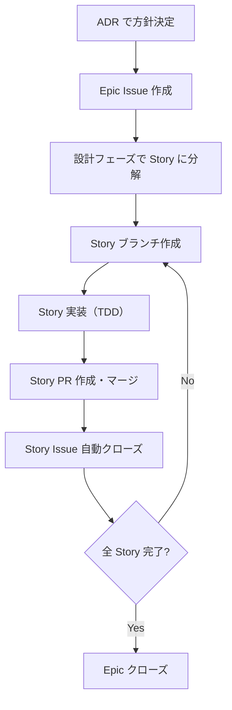

# Issue #452: ブランチ戦略を Story-per-PR に見直す

## Context

Phase 2-2 (#403) で Epic 全体を 1 PR (#426) にまとめた結果、以下の問題が発生した:

- レビュータイミングの遅延（全 Story 完了後に一括レビュー）
- サブ Issue (#427〜#432) のクローズ漏れ
- PR の巨大化によるレビュー品質低下

根本原因: Story 単位で main にマージするフローが確立されていなかった。改善記録 (`prompts/improvements/2026-02/2026-02-11_2200_Epic単位PRによるサブIssueクローズ漏れ.md`) で分析済み。

意図する成果: Story-per-PR を標準フローとして確立し、上記問題の構造的な再発を防止する。

## 対象と対象外

対象:
- ADR-046 作成（意思決定の記録）
- 手順書更新（Epic/Story 運用フロー）
- CLAUDE.md 更新（ブランチ戦略、PR 作成セクション）
- CI 更新（`develop` ブランチトリガー削除）
- 運用設計書更新（ブランチ戦略セクション）

対象外:
- GitHub リポジトリ設定の変更（ブランチ保護ルール等）
- `develop` ブランチ自体の削除（ローカル/リモート）— 別途手動で実施

## Phase 1: ADR-046 作成

### 確認事項

- [x] ADR テンプレート → `docs/70_ADR/template.md`
- [x] 最新 ADR 番号 → ADR-045（次は ADR-046）
- [x] 関連 ADR → ADR-012（Issue 駆動開発）、ADR-013（Draft PR 運用）

### 作業内容

ファイル: `docs/70_ADR/046_Story-per-PRブランチ戦略.md`

検討する選択肢:

1. **GitHub Flow + Story-per-PR（推奨）**: 各 Story を個別 PR で main にマージ。Integration branch なし
2. **GitHub Flow + Epic-per-PR（現状）**: Epic 全体を 1 PR でマージ
3. **Git Flow（develop ブランチ活用）**: develop で統合後、main にリリース

決定: 選択肢 1 を採用。理由:
- 1 PR = 1 Story = 1 `Closes` で Issue が自然にクローズされる
- レビュー粒度が小さくなり、フィードバックが早期化
- 個人開発のため develop ブランチでの統合テストの必要性が低い

帰結:
- Story 分解の品質基準が必要（各 Story が独立して main にマージ可能）
- DB マイグレーションの後方互換は既に運用設計書で MUST（Expand/Contract パターン）
- CI から `develop` トリガーを削除

## Phase 2: 手順書更新（Issue 駆動開発）

### 確認事項

- [x] 現在の Epic/Story 運用フロー → `docs/60_手順書/04_開発フロー/01_Issue駆動開発.md` L647-726

### 作業内容

ファイル: `docs/60_手順書/04_開発フロー/01_Issue駆動開発.md`

「Epic / Story 運用」セクション (L647〜) を更新:

1. **運用フローの Mermaid 図を更新**: 「Story ごとに実装（TDD）」→「Story ごとに個別 PR で main にマージ」に明確化



2. **Story 分解の品質基準を追加**（Issue #452 の To-Be から）:

| 基準 | 問い |
|------|------|
| 独立動作 | この Story だけマージしても main は壊れないか？ |
| 後方互換 | 後続 Story がなくても既存機能は動作するか？ |
| テスト完結 | この Story 単独でテストが全て通るか？ |
| 意味のある単位 | この Story だけで何らかの価値を提供するか？ |

3. **PR と Issue の紐付けルールを追加**:
   - Story PR: `Closes #<Story番号>` で自動クローズ
   - Epic: サブ Issue の自動追跡で進捗管理。最後の Story 完了後に手動クローズ
   - Epic PR は存在しない（Story 単位でマージ）

4. **ブランチ命名の明確化**:
   - `feature/<Story番号>-<機能名>` — Story 単位で作成
   - Epic 番号でブランチを作成しない

## Phase 3: CLAUDE.md 更新

### 確認事項

確認事項: なし（Phase 1-2 の内容に基づく更新のみ）

### 作業内容

ファイル: `CLAUDE.md`

1. **「Git 操作ルール > ブランチ戦略」セクションを更新** (L995付近):
   - 現在の `git checkout -b feature/機能名` → Story 単位であることを明記
   - Integration branch を使わない方針を追記

2. **「PR 作成（Draft）」セクションを更新** (L1016付近):
   - Story PR の `Closes` ルールを追記
   - Epic に対する PR は作成しない旨を追記

3. **「Issue 駆動開発」セクションに参照を追加** (L979付近):
   - ADR-046 への参照を追加

## Phase 4: CI 更新

### 確認事項

- [x] `ci.yaml` の `develop` トリガー → L12（push）、L17（pull_request）

### 作業内容

ファイル: `.github/workflows/ci.yaml`

`develop` を push と pull_request のブランチリストから削除:

```yaml
# Before
on:
  push:
    branches:
      - main
      - develop        # 削除
  pull_request:
    types: [opened, synchronize, reopened, ready_for_review]
    branches:
      - main
      - develop        # 削除
```

```yaml
# After
on:
  push:
    branches:
      - main
  pull_request:
    types: [opened, synchronize, reopened, ready_for_review]
    branches:
      - main
```

## Phase 5: 運用設計書更新

### 確認事項

- [x] 現在のブランチ戦略セクション → `docs/30_基本設計書/04_運用設計.md` L408-431

### 作業内容

ファイル: `docs/30_基本設計書/04_運用設計.md`

「10.2 ブランチ戦略」セクション (L408〜) を更新:

1. **ブランチテーブルに Story-per-PR を明記**:
   - feature ブランチの用途欄に「Story 単位」を追加
   - Integration branch（develop 等）を使わない旨を注記

2. **Mermaid の gitGraph は変更不要**: 既に main + feature の 2 ブランチ構成で、Story-per-PR と整合している

## ブラッシュアップループの記録

| ループ | 検出したギャップ | 観点 | 対応 |
|-------|----------------|------|------|
| 1回目 | Epic クローズの方法が未定義 | 未定義 | Epic は最後の Story 完了後に手動クローズ、と明記 |
| 2回目 | ブランチ命名で Epic 番号を使うケースが曖昧 | 曖昧 | 「Epic 番号でブランチを作成しない」と明記 |
| 3回目 | 運用設計書の Mermaid 図が Story-per-PR と矛盾しないか | アーキテクチャ不整合 | 既に main + feature の 2 ブランチ構成で整合確認。変更不要 |

## 収束確認（設計・計画）

| # | 観点 | 理想状態（To-Be） | 判定 | 確認内容 |
|---|------|------------------|------|---------|
| 1 | 網羅性 | Issue の対象タスク 5 件が全て計画に含まれている | OK | ADR、手順書、CLAUDE.md、CI、運用設計書の 5 ファイルを Phase 1-5 でカバー |
| 2 | 曖昧さ排除 | 各 Phase の変更内容が具体的 | OK | 変更箇所を行番号付きで特定し、Before/After を記載 |
| 3 | 設計判断の完結性 | Story-per-PR に関する全ての判断が記載されている | OK | Epic クローズ方法、ブランチ命名、PR 紐付けルールを明記 |
| 4 | スコープ境界 | 対象と対象外が明記されている | OK | リポジトリ設定変更と develop ブランチ削除を対象外に |
| 5 | 技術的前提 | CI の動作に影響がないことを確認 | OK | PR トリガーは main ベースで動作。develop 削除の影響なし |
| 6 | 既存ドキュメント整合 | ADR-012, ADR-013, 運用設計書と矛盾がない | OK | GitHub Flow の拡張（Story-per-PR の明確化）であり、既存方針と整合 |

## 検証方法

1. `just check-all` が通過すること（CI 設定変更の影響がないか）
2. 全ドキュメントのリンクが有効であること
3. ADR-046 がテンプレートに準拠していること
