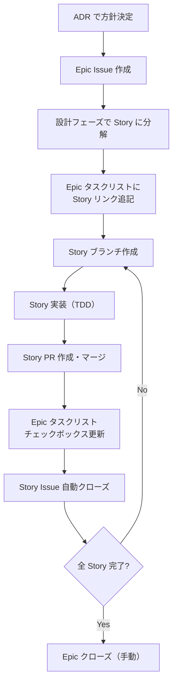

# #524 Epic-Story 進捗管理ステップを手順書に追加する

## Context

改善記録 [Epic の Story 進捗が未記録](../../process/improvements/2026-02/2026-02-14_2230_EpicのStory進捗が未記録.md) への対策。Epic #467 の Story 1（#511）完了時に Epic タスクリストが更新されなかった問題を、手順書にステップを追加することで構造的に防止する。

## 対象ファイル

- `docs/60_手順書/04_開発フロー/01_Issue駆動開発.md`

## 対象外

- GitHub Actions による自動化（手動プロセスとして定義する）
- Sub-issues progress フィールドの設定（既存の自動追跡は変更しない）

## 変更内容

### 1. 「運用フロー（Story-per-PR）」のフロー図を更新（L786-796）

Epic タスクリスト更新のステップを追加する。

### 2. 新しいサブセクション「Epic タスクリストの管理」を追加

「PR と Issue の紐付け」セクション（L810-817）の後、「進捗の可視化」セクション（L819）の前に追加する。

内容:
- Story Issue 作成時の手順（`gh issue edit` で Epic 本文を更新）
- Story PR マージ時の手順（Epic のチェックボックスを `[x]` に更新）
- 改善の経緯リンク

### 3. 変更履歴を追加（L877-）

変更内容を記録する。

## 確認事項

- [x] パターン: `gh issue edit` の使用例 → 手順書 L379-391、同じパターンで Epic 本文を更新する

## テストリスト

ユニットテスト（該当なし）
ハンドラテスト（該当なし）
API テスト（該当なし）
E2E テスト（該当なし）

## 検証方法

1. 追加したセクションの Markdown が正しくレンダリングされることを確認（mermaid 図含む）
2. 追加したステップが既存のフローと矛盾しないことを確認
3. `gh issue edit` コマンドの形式が既存パターンと一致することを確認

## ブラッシュアップループの記録

| ループ | 検出したギャップ | 観点 | 対応 |
|-------|----------------|------|------|
| 1回目 | フロー図にのみ追加すると手順の詳細が不明 | 不完全なパス | フロー図の更新に加えて、手順を記述するサブセクションを追加 |

## 収束確認（設計・計画）

| # | 観点 | 判定 | 確認内容 |
|---|------|------|---------|
| 1 | 網羅性 | OK | Issue の2つのタスク（Story 作成時、Story マージ時）が計画に含まれている |
| 2 | 曖昧さ排除 | OK | 変更箇所（フロー図、新セクション、変更履歴）が明確 |
| 3 | 設計判断の完結性 | OK | サブセクションの配置場所を決定済み（「PR と Issue の紐付け」の後） |
| 4 | スコープ境界 | OK | 対象: 手順書へのステップ追加。対象外: 自動化、Sub-issues 設定 |
| 5 | 技術的前提 | OK | `gh issue edit --body` の使用パターンは手順書 L379 に既存 |
| 6 | 既存ドキュメント整合 | OK | ADR-046（Story-per-PR）と整合、既存の Epic / Story 運用フローを補完 |
