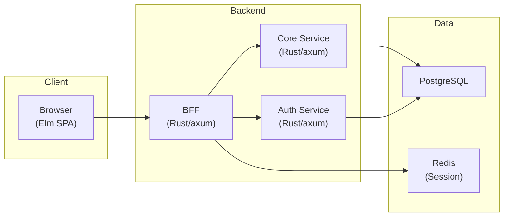

# README.md 更新計画 (#266)

## Context

Issue #266: README.md の内容が現在のプロジェクト状態と6箇所で乖離している。
方針: 「現在実装済みの機能を正確に反映する」「将来計画は将来計画として明示する（現在の機能と混同しない）」

## 対象ファイル

- `README.md` — 更新対象（唯一のファイル）

## 参照ファイル

- `CLAUDE.md` — ベストプラクティス起点の記述
- `docs/03_詳細設計書/00_実装ロードマップ.md` — Phase 定義と完了基準

## 変更内容

### 1. プロジェクト理念セクション (lines 14-45)

「品質の追求」の後に「共通アプローチ: ベストプラクティス起点」を追加する。

CLAUDE.md の構造に合わせ、「2つの理念 + 共通アプローチ」として記載:

```markdown
### 共通アプローチ: ベストプラクティス起点

2つの理念を実現するため、あらゆる判断において業界ベストプラクティスを起点とし、プロジェクトの現実に合わせて調整する。

- 起点を高く置く（ベストプラクティスから始めて調整する）
- 全領域に適用（コード設計、UI/UX、セキュリティ、テスト——例外なし）
- 意識的な調整（外れるときは理由を記録する）
```

重点学習テーマの CQRS + Event Sourcing はそのまま残す（学習目標としては適切）。

### 2. 技術スタック表 (lines 50-56)

| 行 | 現状 | 変更後 |
|---|------|--------|
| データストア | `Aurora PostgreSQL, DynamoDB, S3, Redis` / `CQRS + Event Sourcing に最適化` | `PostgreSQL, Redis` / `ワークフロー・ユーザー管理、セッション管理` |
| インフラ | `AWS (ECS Fargate, CloudFront, WAF)` / `エンタープライズグレードの可用性・セキュリティ` | `AWS Lightsail, Cloudflare` / `デモ環境（個人開発向け低コスト構成）` |
| IaC | `Terraform` / `再現可能なインフラ構築` | 削除（Terraform モジュール構造はあるが未適用。本番構成は将来計画） |

### 3. アーキテクチャ図 (lines 58-86)

デプロイ基盤に依存しないアプリケーション構造を示す。ロードマップの Phase 1 アーキテクチャ図（`docs/03_詳細設計書/00_実装ロードマップ.md:157-178`）と整合させる。



設計判断: Lightsail/Cloudflare/Nginx の配置図ではなく、アプリケーションアーキテクチャを示す。理由:
- デプロイ基盤は変わりうるが、アプリケーション構造は安定している
- ロードマップの既存図と一貫性を保つ
- README の読者が理解すべきはサービス間の関係

### 4. 設計パターン表 (lines 88-94)

| 現状 | 変更後 |
|------|--------|
| BFF (Backend for Frontend) — そのまま | BFF (Backend for Frontend) — セキュリティ強化（トークン秘匿）、フロントエンド最適化 API |
| CQRS + Event Sourcing — **削除** | — |
| マルチテナント (RLS) — **修正** | マルチテナント（tenant_id）— アプリケーションレベルのテナントデータ分離 |
| — | レイヤードアーキテクチャ — domain / infra / apps の責務分離（**追加**） |

RLS は DB レベルでは未実装。アプリケーションレベルの `tenant_id` フィルタリングが現在の実装。

### 5. Getting Started (lines 167-185)

```bash
# 初回セットアップ（依存関係インストール、DB 起動、マイグレーション）
just setup

# 開発サーバー起動（BFF, Core Service, Auth Service, Web を一括起動）
just dev-all

# コミット前チェック（lint + test + API test）
just check-all
```

- `just dev-deps` + 個別起動 → `just dev-all` に置き換え
- `check-all` の説明を更新（API test を含む）

### 6. 開発状況 (lines 187-207)

Phase テーブル: Phase 1 を `✅ 完了` に変更（完了基準5項目すべて達成済み）。
ステータス行: 「Phase 1（MVP）開発中」→「Phase 2（機能拡張）計画中」に更新。

Phase 1 の進捗: 全項目を `[x]` に更新。

```markdown
**Phase 2（機能拡張）計画中** — Phase 1 MVP 完了

### Phase 1 の進捗

- [x] 認証（メール/パスワードログイン、ログアウト）
- [x] セッション管理（HTTPOnly Cookie、Redis）
- [x] ワークフロー申請・承認
- [x] タスク一覧・詳細
- [x] ダッシュボード
```

## スコープ外

- ロードマップ（`docs/03_詳細設計書/00_実装ロードマップ.md`）の更新 — 別 Issue
- ADR の作成 — 設計判断を伴う技術選定なし
- ナレッジベースの更新 — 新しいツール・パターンの導入なし

## 検証方法

1. README.md を読み直し、すべての記載が現在の実装と一致していることを確認
2. Mermaid 図が正しくレンダリングされることを確認（GitHub 上）
3. リンクが有効であることを確認

## ブラッシュアップループの記録

| ループ | きっかけ | 調査内容 | 結果 |
|-------|---------|---------|------|
| 1回目 | 初版完成 → Issue のリスト以外に乖離がないか確認 | README 全行を読み、実装状態と突合 | Rust バージョン (1.92) は正確。Terraform は IaC 行として残すか検討 → 未適用のため削除を推奨 |
| 2回目 | アーキテクチャ図の方針決定 | ロードマップの Phase 1 図、Lightsail 構成を確認 | デプロイ非依存のアプリケーション構造を採用。ロードマップ既存図と整合 |
| 3回目 | RLS の実装状態確認 | tenant.rs、リポジトリ実装を調査 | DB レベル RLS は未実装。アプリケーションレベル tenant_id フィルタリング。表記を修正 |

## 収束確認（設計・計画）

| # | 観点 | 判定 | 確認内容 |
|---|------|------|---------|
| 1 | 網羅性 | OK | Issue の6箇所 + 追加発見（IaC 行）すべてカバー |
| 2 | 曖昧さ排除 | OK | 各変更の before/after を明示。「必要に応じて」等の曖昧表現なし |
| 3 | 設計判断の完結性 | OK | アーキテクチャ図方針、RLS 表記、Phase 1 ステータスの判断を記載 |
| 4 | スコープ境界 | OK | 対象（README の6セクション）、対象外（ロードマップ、ADR）を明記 |
| 5 | 技術的前提 | OK | Mermaid flowchart のノードラベル形式（`ID["ラベル"]`）をドキュメント規約と照合 |
| 6 | 既存ドキュメント整合 | OK | CLAUDE.md の理念構造、ロードマップの Phase 定義・完了基準と照合 |
