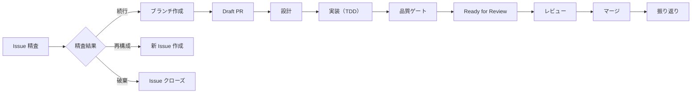

# #944 /start スキルの精査完了チェック追加

## Context

`/start` スキルのワークフロー状態マシンが「環境の状態（ブランチ/PR の有無）」のみで判定し、「プロセスの状態（精査済みか）」を考慮していない。状態 B（PR 欠落）では精査をスキップして Draft PR を作成し、状態 C/D でも精査チェックがない。

根本原因: 状態マシンの 2 次元性（環境 × プロセス）が認識されておらず、「ブランチ存在 = 精査済み」という誤った暗黙の前提がある。

## 対象ファイル

| ファイル | 変更内容 |
|---------|---------|
| `.claude/skills/start/SKILL.md` | 精査完了チェックの共通メカニズム追加、状態 B/C/D への統合 |
| `.claude/rules/dev-flow-issue.md` | フロー概要を Mermaid フローチャートに置換 |

対象外:
- 状態 A: 既に精査を含む（4a-2）。変更不要
- スクリプトの自動化: 精査チェックは AI エージェントの手順として定義。自動スクリプト化はスコープ外

## 設計

### 1. 精査完了チェックの仕組み

精査コメントの有無を `gh` CLI で検出する:

```bash
gh issue view <Issue番号> --json comments --jq '[.comments[].body | select(test("## Issue 精査"))] | length'
```

- 結果 > 0: 精査済み
- 結果 = 0: 未精査

判定基準: dev-flow-issue.md の既存の成果物要件「記録がない場合、精査が実施されたとみなさない」に基づく。

### 2. SKILL.md の変更

#### 2a. Step 3 の後に「Step 3.5: 精査完了の検証」を追加

Step 3（状態検出）と Step 4（状態別フロー）の間に、精査コメントの有無を検証するステップを追加する。全状態で共通のチェックを行い、結果をフロー制御に使用する。

```
### Step 3.5: 精査完了の検証

Issue に精査コメントが存在するか確認する:

gh issue view <Issue番号> --json comments --jq '[.comments[].body | select(test("## Issue 精査"))] | length'

| 結果 | 判定 |
|------|------|
| > 0 | 精査済み |
| = 0 | 未精査 |

精査の判定結果を Step 4 の状態別フローに引き継ぐ。
```

#### 2b. 状態 B の修正

現行: 精査なしで即 Draft PR 作成
変更後: 精査チェック → 未精査なら精査を実施 → 精査結果に応じて分岐

```
#### 状態 B: PR 欠落の復旧

ブランチは存在するが PR がない状態。

**精査の確認:**

| 精査状態 | アクション |
|---------|-----------|
| 精査済み | Draft PR 作成へ進む |
| 未精査 | 精査を実施してから Draft PR 作成へ進む |

未精査の場合、状態 A の 4a-2（Issue 精査）と同じ手順で精査を実施する。
精査結果が「破棄」「再構成」の場合は、Draft PR を作成せずに終了する。

[以下、既存の Draft PR 作成フローを維持]
```

#### 2c. 状態 C の修正

現行: 精査チェックなし
変更後: 精査チェック → 未精査なら警告して精査を促す

```
#### 状態 C: 通常再開

[既存の情報収集の前に追加]

**精査の確認:**

未精査の場合、警告を表示して精査を先に実施する:

検出: Issue #<番号> の精査コメントが見つかりません。作業を続行する前に精査を実施します。

精査を実施し、結果に応じて分岐する:
- 続行 / 修正して続行: 通常再開フローへ
- 再構成 / 破棄: 対応を案内して終了

[以下、既存の情報収集・提示フローを維持]
```

#### 2d. 状態 D の修正

現行: 精査チェックなし
変更後: 精査チェック → 未精査なら注記を表示

```
#### 状態 D: レビュー中

[既存のフローの前に追加]

**精査の確認:**

未精査の場合、注記を表示する:

注記: Issue #<番号> の精査コメントが見つかりません。レビュー中のため作業は継続しますが、精査コメントの追加を推奨します。
```

状態 D ではレビュー中のため、精査未完了でもブロックしない（レビュー中に精査をブロッキング要件にするのは過剰）。注記のみ表示する。

### 3. dev-flow-issue.md の変更

5 行目の一本道表記を Mermaid フローチャートに置換する:

```
開発フロー: Issue 精査 → ブランチ作成 → Draft PR → 設計 → 実装（TDD）→ 品質ゲート → Ready for Review → レビュー → マージ → 振り返り
```

↓



判断: `LR`（左→右）レイアウト。既存の一本道表記が横方向であること、フロー全体が長いため縦方向（`TD`）だと見にくくなることから。

## Phase 1: SKILL.md と dev-flow-issue.md の修正

### 確認事項
- パターン: 精査コメントの検出コマンド → `gh issue view --json comments --jq` の使用パターンを Grep で既存使用確認
- パターン: Mermaid フローチャートの既存使用 → docs/ 内の flowchart 記法を確認

### 操作パス: 該当なし（ドキュメント修正のみ、操作パスが存在しない）

### テストリスト

ユニットテスト（該当なし — ドキュメント修正）
ハンドラテスト（該当なし）
API テスト（該当なし）
E2E テスト（該当なし）

検証方法: `just check-all` の通過 + SKILL.md の各状態フローを手動トレースして論理的整合性を確認

## ブラッシュアップループの記録

| ループ | 検出したギャップ | 観点 | 対応 |
|-------|----------------|------|------|
| 1回目 | 状態 D で精査をブロッキング要件にすべきか | 競合・エッジケース | レビュー中のため注記のみ（非ブロッキング）に決定 |
| 2回目 | Step 3.5 を追加するか、各状態内に埋め込むか | シンプルさ | 共通ステップとして Step 3.5 に抽出。DRY を優先し、各状態での重複記述を避ける |

## 収束確認（設計・計画）

| # | 観点 | 理想状態（To-Be） | 判定 | 確認内容 |
|---|------|------------------|------|---------|
| 1 | 網羅性 | 全対象が計画に含まれている | OK | 完了基準 4 項目すべてに対応する変更を記載。状態 A/B/C/D すべてカバー |
| 2 | 曖昧さ排除 | 不確定な記述がゼロ | OK | 各状態の精査チェック動作を明確に定義 |
| 3 | 設計判断の完結性 | 全ての差異に判断が記載 | OK | 状態 D の非ブロッキング判断、Step 3.5 の抽出判断を記載 |
| 4 | スコープ境界 | 対象と対象外が両方明記 | OK | 対象外にスクリプト自動化・状態 A を明記 |
| 5 | 技術的前提 | 前提が考慮されている | OK | `gh issue view --json comments --jq` で精査コメントを検出可能であることが前提 |
| 6 | 既存ドキュメント整合 | 矛盾がない | OK | dev-flow-issue.md の成果物要件「記録がない場合、精査が実施されたとみなさない」と整合 |
