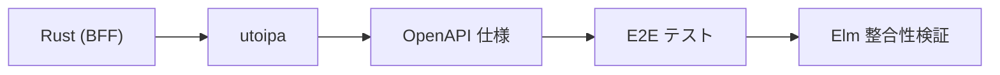

# Elm OpenAPI クライアント生成ツール評価

## 概要

Issue #137 Phase 2 Step 3-4 として、Elm OpenAPI クライアント自動生成ツールを評価した。結果、Cookie 認証非サポートのため採用を見送り、手動デコーダー + E2E テストでの整合性検証を継続する判断を下した。

## 実施内容

### 調査フェーズ

1. **候補ツールの特定**
   - Web 検索で Elm OpenAPI クライアント生成ツールを調査
   - 主要候補: OpenAPI Generator、elm-open-api-cli、Elm with OpenAPI（eriktim 版）

2. **公式ドキュメント確認**
   - OpenAPI Generator: Cookie 認証非対応を明記
   - elm-open-api-cli: 認証サポートの記載なし

3. **現在のアーキテクチャ確認**
   - `Api.elm`: CSRF トークン、X-Tenant-ID ヘッダー付与
   - `Api/{Resource}.elm`: リソース固有の API 関数
   - `Data/{Type}.elm`: 手動デコーダー（json-decode-pipeline）

### 実装フェーズ

1. **elm-open-api-cli のインストール**
   ```bash
   cd frontend && pnpm add -D elm-open-api
   ```
   バージョン: v0.7.0

2. **OpenAPI YAML → JSON 変換**
   - ツールが YAML を直接読めなかったため、js-yaml で変換
   ```bash
   pnpm add -D js-yaml @types/js-yaml
   node -e "const yaml = require('js-yaml'); ..."
   ```

3. **コード生成実行**
   ```bash
   npx elm-open-api ../openapi/openapi.json \
     --output-dir ./elm-openapi-generated \
     --module-name Generated.Api \
     --generateTodos yes
   ```

4. **生成コードの確認**
   - 生成ファイル: `Api.elm`, `Types.elm`, `Json.elm`, `OpenApi/Common.elm`
   - 警告: Cookie 認証非対応、UUID 非対応、Null 型アノテーション

### 評価フェーズ

生成されたコードを以下の観点で評価：

1. **型定義**: 全スキーマが Elm 型として生成、エラー型も明示的
2. **デコーダー**: json-decode-pipeline 類似のスタイル、ただし oneOf + null が複雑
3. **API 関数**: Cmd と Task の両方を生成、ただし `headers = []`（認証なし）
4. **認証**: Cookie 認証が全エンドポイントで非サポート

## 判断ログ

### Cookie 認証非サポートが決定的

生成された API 関数は以下の通り：

```elm
listAuditLogs config =
    Http.request
        { headers = []  -- ← 認証ヘッダーが空
        , ...
        }
```

このプロジェクトの認証スキーム（`apiKey in: cookie`）はツールが対応していない。カスタムヘッダー（CSRF、X-Tenant-ID）の付与も不可能。

### E2E テストで代替可能

Phase 1 で導入した E2E テスト（Playwright）が BFF ↔ Elm の整合性を実行時に検証している。手動デコーダーの問題は E2E テストで検出される。

### 手動デコーダーの品質は高い

現在のデコーダーは可読性・保守性が高く、自動生成に置き換えるメリットは小さい。Cookie 認証の制約を考慮すると、部分的な自動生成（型定義のみ）も現実的でない。

### 代替案の検討

以下の代替案を検討したが、いずれも却下：

| 代替案 | 却下理由 |
|--------|---------|
| 部分的な自動生成（型定義のみ） | Cookie 認証の問題は解決しない、oneOf + null の複雑な型が導入される |
| ツールをフォークして Cookie 認証を実装 | 開発・保守コストが高い、E2E テストで代替できている |
| BearerToken 認証への移行 | 認証アーキテクチャの大幅な変更、要件なし |

## 成果物

### ADR

- [ADR-047: Elm OpenAPI クライアント自動生成の見送り](../../../docs/70_ADR/047_Elm-OpenAPIクライアント自動生成の見送り.md)

### 決定内容

自動生成ツールを採用せず、以下を継続：
- Elm デコーダー/エンコーダーの手動記述
- `Api.elm` ヘルパー（CSRF、カスタムヘッダー）
- E2E テストによる BFF ↔ Elm の整合性検証

### 整合性担保の仕組み



1. utoipa が Rust の型から OpenAPI を自動生成（PR #444 で完了）
2. CI で OpenAPI の同期チェック（`just openapi-check`）
3. E2E テストが BFF レスポンスと Elm デコーダーの整合性を検証

## クリーンアップ

評価に使用した一時ファイルを削除：
- `frontend/elm-openapi-generated/`（生成コード）
- `openapi/openapi.json`（YAML → JSON 変換結果）
- `frontend/node_modules/.pnpm/elm-open-api@0.7.0/`（pnpm uninstall で削除）
- `frontend/node_modules/.pnpm/js-yaml@4.1.1/`（pnpm uninstall で削除）

## 今後の方針

Issue #137 を以下の状態で完了とする：

- [x] Phase 1: E2E テスト導入（PR #444 以前に完了）
- [x] Phase 2-1, 2-2: utoipa 導入（PR #444）
- [x] Phase 2-3, 2-4: Elm デコーダー生成ツール評価 → 採用見送り

整合性担保の方針は確立しており、Issue の目的は達成された。
